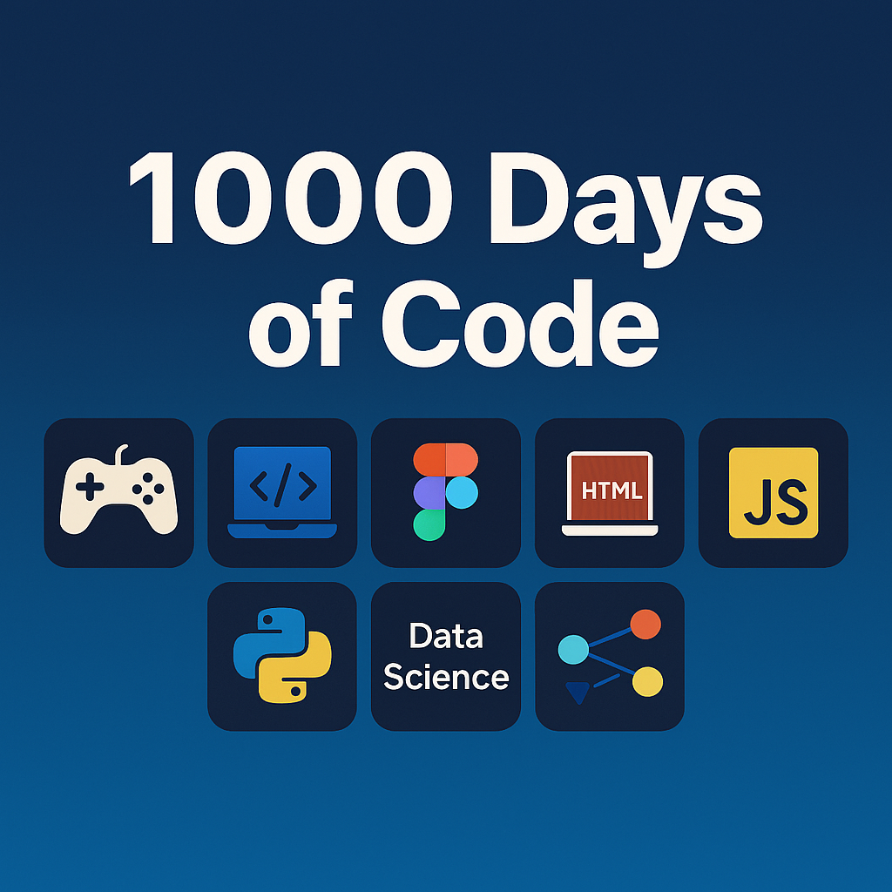

# 1000-days-of-code

|Date       |Description|
|-----------|-------------------------------------------------------------------------------|
|Date       |   Description                                                                 |
|05/27/2026 | Today I decided to break up the projects in this repo out into their own repo |
|           | The steps I will follow:                                                      |
|           | 1. Pick a folder to extract, e.g. python_projects                             |
|           | 2. Create a split branch with full history                                    |
|           | git subtree split --prefix=src/python_projects -b python_split                    |
|           | 3. Create a new Github repo, name it python-project or python-learning        |
|           |       to tie it to the original folder I will attach 1000doc_<new_repo_name>  |
|           | 4. Push the split branch to the new repo                                      |
|           | git push https://github.com/yourname/python-projects.git python_split:main    |
|           | 5. Remove the folder from the main repo                                       |
|           | git rm -r python_projects                                                     |
|           | git commit -m "Remove python_projects after extracting to its own repo"       |
|           | git push                                                                      |
|           | 6. Add a link in your README (this)                                           |
|           |      See details in log1000.md                                                |
|03/28/2026 |Today I decided to cleanup my daily TODO list (see log1000.md)                 |
|10/31/2025 | My progress has slowed down on Coursera courses, due to concentration on Datacamp|
|           | and other projects.  My goal is to complete FE course by the end of the year  |
|           | then resume Cybersecurity specialization and take on Machine Learning         |
|7/24/2025  |I decided to start a new repo to start the next 700 days of code.              |
|           |This holds material on courses I am taking (will now include notes) + projects |
|           |I will try to create PDF files for all the Microsoft Word document I create. The|
|           |Word documents have the advantage of being able to display animated gifs!      | 
|	        |My goal will be to start and complete all coursera courses and datacamp        |

# Links to repositories associated with this 1000-days-of-code

- [Original Daily Dairy - YOU ARE HERE](https://github.com/nyguerrillagirl/1000-days-of-code.git)
    - See: log1000.md for daily log
- [OpenGL, C++ Windows Programming](https://github.com/nyguerrillagirl/1000doc-windows-programming.git)
- [React Projects](https://github.com/nyguerrillagirl/1000doc-react-projects.git)
- [Python Projects](https://github.com/nyguerrillagirl/1000doc-python-projects.git)
- [IntelliJ Projects](https://github.com/nyguerrillagirl/1000doc-intellij-projects.git)
- [HTML, CSS and JavaScript](https://github.com/nyguerrillagirl/1000doc-html-css-javascript-projects.git)
- [Coursera Course Work](https://github.com/nyguerrillagirl/1000doc-coursera.git)
- [Brainycode Website](https://github.com/nyguerrillagirl/1000doc-brainycode-website.git)
- [Documents](https://github.com/nyguerrillagirl/1000doc-docs.git)

# GOAL #1: Complete all current Coursera courses
- Meta Frontend Developer 
    - this is going very slowly
- Google Cybersecurity
    - I dropped this specialization
- "Developing Front-End Apps with React" - Completed (insert dancing buffalo bones here)

  

# GOAL #2: Learning Data Science
- Datacamp courses, taking all courses in the Associate Data Scientist in Python
    - still working on this
- I am on the Associate Python Developer Track. I have two courses remaining.

# Goal #3: Book Club
- Tech Reading
    - Mostly book club reading [Engineering Book Club](https://community.engineeringbookclub.com/feed)
- Non-tech Reading

- See the document log1000.md for day-to-day progress on tasks and issue.
