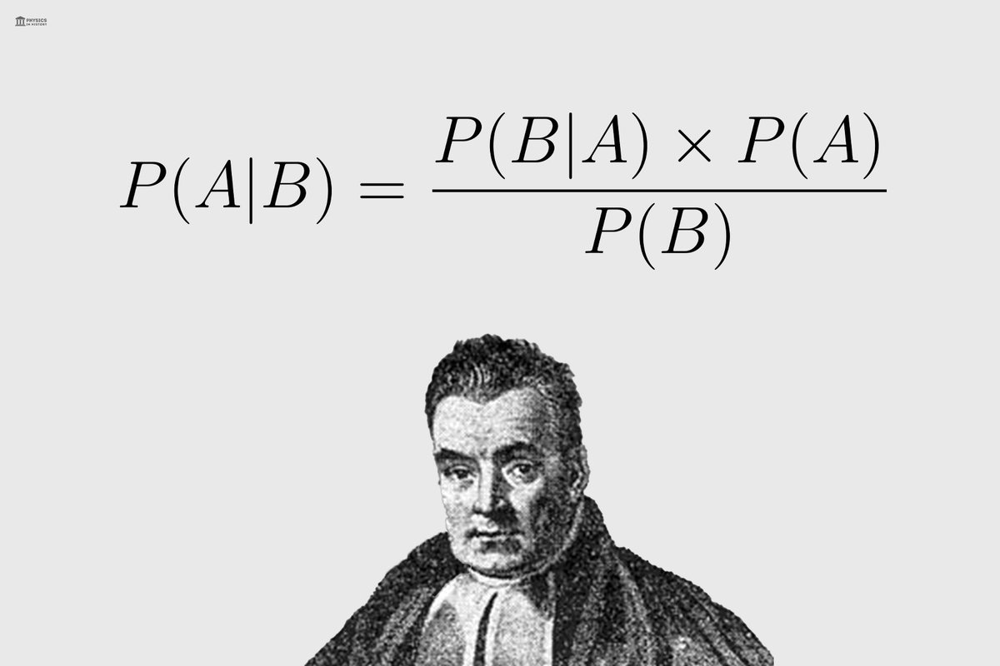
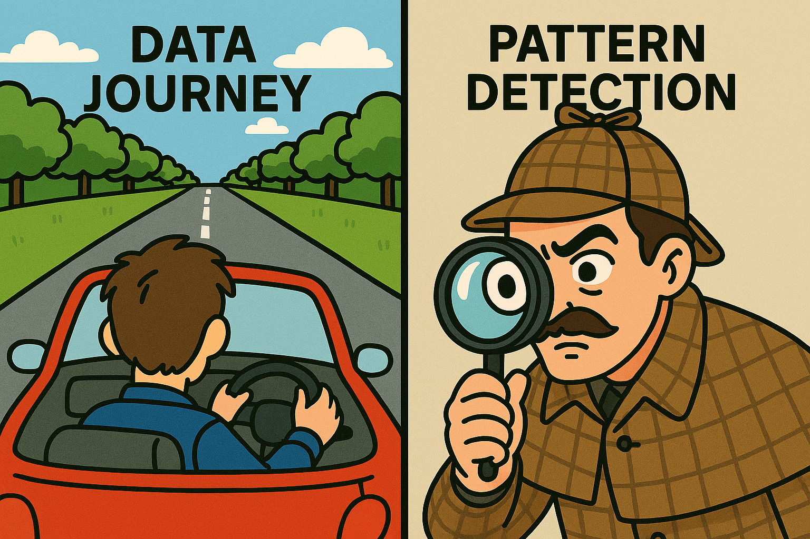

# Another 1000 Days of Code
Goal:
We will stay focused on the following areas/categories:
- Data Science [DS]
- Book Club/Reading [R]
- Coursera [COURSERA]

- See 2025_year_in_review

### Starting these notes on Day #301
### Look at the file backlog.md for tasks that moved to BACKLOG and COMPLETED list 11/15/2025

## Current TODO list
|Topic/Book/Course|Date Started|Date Completed|Working on|
|-----------------|------------|--------------|----------|
| **S P E C I A L I Z A T I O N S**||||
| Coursera Meta Front-End Developer Professional Specialization|10/12/2024| | on Course 7/9 |
| Coursera Statistics with Python Specialization|05/01/2026| | on Course 1/3 |
| **C O U R S E R A COURSES**||||
| Coursera "Principles of UX/UI Design" Course [Course]|6/13/2025| | * |
| Coursera "developing-frontend-apps-with-react" Course [Course]|11/18/2025|03/29/2026| C O M P L E T E D ! ! |
| Coursera "Understanding and Visualizing Data with Python" Course [Course]|05/01/2026| | * |
| **O R E I L L Y  COURSES**||||
| The Redux Official Course Tutorial [Course]|3/7/2026| | * |
| **D A T A C A M P COURSES**||||
| Datacamp - Statistical Thinking in Python (Part 2) [Course]|10/19/2025 |05/24/2026| COMPLETED ! ! ! |
| Datacamp - Developing Python Packages [Course]|4/23/2026 |6/3/2-26| COMPLETED |
| Datacamp - Introduction to Databases in Python [Course]|4/23/2026 |05/16/2026| COMPLETED |
| Datacamp - Generative AI Concepts [Course]|03/15/2026 |03/28/2026| COMPLETED |
| Datacamp - Introduction to Regression with statsmodel in Python [Course]|03/15/2026 || * |
| Datacamp - Regular Expressions in Python [Course]|03/26/2026 |04/29/2026| COMPLETED |
| Datacamp - Introduction to Shell [Course]|03/26/2026 |04/2/2026| COMPLETED |
| Datacamp - AI Ethics [Course]|04/03/2026 |04/06/2026| COMPLETED |
| Datacamp - Introduction to SQL [Course]|04/08/2026 |04/08/2026| COMPLETED |
| Datacamp - Intermediate SQL [Course]|04/09/2026 |04/13/2026| COMPLETED |
| Datacamp - Joining Data in SQL [Course]|04/13/2026 |04/30/2026| COMPLETED |
| Datacamp - Web Scraping [Course]|04/14/2026 |04/22/2026| COMPLETED |
| Datacamp - Data Manipulation in SQL [Course]|5/01/2026 |5/21/2026| COMPLETED |
| Datacamp - Introduction to Data [Course]|5/16/2026 |5/24/2026| COMPLETED |
| Datacamp - Introduction to Relational Databases in SQL [Course]|5/21/2026 |6/5/2026| COMPLETED |
| Datacamp - Understanding Cloud Computing [Course]|6/1/2026 |6/6/2026| COMPLETED |
| Datacamp - Data Warehousing Concepts [Course]|6/1/2026 || * |
| Datacamp - Hypothesis Testing in Python [Course]|6/3/2026 || * |
| Datacamp - Database Design [Course]|6/8/2026 || * |
| Datacamp - Communicating Data Insights [Course]|6/8/2026 || * |
| **U D E M Y COURSES**||||
| Computer Graphics with Modern OpenGL and C++ [Course]|04/20/2026 || * |
| **P E R S O N A L PROJECTS**||||
| Project LDSPW [Project]|9/05/2025| | * |
| Project Math [Project]|10/16/2025| | * |
| Figma Marathon [Project]|2/16/2026| | * |
| Project Wolf/Doom [Project]|4/5/2026| | * |
| **T E C H BOOKS**||||
| React, The Comprehensive Guide [Book]|11/24/2025| | * |
| Arduino for Complete Idiots [Book]|01/08/2026| | * |
| Beginning PyQt [Book]|02/14/2026| | * |
| Tidy First? [Book]|02/14/2026| | * |
| Redux in Action [Book]|02/22/2026| | * |
| How to Bake π [Book]|01/02/2026| | * |
| Data Analysis [Book]|01/16/2026| | * |
| Pandas Workout [Book]|02/06/2026| | * |
| Learn Electronics with Arduino [Book]|01/05/2026| | * |
| Bayesian Statistics The Fun Way [Book]|03/15/2026| | * |
| Scientific Python Lectures [Book]|03/20/2026| | * |
| Introductory DC/AC Electronics  [Book]|03/23/2026| | * |
| The Ultimate Beginner's Guide to the 555 Timer  [Book]|04/03/2026| | * |
| **N O N - F I C T I O N BOOKS**||||
| The Theory That Would Not Die, Sharon Bertsch McGrayne [Book]|03/13/2026| | * |

## Order to complete daily tasks
  - DATACAMP
    - ^[0-9].*XP$
    - GOAL: Get over 2000 XP daily
  - Technical Reading
    - One Manning
    - One non-Manning
  - PROJECT: Wolf/Doom
  - COURSERA
    - Continue to work on Figma Marathon and my personal React project to get
      ready for the final projects/assignments in Coursera courses
    - Figma Marathon
    - Statistics
 - NYT, WAPO 
    - Read at least 3 articles in each one
    - 
    - 
    - 
  - REACT READING
    - 10 pages a day
   - REALPYTHON course
  - READ/PROCESS AN ARTICLE (1/2 articles a day)
  - Engineering Book Club Preparation
    - Reading Tidy First?
  - PROJECT - Data Science with Python Workbook
  - PROJECT - Arduino
  - USE www.classcentral.com when thinking of taking a course

### Day 627: June 16, 2026 (Tuesday)
- NOTE FOR THE DAY:
  - NYT
    - [The Iran War Permanently Altered the Global Economy](https://www.nytimes.com/2026/06/16/business/economy/iran-war-oil-trade.html)
    - [In ‘Widow’s Bay,’ History Is Hard to Kill](https://www.nytimes.com/2026/06/10/arts/television/widows-bay-review.html)
    - [A Garish Spectacle of American Decline](https://www.nytimes.com/2026/06/15/opinion/ufc-freedom-250-fight.html)
  - ARTICLES/VIDEOS
    - [Chromebook controversy continues: Lower Merion School Board votes to change tech policy](https://6abc.com/post/chromebook-controversy-continues-lower-merion-school-board-votes-change-tech-policy/19306037/)
    - [This chef served baked spaghetti to Gordon Ramsay on day one. Ramsay had 4 words for it]()
- PROJECT: RETRO
  - SDL 2
    - [Parallel Realities](https://www.parallelrealities.co.uk/tutorials/)
    - Worked on SDL 2 notes
    - Investigated how Modern C++ came to be - it was either change or die
  - Working on collecting all material in this category together and coming up with a plan
  - Working on: Making a PLAN
- Data Camp [DS]
  - XP: 1500  (Practice) --> 1500  [Peta - Last week: 18,575 XP (9th in Peta League)]
  - Practice:
    - Database Schemas and Normalization
    - Effective Data Visuals
    - Communicating Information
    - Understanding Cloud Computing
    - Introduction to Relational Databases in SQL
    - Introduction to Regression with statsmodels in Python
    - Web Scraping in Python
- Books
  - Non-Tech Reading
    - **In the Garden of Beasts**, Erik Larsen
      - Part VI - Berlin at Dusk
        - Completed Chapter 45 - Mrs. Cerruti’s Distress
          - “During the last five days,stories of many kinds have tended to make the Berlin
              atmosphere more tense than at any time since I have been in Germany.” - Dodd
          - Martha plans to visit Russia
          - Elisabetta Cerruti, wife of Italian ambassador, expressed a sense of doom. People
            suspect she knew something bad was going to occur, she claimed she only meant the weather.
        - Completed Chapter 45 - Friday Night
          - Hitler was concerned when he found Papen was planning to go to Hindenburg. In addition,
            he was upset with Rohm's plan of a coup. The decision was made to go ahead with plan "Hummingbird"
      - current page: 427
- GRADE: 
  - C-

### Day 626: June 15, 2026 (Monday)
- NOTE FOR THE DAY:
  - NYT
    - [Richard Pryor’s Daughter Grapples With a Flawed Father and a Hateful Word](https://www.nytimes.com/2026/06/13/books/review/something-we-said-elizabeth-stordeur-pryor.html)
    - [How a Book Editor and Jazz Musician Lives on $55,000 in West Harlem](https://www.nytimes.com/interactive/2026/06/15/nyregion/nyc-budgeting-affordability-pucillo.html)
    - [Frustrated by Courts, Trump Weighed Suspending a Constitutional Right](https://www.nytimes.com/2026/06/15/us/politics/trump-scharf-habeas-corpus-insurrection-act.html)
  - WAPO
    - [Trump sought to break Iran’s regime. He settled for reopening Hormuz.](https://www.washingtonpost.com/politics/2026/06/15/deal-with-iran-trump-settled-much-less-than-he-set-out-get/)
    - [Israelis denounce Trump’s deal with Iran](https://www.washingtonpost.com/world/2026/06/15/israelis-denounce-trumps-deal-with-iran/)
    - [Alaska boots second Dan Sullivan from Senate race](https://www.washingtonpost.com/politics/2026/06/15/alaska-boots-second-dan-sullivan-senate-race/)
  - ARTICLES/VIDEOS
    - [Parallel Realities](https://www.parallelrealities.co.uk/tutorials/)
      - Tracking in RETRO Section  
- PROJECT: RETRO
  - Re-doing SDL notes
    - [Parallel Realities](https://www.parallelrealities.co.uk/tutorials/)
      - Working on initial notes.
        - Purchased tutorial assets
      - Editing new version of SDL -> SDL2 (using as many Modern C++ )
        - Re-titled as 01_LEARNING_SDL2_TO_CREATE_GAMES
- Data Camp [DS]
  - XP: 1500  (Practice) --> 2500  [Peta - Last week: 18,575 XP (9th in Peta League)]
  - Practice:
    - Communicating Information
    - Analyzing Police Activity with pandas
    - Data Communication Concepts
    - Foundations of Probability in Python
    - Introduction to Shell
    - Understanding ChatGPT
  - Course: Database Design
    - Completed chapter 2/4 - Processing, Storing, and Organizing Data
    - Working on chapter 3/4 - Database views
  - Course: Communicating Data Insights
    - Completed chapter 2/3 - Communicating Information
    - Working on chapter 3/3 - Data storytelling
- Books
  - Non-Tech Reading
    - In the Garden of Beasts, Erik Larsen
      - Part VI - Berlin at Dusk
        - Completed Chapter 43 - A Pygmy Speaks
          - The Pygmy is Papen. “The Government,” Papen said, “is well aware of the selfishness,
            the lack of principle, the insincerity, the unchivalrous behavior, the arrogance which is on
            the increase under the guise of the German revolution.” If the government hoped to establish “an
            intimate and friendly relationship with the people,” he warned, “then their intelligence must not be underestimated,
            their trust must be reciprocated and there must be no continual attempt to browbeat them.”
          - Hitler's response "“All these little dwarfs who think they have something to say against our idea will be swept away
              by its collective strength,” Hitler shouted. He railed against “this ridiculous little worm,” this “pygmy
              who imagines he can stop, with a few phrases, the gigantic renewal of a people’s life.”
          - This was the moment of change - it was not to be.
        - Completed Chapter 44 - The Message in the Bathroom. 
          - The speech writer Edgar Jung house was raided on the bathroom mirror he left the message "GESTAPO".
            He knew his days were numbered. 
        - Working on Chapter 45 - Mrs. Cerruti’s Distress
      - current page: 427
- GRADE: 
  - C-

### Day 625: June 14, 2026 (Sunday)
- NOTE FOR THE DAY:
  - Download LOADSTAR Magazines (250 disks)
    - https://loadstarce.com/resources/categories/loadstar-64.3/?page=5
    - FORMAT: 0xx_LOADSTAR_64
    - On page 3, 81-85
  - NYT
    - [Deadlocked Wars: How Major Powers Misread the Regions They Attacked](https://www.nytimes.com/2026/06/14/world/europe/us-iran-rusisa-ukraine.html)
  - WAPO
    - [Pay $50,000 to do her job? This nurse practitioner is suing.](https://www.washingtonpost.com/opinions/2026/06/10/licensing-rules-cost-nurse-practitioners-thousands/)
    - [How this pyramid scheme scammed 10,000 victims — and what to look out for](https://www.washingtonpost.com/business/2026/06/13/blessings-no-time-stars-sentenced-40-years-each-pyramid-scheme/)
- PROJECT: RETRO
  - Reviewing SDL notes 
    - Changed to SDL2 
    - Will use Modern C++ 
    - Will use Code::Blocks
    - Ordered C++ book to review and learn Modern C++
- Data Camp [DS]
  - XP: 1500  (Practice) --> 1500  [Peta - Last week: 18,575 XP (9th in Peta League)]
  - Practice:
    - Communicating Information
    - Understanding Data Visualization
    - Introduction to Importing Data in Python
    - Python Toolbox
    - Introduction to Statistics
    - Introduction to NumPy
- GRADE: 
  - C-
    - worked on sdl stuff

### Day 624: June 13, 2026 (Saturday)
- NOTE FOR THE DAY:
  - GOAL FOR THE WEEK:
    - Get DOS game Abuse to compile and run. The builing of Abuse requires knowing
      how to use CMake. That is pretty straight forward but given that I don't know
      how to read a CMakeLists.txt file to make sure I have everything set up for processing.
      Another issue is that I don't know what version of SDL2 I have on my machine. 
      1 - Automate moving the files in place under DEBUG [DONE]
      2 - Start working Abuse version on Visual Studio 2022
  - Download LOADSTAR Magazines (250 disks)
    - https://loadstarce.com/resources/categories/loadstar-64.3/?page=5
    - FORMAT: 0xx_LOADSTAR_64
    - On page 3, 81-85
  - ARTICLES/VIDEOS
    - [Today’s Really Big Stories | Explainer](https://www.youtube.com/watch?v=ayvJPR2x1bE) 
- Data Camp [DS]
  - XP: 1500  (Practice) --> 1500  [Peta - Last week: 18,575 XP (9th in Peta League)]
  - Practice:
    - Communicating Information
    - Writing Efficient Python Code
    - Intermediate R
    - Developing Python Packages
    - Statistical Thinking in Python (Part 1)
    - Dealing with Missing Data in Python
- Books
  - Non-Tech Reading
    - Reading "Don't Want You Like a Best Friend"     
    - In the Garden of Beasts, Erik Larsen
      - Part VI - Berlin at Dusk
        - Completed Chapter 40 - A Writer's Retreat
          - Martha and Mildred Harnack go out to visit Rudolf Ditzen known
            as Hans Fallada. He was one of the few great writers that stayed in 
            Germany. They considered him a coward. Fallada became a controversial figure in German
            literature, hated by many because he went along with the Nazi's. The feat and oppression that 
            Martha saw in Fallada crowned a rising mountain of evidence that eroded her infatuation 
            with Hitler's regime. The Nazi's rules againsnt the Jews continued. It was quite clear
            they want to force them all out of Germany.
        - Completed Chapter 41 - Trouble at the Neighbor's
          - As summer neared, the sense of unease in Berlin became acute. The Dodds and the army were
            almost back-fence neighbors.
        - Completed Chapter 42 - Hermann's Toys
          - Goring throws a gathering at Carinhall (named after Gorings dead Swedish wife)
            - “The chief impression was that of the most pathetic   naivete of General Goring, who showed us his
              toys like a big, fat, spoilt child: his primeval woods, his bison and birds, his shooting-box and lake and
              bathing beach, his blond private secretary,’ his wife’s mausoleum and swans and sarsen stones. . . . And
              then I remembered there were other toys, less innocent though winged, and these might some day be
              launched on their murderous mission in the same childlike spirit and with the same childlike glee.”
        - Working on Chapter 43 - A Pygmy Speaks
      - current page: 414
- GRADE: 
  - C-

### Day 623: June 12, 2026 (Friday)
- NOTE FOR THE DAY:
  - GOAL FOR THE WEEK:
    - Get DOS game Abuse to compile and run. The builing of Abuse requires knowing
      how to use CMake. That is pretty straight forward but given that I don't know
      how to read a CMakeLists.txt file to make sure I have everything set up for processing.
      Another issue is that I don't know what version of SDL2 I have on my machine. 
      1 - Review version of OpenGL [DONE]
      2 - Review version of SDL (or set it up) [working on this item today]
        - Got minGW version working on Code::Blocks [DONE]
        - Work on improving my notes for Code::Blocks [DONE]
        - Work on Visual Studio version [DONE]
      3 - Notes located at: C:\1000-days-of-code-repos\1000doc-docs\repo_docs\1000doc-dos-games\abuse
      4 - Book Reading Location: C:\Users\lorra\OneDrive\Documents\75_2026_B\PROJECTS\08_RETRO\BOOKS_TO_READ 
        - See PROJECT: RETRO
- Data Camp [DS]
  - XP: 1500  (Practice) --> 1950  [Peta - Last week: 18,575 XP (9th in Peta League)]
  - Practice:
    - Communicating Information
    - Statistical Thinking in Python (Part 2)
    - Introduction to Data Visualization with Plotly in Python
    - Introduction to Relational Databases in SQL
    - Foundations of Probability in Python
    - Reshaping Data with pandas
- Books
  - Non-Tech Reading
    - Reading "Don't Want You Like a Best Friend"    
- GRADE: 
  - D

### Day 622: June 11, 2026 (Thursday)
- NOTE FOR THE DAY:
  - GOAL FOR THE WEEK:
    - Get DOS game Abuse to compile and run. The builing of Abuse requires knowing
      how to use CMake. That is pretty straight forward but given that I don't know
      how to read a CMakeLists.txt file to make sure I have everything set up for processing.
      Another issue is that I don't know what version of SDL2 I have on my machine. 
      1 - Review version of OpenGL [DONE]
      2 - Review version of SDL (or set it up) [working on this item today]
        - Got minGW version working on Code::Blocks
        - Work on improving my notes for Code::Blocks
        - Work on Visual Studio version
      3 - Notes located at: C:\1000-days-of-code-repos\1000doc-docs\repo_docs\1000doc-dos-games\abuse
      4 - Book Reading Location: C:\Users\lorra\OneDrive\Documents\75_2026_B\PROJECTS\08_RETRO\BOOKS_TO_READ 
        - See PROJECT: RETRO
  - Download LOADSTAR Magazines (250 disks)
    - https://loadstarce.com/resources/categories/loadstar-64.3/?page=5
    - FORMAT: 0xx_LOADSTAR_64
    - On page 3, 81-85
  - Download Your Commodore 
    - https://archive.org/details/YourCommodore80Jun91/YourCommodore/YourCommodore00-Jul84/
    - FORMAT: XX_MON_YY_YOUR_COMMODORE
    - Downloaded 81-85
    - DONE WITH THIS LIST
  - NYT
    - [Is There Nothing Voters Won’t Forgive?](https://www.nytimes.com/2026/06/11/opinion/platner-maine-trump-character.html)
    - [Trump Previews Fall Strategy With Baseless Claims of California Vote Fraud](https://www.nytimes.com/2026/06/08/us/politics/trump-election-fraud-strategy-california.html?searchResultPosition=2)
    - [‘All Men Are Created Equal’? Not Everyone Agrees.](https://www.nytimes.com/2026/06/11/opinion/inequality-musk-thiel-carvalho-billionaires.html)   
- Data Camp [DS]
  - XP: 1500  (Practice) --> 2600  [Peta - Last week: 18,575 XP (9th in Peta League)]
  - Practice:
    - Processing, Storing, and Organizing Data
    - Communicating Information
    - Data Warehouse Basics
    - Introduction to Relational Databases in SQL
    - Developing Python Packages
    - Intermediate SQL
  - Course: Database Design
    - Working on chapter 2/4 - Processing, Storing, and Organizing Data
  - Course: Communicating Data Insights
    - Working on chapter 2/3 - Communicating Information
- Books
  - Non-Tech Reading
    - Reading "Don't Want You Like a Best Friend"     
    - In the Garden of Beasts, Erik Larsen
      - Part VI - Berlin at Dusk
        - Completed Chapter 39 - Dangerous Dining
          - Dodd is back in Berlin
          - Messersmith got promoted to Austria ambassador
          - Wilhelm Regendanz hosts a party inviting French ambassador Francois-Poncet and Captain Rohm. Many of the men who attended were killed.
        - Working on Chapter 40 - A Writer's Retreat
          - Martha and Mildred visit the writer known as Hans Fallada.
          - They think he is a coward.
          - This chapter opened up a whole new area: The brave Germans who were agaisnt Nazism. 
      - current page: 394
- GRADE: 
  - C-

### Day 621: June 10, 2026 (Wednesday)
- NOTE FOR THE DAY:
  - Books to consider:
    - Ava and Shalom
    - The Safekeep
    - The World Unseen by Shamim Sarif
    - A Period of unCertainty
    - The Duke by Anna Cowan
    - The Space Between Worlds by Micaiah Johnson
    - Time War
    - Fingersmith
    - hungerstone  by Kat Dunn
    - the lay of you
    - collateral damage
    - The Unfinished Line by Jen Lyon
    - The Forever and The Now by KJ.
    - Like Sapphire Blue by Marisa Billions
    - Chronicles of Alsea by Fletcher DeLancey
  - GOAL FOR THE WEEK:
    - Get DOS game Abuse to compile and run. The builing of Abuse requires knowing
      how to use CMake. That is pretty straight forward but given that I don't know
      how to read a CMakeLists.txt file to make sure I have everything set up for processing.
      Another issue is that I don't know what version of SDL2 I have on my machine. 
      1 - Review version of OpenGL [DONE]
      2 - Review version of SDL (or set it up) [working on this item today]
        - Got minGW version working on Code::Blocks
        - Work on improving my notes for Code::Blocks
        - Work on Visual Studio version        
      3 - Notes located at: C:\1000-days-of-code-repos\1000doc-docs\repo_docs\1000doc-dos-games\abuse
      4 - Book Reading Location: C:\Users\lorra\OneDrive\Documents\75_2026_B\PROJECTS\08_RETRO\BOOKS_TO_READ 
        - See PROJECT: RETRO
  - Download LOADSTAR Magazines (250 disks)
    - https://loadstarce.com/resources/categories/loadstar-64.3/?page=5
    - FORMAT: 0xx_LOADSTAR_64
    - On page 3, 81-85
  - ARTICLES/VIDEOS
    - [USA vs Brazil Gets OUT OF CONTROL!](https://www.youtube.com/watch?v=X0CmKp1XSv8)
    - [Judge Boyd Faces “STUBBORN DAD” Who Fights the Lawyer and Makes It Worse With a Satisfying Ending](https://www.youtube.com/watch?v=9G9Sg38viEI)
- Books
  - Non-Tech Reading
    - Reading "Don't Want You Like a Best Friend"   
- GRADE: 
  - D

### Day 620: June 9, 2026 (Tuesday)
- NOTE FOR THE DAY:
  - NFW - down...
  - GOAL FOR THE WEEK:
    - Get DOS game Abuse to compile and run. The builing of Abuse requires knowing
      how to use CMake. That is pretty straight forward but given that I don't know
      how to read a CMakeLists.txt file to make sure I have everything set up for processing.
      Another issue is that I don't know what version of SDL2 I have on my machine. 
      1 - Review version of OpenGL [DONE]
      2 - Review version of SDL (or set it up) [working on this item today]
        - working on getting SDL, SDL_image, SDL_ttf and SDL_mixer working both under minGW and MSVC
      3 - Notes located at: C:\1000-days-of-code-repos\1000doc-docs\repo_docs\1000doc-dos-games\abuse
      4 - Book Reading Location: C:\Users\lorra\OneDrive\Documents\75_2026_B\PROJECTS\08_RETRO\BOOKS_TO_READ 
        - See PROJECT: RETRO
  - ARTICLES/VIDEOS
    - [Trump's MANIACAL Meltdown Is A Sign w/ Rick WIlson](https://www.youtube.com/watch?v=2Sjf4d6pgPs)
    - [What SS Soldiers Said After Fighting the 101st Airborne — Their Own Officers Tried to Bury It](https://www.youtube.com/watch?v=4vNMFqA29j0)
    - 
- Data Camp [DS]
  - XP: 1500  (Practice) --> 1950  [Peta - Last week: 18,575 XP (9th in Peta League)]
  - Practice:
    - Regular Expressions in Python
    - Introduction to SQL
    - Sampling in Python
    - Introduction to NumPy
    - Intermediate Python
    - Statistical Thinking in Python (Part 1)
  - Course: Communicating Data Insights
    - Working on chapter 1/3 - Communicating Information
- Books
  - Non-Tech Reading
    - Reading "Don't Want You Like a Best Friend" 
    - In the Garden of Beasts, Erik Larsen
      - Part V - Disquiet
        - Completed Chapter 38 - Humbugged
          - A rather unflattering (for Dodd) article details Dodd's circumstances in April 1934 in Fortune magazine. 
            It made Dodd look poor and stingy.
          - The Nazi's resumed their despicable position on Jews. There are two things Hitler and his henchmen 
            believed deeply: The so-called "Jewish Problem" and the need for "living space". Dodd went along
            with understanding the "Jewish Problem", Dodd believed all countries had it but there was a decent
            way to deal with it. I wonder why no one every thought - "Hmm, maybe it is us and not the Jews at all"
      - current page: 385 
- GRADE: 
  - C-

### Day 619: June 8, 2026 (Monday)
- NOTE FOR THE DAY:
  - CLEAN UP PROJECTS DAY: 6/28/2026
  - GOAL FOR THE WEEK:
    - Get DOS game Abuse to compile and run. The builing of Abuse requires knowing
      how to use CMake. That is pretty straight forward but given that I don't know
      how to read a CMakeLists.txt file to make sure I have everything set up for processing.
      Another issue is that I don't know what version of SDL2 I have on my machine. 
      1 - Review version of OpenGL [DONE]
      2 - Review version of SDL (or set it up)
      3 - Notes located at: C:\1000-days-of-code-repos\1000doc-docs\repo_docs\1000doc-dos-games\abuse
      4 - Book Reading Location: C:\Users\lorra\OneDrive\Documents\75_2026_B\PROJECTS\08_RETRO\BOOKS_TO_READ 
        - See PROJECT: RETRO
  - NYT
    - [Best and Worst Moments From the 2026 Tony Awards](https://www.nytimes.com/2026/06/08/theater/best-worst-tony-awards.html)
    - [These Trump Voters Are Starting to Sound Like Skeptics](https://www.nytimes.com/2026/06/05/us/politics/trump-voters-iran-economy.html)
    - [Ken Paxton’s Former Lawyer Endorses His Democratic Opponent](https://www.nytimes.com/2026/06/08/us/paxton-lawyer-endorse-talarico.html)
  - WAPO
    - [Love coffee? Have the last cup at this time for a better night’s sleep.](https://www.washingtonpost.com/wellness/2026/06/08/love-coffee-have-last-cup-this-time-better-nights-sleep/)
    - [As El Niño develops, this city is seeing beach weather — during winter](https://www.washingtonpost.com/weather/2026/06/08/el-nio-develops-this-city-is-seeing-beach-weather-during-winter/)
  - ARTICLES/VIDEOS
    - [From Yale to homeless in 30 minutes... one accusation changed it all]()
    - [Bill Maher issues blunt response to Scott Pelley's '60 Minutes' firing]()
    - [Trump humiliated as his public plea quickly falls flat]()
    - [A $100 billion city built for 1,000,000 people - only 9,000 showed up]()
    - [England vs. Spain | Women's World Cup 2027 Qualifier](https://www.youtube.com/watch?v=hEeP3Tak7ME)
    - [The Truth About the AoE2 Smurfing Epidemic](https://www.youtube.com/watch?v=jlHAFll7bTg)
    - [The Overlooked D-Day Story No Film Has Ever Told—Until Now](https://www.youtube.com/watch?v=97AepIrhfrk)
    - [Forget Zune. Forget Vista. Copilot Is Microsoft's Biggest Failure](https://www.youtube.com/watch?v=ER0jRB3nhK4)
    - [How to Beat the Extreme AI](https://www.youtube.com/watch?v=nFcmLSbLujU) 
- Data Camp [DS]
  - XP: 1625  (Practice) --> 2675  [Peta - Last week: 18,575 XP (9th in Peta League)]
  - Practice:
    - Working with Categorical Data in Python
    - Joining Data in SQL
    - Introduction to Importing Data in R
    - Understanding Cloud Computing
    - Introduction to Relational Databases in SQL
    - Developing Python Packages
  - Course: Database Design
    - Working on chapter 1/4 - Processing, Storing, and Organizing Data
  - Course: Communicating Data Insights
    - Working on chapter 1/3 - Communicating Information
- Books
  - Tech Reading
    - Professional CMake
      - Part I: Fundamentals
        - Reading Chapter 1/28 - Introduction
        - current page:
  - Non-Tech Reading
    - In the Garden of Beasts, Erik Larsen
      - Part V - Disquiet
        - Completed Chapter 33 - "Memorandum of a Conversation with Hitler"
          - Nazi's unhappy about a mock trial taking place in US. The US responded because of
            free speech rights they were unable to stop the mock trial. 
          - Why did the Nazi's care about American perception?
        - Completed Chapter 34 - Diels, Afraid
          - He is worried that he will be arrested. 
        - Completed Chapter 35 - Confronting the Club
          - Dodd's ship arrives in New York, he is given a letter (from Hitler) by German representative.
          - They try to stop an upcoming Mock trial in Chicago.
          - Dodd gives an ill-advised speech about the Pretty Good Club (the fact that foreign service folks were quite well off and not qualified)
        - Completed Chapter 36 - Saving Diels
          - Martha pleads his case to Messersmith
          - It is revealed that Messersmith detests her (I think it is more about her sexual adventures)
          - Messersmith reaches out to Goring, where Diels gets reassigned 
          - "With Diels gone, the last trace of civility left the Gestapo"
          - It appears the SS is either attracting all the sadists in the country or making men into sadists (Diels observation)
          - Hindenburg is very ill. Now the pushing and shoving for leadership begins.
          - Hitler starts to plot to get rid of Rohm.
        - Completed Chapter 37 - Watchers
          - The Soviet NKVD decides to recruit Martha as an asset
        - Working on Chapter 38 - Humbugged
          - A rather unflattering (for Dodd) article details Dodd's circumstances in April 1934 in Fortune magazine. 
            It made Dodd look poor and stingy.
      - current page: 378
- GRADE: 
  - C-

### Day 618: June 7, 2026 (Sunday)
- NOTE FOR THE DAY:
  - GOAL FOR THE WEEK:
    - Get DOS game Abuse to compile and run. The builing of Abuse requires knowing
      how to use CMake. That is pretty straight forward but given that I don't know
      how to read a CMakeLists.txt file to make sure I have everything set up for processing.
      Another issue is that I don't know what version of SDL2 I have on my machine. 
      1 - Review version of OpenGL [DONE]
      2 - Review version of SDL (or set it up)
      3 - Notes located at: C:\1000-days-of-code-repos\1000doc-docs\repo_docs\1000doc-dos-games\abuse
      4 - Book Reading Location: C:\Users\lorra\OneDrive\Documents\75_2026_B\PROJECTS\08_RETRO\BOOKS_TO_READ 
        - See PROJECT: RETRO
  - Download LOADSTAR Magazines (250 disks)
    - https://loadstarce.com/resources/categories/loadstar-64.3/?page=5
    - FORMAT: 0xx_LOADSTAR_64
    - On page 3, 76-80
  - Download Your Commodore 
    - https://archive.org/details/YourCommodore80Jun91/YourCommodore/YourCommodore00-Jul84/
    - FORMAT: XX_MON_YY_YOUR_COMMODORE
    - Downloaded 76-80
  - ARTICLES/VIDEOS
    - [USA PUT ON A MASTERCLASS AGAINST BRAZIL](https://www.youtube.com/watch?v=QQXwdvSy23o)  
- Data Camp [DS]
  - XP: 1625  (Practice) --> 2675  [Peta - Last week: 18,450 XP (9th in Peta League)]
    - I elected **not** to get promoted. I am not sure how folks are making close to 30,000 XP. For
      me it would require completing 7-8 courses (from start to finish) in a week. 
  - Practice:
    - Introduction to R
    - Dealing with Missing Data in Python
    - Writing Functions in Python    
- Books
  - Non-Tech Reading
    - In the Garden of Beasts, Erik Larsen
      - Part V - Disquiet
        - Completed Chapter 30 - Premonition
          - Boris arranges a romantic evening with Martha, but Martha regarded it
            as the strangest evenings and may have caused "a malevolent eye" to take note
          - Boris had a special place in his room for Lenin and another for Martha
        - Completed Chapter 31 - Night Terrors
          - "How is Uncle Adolf?" 
          - Everyone is becoming more careful about talking agaisnt or joking about the Nazi's.
          - Emerging culture of surveillance
        - Completed Chapter 32 - Storm Warning
          - The conflict between Hitler and Rohm (in charge for Storm Troopers)
        - Working on Chapter 33 - "Memorandum of a Conversation with Hitler"
          - Nazi's unhappy about a mock trial taking place in US. The US responded because of
            free speech rights they were unable to stop the mock trial. 
        - Current page: 343    
- GRADE: 
  - C-

### Day 617: June 6, 2026 (Saturday)
- NOTE FOR THE DAY:
  - GOAL FOR THE WEEK:
    - Editing Abuse notes
  - ARTICLES/VIDEOS
    - [Drunk pilot was caught before 108 passengers took off]()
    - [Holy Smokes—Nancy Pelosi Can Still Throw a Punch!](https://www.youtube.com/watch?v=Cz2qcFgiy8c)
    - [WW2 Historian James Holland Explains Why The Nazis Were Doomed](https://www.youtube.com/watch?v=NUnEOoQtgzI)
    - [SQL Subquery (Visually Explained) | Complete Guide with Correlated Subquery | #SQL Course 27](https://www.youtube.com/watch?v=tvBp81WVrCA)
      - LEFT OFF at: 20:03    
- Data Camp [DS]
  - XP: 1625  (Practice) --> 2675  [Peta - Last week: 18,575 XP (9th in Peta League)]
  - Practice:
    - Introduction to Relational Databases in SQL
    - Cloud Deployment
    - Introduction to Cloud Computing
    - Developing Python Packages
    - Object-Oriented Programming in Python
    - Working with Dates and Times in Python
    - Introduction to Testing in Python
  - Course: Understanding Cloud Computing
    - Completed chapter 3/3 - An Overview of Providers
    - Completed Course
  - Project: Analyzing Students' Mental Health
    - Worked on notebook trying to see any patterns
- Books
  - Non-Tech Reading
    - Hitler's People, The Faces of the Third Reich, Richard J. Evans
      - Part I: The Leader
        - Working on chapter 1: The Dictator: Adolf Hitler
          - In reading this chapter I believe that Hitler truly believed the things he expounded.
- GRADE: 
  - C-

### Day 616: June 5, 2026 (Friday)
- NOTE FOR THE DAY:
  - GOAL FOR THE WEEK:
  - NYT
    - [Xavier Becerra Advances in California Governor Race](https://www.nytimes.com/2026/06/05/us/elections/becerra-california-governor.html)
    - [Progressive Democrat Gains Ground on Pratt for Second L.A. Mayor Spot](https://www.nytimes.com/2026/06/04/us/california-primary-governor-mayor-results.html)
    - [Trump Has Become What He Feared](https://www.nytimes.com/2026/06/05/opinion/trump-republicans-congress.html)
  - WAPO
    - [Man who plotted with au pair to kill his wife receives life sentence](https://www.washingtonpost.com/dc-md-va/2026/06/05/man-who-plotted-with-au-pair-kill-his-wife-receives-life-sentence/)
    - [Trump officials planned to mark 2.7 million living people as dead, whistleblower claims](https://www.washingtonpost.com/politics/2026/06/05/doge-planned-falsely-mark-27-million-people-dead-whistleblower-says/)
    - [Her hit divorce memoir wasn’t entirely truthful. Maybe it doesn’t matter.](https://www.washingtonpost.com/entertainment/2026/06/05/belle-burden-strangers-new-rules-memoir/)
  - ARTICLES/VIDEOS
    - [Anthropic says something unsettling has been happening to Claude]()
    - [G R Mendoza Concrete]() 
- Data Camp [DS]
  - XP: 1250  (Practice) --> 2675  [Peta - Last week: 18,575 XP (9th in Peta League)]
  - Practice:
    - Cloud Deployment
    - Uniquely identify records with key contraints
    - Introduction to Cloud Computing
    - Developing Python Packages
    - Foundations of Probability in Python
    - Software Engineering Principles in Python
  - Course: Introduction to Relational Databases in SQL
     - Completed chapter 3/4 - Better data quality with constraints
     - Completed chapter 4/4 - Model 1:N relationships with foreign keys
     - Completed Course!!!
  - Course: Understanding Cloud Computing
    - Completed chapter 2/3 - Cloud Deployment Models
    - Working on chapter 3/3 - An Overview of Providers
  - Project: Analyzing Students' Mental Health
- Books
  - Non-Tech Reading
    - In the Garden of Beasts, Erik Larsen
      - Part V - Disquiet
        - Completed on Chapter 28 - January 1934
          - Van der Lubbe’s execution for the Reichstag Fire, Dimitrov went back to Moscow
          - There is a sense that Germany is becoming more stable, it would falsely appear that
            persecution of Jews has decreased
          - The growing conflict between Hitler and Rohm.
        - Completed Chapter 29 - Sniping
          - It appears Dodd sent a letter sniping about Phillips and the fact that the 
            Germany embassy had too many Jews.
        - Working on Chapter 30 - Premonition
        - Current page: 319    
- GRADE: 
  - C-

### Day 615: June 4, 2026 (Thursday)
- NOTE FOR THE DAY:
  - GOAL FOR THE WEEK:
    - Get DOS game Abuse to compile and run
  - NOSQL Databases to explore:
    - MongoDB
    - Redis
    - Cassandra
    - Consider reading the book "Seven Databases in Seven Weeks"
  - Download LOADSTAR Magazines (250 disks)
    - https://loadstarce.com/resources/categories/loadstar-64.3/?page=4
    - FORMAT: 0xx_LOADSTAR_64
    - On page 3, 71-75
  - Download Your Commodore 
    - https://archive.org/details/YourCommodore80Jun91/YourCommodore/YourCommodore00-Jul84/
    - FORMAT: XX_MON_YY_YOUR_COMMODORE
    - Downloaded 71-75
  - NYT
    - [John Bolton Reaches Deal to Plead Guilty Over Classified Information](https://www.nytimes.com/2026/06/04/us/politics/john-bolton-plea-deal.html)
    - [America’s Farms Depend More Than Ever on a Troubled Visa Program](https://www.nytimes.com/2026/06/04/business/economy/farms-h2a-visas-migrant-workers.html)
    - [Israel’s Ultra-Orthodox Riot Against Military Draft Outside Judge’s Home](https://www.nytimes.com/2026/06/04/world/middleeast/israel-orthodox-riot-military-draft-judge.html)
  - ARTICLES/VIDEOS
    - [CBS chaos will lead to 60 Minutes suffering a slow death: media expert]()
    - [SQL Subquery (Visually Explained) | Complete Guide with Correlated Subquery | #SQL Course 27](https://www.youtube.com/watch?v=tvBp81WVrCA)
      - LEFT OFF at: 20:03    
- PROJECT: EDUCATIVE - Grokking the System Design Interview
  - https://www.educative.io/collection/lta/5668639101419520/5649050225344512
  - Completed 1/17 - "System Design Interviews: A step by step guide"
  - Working 2/17 0 "Designing a URL Shortening Service like TinyURL"
- Data Camp [DS]
  - XP: 1250  (Practice) --> 2675  [Peta - Last week: 18,575 XP (9th in Peta League)]
  - Practice:
    - Developing Python Packages
    - Introduction to Cloud Computing
    - Introduction to Data Visualization with Matplotlib
    - Intermediate SQL
    - AI Ethics
    - Reshaping Data with pandas
  - Course: Introduction to Relational Databases in SQL
     - Completed chapter 3/4 - Better data quality with constraints
     - Working on chapter 4/4 - An overview of providers
  - Course: Understanding Cloud Computing
    - Completed chapter 2/3 - Cloud Deployment Models
    - Working on chapter 3/3 - An Overview of Providers
- PROJECT: Learning Data Science with Python Workbook (LDSPW)
    - Statistics
      - Working on Probability Bootcamp - https://www.youtube.com/playlist?list=PLMrJAkhIeNNR3sNYvfgiKgcStwuPSts9V
        - Completed 1/44 - Probability and Statistics Overview
        - Working on MANNING/STATISTICS_EVERY_PROGRAMMER_NEEDS
- Books
  - Non-Tech Reading
    - Completed the book "Like in Love with You" by Emma R. Alban
      - Not a book I would ever read again. The story was okay but stretched things a bit.
    - In the Garden of Beasts, Erik Larsen
      - Part V - Disquiet
        - Working on Chapter 28 - January 1934
          - The calm before the storm.
        - Current page: 305    
- GRADE: 
  - C

### Day 614: June 3, 2026 (Wednesday)
- NOTE FOR THE DAY:
  - GOAL FOR THE WEEK:
    - Get DOS game Abuse to compile and run
    - Created new REPO for Godot project
  - Download LOADSTAR Magazines (250 disks)
    - https://loadstarce.com/resources/categories/loadstar-64.3/?page=4
    - FORMAT: 0xx_LOADSTAR_64
    - On page 3, 66-70
  - Download Your Commodore 
    - https://archive.org/details/YourCommodore80Jun91/YourCommodore/YourCommodore00-Jul84/
    - FORMAT: XX_MON_YY_YOUR_COMMODORE
    - Downloaded 66-70
  - NYT
    - [Iran War Live Updates: Drone Barrage at Kuwait Airport Kills One and Injures Dozens](https://www.nytimes.com/live/2026/06/03/world/iran-war-trump-israel-lebanon)
    - [Mullin Says ICE Training Going Back to ‘Regular Standards’](https://www.nytimes.com/2026/06/03/us/politics/mullin-ice-training.html)
    - [CBS News Fires Scott Pelley of ‘60 Minutes’](https://www.nytimes.com/2026/06/02/business/media/scott-pelley-cbs-bari-weiss.html)
  - ARTICLES/VIDEOS
    - [I Help YouTuber Arrested Over Lego Videos (Part 1)](https://www.youtube.com/watch?v=Hs3bElrHKUE)
    - [Rage-Fueled Driver Attacks Pregnant Woman in Parking Lot Brawl: Police](https://www.youtube.com/watch?v=zSYi_DpD4RQ)
    - [Trump’s Biggest Boosters Finally Realize He Lied (w/ Luke Russert & Josh Turek) | Bulwark Podcast](https://www.youtube.com/watch?v=sz648wOzfPw)   
- PROJECT: JAVA
  - Added submodule for AiJavaLabs
- Data Camp [DS]
  - XP: 1250  (Practice) --> 2675  [Peta - Last week: 18,575 XP (9th in Peta League)]
  - Practice:
    - Data Warehouse Basics
    - Introduction to Cloud Computing
    - Analyzing Police Activity with pandas
    - Introduction to Shell
    - Web Scraping in Python
    - Foundations of Probability in Python
  - Course: Introduction to Relational Databases in SQL
     - Working on chapter 3/4 - Better data quality with constraints
  - Course: Developing Python Packages
    - Completed chapter 3/4 - Testing your package
    - Completed chapter 4/4 - Faster package development with templates
    - COMPLETED COURSE!! 
  - Course: Hypothesis Testing in Python
    - Working on chapter 1/4 - Hypothesis Testing Fundamentals
- Books
  - Non-Tech Reading
    - I have been reading the book "Like in Love with You" by Emma R. Alban for the last several days.
- GRADE: 
  - C

### Day 613: June 2, 2026 (Tuesday)
- NOTE FOR THE DAY:
  - I have spent most of the day on Datacamp courses (trying to hit all of them)
  - GOAL FOR THE WEEK:
    - Get DOS game Abuse to compile and run
  - WAPO
    - [Do these words make you sound smarter? The bias is spreading.](https://www.washingtonpost.com/opinions/2026/06/02/what-ai-chatbots-bias-romance-languages-tell-us-about-humanity/)
    - [Inside the lives of the last Jews in Berlin](https://www.washingtonpost.com/opinions/2026/06/02/jewish-hospital-review-inside-hitler-berlin/)
- Data Camp [DS]
  - XP: 1250  (Practice) --> 2675  [Peta - Last week: 18,575 XP (9th in Peta League)]
  - Practice:
    - Enforce data consistency with attribute constraints
    - Install Your Package from Anywhere
    - From Loose Code to Local Package
    - Statistical Thinking in Python (Part 2)
    - Regular Expressions in Python
    - Data Manipulation in SQL
  - Course: Introduction to Relational Databases in SQL
     - Completed chapter 2/4 - Better data quality with constraints
  - Course: Developing Python Packages
    - Completed chapter 2/4 - Install Your Package from Anywhere
    - Working on chapter 3/4 - Testing your package
  - Course: Understanding Cloud Computing
    - Working on chapter 1/3 - Introduction to Cloud Computing
  - Course: Data Warehousing Concepts
    - Working on chapter 1/4 - Data Warehousing Basics
- GRADE: 
  - C-

### Day 612: June 1, 2026 (Monday)
- NOTE FOR THE DAY:
  - SPENT MOST OF THE DAY working on Datacamp
  - GOAL FOR THE WEEK:
    - Get DOS game Abuse to compile and run
  - Download LOADSTAR Magazines (250 disks)
    - https://loadstarce.com/resources/categories/loadstar-64.3/?page=4
    - FORMAT: 0xx_LOADSTAR_64
    - On page 3, 61-65
  - Download Your Commodore 
    - https://archive.org/details/YourCommodore80Jun91/YourCommodore/YourCommodore00-Jul84/
    - FORMAT: XX_MON_YY_YOUR_COMMODORE
    - Downloaded 61-65
  - NYT
    - [How Long Can Marco Rubio Keep This Up?](https://www.nytimes.com/2026/06/01/opinion/marco-rubio-florida.html)
    - [They Voted for Trump. Here’s How They Feel About High Gas Prices.](https://www.nytimes.com/2026/06/01/us/politics/trump-gas-prices-iran-war.html)
    - [As Democrats Worry About Senate Race, Platner Attacks Reports About Sexual Messages](https://www.nytimes.com/2026/05/31/us/politics/booker-platner-democrats-senate-midterms.html)
  - WAPO
    - [‘Common Spence’ strikes a chord in Los Angeles](https://www.washingtonpost.com/opinions/2026/06/01/spencer-pratt-los-angeles-mayoral-race-heads-primary-day/)
    - [Loan rules would gut aid for thousands of low-paying college majors](https://www.washingtonpost.com/education/2026/06/01/loan-rules-would-gut-aid-thousands-low-paying-college-majors/)
- Data Camp [DS]
  - XP: 1500  (Practice) --> >3000  [Peta - Last week: 18,575 XP (9th in Peta League)]
  - Practice:
    - Statistical Thinking in Python (Part 2)
    - Data Manipulation in SQL
    - Your first database
    - Introduction to Data
    - Large Language Models (LLMs) Concepts
    - Introduction to Databases in Python
  - Course: Introduction to Relational Databases in SQL
     - Completed chapter 2/4 - Better data quality with constraints
  - Course: Developing Python Packages
    - Completed chapter 2/4 - Install Your Package from Anywhere
    - Working on chapter 3/4 - Testing your package
  - Course: Understanding Cloud Computing
    - Working on chapter 1/3 - Introduction to Cloud Computing
  - Course: Data Warehousing Concepts
    - Working on chapter 1/4 - Data Warehousing Basics
- GRADE: 
  - C-

### Day 611: May 31, 2026 (Sunday)
- NOTE FOR THE DAY:
  - REPO REORG. DAY #4
    - Create Project-based DOCS folder to match other REPOs
    - Working on updating repo's README.md
  - NO DATACAMP THIS WEEK!
  - Download LOADSTAR Magazines (250 disks)
    - https://loadstarce.com/resources/categories/loadstar-64.3/?page=4
    - FORMAT: 0xx_LOADSTAR_64
    - On page 3, 56-60
  - Download Your Commodore 
    - https://archive.org/details/YourCommodore80Jun91/YourCommodore/YourCommodore00-Jul84/
    - FORMAT: XX_MON_YY_YOUR_COMMODORE
    - Downloaded 56-60
  - NYT
    - [Inside the Deal to Drop Trump’s $10 Billion Suit Against the I.R.S.](https://www.nytimes.com/2026/05/30/us/politics/trump-irs-lawsuit-deal.html)
    - [Trump Urges Canceling Freedom 250 Concerts After Artists Drop Out](https://www.nytimes.com/2026/05/30/arts/music/trump-freedom-250-concert-cancellations.html)
    - [Trump Sends Tougher Terms to Iran for Peace Framework, Officials Say](https://www.nytimes.com/2026/05/30/us/politics/trump-iran-peace-framework.html)
  - WAPO
    - [Trump’s Kennedy Center plans were blocked by a judge. What happens next?](https://www.washingtonpost.com/style/2026/05/30/trumps-kennedy-center-plans-were-blocked-by-judge-what-happens-next/)
    - [Activating this nerve can relieve stress. Here’s how to do it.](https://www.washingtonpost.com/wellness/2026/05/31/what-know-about-vagus-nerve/)
    - 
  - ARTICLES/VIDEOS
    - [90s side scrolling at it's cruelest - Abuse (1996) Retrospective](https://www.youtube.com/watch?v=C-TSUtSYNcI)
    - [There’s Nothing Wrong With Wanting Men](https://www.nytimes.com/2026/05/31/opinion/heteropessimism-straight-dating-love.html)
    - [Abuse, and the unfortunate story of its ambitious developer, Crack dot com](https://www.youtube.com/watch?v=jA_oLrc33LQ)
    - [Wrong Woman Jailed 13 Days For Triple Fatal Crash](https://www.youtube.com/watch?v=6F_0iIaXGqA)
- PROJECT: RETRO
  - Worked on downloading and exploring the DOS game Abuse
- PROJECT: Brainycode Magazine
  - Working on Article #1: Configuring Your Favorite IDE for OpenGL
    - Dropping this as a magazine article
  - Working on Article #1: Why do developers create video games with SDL + OpenGL?
  - Working on Article #2: Python sockets and struct
  - Working on Article #3: Modern Low-Level Graphics API (Direct GPU Control)
  - Working on Article #4: Dowloading files from a page (using Python)
  - Working on Article #5: Building a playing DOS game Abuse
- GRADE: 
  - C

### Day 610: May 30, 2026 (Saturday)
- NOTE FOR THE DAY:
  - NO DATACAMP THIS WEEK!
  - Installed Godot
  - Installed SoapUI
  - Work on making this list smaller.
    - BEFORE TOTAL LINES: 286, Let's reduce this 50%, got it down to: 146
  - REPO REORG. DAY #4
    - Create Project-based DOCS folder to match other REPOs
    - Working on updating repo's README.md
  - ARTICLES/VIDEOS
    - I read many articles from Bing news reader
    - [Today in Politics | Explainer](https://www.youtube.com/watch?v=N8pszBePf1U)
    - [MAGA couple reveals why they dumped Trump's movement]()
    - [He Ra*ed A 10 Year Old And Thought He'd Walk Away — Judge Shattered His Fantasy](https://www.youtube.com/watch?v=XpPrOI9LQ-A)
    - [SQL Subquery (Visually Explained) | Complete Guide with Correlated Subquery | #SQL Course 27](https://www.youtube.com/watch?v=tvBp81WVrCA)
      - LEFT OFF at: 20:03    
- PROJECT: ZENVA
  - I was considering purchasing a Unreal package 
  - Worked on Intro to Bite-Sized Courses (Godot)
    - Completed 2/17 - Introduction
- GRADE: 
  - D

### Day 609: May 29, 2026 (Friday)
- NOTE FOR THE DAY:
  - NO DATACAMP THIS WEEK!
  - Download LOADSTAR Magazines (250 disks)
    - https://loadstarce.com/resources/categories/loadstar-64.3/?page=3
    - FORMAT: 0xx_LOADSTAR_64
    - On page 3, 51-55
  - Download Your Commodore 
    - https://archive.org/details/YourCommodore80Jun91/YourCommodore/YourCommodore00-Jul84/
    - FORMAT: XX_MON_YY_YOUR_COMMODORE
    - Downloaded 51-55
  - NYT
    - [ICE Agent Charged in Minnesota Shooting Is Arrested in Texas](https://www.nytimes.com/2026/05/29/us/ice-agent-arrested-minnesota-shooting-immigrant.html)
    - [After China Orders a Times Reporter to Leave the Country, the U.S. Reciprocates](https://www.nytimes.com/2026/05/29/us/politics/china-expels-times-reporter.html)
    - [The Secret Campaign in China to Save a Woman Chained by the Neck](https://www.nytimes.com/interactive/2025/03/05/world/asia/xuzhou-china-chained-woman-incident-activists.html)
  - WAPO
    - [Trump calls a Situation Room meeting to decide on extending Iran ceasefire](https://www.washingtonpost.com/politics/2026/05/29/trump-calls-situation-room-meeting-decide-extending-iran-ceasefire/)
    - [Over half of Great American State Fair performers drop out over politics, threats](https://www.washingtonpost.com/style/2026/05/29/great-american-fair-loses-performers-amid-divisive-backlash/)
    - [He hasn’t been seen in Congress for months. Now Republicans are worried.](https://www.washingtonpost.com/politics/2026/05/29/republicans-fear-tom-kean-jrs-absence-could-cost-them-house-seat/)
  - ARTICLES/VIDEOS
    - [I Designed Airbnb’s Booking System Live. The Interviewer Stopped Me at Minute 12.](https://medium.com/beyond-localhost/i-designed-airbnbs-booking-system-live-the-interviewer-stopped-me-at-minute-12-1b3228fb6c50)
    - [Ex-League Pro Beats Extreme AI Within 24 Hours of Learning AoE2](https://www.youtube.com/watch?v=0S-TcX5OSt8)
    - [The Eternal Sloptember](https://geohot.github.io//blog/jekyll/update/2026/05/24/the-eternal-sloptember.html)
    - [The Brutal Truth About Warlords V (And My Future As a Host)](https://www.youtube.com/watch?v=taEWG-TCBQw)
- PROJECT: JAVA
  - Worked on example of Idempotent-Key Spring Boot example. Spent all morning working on "Airbnb" article
  - Worked on SOAP+REST Spring Boot application
  - Spent most of the day on these two applications. There are a number of differences between modern Spring Boot
    and older versions. 
- PROJECT: EDUCATIVE - Grokking the System Design Interview
  - https://www.educative.io/collection/lta/5668639101419520/5649050225344512
  - Worked on "System Design Interviews: A step by step guide"
  - Working on Designing a URL Shortening Service like TinyURL
- GRADE: 
  - B-
    - Coded two new Java projects to learn and understand some system design questions

### Day 608: May 28, 2026 (Thursday)
- NOTE FOR THE DAY:
  - REPO REORG. DAY #2
    - Create local folder 1000-days-of-code-repos 
      - clone all 1000doc-<REPO_NAME> there [DONE]
      - Create README files for all REPOS [WORKING...]
      - Work on a script to automatically update a repo that has been updated. [DONE]
  - NO DATACAMP THIS WEEK!
  - NYT
    - [My Partner’s Irresponsible Mother Asked Him to Guarantee Her Lease. Help!](https://www.nytimes.com/2026/05/27/style/family-co-sign-lease-guarantor.html)
    - [Michigan Governor Gretchen Whitmer Will Not Run for President in 2028](https://www.nytimes.com/2026/05/28/us/gretchen-whitmer-rules-out-2028.html)
    - [Texas School Police Pepper-Sprayed, Tackled and Tasered Students](https://www.nytimes.com/interactive/2026/05/27/us/texas-schools-police-force-students-uvalde.html)
  - ARTICLES/VIDEOS
    - [Secret White House AI rift leaks after Trump’s sudden U-turn]()
    - [We Accidentally Played Rage Forest On 2 PLAYER Map Size...](https://www.youtube.com/watch?v=vXp8o3zqOuo) 
- Data Camp [DS]
  - Review:
    - Introduction to Statistics
      - Reviewing this course today
- Books
  - Non-Tech Reading
    - Hitler's People, The Faces of the Third Reich, Richard J. Evans
      - Part I: The Leader
        - Working on chapter 1: The Dictator: Adolf Hitler
          - In reading this chapter I believe that Hitler truly believed the things he expounded.
 - GRADE: 
  - C

### Day 607: May 27, 2026 (Wednesday)
- NOTE FOR THE DAY:
  - EXTRACT FOLDERS to their own project directories, in order to make updates
    more efficient. 
    - New repos:
      - 1000doc-brainycode-website
        - created github repo: 1000doc-brainycode-website
          - https://github.com/nyguerrillagirl/1000doc-brainycode-website.git
        - git subtree split --prefix=src/brainycode_webite -b brainycode_website_split
        - git push https://github.com/nyguerrillagirl/1000doc-brainycode-website.git brainycode_website_split:main 
        - Remove folder
          - git rm -r src/brainycode_website
          - git commit -m "Remove brainycode_website after extracting to its own repo"
          - git push
      - 1000doc-coursera (DONE)
      - 1000doc-docs  (DONE)
      - 1000doc-html-css-javascript-projects (DONE)
      - 1000doc-intellij-projects (DONE)
      - 1000doc-python-projects (DONE)
      - 1000doc-react-projects (DONE)
      - 1000doc-windows-programming 
  - NO DATACAMP THIS WEEK!
  - OREILLY COURSE: PYTHON UNDER THE HOOD
    - Need to finish. It was from (1-6) I could not finish it. Not enough breaks.
  - WAPO
    - [Americans don’t like either political party. We asked them why.](https://www.washingtonpost.com/politics/2026/05/27/what-americans-dislike-most-about-democrats-republicans-poll-finds/)
    - [What happened when one university set out to purge ‘woke’ classes](https://www.washingtonpost.com/education/2026/05/27/rise-conservative-civic-education-programs-universities/)
    - [A deadly heat wave hits Europe, with decades-old temperature records falling](https://www.washingtonpost.com/weather/2026/05/27/deadly-heat-wave-hits-europe-with-decades-old-temperature-records-falling/)
  - ARTICLES/VIDEOS
    - [Trump might not have a good way out of the Iran war](CNN)
    - [Tom Hardy “Refused to Come Out” of ‘MobLand’ Trailer, Kept Pierce Brosnan and Helen Mirren Waiting for Hours: “Career Suicide”](https://www.hollywoodreporter.com/tv/tv-news/mobland-tom-hardy-fired-pierce-brosnan-helen-mirren-1236606437/)
- Books
  - Non-Tech Reading
    - Hitler's People, The Faces of the Third Reich, Richard J. Evans
      - Part I: The Leader
        - Working on chapter 1: The Dictator: Adolf Hitler
          - I. The early life of Hitler. His desire to be an artist. The start of WWI turned Hitler's life around.
                He was a so-so soldier.
          - II. After the war the Weimar Republic came to be. It had many problems to contend with. There were many
              parties and factions with factions contending for influence in Germany. Hitler joined a right-wing group.
              Central to the thirty-one-year-old Hitler's emerging political world view after the war was rabid antisemitism!
              Hitler had a talent for rabble-rousing. "The masses were feminine and needed to be dominated." This is where
              many of his ideas took shape: removal of citizenship rights from Jews, confiscation of "war profits", Parliamentary 
              democracy was damned as corrupt, etc. This is where Hitler gathered a circle of lieutenants: Hess, Goring, Himmler, Rohm.
          - III. Hitler discovered an aim in life, esp. after the uprising failed. He wrote Mein Kampf (My Struggle)
    - In the Garden of Beasts, Erik Larsen
      - Part IV - How the Skeleton Aches
        - Completed on O Tannenbaum
          - The plan all the men on trial for the Reichtag fire off but one but Goring planning to have one of the men
            (Dimitrov) killed is revealed to Dodd and some others. They came up with a plan to have a newspaper associated
            with Great Britain to reveal the plot. "One might thing the Germans believed in Jesus or practiced his teachings!"
        - Completed Part IV
        - Current page: 303    
- GRADE: 
  - B-
    - Did Spring cleaning on this REPO!

### Day 606: May 26, 2026 (Tuesday)
- NOTE FOR THE DAY:       
  - NO DATACAMP THIS WEEK
    - Will show up when I cover topics in need of review
  - OREILLY LEARNING
    - Took the 4-hour course: Integrating AI in Java Projects
    - Obtained OpenAI account/OPENAI_KEY
  - NYT
    - [As Trump Politicizes Justice Dept., Prosecutors Struggle With Grand Juries](https://www.nytimes.com/2026/05/26/us/politics/trump-justice-department-grand-juries.html)
    - [The Hard Truth My Party Needs to Face](https://www.nytimes.com/2026/05/26/opinion/democrats-israel.html)
    - [Celebrity Assistants Exist to Indulge Their Bosses, but When Does Duty Cross a Line?](https://www.nytimes.com/2026/05/26/arts/matthew-perry-personal-assistant-ketamine.html)
  - WAPO
    - [South Carolina Republicans block Trump’s effort to gain more House seats](https://www.washingtonpost.com/politics/2026/05/26/court-blocks-map-meant-help-republicans-alabama/)
    - [6 things a neurologist does to keep his brain healthy](https://www.washingtonpost.com/wellness/2026/05/26/what-neurologist-eats-day-better-brain-health/)
  - ARTICLES/VIDEOS
    - [Trump Blinked. Iran Won. Now What? (w/ Bill Kristol) | Bulwark Podcast](https://www.youtube.com/watch?v=5lVp6uS3usE)
    - [How to stop screwing yourself over](https://www.ted.com/talks/mel_robbins_how_to_stop_screwing_yourself_over)
    - [Guy in Random Chess Tournament Says He's 2700 Rated](https://www.youtube.com/watch?v=Z9HzVMx2r_0) 
- PROJECT: RETRO
  - Working on collecting all material in this category together and coming up with a plan
  - Processed/collected together 
  - Working on: Making a PLAN
- PROJECT: Wolf/Doom
  - Some older material folded in. The retro plan will detail plan to complete this project
- Books
 - Tech Reading
   - Non-Tech Reading
    - Hitler's People, The Faces of the Third Reich, Richard J. Evans
      - Part I: The Leader
        - Working on chapter 1: The Dictator: Adolf Hitler
          - In reading this chapter I believe that Hitler truly believed the things he expounded.
    - In the Garden of Beasts, Erik Larsen
      - Part IV - How the Skeleton Aches
        - Completed Chapter 26 - The Little Press Ball
          - Foreign Press Association yearly ball
          - Disussion of a new law that will prevent Jewish journalists to work for German papers
        - Working on O Tannenbaum
          - Celebrating Christmas. Interesting story to an American being arrested by the SA because
            some people falsy accused Erwin Wollstein. 
          - Martha fancies herself a better writer than she truly is.
        - Current page: 295    
- GRADE: 
  - B
    - took 4-hour course

### Day 605: May 25, 2026 (Monday)
- NOTE FOR THE DAY:
  - I am thinking of taking another week off from Datacamp. Concentrate on reviewing
    and continuing Coursera courses.  The fact is it usually takes me several hours doing Datacamp. 
    - NO DATACAMP THIS WEEK!
  - Download LOADSTAR Magazines (250 disks)
    - https://loadstarce.com/resources/categories/loadstar-64.3/?page=3
    - FORMAT: 0xx_LOADSTAR_64
    - On page 3, 46-50
  - Download Your Commodore 
    - https://archive.org/details/YourCommodore80Jun91/YourCommodore/YourCommodore00-Jul84/
    - FORMAT: XX_MON_YY_YOUR_COMMODORE
    - Downloaded 46-50
  - NYT
    - [He Name-Drops Ocasio-Cortez in His Bid for Congress. She Doesn’t Talk About Him at All.](https://www.nytimes.com/2026/05/25/us/politics/saikat-chakrabarti-aoc-sf-pelosi-seat.html)
    - [How to Be Old](https://www.nytimes.com/2026/05/25/opinion/aging-advice.html)
    - [The Brain Is the New Belly](https://www.nytimes.com/2026/05/25/opinion/brain-cognitive-health-trend.html)
  - WAPO
    - [Trump faces health questions ahead of another Walter Reed trip](https://www.washingtonpost.com/politics/2026/05/25/trump-faces-health-questions-ahead-another-walter-reed-trip/)
    - [Some of Texas’s oldest barbecue joints close as meat prices skyrocket](https://www.washingtonpost.com/nation/2026/05/25/some-texass-oldest-barbecue-joints-close-meat-prices-skyrocket/)
    - [I’m a gastroenterologist. Here’s what antibiotics really do to your gut.](https://www.washingtonpost.com/wellness/2026/05/25/im-gastroenterologist-heres-what-antibiotics-really-do-your-gut/)
  - ARTICLES/VIDEOS
    - [How to Beat the TC Drop Strategy Every Time | AoE2](https://www.youtube.com/watch?v=AK-GzIKyPL8)
    - [Probability and Statistics: Overview](https://www.youtube.com/watch?v=sQqniayndb4)
    - [How this Lightboard Works](https://www.youtube.com/watch?v=6_d44bla_GA)
    - [All charges dropped against 'Broadview Six' after feds admit to errors in case](https://www.youtube.com/watch?v=Vnd947bYLrw)
    - [How to stop screwing yourself over](https://www.ted.com/talks/mel_robbins_how_to_stop_screwing_yourself_over)
    - [SQL Subquery (Visually Explained) | Complete Guide with Correlated Subquery | #SQL Course 27](https://www.youtube.com/watch?v=tvBp81WVrCA)
      - LEFT OFF at: 20:03    
- PROJECT: RETRO
  - Working on collecting all material in this category together and coming up with a plan
- Data Camp [DS]
  - Worked on review of "Introduction to Statistics" course. It is interesting to note
    that I did not copy the transcript over. 
- PROJECT: Learning Data Science with Python Workbook (LDSPW)
  - Working on Part V - Statistics (and Probability)
    - working on NumPy
  - PROJECT: MAJOR DATA SCIENCE TRACKS
    - Statistics
      - Working on Probability Bootcamp - https://www.youtube.com/playlist?list=PLMrJAkhIeNNR3sNYvfgiKgcStwuPSts9V
        - Completed 1/44 - Probability and Statistics Overview
        - Working on MANNING/STATISTICS_EVERY_PROGRAMMER_NEEDS
- Books
 - Tech Reading
   - Manning Publishing
    - Statistics Every Programmer Needs
      - Completed Chapter 1/14 - Laying the groundwork
      - Working on Chapter 2/24 - Exploring probability and counting
      - pages 16-40 
      - current page: 16
    - The Art of Code
  - Non-Tech Reading
    - Hitler's People, The Faces of the Third Reich, Richard J. Evans
      - Part I: The Leader
        - Working on chapter 1: The Dictator: Adolf Hitler
          - In reading this chapter I believe that Hitler truly believed the things he expounded.
- GRADE: 
  - C+

### Day 604: May 24, 2026 (Sunday)
- NOTE FOR THE DAY:
   - Warlords V - Finals
    - Liereyy v. ACCM     Predict: 5-1 Actual: 5-3, 
      - This was an exciting match. Lierry was up 4-0 and we thought it was going to a dougnut today but
        ACCM came back and won the next 3. I believed it was Lierry's tournament from the start (with Hera out). 
        I have only known Hera as the best player in AOE2 for the last 3 years. The way the players he lost to
        were handled by other players smells like he gave it away!
  - I finally finished that Datacamp course ...it just took 7 months!!!! To be honest, I don't understand any of it.
    I pulled myself across the finish line, following patterns and previous examples, I don't get it. I need to 
    REVIEW, REVIEW, REVIEW.  I wish I can find similar material outside this course. But, it just does not exist!! Why?
  - NYT
    - [With Big Decisions Ahead, the Supreme Court Collides With a Testy Trump](https://www.nytimes.com/2026/05/24/us/politics/supreme-court-trump-vance.html)
    - [Whites-Only Community in Arkansas Sued for Discrimination](https://www.nytimes.com/2026/05/20/realestate/return-to-the-land-discrimination-lawsuit.html)
    - [As Easy as Riding a Bike? Adult Learners Give It a Try.](https://www.nytimes.com/2026/05/24/nyregion/bike-new-york-classes-nyc.html)
  - WAPO
    - [She’s the world’s oldest drag king, and still hoping for her big break](https://www.washingtonpost.com/nation/2026/05/24/shes-worlds-oldest-drag-king-still-hoping-her-big-break/)
    - [Brain rot is good, actually](https://www.washingtonpost.com/opinions/2026/05/22/brain-rot-memes-social-media-screen-time-sabbath-are-healthy/)
    - [Trump said gas prices are ‘peanuts.’ Only if you’re rich.](https://www.washingtonpost.com/business/2026/05/24/rising-gas-prices-are-widening-gap-between-rich-poor/)
  - ARTICLES/VIDEOS
    - [The Legend of info](https://www.youtube.com/watch?v=BHnD0z4H63w)
    - [Oilfield Worker Refuses Training From Teenage Girl, Then Gets Fired on the Spot](https://twistedsifter.com/2026/05/oilfield-worker-refuses-training-from-teenage-girl-then-gets-fired-on-the-spot/)
    - [SQL Subquery (Visually Explained) | Complete Guide with Correlated Subquery | #SQL Course 27](https://www.youtube.com/watch?v=tvBp81WVrCA)
      - LEFT OFF at: 20:03    
- Data Camp [DS]
  - Leaderboard CLOSES at 8:00 P.M. on Sundays
  - XP: 1250  (Practice) --> 2675  [Peta - Last week: 18,575 XP (9th in Peta League)]
    - ALL TIME HIGH for XP for the week. The person above me was 2000 XP better. I don't see
      ever moving higher than Peta. The best I think I can do is 21,000 points (3000x7) but that 
      would never place me at the top. Oh, well. 
  - Practice:
    - Hypothesis test examples
    - Data Wisdom
    - Data Basics
    - Data Manipulation in SQL
    - Introduction to Databases in Python
    - Introduction to Testing in Python
    - Avoid:
      - Data Manipulation with pandas
      - Intermediate Python
      - Understanding ChatGPT
      - Python Toolbox
      - Data Types in Python
      - Introduction to Python
      - Data Types in Python
   - PROJECT: MAJOR DATA SCIENCE TRACKS
    - SQL
        - Working on the book "Learn PostgreSQL"
        - Getting everything set up on WSL and Windows
    - Statistics
        - Working on MANNING/STATISTICS_EVERY_PROGRAMMER_NEEDS
  - Course: Introduction to Data - Data Basics
     - Completed chapter 3/3 - Data ethics and privacy
     - Completed course 5/24
  - Course: Statistical Thinking in Python (Part 2)
     - Completed chapter 4/5 - A/B testing
     - Working on chapter 5/5 - Finch beaks and the need for statistics
     - TODO: Review from beginning
- Books
 - Tech Reading
   - Manning Publishing
    - Statistics Every Programmer Needs
      - Working on Chapter 1/14 - Laying the groundwork
      - page 1-15
      - current page: 9
   - Bayesian Statistics The Fun Way
    - PART I: Introduction to Probability
      - Working on chapter 4/18 - Creating a Binomial Probability Distribution
      - Current page: 33
      - Answers page: 232
   - Non-Tech Reading
    - Hitler's People, The Faces of the Third Reich, Richard J. Evans
      - Part I: The Leader
        - Completed Prologue: The Lady at the Trial 
          - A woman (Marie-Claude Vaillant-Couturier) was arrested in Feb 1942 for Resistance
            activities in France and sent to Auschwitz. 
          - She discusses her experience there and in Ravensbruck concentration camp
        - Completed Introduction
          - The author discusses various aspects (books, original source material) used. He
            also discusses various theories presented by other historians (and people who lived it)
        - Working on chapter 1: The Dictator: Adolf Hitler
          - In reading this chapter I believe that Hitler truly believed the things he expounded.
    - In the Garden of Beasts, Erik Larsen
      - Part IV - How the Skeleton Aches
        - Completed on Chapter 25 - The Secret Boris
        - Current page: 262    
- GRADE: 
  - C+

### Day 603: May 23, 2026 (Saturday)
- NOTE FOR THE DAY:
   - Warlords V
    - Sebastian v. ACCM         Predict: 4-2  (ACCM won)
    - Liereyy v. Vinchester     Predict: 4-1  (Liereyy won)
   - NYT
    - [Defiant After Bad Week, Trump Pushes Ahead on Politically Unpopular Ideas](https://www.nytimes.com/2026/05/23/us/politics/trump-republicans-fund-ballroom-iran.html)
    - [My Husband Is a Serial Cheater. Why Can’t I Leave Him?](https://www.nytimes.com/2026/05/21/well/mind/cheating-husband-leave-him.html)
    - [Chemical Tank in Orange County Continues to Overheat, Authorities Say](https://www.nytimes.com/2026/05/23/us/garden-grove-chemical-tank-orange-county.html)
  - ARTICLES/VIDEOS
    - [Deputy FIRED After Ambulance Bodycam Footage Leaks! Massive Lawsuit Incoming!](https://www.youtube.com/watch?v=gAq3mM2ocY8)
    - [Four Women Who Jumped Pregnant Qdoba Worker Appear In Court](https://www.youtube.com/watch?v=R7tGz4AV4D0)
    - [The Real Reason Rommel Betrayed Hitler](https://www.youtube.com/watch?v=XI7Gm8Z0z4M)
- Data Camp [DS]
   - XP: 1500  (Practice) --> 3100  [Peta - Last week: 15,825 XP (9th in Peta League)]
  - Practice:
    - Your first database
    - Data Basics
    - Intermediate Importing Data in R
    - Statistical Thinking in Python (Part 1)
    - Working with Dates and Times in Python
    - Software Engineering Principles in Python
  - PROJECT: ADVANCED SQL
    - Working on the book "Learn PostgreSQL"
      - Getting everything set up on WSL and Windows
  - Course: Introduction to Data - Data Basics
    - Completed chapter 2/3 - Data wisdom 
    - Working on chapter 3/3 - Data ethics and privacy
  - Course: Statistical Thinking in Python (Part 2)
     - Completed chapter 4/5 - A/B testing
     - Working on chapter 5/5 - Finch beaks and the need for statistics
     - TODO: Review from beginning
- Books
 - Tech Reading
   - Learn PostgreSQL, 2nd Edition
    - Working on chapter 1/19 - Introduction to PostgreSQL
    - current page: 
  - Non-Tech Reading
    - Hitler's People, The Faces of the Third Reich, Richard J. Evans
      - Completed Prologue: The Lady at the Trial 
      - Working on Chapter 1
- GRADE: 
  - C-

### Day 602: May 22, 2026 (Friday)
- NOTE FOR THE DAY:
  - Board games to consider:
    - Plunder (got it)
    - Asmodee Dixit Board Game (2021 Refresh)
    - The Chameleon
    - Herd Mentality
    - I should have known that!
    - Azul Board Game-
    - Unstable Games Twisted Cryptids
    - USAOPOLY The Original TAPPLE
    - You Laugh You're Out
    - Asmodee Splendor 
  - Warlords V
    - TheViper v. ACCM      Predict: 2-4  outcome: 3-4 (almost a reverse sweep)
    - Liereyy v. Lewis      Predict: 4-1  outcome: 4-0 (no contest)
  - NYT
    - [Trump Administration Live Updates: Tulsi Gabbard Resigns as Intelligence Chief](https://www.nytimes.com/live/2026/05/22/us/trump-news)
- Data Camp [DS]
  - XP: 1500  (Practice) --> 2000  [Peta - Last week: 15,825 XP (9th in Peta League)]
  - Practice:
    - Data Manipulation in SQL
    - Data Basics
    - Writing Efficient Python Code
    - Introduction to Databases in Python
    - AI Ethics
    - Generative AI Concepts
  - PROJECT: ADVANCED SQL
    - Working on the book "Learn PostgreSQL"
      - Getting everything set up on WSL and Windows
  - Course: Introduction to Relational Databases in SQL
    - Completed chapter 1/4 - Your First Database
    - Working on chapter 2/4 - Better data quality with constraints
    - OLS - Ordinary Least Squares
  - Course: Statistical Thinking in Python (Part 2)
     - Working on chapter 4/5 - A/B testing
     - TODO: Review from beginning
- Books
 - Tech Reading
   - Learn PostgreSQL, 2nd Edition
    - Working on chapter 1/19 - Introduction to PostgreSQL
    - current page: ccc
  - Non-Tech Reading
    - Hitler's People, The Faces of the Third Reich, Richard J. Evans
      - Working on Prologue: The Lady at the Trial
    - The Oppermanns, by Lion Feuchtwanger
       - Working on Chapter One
        - Sets the stage for the family, business and relationships
    - The Theory that would not Die, How Bayes' Rule Cracked the Enigma Code,
- GRADE: 
  - C

### Day 601: May 21, 2026 (Thursday)
- NOTE FOR THE DAY:
  - Warlords V
    - FreakinAndy v. Vinchester   Predict Vinchester 2-4 (1-4)
    - Sebastian v. TaToh          Predict Sebastian  4-2 (4-0)
  - PROJECT: FileScraper
    - Create Python project
    - get the program to print list of files it would download
    - To compare two files are exactly the same:
      - fc /b f1.dsk f2.dsk
      - TESTED - WORKED.
  - Download LOADSTAR Magazines (250 disks)
    - https://loadstarce.com/resources/categories/loadstar-64.3/?page=3
    - FORMAT: 0xx_LOADSTAR_64
    - On page 2, 41-45
  - Download Your Commodore 
    - https://archive.org/details/YourCommodore80Jun91/YourCommodore/YourCommodore00-Jul84/
    - FORMAT: XX_MON_YY_YOUR_COMMODORE
    - Downloaded 41-45
  - NYT
    - [Meta Lays Off 8,000 Employees, as A.I. Casualties Mount](https://www.nytimes.com/2026/05/19/technology/meta-layoffs-ai.html)
    - [‘We’ve Never Been This Bad.’ Eastern Pennsylvania Weighs Rising Costs.](https://www.nytimes.com/2026/05/21/us/politics/pennsylvania-affordability-politics.html)
    - [Live Updates: Democrats’ Draft Autopsy Report on 2024 Loss Puts Blame on Biden and Beyond](https://www.nytimes.com/live/2026/05/21/us/dnc-report)
  - WAPO
    - [Trump tried to silence late-night hosts. They’re mocking him even more.](https://www.washingtonpost.com/entertainment/tv/2026/05/21/trump-keeps-targeting-late-night-tv-hosts-keep-pushing-back/)
    - [Dumb and dumber, Republican-style](https://www.washingtonpost.com/opinions/2026/05/21/cassidy-cornyn-republican-party-stupidity-under-trump/)
    - [A live TV gaffe turned the ‘Survivor 50’ finale into a fitting train wreck](https://www.washingtonpost.com/entertainment/tv/2026/05/21/live-tv-gaffe-turned-survivor-50-finale-into-fitting-train-wreck/)
  - ARTICLES/VIDEOS
    - [Judge dismisses charges against ex-administrator accused after student shot teacher](https://www.washingtonpost.com/national/2026/05/21/charges-dismissed-assistant-principal-teacher-shot/e3e1683c-552a-11f1-9c40-7a0a12d9e745_story.html)
    - [The Dam is Starting to Break on Trump’s Stupid War (Sarah, Sam & Amanda Carpenter) | Bulwark Podcast](https://www.youtube.com/watch?v=iez72rtM1MY)
    - [What Caused The Fall Of The Roman Empire?](https://www.youtube.com/watch?v=VAX8o8dXDEM)
    - [SQL Subquery (Visually Explained) | Complete Guide with Correlated Subquery | #SQL Course 27](https://www.youtube.com/watch?v=tvBp81WVrCA)
- PROJECT: RETRO
  - Ran FileScraper to obtain files
  - Downloaded AppleWin
  - Test the files downloaded
    - TESTED - WORKS!
- Data Camp [DS]
  - Leaderboard CLOSES at 8:00 P.M. on Sundays
  - XP: 1500  (Practice) --> 2500  [Peta - Last week: 15,825 XP (9th in Peta League)]
  - Practice:
    - Data Basics
    - Short and Simple Subqueries
    - From Loose Code to Local Package
    - Intermediate SQL
    - Reshaping Data with pandas
    - Object-Oriented Programming in Python
  - Course: Introduction to Relational Databases in SQL
    - Working on chapter 1/4 - Your First Database
  - Course: Developing Python Packages
    - Working on chapter 1/4 - From Loose Code to Local Package
  - Course: Data Manipulation in SQL
    - Completed chapter 4/4 - Window Functions
    - Completed course!!!! 
    - This course requires more practice
  - Review R
- PROJECT: Wolf/Doom
  - Worked on MiniScript (don't like it) and MiniMicro virtual computer
- Books
  - Non-Tech Reading
    - In the Garden of Beasts, Erik Larsen
      - Part IV - How the Skeleton Aches
        - Completed Chapter 25 - The Secret Boris
          - Martha and Boris' relationship getting serious (on both sides).
            Both reveal/find out that the other is still married.
        - Working on Chapter 26 - The Little Press Ball
          - Every Nov. the Foreign Press Association in Berlin throws a dinner and ball
            at the Hotel Adlon. 
          - Bella Fromm has anxiety over a conversation with "Poulette" apparently she
            found out she is not Aryan and a new law to take effect at the end of the year
            will prevent Jews from working for any German Press
        - Current page: 278    
- GRADE: 
  - C

### Day 600: May 20, 2026 (Wednesday)
- NOTE FOR THE DAY:
  - Warlords V
    - Barles v. Vinchester - hard to guess. I favor Barles because Vinch can be so inconsistent. Toss-Up
      - Vinchester was dominated
    - Hera v. Lewis.  Hera should win but you never know what with Warcraft 3 play taking up a lot of time and energy.
        Maybe Hera is in the "move on" mode.
      - Hera lost 4-1, not 
  - NYT
    - [How a Web Developer Lives on $45,000 in Far Rockaway](https://www.nytimes.com/interactive/2026/05/18/nyregion/nyc-budgeting-affordability-radley.html)
    - [Harvard Caps A’s as Selective Colleges Attack Grade Inflation](https://www.nytimes.com/2026/05/20/us/harvard-grade-inflation.html)
    - [‘That Awful Thing That Happened’ Is Now a Stunning Memoir](https://www.nytimes.com/2026/05/20/books/review/dog-days-emily-labarge.html)
  - WAPO
    - [The Trump paradox: What’s good for him is weighing down his party](https://www.washingtonpost.com/politics/2026/05/20/trump-is-his-weakest-nationally-yet-flexing-power-with-his-base/)
    - [Chronic pilot shortages. Ancient planes. The Air Force needs upgrading.](https://www.washingtonpost.com/opinions/2026/05/20/us-air-force-copes-with-pilot-shortages-geriatric-airplanes/)
    - [Dining chat: Why do diners get bad tables, even when it’s not busy?](https://www.washingtonpost.com/food/2026/05/20/ask-elazar-sontag-your-dining-questions/)
  - ARTICLES/VIDEOS
    - [Trump tried to deliver an inspirational speech. It was uncomfortable]()
    - [How to get started with Mini Micro](https://miniscript.org/wiki/How_to_get_started_with_Mini_Micro)
    - [SQL Subquery (Visually Explained) | Complete Guide with Correlated Subquery | #SQL Course 27](https://www.youtube.com/watch?v=tvBp81WVrCA)
- Data Camp [DS]
  - XP: 1500  (Practice) --> 3100  [Peta - Last week: 15,825 XP (9th in Peta League)]
  - Practice:
    - Correlated Queries, Nested Queries, and Common Table Expressions
    - Data Basics
    - Analyzing Police Activity with pandas
    - Regular Expressions in Python
    - Introduction to Shell
    - Foundations of Probability in Python
  - PROJECT: ADVANCED SQL
    - Collected information on a project
    - Decide on database - probably will select PostgreSQL
  - Course: Introduction to Data - Data Basics
    - Working on chapter 2/3 - Data wisdom 
  - Course: Developing Python Packages
    - Working on chapter 1/4 - From Loose Code to Local Package
  - Course: Statistical Thinking in Python (Part 2)
     - Completed chapter 3/5 - Formulating and simulating a hypothesis
     - Working on chapter 4/5 - A/B testing
     - TODO: Review from beginning
  - Course: Data Manipulation in SQL
    - Working on chapter 4/4 - Window Functions
- PROJECT: Wolf/Doom
  - Worked on learning MiniMico and MiniScript in order to understand and follow 
    the code in the Donkey articles I am reading
- Books
  - Non-Tech Reading
    - In the Garden of Beasts, Erik Larsen
      - Part IV - How the Skeleton Aches
        - Completed Chapter 22 - The Witness Wore Jackboots
          - Martha attends the trial of the men allegedly responsible for the Reichtag fire.
          - Goring speaks at the trial.
          - Martha starts to see what the Nazi's are all about
        - Completed Chapter 23 - Boris Dies Again
          - the chapter title refers to Boris pretending to be Jesus on the cross
        - Completed Chapter 24 - Getting Out the Vote
          - The Nazi's persuade over 95% of the people to vote "Yes" to leave the 
            League of Nation and start rearmament.
          - Dodd reports that the election was a farce
          - The U.S. recognizes the Soviet Union
        - Working on Chapter 25 - The Secret Boris
        - Current page: 262    
    - The Oppermanns, by Lion Feuchtwanger
       - Working on Chapter One
        - Sets the stage for the family, business and relationships
- GRADE: 
  - C+
    - for hitting 3000 in datacamp

### Day 599: May 19, 2026 (Tuesday)
- NOTE FOR THE DAY:
  - [Advanced SQL Challenges](https://github.com/felipecastro-data/advanced-sql-challenges?utm_source=copilot.com)
  - Caught some of the Warlords V matches, but it was obvious from the start that ACCM would demolish Hearttt. I feel
    that Hearttt has lost a step or two (confidence?) He takes a winning position and figures out how to blow it. 4-0 mismatch.
    The second match was only slightly better but it was clear from the start who would win. TaToH v. Sitaux. TaToH came to win.
  - PROJECT: FileScraper
    - Create Python project
    - get the program to print list of files it would download
    - I got the program to extract all the links.  I am failing 
      - to download any of the files
      - the program does not stop after 1 try
      - I will troubleshoot . . . 
   - [Scrapy Course – Python Web Scraping for Beginners](https://www.youtube.com/watch?v=mBoX_JCKZTE)
    - AT LOCATION: 23:45
    - REPO: https://github.com/orgs/python-scrapy-playbook/repositories
    - CANCEL THIS 
  - WAPO
    - [I lead a Jewish school. Mamdani’s first veto is astonishing.](https://www.washingtonpost.com/opinions/2026/05/18/new-york-mayor-zohran-mamdani-vetoes-bill-amid-rising-antisemitism/)
    - [I saw America vilified in Iran. Then came the culture shock.](https://www.washingtonpost.com/opinions/2026/05/18/iranian-us-worries-about-americans-loss-pride/)
    - [Why this Ebola outbreak will be so difficult to contain](https://www.washingtonpost.com/health/2026/05/19/why-this-ebola-outbreak-will-be-so-difficult-contain/)
  - ARTICLES/VIDEOS
    - [Trump Keeps Going to the Doctor. Nobody's Allowed to Ask Why. (w/ Bill Kristol) | Bulwark Podcast](https://www.youtube.com/watch?v=ORdYYymXVKA)
    - [Top 20 Things The Gilded Age Gets Factually Right & Wrong](https://www.youtube.com/watch?v=H6NcnV43S4A)
    - 
    - [SQL Subquery (Visually Explained) | Complete Guide with Correlated Subquery | #SQL Course 27](https://www.youtube.com/watch?v=tvBp81WVrCA)
- Data Camp [DS]
  - XP: 1500  (Practice) --> 2500  [Peta - Last week: 15,825 XP (9th in Peta League)]
  - Practice:
    - Data Basics
    - Introduction to R
    - Introduction to Data Visualization with Plotly in Python
    - Introduction to Databases in Python
    - Introduction to Statistics in Python
    - Reshaping Data with pandas
  - Course: Introduction to Data - Data Basics
    - Completed chapter 1/3 - Data Basics
  - Course: Data Manipulation in SQL
    - Completed chapter 3/4 - Correlated subqueries
- PROJECT: Brainycode Magazine
  - Working on Article #1: Configuring Your Favorite IDE for OpenGL
    - review
  - Working on Article #2: Why do developers create video games with SDL + OpenGL?
  - Working on Article #3: Python sockets and struct
  - Working on Article #4: Modern Low-Level Graphics API (Direct GPU Control)
  - Working on Article #5: Dowloading files from a page (using Python)
- PROJECT: Wolf/Doom
  - Rebuilt classic Donkey Kong in Python using PyGame
    - [Github](https://github.com/plemaster01/PythonDonkeyKong)
    - [How to Make Donkey Kong in Python with PyGame!](https://www.youtube.com/watch?v=u6RV1lkHW8M)
    - Learning MiniScript
- Books
   - Non-Tech Reading
    - Reading: The Miseducation of Caroline Bingley, by McLeod, Lindz
        - Completed. This is a book I will probably never read again. I enjoyed the
          previous book more. 
 - GRADE: 
  - C+
    - coding

### Day 598: May 18, 2026 (Monday)
- NOTE FOR THE DAY:
  - Converting WebP into GIF
    1. Go to ezgif.com/webp-to-gif
    2. Upload your animated WebP
    3. Click Upload
    4. Click Convert to GIF
    5. Wait for the preview
    6. Download the GIF
  - Optimize GIF
    1. Using EZGIF Optimizer (see above)
    2. Click Optimize
    3. Choose one of these modes:
      - Lossy GIF (best size reduction)
    - Provides a working GIF but not an optimized one
  - Courses:
    - The Full Stack Deep Learning
      - https://fullstackdeeplearning.com/course/2022/
    - Practical Deep Learning
      - https://course.fast.ai/
  - Links to explore
    - [Dangerous Dave github clone](https://github.com/AkhilRaja/Dave)
    - [Class Central - Canva Courses](https://www.classcentral.com/search?q=canva)
    - [FreeCodeCamp - Scrapy Course Repo](https://github.com/orgs/python-scrapy-playbook/repositories?type=all)
    - [Bernoulli Distribution: A Complete Guide with Example](https://www.datacamp.com/tutorial/bernoulli-distribution)
    - [Data Science: Statistics and Machine Learning Specialization](https://www.coursera.org/specializations/data-science-statistics-machine-learning)
    - [Lab 1: Intro to DC Circuits](https://www.ece.ualberta.ca/~terheide/ECE202-lab-AD2/lab1.html)
  - WAPO
    - [7 charts that explain why the job market is so tough right now](https://www.washingtonpost.com/business/2026/05/18/us-job-market-is-stuck-here-what-that-looks-like/)
    - [What jobs will AI destroy? Exhibit A shouldn’t be on the list.](https://www.washingtonpost.com/opinions/2026/05/17/ai-isnt-end-legal-profession-its-future/)
    - [Head and neck cancers are on the rise. Here’s how to reduce your risk.](https://www.washingtonpost.com/wellness/2026/05/18/how-reduce-your-risk-head-neck-cancer/)
  - ARTICLES/VIDEOS
    - [The Real Reason Kamala Harris Lost (w/ Rob Flaherty)](https://www.thebulwark.com/p/the-real-reason-kamala-harris-lost)
    - [SQL Subquery (Visually Explained) | Complete Guide with Correlated Subquery | #SQL Course 27](https://www.youtube.com/watch?v=tvBp81WVrCA)
      - LEFT OFF at: 20:03
    - [ava & deborah | ribs {5x07}](https://www.youtube.com/watch?v=TGCcoJ1q7qA)
- Data Camp [DS]
  - XP: 1500  (Practice) --> 2150  [Peta - Last week: 15,825 XP (9th in Peta League)]
  - Practice:
    - Introduction to SQL
    - Introduction to Data Visualization with Matplotlib
    - Parameter estimation by optimzation
    - Introduction to Databases in Python
    - Regular Expressions in Python
    - Web Scraping in Python
  - Course: Introduction to Data - Data Basics
    - Working on chapter 1/3 - 
  - Course: Data Manipulation in SQL
    - Working on chapter 3/4 - Correlated subqueries
- PROJECT: Wolf/Doom
  - Light review of Donkey Kong article
 - Books
  - Non-Tech Reading
    - Reading: The Miseducation of Caroline Bingley, by McLeod, Lindz
        - I am still reading. It appears Caroline Bingley is a hopeless case!
 - GRADE: 
  - C-

### Day 597: May 17, 2026 (Sunday)
- NOTE FOR THE DAY:
  - Courses:
    - The Full Stack Deep Learning
      - https://fullstackdeeplearning.com/course/2022/
    - Practical Deep Learning
      - https://course.fast.ai/
  - [Scrapy Course – Python Web Scraping for Beginners](https://www.youtube.com/watch?v=mBoX_JCKZTE)
    - Tried to get back into Scrapy with the goal of scrapping the files at:
      - https://mirrors.apple2.org.za/ftp.apple.asimov.net/images/magazines/uptime/ 
      - The idea is the locate each href and download into a designated folder each file.
      - I would like to create a package with a key function grabFiles where I provide the following:
        - url to start scraping
        - folder on pc to place all the extracted files
        - xpath to extract all the hrefs of interest
        - optional: file name format (e.g. *.dsk vs the default *.*)
    - AT LOCATION: 23:45
    - REPO: https://github.com/orgs/python-scrapy-playbook/repositories
  - NYT
    - [For Trump, Soaring Prices Test Voters’ Finances and Patience](https://www.nytimes.com/2026/05/17/business/for-trump-soaring-prices-test-voters-finances-and-patience.html)
    - [Why Neutral Maps Could Empower Black Voters as Much as the Voting Rights Act](https://www.nytimes.com/2026/05/17/upshot/redistricting-race-court-gerrymanders-elections.html)

  - ARTICLES/VIDEOS
    - [Here’s What I Told the DNC Autopsy](https://www.thebulwark.com/p/heres-what-i-told-the-dnc-autopsy-biden-harris-2024-lessons-democrats-2028)
    - [Let's Talk About AI](https://www.youtube.com/watch?v=NzpcuP2RAdQ)
- Data Camp [DS]
  - Review:
    - Foundations of Probability
    - Introduction to Statistics in Python
    - Introduction to Data Visualization with Seaborn
  - Leaderboard CLOSES at 8:00 P.M. on Sundays
  - XP: 750  (Practice) --> 750  [Peta - Last week: 14,200 XP (8th in Peta League)]
  - Practice:
    - Writing Functions in Python
    - Bootstrap confidence intervals
    - Dealing with Missing Data in Python
- PROJECT: Brainycode Magazine
  - Working on Article #1: Configuring Your Favorite IDE for OpenGL
    - review
  - Working on Article #2: Why do developers create video games with SDL + OpenGL?
  - Working on Article #3: Python sockets and struct
  - Working on Article #4: Modern Low-Level Graphics API (Direct GPU Control)
- PROJECT: Wolf/Doom
  - Working on Donkey Kong
    - Obtained Sprite Sheet.
    - Read article at: https://dev.to/joestrout/hwydt-donkey-kong-29me
    - Need to complete: https://dev.to/joestrout/hwydt-ladders-b30
    - Need to define my first approach (should use Tiled)
- PROJECT: Learning Data Science with Python Workbook (LDSPW)
  - Working on Part 3 - Advanced Python Concepts
    - Worked on notes on signal package
    - Worked on notes on Context Managers
- Books
 - Tech Reading
  - Manning Publishing
    - Grokking Bayes
    - Grokking Software Architecture
    - Grokking Statistics
    - Regular Expressions and AI Coding Assistants
    - Software Design for Python Programmers
    - Statistics Every Programmer Needs
    - The Art of Code
  - Non-Tech Reading
    - Reading: The Miseducation of Caroline Bingley, by McLeod, Lindz
        - I am still reading. It appears Caroline Bingley is a hopeless case!
- GRADE: 
  - C+

### Day 596: May 16, 2026 (Saturday)
- NOTE FOR THE DAY:
  - Watched Warlords matches
  - NYT
    - [How a Nature Cruise Turned Into a Nightmare](https://www.nytimes.com/2026/05/16/world/europe/hantavirus-hondius-cruise.html)
    - [CBS Cancels Itself, Not Just Colbert](https://www.nytimes.com/2026/05/16/opinion/stephen-colbert-late-show-cbs.html)
    - [On Capitol Hill, a Sexual Harassment ‘Minefield’ Persists](https://www.nytimes.com/2026/05/16/us/politics/on-capitol-hill-a-sexual-harassment-minefield-persists.html)
  - WAPO
    - [Women with this condition are often misdiagnosed. Its new name could help.](https://www.washingtonpost.com/wellness/2026/05/16/how-pcos-name-change-could-help-more-women-get-diagnosed/)
    - [He’s king of the AI boom. Why do former colleagues say he can’t be trusted?](https://www.washingtonpost.com/technology/2026/05/16/elon-musk-trial-against-sam-altman-renews-questions-about-his-honesty/)
    - [Inside Ben Shapiro’s MAGA meltdown](https://www.washingtonpost.com/technology/2026/05/09/ben-shapiro-daily-wire-maga-media/)
  - ARTICLES/VIDEOS
    - [This Rescued Labrador Befriended a Weak Cheetah Cub — Two Years Later Nobody Expected This](https://www.youtube.com/watch?v=T6daeRhVUms)
    - [A Kamala Harris Campaign Insider Suspects Joe Rogan Stacked the Deck for Donald Trump](https://www.vanityfair.com/news/story/kamala-harris-joe-rogan-debate)
    - [My Son’s Math Homework Is Essentially Just Pokémon](https://www.theatlantic.com/technology/2026/05/homework-video-games-ed-tech/687198/)
    - [Blows a ZERO, Gets Arrested Anyway - WINS in Court (part 2)](https://www.youtube.com/watch?v=DWCEssxYVC0)
- Data Camp [DS]
  - Leaderboard CLOSES at 8:00 P.M. on Sundays
  - XP: 1125  (Practice) --> 2500  [Peta - Last week: 15,825 XP (9th in Peta League)]
  - Practice:
    - We'll take the CASE
    - Advanced SQLAlchemy Queries (Introduction to Databases in Python)
    - Working with Categorical Data in Python
    - Introduction to Testing in Python
    - Joining Data in SQL
    - Cleaning Data in Python
  - Course: Introduction to Data
    - Working on chapter 1/3 - Data Basics
  - Course: Introduction to Databases in Python
    - Completed chapter 4/5 - Creating databases and table
    - Completed chapter 5/5 - Census case study
    - Completed course
- PROJECT: Brainycode Magazine
  - Working on Article #1: Configuring Your Favorite IDE for OpenGL
    - review
  - Working on Article #2: Why do developers create video games with SDL + OpenGL?
  - Working on Article #3: Python sockets and struct
  - Working on Article #4: Modern Low-Level Graphics API (Direct GPU Control)
    - Current generation of GPU APIs
      - Vulcan: cross-platform, explicit GPU API (Linux, Windows Android)
      - DirectX 12: Microsoft's low-level API for Windows/Xbox
      - Metal: Apple's low-level API for macOS/iOS
      - WebGPU: modern web-native GPU API converging with Vulkan/Metal/DX12
    - Older/Higher-Level GPU APIs (Legacy but still used)
      - OpenGL: classic state-machine API, widely supported
      - OpenGL ES (GLES): mobile/embedded variant of OpenGL
      - DirectX 11: Older but widely used Windows graphics API
      - WebGL/WebGL2: browser APIs based on OpenGL ES
      These APIs hide more GPU details and rely heavily on driver behavior.
    - See notes
- PROJECT: Wolf/Doom
  - Worked on Dangerous Dave
- Books
   - Non-Tech Reading
      - Reading: The Miseducation of Caroline Bingley, by McLeod, Lindz
        - I am still reading. It appears Caroline Bingley is a hopeless case!
- GRADE: 
  - C-

### Day 595: May 15, 2026 (Friday)
- NOTE FOR THE DAY:
  - Contacted Q on https://bytebyteai.com/?utm_source=substack&utm_medium=email&utm_campaign=bytebyteai 
  - Book to consider: Furious Minds
  - Took a 3-hour O'Reilly course: DEVELOPING A GROWTH MINDSET
- Data Camp [DS]
  - XP: 1500  (Practice) --> 2200  [Peta - Last week: 15,825 XP (9th in Peta League)]
  - Practice:
    - Advanced SQLAlchemy Queries
    - Introduction to Importing Data in R
    - Sampling in Python
    - Regular Expressions in Python
    - Joining Data in SQL
    - Web Scraping
  - Course: Introduction to Databases in Python
    - Working on chapter 4/5 - Creating databases and table
  - Course: Data Manipulation in SQL
    - Working on chapter 3/4 - Correlated subqueries
- Books
   - Non-Tech Reading
      - Reading: The Miseducation of Caroline Bingley, by McLeod, Lindz
        - I am still reading. It appears Caroline Bingley is a hopeless case!
- GRADE: 
  - C
    - I have been a bit down.

### Day 594: May 14, 2026 (Thursday)
- NOTE FOR THE DAY:
  - NYT
    - [After Xi’s Warning on Taiwan, He and Trump Strike Positive Tone](https://www.nytimes.com/live/2026/05/13/world/trump-xi-summit-china)
    - [Where Are the Women at the Trump-Xi Summit?](https://www.nytimes.com/2026/05/14/world/asia/trump-xi-meeting-china-women-melania.html)
    - [The Trump Dumpster Fire Is Lit](https://www.nytimes.com/2026/05/14/opinion/trump-politics-maha.html)
  - WAPO
    - [Xi warns Trump that mishandling Taiwan could spark ‘conflicts’](https://www.washingtonpost.com/politics/2026/05/14/trump-chinas-xi-hold-opening-session-two-day-summit/)
    - [Harvard has a defense-tech incubator. Pete Hegseth should visit it.](https://www.washingtonpost.com/opinions/2026/05/14/pete-hegseth-should-visit-harvard-qlab/)
    - [Meet Merla, the beagle who busted air travelers for 100 meat sandwiches and more](https://www.washingtonpost.com/travel/2026/05/14/beagle-follows-her-nose-100-illegal-sandwiches-minneapolis-airport/)
  - ARTICLES/VIDEOS
    - [I was laid off by Atlassian](https://www.youtube.com/watch?v=55pTFVoclvE)
    - [The Men Who Want Women to Be Quiet](https://www.theatlantic.com/magazine/2026/06/conservative-masculinism-misogyny/686939/)
- Data Camp [DS]
  - XP: 1500  (Practice) --> 1500  [Peta - Last week: 15,825 XP (9th in Peta League)]
  - Practice:
    - Short and Simple Subqueries
    - Advanced SQLAlchemy Queries
    - From Loose Code to Local Package
    - AI Ethics
    - Introduction to Shell
    - Generative AI Concepts
- Books
  - Non-Tech Reading
    - In the Garden of Beasts, Erik Larsen
      - Part IV - How the Skeleton Aches
        - Completed chapter 20 - The Fuhrer's Kiss
          - Dodd meets Hitler.
          - Martha meets Hitler. 
          - There is so much antisemitism. 
          - Diels is back!
        - Completed Chapter 21 - The Trouble with George
          - Nazis make laws against marrying Jews and colors. Also they encourage euthanizing incurables.
            They also sterilize those seen as "unfit" to reproduce.   
          - Dodd feels there are too many Jews working in his embassy! Dodd also
            has concerns about George Messersmith (hints he may be from the "Chosen People")    
        - Working on Chapter 21 - The Witness Wore Jackboots
          - Martha attends the trial of the men allegedly responsible for the Reichtag fire.
        - Current page: 249
    - Reading: The Unlikely Persuit of Mary Bennet, by McLeod, Lindz
      - Completed. A delightful story from the POV of Charlotte (Mrs. Collins) after
        the death of her husband. The story takes place around three years after their
        initial marriage.  It was a nice story on Charlotte falling in love with Mary Bennet.
    - Reading: The Miseducation of Caroline Bingley, by McLeod, Lindz
      - It appears hopeless but Caroline Bingley wants Georgina Darcy to teach how to 
        pretend to be "sweet" and "kind". I don't think this book is as well-written as the first (see above).
        There appears to be phrases that feel anachronistic in the reading. 
- GRADE: 
  - C

### Day 593: May 13, 2026 (Wednesday)
- NOTE FOR THE DAY:
  - NYT
    - [On ‘The Pitt,’ She Clocked Out on Time. In Real Life, It Started a Debate.](https://www.nytimes.com/2026/05/11/style/the-pitt-joy-kwon-irene-choi-work-life-balance.html)
    - [The Author of ‘Divergent’ Returns With an Action-Packed Adventure](https://www.nytimes.com/2026/05/12/books/review/seek-the-traitors-son-veronica-roth.html)
- Data Camp [DS]
  - Leaderboard CLOSES at 8:00 P.M. on Sundays
  - XP: 1500  (Practice) --> 2500  [Peta - Last week: 15,825 XP (9th in Peta League)]
  - Practice:
    - We'll take the CASE
    - Advanced SQLAlchemy Queries
    - Intermediate R
    - Regular Expressions in R
    - Web Scraping in Python
    - Foundations of Probability in Python
    - Avoid:
      - Data Manipulation with pandas
      - Intermediate Python
      - Understanding ChatGPT
      - Python Toolbox
      - Data Types in Python
      - Introduction to Python
      - Data Types in Python
  - Course: Introduction to Databases in Python
    - Working on chapter 4/5 - Creating databases and table
  - Course: Data Manipulation in SQL
    - Working on chapter 3/4 - Correlated subqueries
- Books
  - Non-Tech Reading
    - Reading: The Unlikely Persuit of Mary Bennet
      - almost done
 - GRADE: 
  - C-

### Day 592: May 12, 2026 (Tuesday)
- NOTE FOR THE DAY:
  - NYT
    - [On ‘The Pitt,’ She Clocked Out on Time. In Real Life, It Started a Debate.](https://www.nytimes.com/2026/05/11/style/the-pitt-joy-kwon-irene-choi-work-life-balance.html)
    - [The Author of ‘Divergent’ Returns With an Action-Packed Adventure](https://www.nytimes.com/2026/05/12/books/review/seek-the-traitors-son-veronica-roth.html)
    - 
  - ARTICLES/VIDEOS
    - [Trump tantrums as football star cancels White House event]()
- Data Camp [DS]
  - Leaderboard CLOSES at 8:00 P.M. on Sundays
  - XP: 1500  (Practice) --> 2200  [Peta - Last week: 15,825 XP (9th in Peta League)]
  - Practice:
    - We'll take the CASE
    - Advanced SQLAlchemy Queries
    - Intermediate R
    - Regular Expressions in R
    - Web Scraping in Python
    - Foundations of Probability in Python
  - Course: Introduction to Databases in Python
    - Working on chapter 2/5 - Filtering and Targeting Data
- GRADE: 
  - D

### Day 591: May 11, 2026 (Monday)
- NOTE FOR THE DAY:
  - O'Reilly books to explore
    - Rheinwerk Publishing
      - Generative AI with Python
      - Software Architecture and Design
      - Spring Boot 3 and Spring Framework 6
      - Full Stack Web Development
      - Node.js
      - C++
      - SQL
      - Keras 3
  - NYT
    - [As Trump Heads to Beijing, China Is ‘Locked and Loaded’ for a Fight](https://www.nytimes.com/2026/05/11/business/trump-xi-economic-warfare.html)
    - [What We Saw in Cuba Shocked Us](https://www.nytimes.com/2026/05/11/opinion/cuba-us-blockade.html)
    - [Inside the Courtroom Circus With Elon Musk and Sam Altman](https://www.nytimes.com/2026/05/11/technology/courtroom-circus-elon-musk-sam-altman.html)
  - WAPO
    - [RFK Jr.’s crusade against hospital Jell-O is a warning](https://www.washingtonpost.com/opinions/2026/05/10/rfk-jrs-war-jell-o-shows-why-government-cannot-run-health-care/)
    - [AOC vs. Airbnb](https://www.washingtonpost.com/opinions/2026/05/09/alexandria-ocasio-cortez-versus-airbnb/)
    - [Target lost its retail magic. Can an insider get it back?](https://www.washingtonpost.com/business/2026/05/11/target-earnings-ceo-michael-fiddelke/)
  - ARTICLES/VIDEOS
    - [Mary Beard: classicists feel ashamed about the far right | The Exchange](https://www.youtube.com/watch?v=Gkr3VezdFJ4)
- Data Camp [DS]
  - Leaderboard CLOSES at 8:00 P.M. on Sundays
  - XP: 1500  (Practice) --> 2500  [Peta - Last week: 15,825 XP (9th in Peta League)]
  - Practice:
    - Applying Filtering, Ordering and Grouping to Queries
    - Foundations of Probablity in Python
    - Regular Expressions in Python
    - Joining Data in SQL
    - Web Scraping in Python
    - Intermediate SQL
  - Course: Introduction to Databases in Python
    - Working on chapter 2/5 - Filtering and Targeting Data
  - Course: Data Manipulation in SQL
    - Working on chapter 1/4 - We'll take the CASE
- PROJECT: Wolf/Doom
  - Rebuilt classic Donkey Kong in Python using PyGame
    - [Github](https://github.com/plemaster01/PythonDonkeyKong)
    - [How to Make Donkey Kong in Python with PyGame!](https://www.youtube.com/watch?v=u6RV1lkHW8M)
- GRADE: 
  - C-

### Day 590: May 10, 2026 (Sunday)
- NOTE FOR THE DAY:
  - Spent the entire day on one topic for the most part: Coursera notebooks
    - I am not sure why they provide notebooks with no lectures on the material 
      being provided. 
  - Warlords Matches:
    - ACCM v. MBL           Predict: 3-2 ACCM <- CALLED IT
    - Hera v. classicpro    Predict: 3-0 Hera 3-1 For some reason Hera played
                                              played Romans with archers+pikeman.
  - ARTICLES/VIDEOS
    - [Jolly Mom Has No Idea Police Are About To Arrest Her 13 Year Old Son For Murder...](https://www.youtube.com/watch?v=lb7x9wQlD74)
    - [Professional Player vs 6 Beginners | AoE2](https://www.youtube.com/watch?v=sr6nLNDfVrs)
    - [Tim Miller’s Rage Finally Boiled Over](https://www.youtube.com/watch?v=Bzq5Iun9B2w)
      - About the Voting Rights Act. I am upset.
- PROJECT: Wolf/Doom
  - Worked on approach and looking for Softdisk CDs
- Coursera Course: Understanding and Visualizing Data with Python
  - Working on Module 2/4 - Univariate Data
    - The course dumped 4 workbooks on me. Wow!
- Books
   - Non-Tech Reading
    - In the Garden of Beasts, Erik Larsen
      - Part IV - How the Skeleton Aches
        - Working on chapter 20 - The Fuhrer's Kiss
          - current page: 228        
- GRADE: 
  - C
    - working on notes on scipy.stats

### Day 589: May 09, 2026 (Saturday)
- NOTE FOR THE DAY:
  - Warlords Matches:
    - Liereyy v. Lewis            Predict: 3-1 Liereyy (Let's go Lewis)
      - Called it
    - Sebastian v. Sitaux         Predict: 3-2 Sebastian (Let's go Sebastian!!)
      - Called the winner but it was 3-0. Not sure why it was so lopsided.
  - NYT
    - [How Minority Districts Fueled the G.O.P.’s Southern Ascendancy in Congress](https://www.nytimes.com/2026/05/09/us/politics/how-minority-districts-fueled-the-gops-southern-ascendancy-in-congress.html)
    - [In Brooklyn, Two Men and a 90-Year-Old Roommate They Call Mamá](https://www.nytimes.com/2026/05/08/realestate/renters-brooklyn-gowanus-roommates.html)
    - [My Ted Talk](https://www.nytimes.com/2026/05/09/opinion/ted-turner-death-jane-fonda-cnn.html)
  - WAPO
    - [DOJ sees fallout after push to prosecute former FBI director James Comey](https://www.washingtonpost.com/national-security/2026/05/09/doj-sees-fallout-after-push-prosecute-former-fbi-director-james-comey/)
  - ARTICLES/VIDEOS
    - [WW2 Historian Reacts to ‘Downfall’ | Deep Dives](https://www.youtube.com/watch?v=-XfUFiOeDZY)
      - A great review of the different scences in the movie - Downfall  
    - [300 Elo Username (Low Elo Legends)](https://www.youtube.com/watch?v=hpb7zLUVpTc)
        - completed..    
    - [CNN Star’s Ellison Alarm, Bari Weiss' Never-Ending Ratings Spiral, The Next Murdoch Media Empire](https://www.youtube.com/watch?v=er6AwdZM57k)
    - [HCR - What the Heck Just Happened?](https://www.youtube.com/watch?v=n_xrcMHCHE0)
    - [CCTV Shows Mom’s Final Moments's, Before Son’s Deadly Rampage](https://www.youtube.com/watch?v=AJW3_nQimNQ)
- PROJECT: Brainycode Magazine
  - Working on Article #1: Configuring Your Favorite IDE for OpenGL
    - review
- PROJECT: Wolf/Doom
    - [Ray-Casting Tutorial For Game Development And Other Purposes](https://permadi.com/1996/05/ray-casting-tutorial-table-of-contents/)
      - WORKING ON THIS TUTORIAL    
    - Started working on [Implementing a Ray Caster Part 1: Basic Wall Rendering](https://wynnliam.github.io/raycaster/news/tutorial/2019/03/23/raycaster-part-01.html)
      - WORKING ON THIS TUTORIAL
- Coursera Course: Understanding and Visualizing Data with Python
  - Working on Module 2/4 - Univariate Data
- Books
 - Tech Reading
    - Learn OpenGL
      - Working on chapter 1/61 - Introduction
      - page 7/525
  - Non-Tech Reading
    - In the Garden of Beasts, Erik Larsen
      - Part III - Lucifer in the Garden
        - Completed chapter 18 - Warning from a Friend
          - Martha is organizing her own salon's similar to Mildred Fish Harnack  
          - At her birthday party, Martha decided to play the Nazi theme "Horst Wessel", 
            a young liaison between the Foreign Ministry and Hitler's chancellery, 
            Hans Thomsen got very upset.   
          - Dodd gave an speech at the American Chamber of Commerce - it was not 
            well received by the Nazis. Hitler withdraws from the League of Nations
        - Completed chapter 19 - Matchmaker
          - Putzi thought getting Martha together with Hitler would be good for Hitler!
- GRADE: 
  - C-

### Day 588: May 08, 2026 (Friday)
- NOTE FOR THE DAY:
  - Warlords Matches:
    - Yo v. Barles                Predict: 3-1 Yo (I don't really care)
      - Barles Won!!! What an upset! Yeah Barles
    - TheViper v. Mihai06         Predict: 3-2 TheViper (I would not be heartbroken if Mihai won)
      - TheViper won 3-1
  - NYT
    - [When You’re ‘Fired From Retirement’](https://www.nytimes.com/2026/05/08/business/retirees-back-to-work-money.html)
  - WAPO
    - [John Fetterman: I haven’t changed. Here’s what has.](https://www.washingtonpost.com/opinions/2026/05/07/sen-john-fetterman-im-not-leaving-democratic-party/)
    - [Why young and old men are leaving the labor force at record rates](https://www.washingtonpost.com/business/2026/05/08/men-labor-force-drop-outs/)
      - Labor Department data released Friday showed that 1 in 3 American men were not working or looking for a job in April.
    - [Miss Manners: Sneaky tests for job applicants](https://www.washingtonpost.com/advice/2026/05/08/miss-manners-sneaky-tests-job/)
  - ARTICLES/VIDEOS
    - [People Are Finally Waking Up! | Explainer](https://www.youtube.com/watch?v=iGExgRL3w1k)
    - [Villagers Were Harmed In This Video (Low Elo Legends)](https://www.youtube.com/watch?v=wZBKLrKbX9c)
- PROJECT: REAL PYTHON
  - [Regular Expressions and Building Regexes in Python](https://realpython.com/courses/building-regexes-python/)
  - [Regular Expressions: Regexes in Python (Part 1)](https://realpython.com/regex-python/)    
    - Completed    
  - [Regular Expressions: Regexes in Python (Part 2)](https://realpython.com/regex-python/)    
    - Completed    
- Books
  - Non-Tech Reading
    - In the Garden of Beasts, Erik Larsen
      - Part III - Lucifer in the Garden
        - Completed chapter 17 - Lucifer's Run
          - Diels leaves Germany (with compromising papers) due to the infighting 
        - Working on chapter 18 - Warning from a Friend
          - current page: 202        
- GRADE: 
  - D

### Day 587: May 07, 2026 (Thursday)
- NOTE FOR THE DAY:
  - Warlords Matches:
    - Vinchester v. FreakinAndy   Predict: 3-1 Vinchester WRONG 2-3 Andy
    - Hearttt v. TaToH            Predict: 3-2 Hearttt    WRONG 1-3 TaToH
    - What an awful day. What is going on with Hearttt!
  - NYT
    - [5 Takeaways From the Last Televised California Governor Debate](https://www.nytimes.com/2026/05/07/us/politics/california-governors-debate-takeaways.html)
    - [Why So Few Babies? We Might Have Overlooked the Biggest Reason of All.](https://www.nytimes.com/2026/05/07/opinion/birthrate-kids-parents-demographics-future.html)
    - [As U.S. Debt Hits a Worrying Milestone, Washington Barely Notices](https://www.nytimes.com/2026/05/07/business/us-debt-trump-policies-budget.html)
  - ARTICLES/VIDEOS
    - [NYT Columnist David French Didn't Realize Racism Was That Bad in America](https://www.youtube.com/watch?v=gdaQZRb0p6M)
    - [300 Elo Username (Low Elo Legends)](https://www.youtube.com/watch?v=hpb7zLUVpTc)
      - did not complete
    - [I found Katherine Johnson's actual calculations at NASA](https://www.youtube.com/watch?v=78BdxTJ5spY)
- Coursera Course: Understanding and Visualizing Data with Python
  - Completed Module 1/4, Completed all  Sections
    - downloaded all cheat sheets
  - Working on Module 2/4 - Univariate Data
    - Working on Section 1/3 stopped at Quiz
- Books
  - Non-Tech Reading
    - In the Garden of Beasts, Erik Larsen
      - Part III - Lucifer in the Garden
        - Completed chapter 17 - Lucifer's Run
          - Diels leaves Germany (with compromising papers) due to the infighting 
        - Working on chapter 18 - Warning from a Friend
          - Martha starts salons and gives herself a birthday party. She is still
            pro Nazi in a way (I mean she invited Putzi!)
          - current page: 212        
- GRADE: 
  - D

### Day 586: May 06, 2026 (Wednesday)
- NOTE FOR THE DAY:
  - ARTICLES/VIDEOS
    - [Today in Politics | Explainer](https://www.youtube.com/watch?v=prRuzLpEXu8)
    - [This Book Was Cancelled. The Reason Why Should Scare You.](https://www.youtube.com/watch?v=Ucw4JF5EIfw)
    - [This Game Made me DIE of Laughter!](https://www.youtube.com/watch?v=xDkgEeoYkHA)
- Data Camp [DS]
  - Working on Statistics Review
- Coursera Course: Understanding and Visualizing Data with Python
  - Completed Module 1/4, Completed all  Sections
    - downloaded all cheat sheets
  - Working on Module 2/4 - Univariate Data
- PROJECT: Learning Data Science with Python Workbook (LDSPW)
  - Working on Statistics part
- Books
  - Non-Tech Reading
    - In the Garden of Beasts, Erik Larsen
      - Part III - Lucifer in the Garden
        - Completed chapter 16 - A Secret Request
          - Attacks against Americans continue. Panosky (the owner of the home 
            being rented by Dodd) moves his wife and children into the home. This
            chapter discusses how the language changed - fanatical, ubermensch, untermench 
            there was a hysteria of language that was developing.
          - Dodd requests a vacation
        - Working on chapter 17 - Lucifer's Run
          - Diels leaves Germany (with compromising papers) due to the infighting 
          - current page: 194        
- GRADE: 
  - D

### Day 585: May 05, 2026 (Tuesday)
- NOTE FOR THE DAY:
  - Took another day off. I plan on resuming Coursera and still off Datacamp.
  - Check:
    - books on French Revolution
    - The Great Terror - The Great Purge
  - NYT
    - [This Trump Proposal Could Result in Millions of Americans Losing Their Retirement Savings](https://www.nytimes.com/2026/05/05/opinion/trump-retirement-private-equity-401k.html)
    - [Trump Looks for a Silver Bullet to End the Iran War. There May Be None.](https://www.nytimes.com/2026/05/05/world/middleeast/trump-blockade-iran-war.html)
    - [My Co-op’s New Rule Is Unfair. What Can I Do?](https://www.nytimes.com/2026/05/02/realestate/my-co-ops-new-rule-is-unfair-what-can-i-do.html)
  - WAPO
    - [To help America, tech companies belatedly stand up to activist workers](https://www.washingtonpost.com/opinions/2026/05/04/competition-pentagon-ai-contracts-ensures-troops-get-best-tools/)
    - [China is laying a technological trap. Call it the ‘Silicon Curtain.’](https://www.washingtonpost.com/opinions/2026/05/05/china-soft-power-acts-silicon-curtain/)
  - ARTICLES/VIDEOS
    - [Making Catacomb 3-D](https://www.youtube.com/watch?v=ZcUqwMf01pI)
- PROJECT: Wolf/Doom
  - Changed 
  - SDL
    - [sdl2 - SDL2 library wrapper](https://pysdl2.readthedocs.io/en/stable/modules/sdl2.html)
  - Hovertank
    - Investigate setting up DOSBOX (use notebook)
    - Install and play Hovertank One
    - Check Catacombs
    - Hovertank One Links:
      - [SDL_Hovertank3D](https://github.com/Codes4Fun/SDL_Hovertank3D)
- Books
 - Tech Reading
    - Non-Tech Reading
        - In the Garden of Beasts, Erik Larsen
            - Part III - Lucifer in the Garden
              - Completed chapter 14 - The Death of Boris
                - The chapter title has two meanings: Martha meeting Boris Winogradov (pronounced Vinogradov),
                  and the album he brought over for them to listen to. Boris was a Russian spy that went
                  out of his way to form a relationship with the ambassadors daughter. Martha fell in love!
              - Completed chapter 15 - The "Jewish Problem"
                - Dodd speaks with Foreign Minister Neurath about incidents agaisnt Americans and how
                  Jews are being treated. I was shocked that Dodd said that America too had a problem
                  with Jews with Jews gotten "too much of a hold on certain departments of intellectual and business life." 
                - It is reported that Germany is making more munitions
              - Working on chapter 16 - A Secret Request
              - current page: 194
   - The Theory that would not Die, How Bayes' Rule Cracked the Enigma Code,
      Hunted down russian submarines, & emerged triumphant from two centuries
      of controversy - Sharon Bertsch McGrayne
      - PART III - The Glorious Revival
       - Completed chapter 10 - 46,656 Varieties
        - Bayesian theories mushroomed in glorious profusion during the 1960's
        - There’s no Theorem like Bayes theorem
        - Like no theorem we know
        - Everything about it is appealing
        - Everything about it is a wow
        - Let out all that a priori feeling
        - You’ve been concealing right up to now.
        - . . . . There’s no theorem like Bayes theorem
        - Like no theorem we know
- GRADE: 
  - D

### Day 584: May 04, 2026 (Monday)
- NOTE FOR THE DAY:
  - Warlords IV Qualifer 2 Finals
    - FreakinAndy v. Benanji    3-1 Andy    3-0 Better than I thought!
    - Mihai06 v. dogao          3-1 Mihai06 Got this!
    - Hearttt v. Ciskhan        3-0 Hearttt 3-1 Hearttt
  - WAPO
    - [Iran fires on U.S. ships in Strait of Hormuz, in threat to ceasefire](https://www.washingtonpost.com/world/2026/05/04/us-ships-iran-hormuz-ceasefire/)
  - ARTICLES/VIDEOS
    - [Carolyn Hax: ‘I became my wife’s abuser.’ How does a person go on after that?](https://www.washingtonpost.com/advice/2026/05/04/carolyn-hax-divorce-anger-issues/)
- Data Camp [DS]
  - I decided to take a week off from formal courses. I skipped doing anything today.
  - I will concentrate on the review items I have listed and reboot next week.
- PROJECT: Wolf/Doom
    - Renamed document. Thinking of a bigger project.
    - Wrote about the start of Id
- Books
 - Tech Reading
  - Bayesian Statistics The Fun Way
    - PART I: Introduction to Probability
      - Completed chapter 3/18 (pages: 21-32)
      - Current page: 33
      - Working on chapter 4/18 - Creating a Binomial Probability Distribution
        - Completed reading the chapter, need to do exercises
      - Answers page: 232
    - Non-Tech Reading
        - In the Garden of Beasts, Erik Larsen
            - Part III - Lucifer in the Garden
              - Completed chapter 13 - My Dark Secret
                - Martha did not a meet a man she would not sleep with. She is
                  a serioulsy flawed woman. Rudolf Diels! Putzi Hanfstaengl!!!
              - Working on chapter 14 - The Death of Boris
              - current page: 178
- GRADE: 
  - C-

### Day 583: May 03, 2026 (Sunday)
- NOTE FOR THE DAY:
  - Warlords IV Qualifer 2 Finals
    - Vinchester v. Dark  => Vinchester 3-1 SPOT ON
    - Barles v. NeoZz     => Barles 3-0 3-1 
    - Daut v. classicpro  => Daut 3-2   UPSET 2-3 classicpro!
  - NYT
    - [The Gift of Getting Weirder With Age](https://www.nytimes.com/2026/05/01/well/getting-older-getting-weird.html)
    - [A California Dream? Some Democrats Fear Harris Picked the Wrong Race.](https://www.nytimes.com/2026/05/03/us/politics/kamala-harris-california-governor-democrats.html)
    - [My Parents Are in Their Mid-80s. Why Won’t They Plan for the End?](https://www.nytimes.com/2026/05/03/opinion/old-age-planning-parents-family.html)
  - WAPO
    - [Trump disapproval reaches new high, Post-ABC-Ipsos poll finds](https://www.washingtonpost.com/politics/2026/05/03/trump-approval-ratings-poll/)
    - [He nearly joined Trump’s administration. Now he’s running for Congress as a Democrat.](https://www.washingtonpost.com/style/2026/05/03/george-conway-congress-trump/)
    - [Elmer the kitten, found in a bucket of glue, got lifesaving care and a home](https://www.washingtonpost.com/lifestyle/2026/05/03/elmer-cat-glue-rescue-adoption/)
  - ARTICLES/VIDEOS
    - [Wilma Rudolph Truly Hated Her More Than Anyone](https://www.youtube.com/watch?v=UtP0JJxvCXc)
      - Did not finish. The title felt like click bait. They did not get to the point.
- Data Camp [DS]
  - Leaderboard CLOSES at 8:00 P.M. on Sundays
  - XP: 1000  (Practice) --> 1000  [Peta - Last week: 12,750 XP (12th in Peta League)]
    - I decided to spend time on review but I did not.
  - Practice:
    - Data Communication Concepts
    - Introduction to Importing Data in Python
    - Understanding Data Visualization
- PROJECT: Wolf/Doom
  - Spent time reviewing. I need to start working on overall plan and notes.
- Coursera Course: Understanding and Visualizing Data with Python
  - Working on Module 1/4, Completed 4/5 Sections
    - Working on last section "Introduction to Jupyter Notebooks"
      - Will not take notes - just follow.
- Books
 - Tech Reading
  - Bayesian Statistics The Fun Way
    - PART I: Introduction to Probability
      - Completed chapter 3/18 (pages: 21-32)
      - Current page: 33
      - Working on chapter 4/18 - Creating a Binomial Probability Distribution
      - Answers page: 232
   - Wolf/Doom Reading
    - The goal is to complete all books in 100-150 days
    - Elementary Geometry for College Students, 7e
      - Working on chapter 0/11 - Preliminary Concepts
        - pages: 1-31
        - current page: 1 
    - Non-Tech Reading
        - In the Garden of Beasts, Erik Larsen
            - Part III - Lucifer in the Garden
                - Completed chapter 12 - Brutus
                  - All about how Edgar Mowrer had to leave(forced) for his 
                    own safety. He uttered "And you, Brutus" to Messersmith".
                    Popularized by Shakespeare in Julius Caesar, it represents 
                    the ultimate, shocking betrayal by a trusted friend. 
                    It is famously uttered by Caesar upon seeing his friend among his assassins.
                  - H.V. Kaltenborn experiences the Nazi hate when he and his
                    family get harrassed and assaulted for not saluting, even
                    after explaining that they were Americans.
                - Working on chapter 13 - My Dark Secret
            - current page: 166
- GRADE: 
  - C

### Day 582: May 02, 2026 (Saturday)
- NOTE FOR THE DAY:
  - Watched a lot of Warlords Qualifier 2 games. 
  - NYT
    - [These G.O.P. Women Want Congress Members to Pay a Price for Abuse. Will It Work?](https://www.nytimes.com/2026/05/02/us/politics/boebert-mace-luna-republican-women.html)
    - [How Germany May Have Misjudged Trump’s Anger on Iran](https://www.nytimes.com/2026/05/02/world/europe/germany-trump-merz-troops-withdrawal.html)
    - [Slouching Toward Kamala Harris](https://www.nytimes.com/2026/05/02/opinion/kamala-harris-democratic-party.html)
  - WAPO
    - [This degree changed my life. And it’s essential to a changing America.](https://www.washingtonpost.com/opinions/2026/04/27/anthropology-teaches-an-essential-skill-era-big-data/)
    - [Residents of a small rural town discuss what’s really ailing American politics](https://www.washingtonpost.com/nation/2026/05/02/rural-urban-divide-solution/)
    - [To understand our divided America, she started with her hometown](https://www.washingtonpost.com/books/2025/10/07/paper-girl-beth-macy-review/)
  - ARTICLES/VIDEOS
    - [We Should All Be Concerned About What’s Happening in India](https://www.nytimes.com/2026/05/01/opinion/india-modi-internet-censorship.html)
    - [The right’s anti-Candace coalition is finally here](https://www.thebulwark.com/p/a-kamikaze-mission-to-finally-stop-candace-owens-kirk-loomer-tim-pool-animal-farm?utm_campaign=email-post&r=1pe7yq&utm_source=substack&utm_medium=email)
    - [LINUS TORVALDS WAS RIGHT ABOUT MICROSOFT BUT NOBODY LISTENED....](https://www.youtube.com/watch?v=0NGdHSvRH9M)
    - [HCR - What the Heck Just Happened...](https://www.youtube.com/watch?v=HbswG2GJmkk)
- Data Camp [DS]
  - Leaderboard CLOSES at 8:00 P.M. on Sundays
  - XP: 1125  (Practice) --> 2500  [Peta - Last week: 15,825 XP (9th in Peta League)]
  - Practice:
    - Applying Filtering, Ordering and Grouping to Queries
    - Foundations of Probablity in Python
    - Introduction to R
    - Joining Data in SQL
    - Regular Expressions in Python
- PROJECT: Wolf/Doom
  - Worked on Geometry book. Spent a bit of time trying to find a good replacement. The
    current book I was trying to read is NO LONGER available at the openstax location
    I originally got it. It was full of errors and no longer provided the answers
    to any of the exercises. This is the downside of using an openstax book. 
    I decided to use a textbook - Elementary Geometry for College Students. 
    It is not the classic Euclid based / Proof based Geometry but it will do. 
- Coursera Course: Understanding and Visualizing Data with Python
  - Working on Module 1/4, Completed 3/5 Sections
    - Completed section What is Statistics
    - Working on section "What is Data"
- Books
  - Tech Reading
    - Wolf/Doom Reading
      - The goal is to complete all books in 100-150 days
      - Geometry
        - DROPPING THIS BOOK
          - This book is not supported and difficult to navigate through
          - It is NO LONGER available ...selecting an alternative book.
        - plan: 10 pages/day
        - Working on chapter 1/9 - Basics of Geometry
          - chapter 1 pages: 10-120
          - currently at: 36
      - Elementary Geometry for College Students, 7e
          - Working on chapter 0/11 - Preliminary Concepts
            - pages: 
      - Mathematics for Computer Graphics, 3rd Edition
        - Completed chapter 1/14 - Mathematics
          - pages: 15-18
        - Current page: 18
        - Working on chapter 2/14 - Numbers
    - Non-Tech Reading
        - The Oppermanns, by Lion Feuchtwanger
          - Working on Chapter One
- GRADE: 
  - C

### Day 581: May 01, 2026 (Friday)
- NOTE FOR THE DAY:
  - Good books on Mathematics
    - 1. Leonhard Euler: Mathematical Genius in the Enlightenment — Ronald S. Calinger
    - 2. A Concise History of Mathematics — Dirk J. Struik
    - 3. The History of Mathematics: A Reader — John Fauvel & Jeremy Gray
    - 4. The Wonder Book of Geometry: A Mathematical Story — David Acheson
    - 5. Zero: The Biography of a Dangerous Idea — Charles Seife
    - 6. Journey through Genius — William Dunham
    - 7. The History of Mathematics — Carl B. Boyer & Uta Merzbach
    - The Pamphlets of Lewis Carroll: The Mathematical Pamphlets of Charles Lutwidge Dodgson and Related Pieces, Francine Abeles, Co
    - Mathematical Models
  - NYT
    - [Since Congress Let Obamacare Subsidies Expire, Millions Are Dropping Coverage](https://www.nytimes.com/2026/05/01/business/obamacare-enrollment-decline.html)
    - [Iran Sends New Proposal for Peace Talks with U.S., State Media Says](https://www.nytimes.com/2026/05/01/world/middleeast/iran-new-proposal-peace-talks.html)
    - [Trump Is the One Without the Cards at the Poker Table](https://www.nytimes.com/2026/05/01/opinion/trump-iran-artificial-intelligence-china.html)
  - ARTICLES/VIDEOS
    - [Today in Politics | Explainer](https://www.youtube.com/watch?v=xOVMxorHG3Q)
- Data Camp [DS]
  - Leaderboard CLOSES at 8:00 P.M. on Sundays
  - XP: 650  (Practice) --> 2000  [Peta - Last week: 15,825 XP (9th in Peta League)]
  - Practice:
    - Joining Data in SQL
    - Introduction to Statistics
    - Intermediate Python
  - Course: Introduction to Databases in Python
    - Working on chapter 2/5 - Filtering and Targeting Data
  - Course: Data Manipulation in SQL
    - Working on chapter 1/4 - We'll take the CASE
- PROJECT: Wolf/Doom
    - Worked on Geometry and Mathematics for Computer Graphics (see reading details below)
- Coursera Course: Understanding and Visualizing Data with Python
  - Working on Module 1/4, Completed 2/5 Sections
    - Working on section What is Statistics
- Books
 - Tech Reading
  - Bayesian Statistics The Fun Way
    - PART I: Introduction to Probability
      - Completed chapter 3/18 (pages: 21-32)
      - Current page: 33
      - Working on chapter 4/18 - Creating a Binomial Probability Distribution
      - Answers page: 232
  - React, The Comprehensive Guide 
    - Finally resuming my reading
    - Working chapter 9/21 - Securing a React Application through Testing
      - start page: 422  end page: 461
    - GOAL: The goal (to get a C and above) is to complete 10 pages a day
      - This will allow me to complete the book in 90 days from today
    - npm install -D sass
   - Wolf/Doom Reading
    - The goal is to complete all books in 100-150 days
    - Geometry
      - plan: 10 pages/day
      - Working on chapter 1/9 - Basics of Geometry
        - chapter 1 pages: 10-120
        - currently at: 28
    - Mathematics for Computer Graphics, 3rd Edition
      - Completed chapter 1/14 - Mathematics
        - pages: 15-18
      - Current page: 18
      - Working on chapter 2/14 - Numbers
  - Non-Tech Reading
    - In the Garden of Beasts, Erik Larsen
      - Part III - Lucifer in the Garden
        - Completed chapter 11 - Strange Beings
          - They all take a trip. The younger Dodd's + a journalist experience
            an awful event in Nuremburg, where a young Aryan woman is degraded and 
            shaved and walked around in shame, all because she wanted to marry a Jewish man.
          - Martha was still enthralled with life in the new Germany
          - What is this "Horst Wessel Song"?
          - Dodd declines an invitation to a rally in Nuremburg - feeling it is a party event.
      - Working on chapter 12 - Brutus
      - current page: 150
    - The Oppermanns, by Lion Feuchtwanger
      - Finished the Introduction
        - The Oppermanns immerses us in these oppositions, and in our own contradictions, and reminds us, every time we leave the page to check our phones, that just reading a novel about the German 1930s—a novel about pervasive surveillance and militarized policing, and about how the fake-news threats of “migrants” and “terrorism” can be manipulated to curtail civil liberties and crush democratic norms—will never be enough to prevent any of that from ever happening again.
      - Working on Chapter One
- GRADE: 
  - C+

### Day 580: April 30, 2026 (Thursday)
- NOTE FOR THE DAY:
  - Download LOADSTAR Magazines (250 disks)
    - https://loadstarce.com/resources/categories/loadstar-64.3/?page=3
    - FORMAT: 0xx_LOADSTAR_64
    - On page 2, 36-40
  - Download Your Commodore 
    - https://archive.org/details/YourCommodore80Jun91/YourCommodore/YourCommodore00-Jul84/
    - FORMAT: XX_MON_YY_YOUR_COMMODORE
    - Downloaded 36-40
  - Investigating using Word or an Open-Source application
    - How to create a magazine with Microsoft Word
  - NYT
    - [Trump May Pull Troops From Germany. That Isn’t as Scary as It Once Was.](https://www.nytimes.com/2026/04/30/world/europe/trump-germany-troops-merz-threat.html)
    - [Crop Undercount Raises Questions About Reliability of U.S.D.A. Data](https://www.nytimes.com/2026/04/30/business/usda-farmers-crops-data.html)
    - [Trump Administration Casts Host of Policies Under Biden as Anti-Christian](https://www.nytimes.com/2026/04/30/us/politics/trump-report-christians-biden.html)
  - WAPO
    - [Trump drops embattled surgeon general pick Casey Means, announces new nominee](https://www.washingtonpost.com/health/2026/04/30/surgeon-general-nominee-means-saphier/)
    - [Maine Gov. Janet Mills drops out of race to unseat Republican Sen. Susan Collins](https://www.washingtonpost.com/politics/2026/04/30/mills-maine-senate-collins-platner/)
    - [The Comey indictment could be upended by this 2015 Supreme Court precedent](https://www.washingtonpost.com/national-security/2026/04/30/comey-indictment-supreme-court-precedent/)
  - ARTICLES/VIDEOS
    - [Github are you joking?](https://www.youtube.com/watch?v=b13m-iuu4XU)
    - [GitHub is facing HUGE problems!](https://www.youtube.com/watch?v=pekbl3Yz02g)
    - [All the Sad Young Chinese Professionals](https://www.theatlantic.com/international/2026/04/china-loneliness-epidemic/686994/)
- Data Camp [DS]
  - XP: 1000  (Practice) --> 2000  [Peta - Last week: 15,825 XP (9th in Peta League)]
   - Practice:
    - Regular Expressions in Python
    - Intermediate R
    - Analyzing Police Activity with pandas
    - Introduction to Data Science in Python
  - Course: Introduction to Databases in Python
    - Working on chapter 2/5 - Filtering and Targeting Data
  - Course: Joining Data in SQL
    - Completed chapter 4/4 - Subquerying with semi joins and anti joins
    - Completed Course
- PROJECT: Brainycode Magazine
  - Working on Article #1: Configuring Your Favorite IDE for OpenGL
  - Working on Article #2: Why do developers create video games with SDL + OpenGL?
  - Working on Article #3: Python sockets and struct
  - Checking [Create Cover Page in Microsoft Word | Natural Magazine Cover Designing in MS Word](https://www.youtube.com/watch?v=7QjT_nGXGww)
  - Place for images (free) https://www.pexels.com/
  - Check:
    - 
    - [Scribus: the best free Adobe InDesign alternative](https://gsantoro.dev/posts/scribus-vs-indesign/)
    - See: [Scribus Lesson 1 - Getting Started and User Interface](https://www.youtube.com/watch?v=hMlT9C6xcDw&list=PLqazFFzUAPc6U1RcNRBMeCK6Hg3g_S6aN)
    - FROM Playlist [Scribus Tutorials](https://www.youtube.com/playlist?list=PLqazFFzUAPc6U1RcNRBMeCK6Hg3g_S6aN)
    - Download Scribus: https://sourceforge.net/projects/scribus/
- Books
 - Tech Reading
  - Bayesian Statistics The Fun Way
    - PART I: Introduction to Probability
      - Completed chapter 2/18 - Measuring Uncertainty (page: 13-21)
      - Completed exercises on page: 20
      - Working on chapter 3/18 (pages: 21-32)
  - Wolf/Doom Reading
    - The goal is to complete all books in 100-150 days
    - Geometry
      - plan: 13 pages/day
      - Working on chapter 1/9 - Basics of Geometry
        - chapter 1 pages: 10-120
        - currently at: 17
 - Non-Tech Reading
   - In the Garden of Beasts, Erik Larsen
    - Part II - House Hunting in the Third Reich
      - Completed chapter 10 - Tiergartenstrasse 27a
- GRADE: 
  - C+

### Day 579: April 29, 2026 (Wednesday)
- NOTE FOR THE DAY:
  - Obtaining more exercises with Regular Expressions
    - [RegexOn](https://regexone.com)
    - [HackerRank](https://www.hackerrank.com/domains/regex)
    - [Codewars](https://www.codewars.com)
      - Search for "regex" kata
    - [Exercism](https://exercism.or)
  - Download LOADSTAR Magazines (250 disks)
    - https://loadstarce.com/resources/categories/loadstar-64.3/?page=2
    - FORMAT: 0xx_LOADSTAR_64
    - On page 2, 31-35
  - Download Your Commodore 
    - https://archive.org/details/YourCommodore80Jun91/YourCommodore/YourCommodore00-Jul84/
    - FORMAT: XX_MON_YY_YOUR_COMMODORE
    - Downloaded 31-35
- Data Camp [DS]
   - XP: 1500  (Practice) --> 2000  [Peta - Last week: 15,825 XP (9th in Peta League)]
  - Practice:
    - Basics of Relational Databases
    - Understanding ChatGPT
    - Intermediate Importing Data in R
    - AI Ethics
    - Data Types in Python
    - Working with Categorical Data in Python
  - Course: Regular Expressions in Python
    - Completed chapter 4/4 - Advanced Regular Expression Concepts
    - Completed Course
      - I worked all day to complete this course. I walked away from the exercises, 
        came back to try to tackle them again, over and over again. It was frustrating.
        I found Copilot pretty disappointing since all the suggested regex's it provided
        were rejected by the grader because it was looking for a specific solution. Unfortunately,
        there is more than one way to solve a problem and the grader is not flexible enough.
        I think it would be a challenge to create my own regex processor. But, first I plan
        on using one of the free online tools to continue working on this skill.
- PROJECT: Import/Export Python tool
  - DROPPED THIS PROJECT
- PROJECT: Advent of Code
  - DROP THIS PROJECT
- Books
 - Tech Reading
  - Wolf/Doom Reading
    - The goal is to complete all books in 100-150 days
    - Geometry
      - plan: 13 pages/day
      - Working on chapter 1/9 - Basics of Geometry
        - chapter 1 pages: 10-120
        - currently at: 17
- GRADE: 
  - C
    - It would have been a D day but for the fact I commited to completing my Regular
      Expression course (which I found quite painful at the end). First is the fact
      that I could not listen to the presenter because the voice quality and delivery was poor.

### Day 578: April 28, 2026 (Tuesday)
- NOTE FOR THE DAY:
  - Renamed bspEngine ==> Wolf/Doom Project
    - I would like to dedicate as much time as possible to this project in order to complete something
      significant in 200 days of code.  I need to re-learn C++, learn OpenGL, Qt and math for graphics
      programming. I will keep notes on my progress learning, in the wolf_doom_docs section of 
      1000-days-of-code. 
    - Update update_git to move files from OneDrive into wolf_doom_docs section. Actually update with current set of files
  - Went to the dentist. It has been around 3 years. Wow! It feels good.
  - Books to consider:
    - My Programming Notes: SQLAlchemy 2.0: Query relational databases with Python
  - [Scrapy Course – Python Web Scraping for Beginners](https://www.youtube.com/watch?v=mBoX_JCKZTE)
    - AT LOCATION: 23:45
    - REPO: https://github.com/orgs/python-scrapy-playbook/repositories
  - NYT
    - [‘Disappointed,’ ‘Surprised,’ ‘Betrayed’: 12 Trump Voters on What Has Gone Wrong](https://www.nytimes.com/interactive/2026/04/28/opinion/focus-group-trump-voters-disappointed.html)
- Data Camp [DS]
  - XP: 1500  (Practice) --> 2000  [Peta - Last week: 15,825 XP (9th in Peta League)]
  - Practice:
    - From Loose Code to Local Packages
    - Writing Efficient Python Code
      - %timeit uses multiple runs and loops to calculate an average. %lprun runs the code only once
      - What is the data type returned by the .itertuples() method? named tuples
    - Working with Dates and Time in Python
    - Introduction to Numpy
    - Intermediate Object-Oriented Programming in Python
    - Software Engineering Principles in Python
  - Course: Regular Expressions in Python
    - Working on chapter 3/4 - Positional Formatting
- PROJECT: Wolf/Doom
  - Topics to Learn in 100 days of preparing
    - Maths
    - OpenGL
    - Qt
- Books
 - Tech Reading
  - Wolf/Doom Reading
    - The goal is to complete all books in 100-150 days
    - Geometry
      - plan: 13 pages/day
      - Working on chapter 1/9 - Basics of Geometry
        - chapter 1 pages: 10-120
        - currently at:
 - Non-Tech Reading
   - In the Garden of Beasts, Erik Larsen
    - Part II - House Hunting in the Third Reich
      - Working on chapter  - Seduction
   - The Theory that would not Die, How Bayes' Rule Cracked the Enigma Code,
      Hunted down russian submarines, & emerged triumphant from two centuries
      of controversy - Sharon Bertsch McGrayne
      - PART III - The Glorious Revival
       - Completed chapter 9 - There's Always a First Time (page: 110)
        - This chapter covers the stories of Edgar A. Mowrer an american journalist
          this is hated by the Nazi's. He is advised by everyone to leave Germany for
          fear of the possibility of violence. Another person covered is what happened
          to Fritz Haber. He was 65 years old and had to leave Germany. Dodd was still
          optimistic about the direction Germany would go. 
       - Working on chapter 10 - Tiergartenstrasse 27 a (page: 122)
- GRADE: 
  - C

### Day 577: April 27, 2026 (Monday)
- NOTE FOR THE DAY:
  - Solo Games to Explore
    - Orchard
    - Rio Grande Games Friday
    - Onirim
  - [Scrapy Course – Python Web Scraping for Beginners](https://www.youtube.com/watch?v=mBoX_JCKZTE)
    - AT LOCATION: 23:45
    - REPO: https://github.com/orgs/python-scrapy-playbook/repositories
  - NYT
    - [President and First Lady Demand ABC Fire Jimmy Kimmel Over ‘Widow’ Joke](https://www.nytimes.com/2026/04/27/us/politics/trump-jimmy-kimmel-abc-widow-joke.html)
    - [The Best Books of the Year (So Far)
    ](https://www.nytimes.com/2026/04/27/books/best-books-2026-so-far.html)
  - WAPO
    - [Trump wants a correspondents’ dinner redo. Critics aren’t convinced.](https://www.washingtonpost.com/style/2026/04/27/trump-whca-dinner-redo-critics-end/)
    - [Absent GOP congressman says he’s dealing with ‘medical issue’ in vague statement](https://www.washingtonpost.com/politics/2026/04/27/tom-kean-new-jersey-health-issues/)
  - ARTICLES/VIDEOS
    - [Packaging Data Using Structs in Python](https://www.youtube.com/watch?v=gViM3ZuDQrw)
      - VERY GOOD tutorial on struct and sockets.
    - [Ray-Casting Tutorial For Game Development And Other Purposes](https://permadi.com/1996/05/ray-casting-tutorial-table-of-contents/)
      - WORKING ON THIS TUTORIAL    
      - Moved copy tobspEngine project area
- Data Camp [DS]
  - Review:
  - XP: 1125  (Practice) --> 2500  [Peta - Last week: 15,825 XP (9th in Peta League)]
  - Practice:
    - Outer Joins, Cross Joins and Self Joins
    - Introduction to Importing Data in R
    - Introduction to Data Visualization with Plotly in Python
    - Joining Data in SQL - Set Theory for SQL Joins
    - Regular Expressions in Python - Regular Expressions for Pattern Matching
  - Course: Introduction to Databases in Python
    - Working on chapter 1/5 - Basics of Relational Databases
  - Course: Developing Python Packages
    - Working on chapter 1/4 - From Loose Code to Local Package
  - Course: Joining Data in SQL
    - Completed chapter 3/4 - Set Theory for SQL Joins
    - Working on chapter 4/4 - Subquerying with semi joins and anti joins
- PROJECT: bspEngine
    - [Ray-Casting Tutorial For Game Development And Other Purposes](https://permadi.com/1996/05/ray-casting-tutorial-table-of-contents/)
      - WORKING ON THIS TUTORIAL    
- Books
 - Non-Tech Reading
   - In the Garden of Beasts, Erik Larsen
    - Part II - House Hunting in the Third Reich
      - Completed chapter 6 - Seduction
        - All about Martha meeting different people 
      - Completed chapter 7 - Hidden Conflict
        - I did not realize most people working in foreign service were usually
          quite well off. Dodd was not. In fact, he was a bit frugle. The key
          point of this chapter was the fact that many Americans visiting did 
          not see or believe the vile and despicable acts the Nazi were doing.
          A good example is Kaltenborn.
      - Completed chapter 8 - Meeting Putzi
        - Putzi is Ernst Hangstaengl. See: https://en.wikipedia.org/wiki/Ernst_Hanfstaengl
      - Working on chapter 9 - Death is Death
 - GRADE: 
  - C

### Day 576: April 26, 2026 (Sunday)
- NOTE FOR THE DAY:
  - Solo Games to Explore
    - Orchard
    - Rio Grande Games Friday
    - Onirim
   - NYT
    - [After Security Scare, Trump Demands Approval for His White House Ballroom](https://www.nytimes.com/2026/04/26/us/politics/trump-white-house-ballroom-dinner-shooting.html)
    - [The Trump Administration Has Changed Almost Every Aspect of Food Stamps](https://www.nytimes.com/2026/04/26/us/trump-administration-food-stamps.html)
    - [The Hard Life of an Immigrant Whose Killing Became a Symbol for Trump](https://www.nytimes.com/2026/04/26/us/the-hard-life-of-an-immigrant-whose-killing-became-a-symbol-for-trump.html)
  - WAPO
    - [Mood in Russia turns bleak as war in Ukraine drags on and economy suffers](https://www.washingtonpost.com/world/2026/04/26/russia-public-despair-war-ukraine/)
  - ARTICLES/VIDEOS
    - [2022 People's Choice Top 200 Solo Games (1-200)](https://boardgamegeek.com/geeklist/306154/2022-peoples-choice-top-200-solo-games-1-200)
    - [
The Best One-Player Games (That Aren’t Solitaire), According to Gamers](https://nymag.com/strategist/article/best-one-player-board-games.html?utm_source=google&utm_medium=h5d&utm_campaign=h_st_000315&gad_source=1&gad_campaignid=21393670725&gbraid=0AAAAA9k5E7Ctc_RcCwE1n2JmYUNiu8Cgr&gclid=Cj0KCQjw77bPBhC_ARIsAGAjjV-YfHDl1TnaJG9OIMe_VjluUeF567ygNlTh3hR3rZw1lJOaCyLEGHAaAmeREALw_wcB)
- Data Camp [DS]
  - Practice:
    - Regular Expressions for Pattern Matching
    - Introducing Inner Joins
    - Sampling in Python
- PROJECT: Udemy Course - Computer Graphics with Modern OpenGL and C++
  - Review Section 1: Introduction
  - Find previous material - Need to start from scratch - could not find it - ODD!
  - See: https://glm.g-truc.net/0.9.8/index.html
- GRADE: 
  - D

### Day 575: April 25, 2026 (Saturday)
- NOTE FOR THE DAY:
  - POPULAR DATABASES:
    - [CHINOOK DATABASE](https://github.com/lerocha/chinook-database)
      - Chinook is considered a modern replacement for Northwind. It models a 
        digital media store (artists, albums, tracks, invoices, customers). 
        Why it's good: It has a clean design, 11 tables, and represents a 
          real-world scenario with hierarchical data (employees reporting to managers).
          Compatibility: Excellent support for SQLite, PostgreSQL, MySQL, SQL Server, and Oracle. 
    - [Sakila Sample Database](https://dev.mysql.com/doc/sakila/en/)
      - Created by MySQL, Sakila models a DVD rental store chain. 
        It is more complex than Northwind, with 16 tables. 
        Why it's good: Features many-to-many relationships, complex views, 
        and stored procedures. Ideal for practicing GROUP BY with HAVING and subqueries.
        Compatibility: MySQL, MariaDB.
    - [Adventure Works](https://www.kaggle.com/datasets/universalanalyst/adventureworks-sample-mfg-database-tables)
      - Microsoft’s flagship sample database for SQL Server, representing a bicycle manufacturer. 
        Why it's good: Highly normalized (3NF), covers multiple schemas (Sales, Purchasing, HR, Production), and is 
        suitable for advanced SQL like CTEs and window functions. Versions: AdventureWorksLT (Lightweight), AdventureWorksDW (Data Warehouse)
    - [World DB](https://dev.mysql.com/doc/index-other.html)
      - A compact MySQL sample database containing geographic data (city, country, language). 
        Why it's good: Small and simple (3 tables), perfect for beginners to run queries on populations and regions without being overwhelmed by schema complexity
  - Links to explore
    - [Packaging Data Using Structs in Python](https://www.youtube.com/watch?v=gViM3ZuDQrw)
    - [Ray-Casting Tutorial For Game Development And Other Purposes](https://permadi.com/1996/05/ray-casting-tutorial-table-of-contents/)
    - [Implementing a Ray Caster Part 1: Basic Wall Rendering](https://wynnliam.github.io/raycaster/news/tutorial/2019/03/23/raycaster-part-01.html)
    - [Class Central - Canva Courses](https://www.classcentral.com/search?q=canva)
    - [FreeCodeCamp - Scrapy Course Repo](https://github.com/orgs/python-scrapy-playbook/repositories?type=all)
    - [Bernoulli Distribution: A Complete Guide with Example](https://www.datacamp.com/tutorial/bernoulli-distribution)
    - [Data Science: Statistics and Machine Learning Specialization](https://www.coursera.org/specializations/data-science-statistics-machine-learning)
    - [Lab 1: Intro to DC Circuits](https://www.ece.ualberta.ca/~terheide/ECE202-lab-AD2/lab1.html)
    - [Regular Expressions and Building Regexes in Python](https://realpython.com/courses/building-regexes-python/)
    - [Regular Expressions: Regexes in Python (Part 1)](https://realpython.com/regex-python/)        
  - Writing document: IDEs and OpenGL Programming
    - This doducment explores how to do OpenGL programming on three different IDEs:
      - Code::Blocks 
        - Add templating notes
      - Visual Studio 2022
        - Failed to correctly create template. I am not sure why it does not 
          create the template file correctly...I will try one last time
      - Visual Studio Code
        - Added code for this - NOT A GOOD CHOICE
  - NYT
    - [Trump Reposts Tirade Against Chinese and Indian Immigrants](https://www.nytimes.com/2026/04/23/us/politics/trump-china-india-immigrants.html)
    - [Trump Seeks to Abolish Iran’s Atomic Stockpile, a Problem He Helped Create](https://www.nytimes.com/2026/04/25/us/politics/trump-iran-nuclear.html)
    - [A.I. ‘Hallucinations’ Created Errors in Court Filing, Top Law Firm Says](https://www.nytimes.com/2026/04/21/nyregion/sullivan-cromwell-ai-hallucination.html)
  - WAPO
    - [Trump’s political headwinds pile up after gerrymandering, Iran setbacks](https://www.washingtonpost.com/politics/2026/04/25/trump-gerrymandering-iran-polls/)
    - [I used to be a skeptic. This changed my mind.](https://www.washingtonpost.com/opinions/2026/04/24/society-needs-less-skepticism-more-belief/)
    - [Tony Dokoupil Is the Face of the Bari Weiss Revolution at CBS News. Will He Survive It?](https://www.vanityfair.com/news/story/tony-dokoupil)
  - ARTICLES/VIDEOS
    - [Carolyn Hax: How to tell teen daughter her new bestie is a ‘jerk’?](https://www.washingtonpost.com/advice/2026/04/25/carolyn-hax-teen-new-bestie-jerk/)
    - [How WAD Works](https://coleton.io/posts/wad/)
- Data Camp [DS]
  - XP: 1500  (Practice) --> 1500  [Peta - Last week: 14,100 XP (8th in Peta League)]
  - Practice:
    - Basics of Relational Databases
    - Bootstrap confidence intervals
    - Writing Functions in Python
    - Web Scraping in Pythin
    - Intermediate SQL
    - Foundations of Probability in Python
- PROJECT: Import/Export Python tool
  - Started write up. I need it to be a web service like app where somewhere sets
    up the target database + configuration table
- PROJECT: Brainycode Magazine
  - Working on Article #1: COMPLETED THIS FOR NOW
  - Working on Article #2: Why do developers create video games with SDL + OpenGL?
- PROJECT: Udemy Course - Computer Graphics with Modern OpenGL and C++
  - Working on  Section 1 - Lecture Setting up GLEW and GLFW
    - The presenter is using Visual Studio (older than 2022)
  - See: https://glm.g-truc.net/0.9.8/index.html
- GRADE: 
  - C-

### Day 574: April 24, 2026 (Friday)
- NOTE FOR THE DAY:
  - Books to read:
    - The Soul of a new machine
    - Doom Guy: Life in First Person
    - Sid Meier's Memoir
    - Console Wars
    - Press Reset
    - Hackers, hereos of the computer resolution
    - Play Nice, The Rise and Fall and Future of Blizzard
    - The Ultimate History of Video Games
  - NYT
    - [Iran War Has Drained U.S. Supplies of Critical, Costly Weapons](https://www.nytimes.com/2026/04/23/us/politics/iran-war-cost-military.html)
    - [There’s a New Phishing Scam: Fake Invitations](https://www.nytimes.com/2026/04/23/style/invitation-phishing-scam.html)
    - [The Conspiracy Theory Behind Tucker Carlson’s Apology](https://www.nytimes.com/2026/04/24/opinion/conspiracy-theory-tucker-antisemitism.html)
  - ARTICLES/VIDEOS
    - [CCTV Captures Girlfriend’s Last Moments, What Police Find Next Is Horrifying](https://www.youtube.com/watch?v=ANZkVAkZSww)
- Data Camp [DS]
  - Practice:
    - Set Theory for SQL Joins
    - Dealing with Missing Data in Python
    - Introduction to SQL
    - Web Scraping in Python
    - Introduction to Testing in Python
    - Cleaning Data in Python
  - Course: Introduction to Databases in Python
    - Working on chapter 1/5 - Basics of Relational Databases
  - Course: Developing Python Packages
    - Working on chapter 1/4 - From Loose Code to Local Package
- PROJECT: bspEngine
    - See Magazine articles
    - Started working on [Implementing a Ray Caster Part 1: Basic Wall Rendering](https://wynnliam.github.io/raycaster/news/tutorial/2019/03/23/raycaster-part-01.html)
    - Raycaster Videos to watch
      - [Make Your Own Raycaster Part 1](https://www.youtube.com/watch?v=gYRrGTC7GtA&list=PLMTDxt7L_MNXx7QP80seZUfcSoJ4jl34D&index=5&t=170s&pp=iAQB)
        - Working on this - processing the WAD file
        - Present overall information on the format of a WAD file and what needs
          to be processed
- GRADE: 
  - C-

### Day 573: April 23, 2026 (Thursday)
- NOTE FOR THE DAY:
   - Writing document: IDEs and OpenGL Programming
    - This doducment explores how to do OpenGL programming on three different IDEs:
      - Code::Blocks 
        - Add templating notes
      - Visual Studio 2022
        - Abandoned templating notes for this IDE. It is flawed and does not work
      - Visual Studio Code
        - pending
  - NYT
    - [No, I Won’t Be Your Bridesmaid](https://www.nytimes.com/2026/04/22/podcasts/modern-love-bridesmaid-tips-ruhama-wolle.html)
    - [‘People Here Do Not Consider Themselves Poor. They Consider Themselves Broke.’](https://www.nytimes.com/2026/04/23/opinion/bobby-pulido-texas-latinos-democrats.html)
    - [House Republicans Clash With ActBlue as Investigation Intensifies](https://www.nytimes.com/2026/04/23/us/politics/actblue-republicans-regina-wallace-jones.html)
  - WAPO
    - [The unflattering secrets revealed so far in Elon Musk’s latest legal feud](https://www.washingtonpost.com/technology/2026/04/23/musk-altman-lawsuit-trial-openai/)
    - [This 21-year-old saved up for years to buy her grandmother’s house back](https://www.washingtonpost.com/lifestyle/2026/04/23/granddaughter-buys-family-home/)
    - [DOJ watchdog launches review of agency’s compliance with Epstein files law](https://www.washingtonpost.com/national-security/2026/04/23/doj-inspector-general-epstein-files-audit/)
  - ARTICLES/VIDEOS
    - [Asking Eric: Our longtime friend cut us off, and we have no idea why.](https://www.washingtonpost.com/advice/2026/04/23/asking-eric-friend-cut-off-no-reason/)
    - [The Kash Patel Fallout](https://www.theatlantic.com/podcasts/2026/04/kash-patel-fallout/686907/)
- Data Camp [DS]
  - XP: 1500  (Practice) --> 3100  [Peta - Last week: 14,100 XP (8th in Peta League)]
  - Practice:
    - Web Scraping
    - Intermediate R
    - Introduction to Data Visualization with Matplotlib
    - Generative AI Concepts
    - Analyzing Police Activity with pandas
    - Large Language Models (LLMs) Concepts
  - Course: Introduction to Databases in Python
    - Working on chapter 1/5 - Basics of Relational Databases
  - Course: Developing Python Packages
    - Working on chapter 1/4 - From Loose Code to Local Package
  - Course: Joining Data in SQL
    - Completed chapter 3/4 - Set Theory for SQL Joins
    - Working on chapter 4/4 - Subquerying with semi joins and anti joins
- PROJECT: Import/Export Python tool
  - See how it works on EIPAM DB
- PROJECT: bspEngine
    - See Magazine articles
    - Started working on [Implementing a Ray Caster Part 1: Basic Wall Rendering](https://wynnliam.github.io/raycaster/news/tutorial/2019/03/23/raycaster-part-01.html)
    - Raycaster Videos to watch
      - [Make Your Own Raycaster Part 1](https://www.youtube.com/watch?v=gYRrGTC7GtA&list=PLMTDxt7L_MNXx7QP80seZUfcSoJ4jl34D&index=5&t=170s&pp=iAQB)
        - Working on this video. 
        - I need to review bit handling functions like struct...
- PROJECT: REAL PYTHON
  - [Regular Expressions: Regexes in Python (Part 1)](https://realpython.com/regex-python/)
    - help to supplement the datacamp course
- Books
 - Tech Reading
  - Bayesian Statistics The Fun Way
    - PART I: Introduction to Probability
      - Completed reading chapter 1/18 - Bayesian Thinking and Everyday Reasoning
        - It is easier to read actual PDF. I can "see" in advance the number of pages
          I have to read to complete the chapter. The goal is the same 10 pages/day
      - Working on chapter 2/18 - Measuring Uncertainty (page: 13-21)
- GRADE: 
  - B-

### Day 572: April 22, 2026 (Wednesday)
- NOTE FOR THE DAY:
   - Writing document: IDEs and OpenGL Programming
    - This doducment explores how to do OpenGL programming on three different IDEs:
      - Code::Blocks 
        - Add templating notes
      - Visual Studio 2022
        - Add templating notes - THIS DOES NOT WORK ...not sure why not...I will remove
      - Visual Studio Code
        - pending
  - [Scrapy Course – Python Web Scraping for Beginners](https://www.youtube.com/watch?v=mBoX_JCKZTE)
  - NYT
    - [To Iran, Trump Blinked First by Extending the Cease-Fire](https://www.nytimes.com/2026/04/22/world/middleeast/iran-trump-ceasefire.html)
    - [What Is Borderline Personality Disorder?](https://www.nytimes.com/2026/04/21/well/mind/bpd-borderline-personality-disorder.html)
    - [Bessent Backs Financial Support for Oil-Rich U.A.E.](https://www.nytimes.com/2026/04/22/us/politics/bessent-support-emirates.html)
- Data Camp [DS]
  - XP: 1500  (Practice) --> 2400  [Peta - Last week: 14,100 XP (8th in Peta League)]
  - Practice:
    - Regular Expressions for Pattern Matching
    - CSS Locators, Chaining, and Responses
    - Basic Concepts of String Manipulation
    - Intermediate SQL
    - Introduction to Shell
    - Statistical Thinking in Python (Part 2) - Parameter estimation by optimization
   - Course: Web Scraping
    - Completed Chapter 4/4 - Spiders
      - COMPLETED COURSE
      - look up scrapy
     - Working on Chapter 4/4
  - Course: Joining Data in SQL
    - Completed chapter 2/4 - Outer Joins, Cross Joins and Self Joins
    - Working on chapter 3 - Set Theory for SQL Joins
  - Course: Regular Expressions in Python
    - Working on chapter 3/4 - Positional Formatting
- Books
  - Non-Tech Reading
   - In the Garden of Beasts, Erik Larsen
    - Part II - House Hunting in the Third Reich
      - Working on chapter 6 - Seduction
- GRADE: 
  - C+

### Day 571: April 21, 2026 (Tuesday)
- NOTE FOR THE DAY:
  - Writing document: IDEs and OpenGL Programming
    - This doducment explores how to do OpenGL programming on three different IDEs:
      - Code::Blocks 
        - Add templating notes
      - Visual Studio 2022
        - Add templating notes
      - Visual Studio Code
        - pending
   - NYT
    - [Iran War Live Updates: Trump Extends Cease-Fire With Iran](https://www.nytimes.com/live/2026/04/21/world/iran-us-war-trump-news)
    - [Israeli Soldiers Sentenced to Jail for Damaging Jesus Statue in Lebanon](https://www.nytimes.com/2026/04/21/world/middleeast/israel-soldiers-statue-lebanon-replaced.html)
    - [‘Easily the Worst President in U.S. History’](https://www.nytimes.com/2026/04/21/opinion/trump-legacy-history-presidents.html)
  - WAPO
    - [Trump got his regime change in Canada. Now he may regret it.](https://www.washingtonpost.com/opinions/2026/04/21/canadian-prime-minister-mark-carney-gains-political-strength/)
    - [ChatGPT allegedly advised Florida State shooter when and where to strike](https://www.washingtonpost.com/technology/2026/04/21/chatgpt-fsu-shooting-openai/)
    - [Two CIA officers die in Mexico accident after counternarcotics operation](https://www.washingtonpost.com/national-security/2026/04/21/cia-mexico-accident-counter-narcotics/)
  - ARTICLES/VIDEOS
    - [Unpaid Parking Fines Explode Into Violent Standoff](https://www.youtube.com/watch?v=nvTGu2p5Mao)
    - [Breaking Down a Truly Unhinged Trump Interview | Morning Shots LIVE](https://www.youtube.com/watch?v=ITGEuXDtZ14)
    - [SWAT Raids Wrong Home Looking For Guy They Already Arrested (3 Months Earlier)](https://www.youtube.com/watch?v=0aCVoLhNlJM)
- Data Camp [DS]
  - XP: 1500  (Practice) --> ~3000  [Peta - Last week: 14,100 XP (8th in Peta League)]
   - Practice:
    - Outer Joins, Cross Joins and Self Joins
    - Parameter estimation by optimzation
    - Statistical Thinking in Python (Part 1)
    - ?
    - Foundations of Probablity in Python
    - AI Ethics
   - Course: Web Scraping
    - Completed Chapter 3/4 - Introduction to HTML
      - look up scrapy
      - [Scrapy Course – Python Web Scraping for Beginners](https://www.youtube.com/watch?v=mBoX_JCKZTE)
    - Working on Chapter 4/4
  - Course: Regular Expressions in Python
    - Working on chapter 4/4 - Grouping and Capturing
- PROJECT: Brainycode Magazine
  - Working on Article #1: Configuring Your Favorite IDE for OpenGL
    - working on this
  - Working on Article #2: Why do developers create video games with SDL + OpenGL?
  - Working on Article #3: Why learn OpenGL?
  - Working on Article #4: Tower Defense Games
- Books
 - Tech Reading
  - Bayesian Statistics The Fun Way
    - PART I: Introduction to Probability
      - Working on 1/18 - Bayesian Thinking and Everyday Reasoning
        - I am having a hard time trying to read this book on O'Reilly learning. 
- GRADE: 
  - C

### Day 570: April 20, 2026 (Monday)
- NOTE FOR THE DAY:
  - Building a COMPUTER GAME
    - Learn SDL
    - Learn OpenGL
    - Combine SDL+OpenGL to create a game
  - NYT
    - [The Forces of Scarcity Hitting Asia May Soon Spread Across the World](https://www.nytimes.com/2026/04/20/world/asia/asia-pacific-iran-war-oil.html)
    - [Why a Democratic Senate, Once Unthinkable, Is a Real Possibility](https://www.nytimes.com/2026/04/20/upshot/democrats-senate-midterms-chances.html)
    - [ICE Arrests 85-Year-Old French Widow Who Married Her G.I. Sweetheart](https://www.nytimes.com/2026/04/16/us/ice-detention-alabama-french-woman.html)
  - WAPO
    - [Labor Secretary Lori Chavez-DeRemer will resign amid misconduct allegations](https://www.washingtonpost.com/business/2026/04/20/chavez-deremer-leaves-cabinet/)
    - [Just 2 minutes a day of this type of exercise may help you live longer](https://www.washingtonpost.com/wellness/2026/04/20/vigorous-lifestyle-activity-longevity/)
    - [13 years of youth crime data reveal one strong pattern](https://www.washingtonpost.com/opinions/2026/04/20/curfews-are-not-enough-reduce-youth-crime-dc/)
  - ARTICLES/VIDEOS
    - [He spreads hate online — and fans pay him hundreds of thousands of dollars
    ](https://www.washingtonpost.com/technology/2026/04/20/nick-fuentes-stream-donors-funding/)
- Data Camp [DS]
  - XP: 1500  (Practice) -->   [Peta - Last week: 14,100 XP (8th in Peta League)]
  - Practice:
    - Intermediate Python for Developers
    - Simple Linear Regression Modeling
    - Introduction to the Tidyverse
    - Intermediate SQL
    - Regular Expression in Python - Formatting Strings
    - Web Scraping - XPaths and Selectors
  - Course: Web Scraping
    - Completed Chapter 2/4 - Introduction to HTML
      - look up scrapy
      - [Scrapy Course – Python Web Scraping for Beginners](https://www.youtube.com/watch?v=mBoX_JCKZTE)
    - Working on Chapter 3/4
  - Course: Joining Data in SQL
    - Completed chapter 2/4 - Outer Joins, Cross Joins and Self Joins
    - Working on chapter 3 - Set Theory for SQL Joins
  - Course: Regular Expressions in Python
    - Working on chapter 3/4 - Positional Formatting
- PROJECT: Brainycode Magazine
  - Working on Article #1: Configuring Your Favorite IDE for OpenGL
  - Working on Article #2: Why do developers create video games with SDL + OpenGL?
  - Working on Article #3: How to build a Regular Expression Processor
- PROJECT: Udemy Course - Computer Graphics with Modern OpenGL and C++
  - Review Section 1: Introduction
  - Find previous material - Need to start from scratch - could not find it - ODD!
  - See: https://glm.g-truc.net/0.9.8/index.html
- GRADE: 
  - C-

### Day 569: April 19, 2026 (Sunday)
- NOTE FOR THE DAY:
  - Watched part of all 5 matches...Barles lost to Sora Kuma (UPSET!!)
  - Suggest Reading List:
    - Guns, Germs, and Steel (Jared Diamond)
      - Adding this to reading list below (tomorrow)
    - Sapiens (Yuval Noah Harari)
    - The Lessons of History (Will & Ariel Durant)
    - The Righteous Mind (Jonathan Haidt)
  - What chapter of my life am I currently in, and is it one I chose?
  - Writing document: IDEs and OpenGL Programming
    - This doducment explores how to do OpenGL programming on three different IDEs:
      - Code::Blocks
      - Visual Studio 2022
      - Visual Studio
      - Created c:\libs with OpenGL libraries
  - NYT
    - [You Can’t Game Your Way to a Real Education](https://www.nytimes.com/2026/04/19/opinion/schools-edtech-laptops-games-learning.html)
    - [A Family Feud at an Oregon Winery Turns to Vinegar Over A.I. Slop](https://www.nytimes.com/2026/04/17/us/oregon-winery-ai-legal-fight.html)
    - [In Trump’s Orbit, Women Aren’t the Only Ones Concerned About Their Looks](https://www.nytimes.com/2026/04/18/style/trump-men-appearance.html)
  - WAPO
    - [A Medicare-for-all future in the United Kingdom](https://www.washingtonpost.com/opinions/2026/04/19/brits-pay-private-care-because-medicare-for-all-is-juvenile-idea/)
    - [Higher education’s frozen yogurt moment](https://www.washingtonpost.com/opinions/2026/04/19/yale-report-shows-colleges-universities-face-reckoning/)
    - [Trump says Iran talks will resume, threatens power plants and bridges if no deal](https://www.washingtonpost.com/world/2026/04/19/trump-iran-war-hormuz-strait-negotiations/)
  - ARTICLES/VIDEOS
    - [Carolyn Hax: Recently separated dad sees daughter’s wedding as ‘hoax’](https://www.washingtonpost.com/advice/2026/04/19/carolyn-hax-separated-dad-daughter-wedding/)
    - [The Problem With Hasan Piker’s Einstein Story](https://www.theatlantic.com/politics/2026/04/hasan-piker-einstein-democrats/686855/)
- Data Camp [DS]
  - XP: 1500  (Practice) --> 1500  [Peta - Last week: 14,550 XP (13th in Peta League)]
   - Practice:
    - Introduction to Data Science in Python
    - Introduction to Data Science in Python
    - Understanding Data Engineering
    - Joining Data in SQL - Introducting inner joins
    - Web Scraping in Python - Introduction to HTML
    - Web Scraping in Python - XPaths and Selectors
- PROJECT: Brainycode Magazine
  - Working on Article #1: Configuring Your Favorite IDE for OpenGL
  - Working on Article #2: Why do developers create video games with SDL + OpenGL?
- PROJECT: bspEngine
    - See Magazine articles
    - Started working on [Implementing a Ray Caster Part 1: Basic Wall Rendering](https://wynnliam.github.io/raycaster/news/tutorial/2019/03/23/raycaster-part-01.html)
    - Starting document "HOW_TO_MAKE_A_DOOM_CLONE"
    - Raycaster Videos to watch
      - [Make Your Own Raycaster Part 1](https://www.youtube.com/watch?v=gYRrGTC7GtA&list=PLMTDxt7L_MNXx7QP80seZUfcSoJ4jl34D&index=5&t=170s&pp=iAQB)
        - Working on this
- GRADE: C
  - Cleaned up notes on configuring Code::Blocks for OpenGL.  Still dancing!!

### Day 568: April 18, 2026 (Saturday)
- NOTE FOR THE DAY:
  - Writing document: IDEs and OpenGL Programming
    - This doducment explores how to do OpenGL programming on three different IDEs:
      - Code::Blocks
        - Only completed this much. Today I will review current content
          and make a list of additional topic to cover.
          - Why use Code::Blocks?
          - Dynamic linking v. Static linking
          - MSYS2 - why do developers use it
      - Visual Studio 2022
      - Visual Studio
      - Created c:\libs with OpenGL libraries

      - This deserves a C E L E B R A T I O N !

      

  - Research: How to create a pdf magazine similar to The Doom Master Wadazine?
    - I decided on Canva. 
    - I will track the topics and mag content for Summer 2026 (which may change to Fall 2026
      if learning Canva takes too long)
  - ARTICLES/VIDEOS
    - [Install Dev C++ and OpenGL | It Works](https://www.youtube.com/watch?v=RTk6W67dyR4&list=PLMTDxt7L_MNXx7QP80seZUfcSoJ4jl34D&index=8)
- Data Camp [DS]
  - XP: 1500  (Practice) --> 2850  [Peta - Last week: 14,100 XP (8th in Peta League)]
  - Practice:
    - Software Engineering Principles in Python
    - Software Engineering Principles in Python
    - Introduction to Object-Oriented Programming in Python
    - Foundations of Probability in Python
    - Analyzing Police Activity with pandas
- PROJECT: Brainycode Magazine
  - Topic #1 Setting up your favorite IDE for OpenGL
- GRADE: B
  - Only because I stayed with the same thing for hours and made it work. 
    Yeah Me!

### Day 567: April 17, 2026 (Friday)
- NOTE FOR THE DAY:
  - Investagate:
    - Total Annilation (open-source)
    - Warzone 2100 (open-source)
    - Starcraft, Starcraft 2 (2010), 
    - Kingdom Under Fire, Kingdom Under Fire II (shut down)
  - Download LOADSTAR Magazines (250 disks)
    - https://loadstarce.com/resources/categories/loadstar-64.3/?page=2
    - On page 2, 26-30
  - Download Your Commodore 
    - https://archive.org/details/YourCommodore80Jun91/YourCommodore/YourCommodore00-Jul84/
    - Downloaded 26-30
  - Research: How to create a pdf magazine similar to The Doom Master Wadazine?
    - Adobe Express
    - Canva (this is a very interesting place) <- WINNER
    - Flipsnack
      - Great for turning PDF into a flipbook
    - Issuu
      - Creates a digital magazine viewer
    - Affinity Publisher
      - one-time purchase, powerful page layouts, the best "pro but affordable" option 
      - DOWNLOADED this product
      - Worked on getting this product to start today. I had to update the firewall rule
  - NYT
    - [Lebanon Cease-Fire Leaves Netanyahu in an Uncomfortable Spot](https://www.nytimes.com/2026/04/17/world/middleeast/lebanon-cease-fire-netanyahu-israel.html)
    - [Three Questions for Kevin Warsh](https://www.nytimes.com/2026/04/17/opinion/warsh-fed-confirmation.html)
    - [A Stunning New Verdict Rewrites the Rules of Corporate Morality](https://www.nytimes.com/2026/04/17/opinion/lafarge-corporate-terrorism-syria-france.html)
  - WAPO
    - [Only one thing could sink Lindsey Graham](https://www.washingtonpost.com/opinions/2026/04/17/lindsey-graham-future-senate-could-hang-iran-war/)
    - [Police rushed to check on a 91-year-old – and found her gaming](https://www.washingtonpost.com/entertainment/video-games/2026/04/17/elderly-gamer-welfare-check-ohio/)
    - [Singer D4vd arrested in connection with death of teen girl](https://www.washingtonpost.com/nation/2026/04/17/d4vd-celeste-rivas-hernandez-body-case/)
  - ARTICLES/VIDEOS
    - [14 Best RTS Games That are Still Worth Playing](https://www.youtube.com/watch?v=2VwygGxTJH0)
    - [What Happens If New York’s Doormen Go on Strike? Mountains of Garbage, History Says.](https://www.vanityfair.com/culture/story/new-york-doormen-strike)
- Data Camp [DS]
  - XP: 1500  (Practice) --> ?  [Peta - Last week: 14,100 XP (8th in Peta League)]
  - Practice:
    - Introducing Inner Joins
    - XPaths and Selectors
    - Object-Oriented Programming in Python
    - AI Ethics
    - Foundations of Probability in Python
    - Reshaping Data with pandas
  - Course: Web Scraping
    - Completed Chapter 2/4 - Introduction to HTML
      - look up scrapy
      - [Scrapy Course – Python Web Scraping for Beginners](https://www.youtube.com/watch?v=mBoX_JCKZTE)
    - Working on Chapter 3/4
  - Course: Joining Data in SQL
    - Completed chapter 1/4 - Introducing Inner Joins
    - Working on chapter 2/4 - Outer Joins, Cross Joins and Self Joins
- PROJECT: Brainycode Magazine
  - Today I started to create a document detailing how I will create a magazine (pdf)
    to discuss various topics under the Brainycode banner.
- PROJECT: bspEngine
    - Working on different video: 
    - Starting document "HOW_TO_MAKE_A_DOOM_CLONE"
    - Raycaster Videos to watch
      - [Install Dev C++ and OpenGL | It Works](https://www.youtube.com/watch?v=RTk6W67dyR4&list=PLMTDxt7L_MNXx7QP80seZUfcSoJ4jl34D&index=7&pp=iAQB)
      - [Make Your Own Raycaster Part 1](https://www.youtube.com/watch?v=gYRrGTC7GtA&list=PLMTDxt7L_MNXx7QP80seZUfcSoJ4jl34D&index=5&t=170s&pp=iAQB)
      - [Make Your Own Raycaster Part 2](https://www.youtube.com/watch?v=PC1RaETIx3Y&list=PLMTDxt7L_MNXx7QP80seZUfcSoJ4jl34D&index=26&pp=iAQB)
      - [Make Your Own Raycaster Part 3](https://www.youtube.com/watch?v=w0Bm4IA-Ii8&list=PLMTDxt7L_MNXx7QP80seZUfcSoJ4jl34D&index=32&pp=iAQB)
      - [Make Your Own Raycaster Part 4](https://www.youtube.com/watch?v=8j0gakEHJuI&list=PLMTDxt7L_MNXx7QP80seZUfcSoJ4jl34D&index=54&pp=iAQB)
- Books
 - Non-Tech Reading
   - In the Garden of Beasts, Erik Larsen
    - Part II - House Hunting in the Third Reich
      - Working on chapter 6 - Seduction
        - For the times, I don't understand why Martha is so naive! 
- GRADE: C

### Day 566: April 16, 2026 (Thursday)
- NOTE FOR THE DAY:
  - I spent too much time trying to make 3000 XP on Datacamp. Not much time
    and energy left for other topic. 
  - NYT
    - [A Huge Statue of a Black Woman Opens a New Door to London’s V&A](https://www.nytimes.com/2026/04/16/arts/design/thomas-j-price-v-and-a-east.html)
    - [I Almost Never Predict Supreme Court Outcomes. Trump Will Lose This Case.](https://www.nytimes.com/2026/04/16/opinion/supreme-court-trump-immigration.html)
- Data Camp [DS]
  - XP: 1500  (Practice) --> 3000  [Peta - Last week: 14,100 XP (8th in Peta League)]
  - Practice:
    - Introduction to HTML
    - Dealing with Missing Data in Python
    - Intermediate R
    - Intermediate SQL
      - The WHERE clause MUST appear BEFORE the GROUP BY clause
      - The order of Execution:
      SQL’s logical query processing order is:
        - FROM
        - WHERE
        - GROUP BY
        - HAVING
        - SELECT
        - ORDER BY
    - Introduction to Statistics in Python
    - Foundations of Probability
  - Course: Web Scraping
    - Completed Chapter 2/4 - Introduction to HTML
      - look up scrapy
    - Working on Chapter 3/4
  - Course: Joining Data in SQL
    - Completed chapter 1/4 - Introducing Inner Joins
    - Working on chapter 2/4 - Outer Joins, Cross Joins and Self Joins
  - Course: Regular Expressions in Python
    - Working on chapter 3/4 - Positional Formatting
- PROJECT: bspEngine
    - Working on different video: 
    - Starting document "HOW_TO_MAKE_A_DOOM_CLONE"
    - Working on installing 3.10.11 because the Numba library only works with 3.10 or lower
      - Obtaining from: https://www.python.org/downloads/windows/
      - Downloading 2.10.11 Windows installer for 64-bit
      - Add Python 3.10 to PATH
- PROJECT: REAL PYTHON
  - [Python Development in Visual Studio Code](https://realpython.com/python-development-visual-studio-code/)
- GRADE: C-

### Day 565: April 15, 2026 (Wednesday)
- NOTE FOR THE DAY:
  - Investigate building a tool to continue the downloads below
  - Check [Web Scraping in Java](https://www.zenrows.com/blog/web-scraping-java#can-you-web-scrape-in-java)
  - Check [Northwind SQL Practice](https://github.com/fadwamousa/Northwind-SQL-Practice)
  - Check [Github Northwind PSQL](https://github.com/pthom/northwind_psql)
  - Download LOADSTAR Magazines (250 disks)
    - https://loadstarce.com/resources/categories/loadstar-64.3/?page=2
    - On page 2, 21-25
  - Download Your Commodore 
    - https://archive.org/details/YourCommodore80Jun91/YourCommodore/YourCommodore00-Jul84/
    - Downloaded 21-25
  - NYT
    - [Trump and Meloni Split Amid Growing Dispute Over Pope and Iran](https://www.nytimes.com/2026/04/15/world/europe/trump-meloni-italy-iran-pope.html)
    - [Don’t Use A.I. to Do This](https://www.nytimes.com/2026/04/15/opinion/art-artificial-intelligence.html)
    - [Gallego Dismissed Rumors of a ‘Flirty’ Swalwell, Highlighting a Culture of Silence](https://www.nytimes.com/2026/04/14/us/politics/gallego-swalwell-congress-culture.html)
  - WAPO
    - [The California governor’s race just got a lot more interesting](https://www.washingtonpost.com/opinions/2026/04/15/eric-swalwell-downfall-remakes-california-governor-race/)
    - [Connecticut’s fight over self-checkout lanes](https://www.washingtonpost.com/opinions/2026/04/15/will-connecticut-crackdown-self-checkout-lanes/)
    - [Want to control your blood sugar? Here’s the best time of day for exercise.](https://www.washingtonpost.com/wellness/2026/04/15/exercise-timing-blood-sugar/)
  - ARTICLES/VIDEOS
    - [Recreating DOOM in Python. Ep0 Introduction](https://www.youtube.com/watch?v=KdYTvqZmyBk&list=PLi77irUVkDasNAYQPr3N8nVcJLQAlANva&index=1&pp=iAQB)
- Data Camp [DS]
  - Review:
    - Foundations of Probability
    - Introduction to Statistics in Python
    - Introduction to Data Visualization with Seaborn
  - Leaderboard CLOSES at 8:00 P.M. on Sundays
  - XP: 1500  (Practice) --> 2850  [Peta - Last week: 14,100 XP (8th in Peta League)]
  - Practice:
    - Bootstrap confidence intervals
    - Working with Categorical Data in Python
    - Introduction to R
    - Intermediate SQL
    - Regular Expressions - Basic Concepts of String Manipulation
    - Foundations of Probability in Python
  - Course: Web Scraping
    - Working on Chapter 1/4 - Introduction to HTML
  - Course: Joining Data in SQL
    - Working on chapter 1/4 - Introducting Inner Joins
- PROJECT: bspEngine
    - Starting video "How to Recreate DOOM in Python" 
  - OREILLY COURSE (no notes) - The Art of Doing: Video Game Creation with Python and Pygame
    - Chapter Chapter 1: Setup and Installation
    - Working on Chapter 2: Basic Pygame Tutorial
    - [iconarchive](https://www.iconarchive.com/)
    - [Leshy Labs](https://www.leshylabs.com/)
    - [Font Space](https://www.fontspace.com/)
- FIGMA Marathon
   - Working on Challenge 9/26 - Grids
    - I need to watch one more time and be careful about properties changing
      from Fill to some other value when I make changes
- PROJECT: REAL PYTHON
  - [PyCharm for Productive Python Development (Guide)](https://realpython.com/pycharm-guide/)
    - Went throught this article. Completed.
- PROJECT: ELECTRONICS
  - Fun with Transistors 
    - Still working on youtube video
    - Worked on - how to use MB102
    - DON'T USE Copilot to draw images. It will be inaccurate.
- Books
 - Non-Tech Reading
  - In the Garden of Beasts, Erik Larsen
    - Part I - Into the Wood
       - Completed chapter 5 - First Night (page 56)
    - Part II - House Hunting in the Third Reich
      - Working on chapter 6 - Seduction
  - The Theory that would not Die, How Bayes' Rule Cracked the Enigma Code,
      Hunted down russian submarines, & emerged triumphant from two centuries
      of controversy - Sharon Bertsch McGrayne
    - PART III - The Glorious Revival
      - Completed Chapter 9 - There's Always A First Time
        - Calculating the probability of a nuclear bomb accident
      - Working on Chapter 10 - 46656 varieties
- GRADE: B-

### Day 564: April 14, 2026 (Tuesday)
- NOTE FOR THE DAY:
  - NFW today. Not much done.
  - Investigate building a tool to continue the downloads below
  - NYT
    - [At a House Republican’s New York Event, Flashes of an Iran Backlash](https://www.nytimes.com/2026/04/14/us/politics/at-a-house-republicans-new-york-event-flashes-of-an-iran-backlash.html)
    - [Trump’s Attacks on Pope Leo Create Fresh Midterm Headaches for G.O.P.](https://www.nytimes.com/2026/04/14/us/politics/trump-attacks-pope-midterms.html)
    - [Here’s How to Defeat Trumpism](https://www.nytimes.com/2026/04/14/opinion/magyar-orban-hungary-trump-defeat.html)
 - Data Camp [DS]
  - Review:
  - XP: 1000  (Practice) --> 1300  [Peta - Last week: 14,100 XP (8th in Peta League)]
   - Practice:
    - Intermediate SQL
    - Intermediate SQL
    - Basic Concepts of String Manipulation
    - AI Ethics
  - Course: Web Scraping
    - Working on Chapter 1/4 - Introduction to HTML
- Books
 - Non-Tech Reading
   - In the Garden of Beasts, Erik Larsen
    - Part I - Into the Wood
      - Completed chapter 4: Dread (page: 36)
        - The anti-semitism in government was surprising to me. The U.S. could
          have saved many Jews. It is a sad and disappointing time.
      - Reading chapter 5 - First Night (page 56)
- GRADE: D

### Day 563: April 13, 2026 (Monday)
- NOTE FOR THE DAY:
  - [SQL Style Guide](https://www.sqlstyle.guide/)
  - Hacker bits
    - https://hackerbits.com/issue/
  - Download LOADSTAR Magazines (250 disks)
    - https://loadstarce.com/resources/categories/loadstar-64.3/?page=2
    - On page 2, 21-25
  - Download Your Commodore 
    - https://archive.org/details/YourCommodore80Jun91/YourCommodore/YourCommodore00-Jul84/
    - Downloaded 21-25
  - C64 magazines
    - Zzap!64
    - Commodore User
    - Compute!'s Gazette
    - RUN Magazine
    - Ahoy!
    - The Transactor
    - Info/INFO64
    - Commodore Format
    - Commodore Force
  - NYT
    - [Iran Blockade Sets Up a Test of Which Side Can Endure More Pain](https://www.nytimes.com/2026/04/13/us/politics/iran-war-strait-of-hormuz-blockade-economy.html)
    - [Trump Takes Down Post Depicting Himself as a Jesus-Like Figure](https://www.nytimes.com/2026/04/13/us/politics/trump-jesus-pope-leo-truth-social-post.html)
    - [The Truth About Mary Todd Lincoln](https://www.nytimes.com/2026/04/11/opinion/mary-todd-lincoln-feminist-history.html)
  - WAPO
    - [U.S. imposes naval blockade as Trump demands Iran end nuclear program](https://www.washingtonpost.com/world/2026/04/13/iran-blockade-us-trump-hormuz/)
    - [New disclosures reveal how DOGE actually worked](https://www.washingtonpost.com/politics/2026/04/13/doge-musk-trump-deposition-videos-chatgpt/)
    - [Under attack by their own congressman](https://www.washingtonpost.com/politics/2026/04/13/chip-roy-muslims-texas/)
- Data Camp [DS]
  - Review:
    - Introduction to Statistics in Python
    - Introduction to Data Visualization with Seaborn
  - Leaderboard CLOSES at 8:00 P.M. on Sundays
  - XP: 1000  (Practice) --> 2000  [Peta - Last week: 14,100 XP (8th in Peta League)]
  - Practice:
    - Sampling in Python
    - Writing Functions in Python
    - Writing Function in Python
    - Regular Expressions - Formatting Strings
  - Course: Joining Data in SQL
    - Working on chapter 1/4 - Introducting Inner Joins
  - Course: Intermediate SQL
    - Completed chapter 4/4 - Grouping
    - Completed Course
- Books
 - Non-Tech Reading
   - In the Garden of Beasts, Erik Larsen
    - Part I - Into the Wood
      - Completed chapter 4: Dread (page: 36)
        - The anti-semitism in government was surprising to me. The U.S. could
          have saved many Jews. It is a sad and disappointing time.
      - Reading chapter 5 - First Night (page 56)
        - Martha as Scarlett O'Hara, on the way to Berlin
- GRADE: C-

### Day 562: April 12, 2026 (Sunday)
- NOTE FOR THE DAY:
  - Postgresql Demo (flight data)
    - https://postgrespro.com/community/demodb
  - Download LOADSTAR Magazines (250 disks)
    - https://loadstarce.com/resources/categories/loadstar-64.3/?page=2
    - On page 1, 16-20
    - Continue with link above for page 2
  - Download Your Commodore 
    - https://archive.org/details/YourCommodore80Jun91/YourCommodore/YourCommodore00-Jul84/
    - Downloaded 6-10
    - Downloaded 16-20
  - NYT
    - [What We Know About the Eric Swalwell Sexual Misconduct Allegations](https://www.nytimes.com/2026/04/12/us/eric-swalwell-sexual-misconduct.html)
    - [Orban, Beacon to the Right, Concedes Defeat in Hungary’s Election](https://www.nytimes.com/2026/04/12/world/europe/hungary-election-orban-magyar.html)
    - 
  - WAPO
    - [Direct U.S.-Iran talks fail to reach resolution after lengthy negotiation](https://www.washingtonpost.com/world/2026/04/11/us-iran-islamabad-hormuz-ceasefire/)
    - [I’m part of Gen Z. Social media didn’t ruin my generation.](https://www.washingtonpost.com/opinions/2026/04/12/social-media-ban-youth-mental-health/)
    - [Trump announces naval blockade of Iran after Islamabad talks yield no deal](https://www.washingtonpost.com/world/2026/04/12/iran-us-talks-ceasefire-vance/)
- Data Camp [DS]
  - Review:
    - Introduction to Statistics in Python
    - Introduction to Data Visualization with Seaborn
  - Leaderboard CLOSES at 8:00 P.M. on Sundays
  - XP: 1000  (Practice) --> 14100 [Peta - Last week: 16,450 XP (13th in Peta League)]
    - Assessment: Statistics Fundamentals with Python
      - NEW ASSESSMENT:
        - Intermediate (low) | Score: 88 | Ptle: 34
      - This result is embarrassing!
  - Practice:
    - Aggregate Functions
    - Foundations of Probability in Python
    - Analzing Police Activity with pandas
    - Introduction to SQL
  - Course: Intermediate SQL
    - Working on chapter 4/4 - Sorting and Grouping
- Books
 - Non-Tech Reading
  - In the Garden of Beasts, Erik Larsen
    - Part I - Into the Wood
      - Completed chapter 4: Dread (page: 36)
        - The anti-semitism in government was surprising to me. The U.S. could
          have saved many Jews. It is a sad and disappointing time.
      - Reading chapter 5 - First Night (page 56)
- GRADE: C-

### Day 561: April 11, 2026 (Saturday)
- NOTE FOR THE DAY:
  - Figured out how to win AI on Arena.  I am only playing the Moderate AI (evenly).
    - I have to send one villager early to lock down the exists (with wood) and not wait
      for Feudal Age. After I have mastered that I will move up in AI. Right now they 
      will only try to knock down my barriers and not just make holes in the wall!
  - Download LOADSTAR Magazines (250 disks)
    - https://loadstarce.com/resources/categories/loadstar-64.3/
    - On page 1, 11-15
  - Download Your Commodore 
    - https://archive.org/details/YourCommodore80Jun91/YourCommodore/YourCommodore00-Jul84/
    - Downloaded 6-10
  - NYT
    - [The Sphinx Thinks It Stinks](https://www.nytimes.com/2026/04/11/opinion/melania-trump-epstein-statement.html)
    - [He Was ‘Trump Before Trump.’ Now He’s in Trouble.](https://www.nytimes.com/2026/04/11/opinion/viktor-orban-donald-trump-hungary-right.html)
    - [In This Film About Amy Goodman, Independent Journalism Is the Real Star](https://www.nytimes.com/2026/04/10/movies/amy-goodman-steal-this-story-please-democracy-now.html)
  - ARTICLES/VIDEOS
    - [MY DEEPEST FEELINGS about REDBULL WOLOLO LONDINIUM](https://www.youtube.com/watch?v=dW0nz_bof5s)
    - [Steal This Story, Please! (Official Theatrical Trailer v2)](https://www.youtube.com/watch?v=oeg6j97XERk)
    - [Hera playing on Noob Lobby](https://www.youtube.com/watch?v=BzKubuqm1lQ)
    - [Pete Buttigieg TORCHES CNBC Host Over Trump Economy Spin](https://www.youtube.com/watch?v=BZag-kx9_Ew)
    - [Chess Legend Magnus Carlsen Lost to Upstart Hans Niemann—Then All Hell Broke Loose](https://www.vanityfair.com/culture/story/
    magnus-carsen-chess-excerpt)
- Data Camp [DS]
  - Leaderboard CLOSES at 8:00 P.M. on Sundays
  - XP:  1000 (Practice) --> 2000 [Peta - Last week: 16,450 XP (13th in Peta League)]
   - Practice:
    - Filtering Records
    - Introduction to Data Visualization with Matplotlib
    - Introduction to Data Visualization with Matplotlib
    - Introduction to Shell
  - Course: Intermediate SQL
    - Working on chapter 1/4 - Selecting Data
- Books
 - Non-Tech Reading
  - In the Garden of Beasts, Erik Larsen
    - Part I - Into the Wood
      - Completed Chapter 2: That Vacancy in Berlin
        - No one wanted the position in Berlin. "...Germany was experiencing a
          great revival or a savage darkening." 
      - Completed Chapter 3: The Choice
        - A bit of history on Dodd's daughter Martha
      - Reading chapter 4: Dread (page: 36)
- GRADE: C

### Day 560: April 10, 2026 (Friday)
- NOTE FOR THE DAY:
  - Working on personal notes on Statistical Thinking...using SQL to keep up
    with XP.
- Data Camp [DS]
  - Leaderboard CLOSES at 8:00 P.M. on Sundays
  - XP: 1000  (Practice) -->  2100 [Peta - Last week: 16,450 XP (13th in Peta League)]
  - Practice:
    - Selecting Data
    - Dealing with Missing Data in Python
    - Introduction to Importing Data in R
    - AI Ethics
  - Course: Intermediate SQL
    - Working on chapter 1/4 - Selecting Data
- Books
 - Non-Tech Reading
  - In the Garden of Beasts, Erik Larsen
    - Part I - Into the Wood
      - Read Chapter 1: Means of Escape
        - How William E. Dodd got assigned as ambassador to Germany
          Dodd was from humble means. He wanted to be more than a farmer and
          yet as an older and secure academic he sought solace on his farm
          in Virginia. He met Woodrow Wilson and grew to admire him. 
      - Reading Chapter 2: That Vacancy in Berlin
        - No one wanted the position in Berlin. "...Germany was experiencing a
          great revival or a savage darkening."
- GRADE: C+
  - I am starting to read a physical book again. 

### Day 559: April 9, 2026 (Thursday)
- NOTE FOR THE DAY:
  - Spent most of the day on notes on "Statistical Thinking in Python"
    - I finally concentrated on one thing!
  - Download LOADSTAR Magazines (250 disks)
    - https://loadstarce.com/resources/categories/loadstar-64.3/
    - On page 1, 6-10
  - Download Your Commodore 
    - https://archive.org/details/YourCommodore80Jun91/YourCommodore/YourCommodore00-Jul84/
    - Downloaded 6-10
  - Research: How to create a pdf magazine similar to The Doom Master Wadazine?
    - Adobe Express
    - Canva (this is a very interesting place)
    - Flipsnack
      - Great for turning PDF into a flipbook
    - Issuu
      - Creates a digital magazine viewer
    - Affinity Publisher
      - one-time purchase, powerful page layouts, the best "pro but affordable" option 
      - DOWNLOADED this product
      - Worked on getting this product to start today. I had to update the firewall rule
  - NYT
    - [The Click That Cost $11,000 and Other Travel Pitfalls](https://www.nytimes.com/2026/04/09/travel/travel-scams-airlines-hotels.html)
    - [My Uncle Gets Called a SMURF!](https://www.youtube.com/watch?v=VwMfmj49vVA)
  - ARTICLES/VIDEOS
    - [Jake Vanderplas - Statistics for Hackers - PyCon 2016.mp4](https://www.youtube.com/watch?v=Iq9DzN6mvYA)
      - Bayesian Methods for Hackers by Cam Davidson-Pilon
      - Talk: Statistical Thinking for Data Science
      - Statistics is Easy
      - Resampling: The New Statistics
    - [My Uncle Gets Called a SMURF!](https://www.youtube.com/watch?v=VwMfmj49vVA)
    - [Trump & Hegseth Ignored Experts—Then Tried to Run a War (w/ Tom Nichols) | Command Post](https://www.youtube.com/watch?v=7ab2rDm0Q54)
    - [Police Step In After Tourists Steal from Coffee Shop Tip Jar](https://www.youtube.com/watch?v=OD8ipsB9Mb0)
    - [Chess Legend Magnus Carlsen Lost to Upstart Hans Niemann—Then All Hell Broke Loose](https://www.vanityfair.com/culture/story/
    magnus-carsen-chess-excerpt)
- Data Camp [DS]
  - Leaderboard CLOSES at 8:00 P.M. on Sundays
  - XP:  1000 (Practice) --> 1800 [Peta - Last week: 16,450 XP (13th in Peta League)]
  - Practice:
    - Introduction to SQL
    - Introduction to SQL
    - Intermediate R
      - lapply(1:2, rnorm, n=5), generates two samples from a normal distribution
      - seq(from=2, to=10, by=1)
      - What could be returned by the sapply() function: A vector
      - rep(1:5, times=2)
    - Introduction to Shell
  - Course: Intermediate SQL
    - Working on chapter 1/4 - Selecting Data
- GRADE: B
  - Worked on one thing datacamp + notes

### Day 558: April 8, 2026 (Wednesday)
- NOTE FOR THE DAY:
  - Download LOADSTAR Magazines (250 disks)
    - https://loadstarce.com/resources/categories/loadstar-64.3/
    - downloaded 1-5
  - Download Your Commodore 
    - https://archive.org/details/YourCommodore80Jun91/YourCommodore/YourCommodore00-Jul84/
    - Downloaded 1/5
  - Continue downloading Wadazine at https://wadazine.com/portofolio/
      - Next Issue 13
      - COMPLETED
  - Research: How to create a pdf magazine similar to The Doom Master Wadazine?
    - Adobe Express
    - Canva (this is a very interesting place)
    - Flipsnack
      - Great for turning PDF into a flipbook
    - Issuu
      - Creates a digital magazine viewer
    - Affinity Publisher
      - one-time purchase, powerful page layouts, the best "pro but affordable" option 
      - DOWNLOADED this product
  - NYT
    - [Trump Finds His Offramp With Iran. But the Causes of War Remain Unresolved.](https://www.nytimes.com/2026/04/07/us/politics/trump-iran-2-week-ceasefire.html)
    - [Did Wokeness Leave Us Worse Off?](https://www.nytimes.com/2026/04/08/opinion/woke-culture-language-politics.html)
    - [A Teenager Plunged to His Death. A Reporter Found More to the Story.](https://www.nytimes.com/2026/04/08/books/review/london-falling-patrick-radden-keefe.html)
  - WAPO
    - [Hormuz traffic at standstill, strikes reported in Gulf amid fragile Iran ceasefire](https://www.washingtonpost.com/world/2026/04/08/trump-iran-war-ceasefire-israel/)
    - [Trump’s labor plan is a massive 401(k) greed grab for Wall Street](https://www.washingtonpost.com/business/2026/04/08/retirement-savings-crypto/)
    - [Bondi won’t testify before House about Epstein files, DOJ says](https://www.washingtonpost.com/national-security/2026/04/08/bondi-epstein-files-testify-house/)
- Data Camp [DS]
  - Leaderboard CLOSES at 8:00 P.M. on Sundays
  - XP:   (Practice) -->  [Peta - Last week: 16,450 XP (13th in Peta League)]
  - Practice:
    - Formatting Strings
    - Simple Linear Regression Modeling
    - Intermediate Python for Developers
    - Introduction to Shell
  - Course: Introduction to SQL
    - Completed on chapter 1/2 
    - Completed chapter 2/2
    - Completed COurse
    - Recommended Followup:
      - Intermediate SQL
      - Joining Data in SQL
      - Data Manipulation in SQL
      - Exploratory Data Analysis in SQL
      - Data-Driven Decision Making in SQL
      - Applying SQL to Real-World Problems
- FIGMA Marathon
  - Completed  Challenge 8/26 - Auto-layout III
  - Working on Challenge 9/26 - Grids
- Books
 - Tech Reading
  - Bayesian Statistics The Fun Way
    - PART I: Introduction to Probability
      - Working on 1/18 - Bayesian Thinking and Everyday Reasoning
- GRADE: B
  - Started and finished a Datacamp course on the same day!!!

### Day 557: April 7, 2026 (Tuesday)
- NOTE FOR THE DAY:
  - Continue downloading Wadazine at https://wadazine.com/portofolio/
      - Next Issue 13
  - Movies
    - Silverstar
    - Sunny Nights (Hulu) 3/11
    - That Night (Netflix)
    - DeadLoch (amazon prime)
    - Forbidden Fruits
    - Whistle (No)
    - Twisted (No)
    - Undercard (movies)
    - How to get to heaven through belfast
  - [Datacamp notebooks](https://github.com/elmoallistair/datacamp)
  - NYT
    - [Iranians Voice Shock and Defiance in Face of Trump’s Looming Deadline](https://www.nytimes.com/2026/04/07/world/middleeast/iran-shock-defiance-trump-deadline-threat.html)
  - ARTICLES/VIDEOS
    - [BREAKING: Trump Threatens Genocide in Iran | Morning Shots Live](https://www.youtube.com/watch?v=AHAGi4fw-S0)
- Data Camp [DS]
  - Leaderboard CLOSES at 8:00 P.M. on Sundays
  - XP: 1000  (Practice) -->  1700 [Peta - Last week: 16,450 XP (13th in Peta League)]
  - Practice:
    - AI Ethics
    - AI Ethics
    - Basic Concepts of String Manipulation
    - Statistical Thinking in Python (Part 2) - Generating bootstrap replicates
- PROJECT: bspEngine
  - Collected suggested books to learn more about the math behind raycasting
  - IDEA: Create a set of notes/books on the topic "Creating a Doom Clone"
          There should be a C, C++, and Python version of the book
- FIGMA Marathon
  - Working on  Challenge 8/26 - Auto-layout III
    - this relied on a feature that we were not taught - how to remove auto-layout from
      an element. I am stuck trying to replace images. ...to be continued
- GRADE: D
  - I get stuck and walk away....

### Day 556: April 6, 2026 (Monday)
- NOTE FOR THE DAY:
  - Links on tablet:
    - [Raycasting: Untextured and textured walls](https://lodev.org/cgtutor/raycasting.html)
      - [Raycasting II: Floor and Ceiling](https://lodev.org/cgtutor/raycasting2.html)
      - [Raycasting III: Sprites](https://lodev.org/cgtutor/raycasting3.html)
      - [Raycasting IV: Directional Sprites, Doors, Secrets, Fog, Enemies, And More](https://lodev.org/cgtutor/raycasting4.html) 
    - [DOOM-Clone](https://github.com/ItsDylan255/DOOM-Clone/tree/main/?tab=readme-ov-file)
      - Based on same tutorial I am going through.
    - [A Senior Developer's Reading List (11 Books That Matter)](https://javarevisited.substack.com/p/a-senior-developers-reading-list)
    - [Lesson 24: Hacker stats I](https://justinbois.github.io/bootcamp/2023/lessons/l24_hackerstats_1.html#:~:text=It's%20as%20simple%20as%20computing%20the%20mean%20of%20the%20bootstrap%20sample.&text=So%2C%20the%20mean%20of%20the,faster%20than%20with%20Pandas%20Series%20.&text=Now%20that%20we%20have%20our,to%20do%20the%20experiment%20again.&text=It%20looks%20Normally%20distributed%2C%20and,give%20a%2095%25%20confidence%20interval.)
      - [Lesson 0: Configuring your computer](https://justinbois.github.io/bootcamp/2023/lessons/l00_configuring_your_computer.html)
    - [Templating in Java Using JTE](https://www.baeldung.com/java-template-engine)
    - [Daily Coding Challenge](https://www.freecodecamp.org/learn/daily-coding-challenge)
    - [Game Developer Roadmap](https://roadmap.sh/game-developer)
    - [Why mathematicians hate Good Will Hunting](https://www.scientificamerican.com/article/why-mathematicians-hate-good-will-hunting/)
    - [10 Modern Java Features Senior Developers Use to Write 50% Less Code](https://medium.com/@martinastaberger/10-modern-java-features-senior-developers-use-to-write-50-less-code-e2bab5d8d410)
    - [Python and PyQt: Building a GUI Desktop Calculator](https://realpython.com/python-pyqt-gui-calculator/)
    - [I Tried 30+ Software Design Courses: Here Are My Top 5 Recommendations for 2026](https://javarevisited.substack.com/p/i-tried-30-software-design-courses)
    - [Java UI in 2026: The Complete Guide](https://robintegg.com/2026/02/08/java-ui-in-2026-the-complete-guide.html)       
    - [12 Java Concurrency Questions You Should Be Able to Explain in Interviews (with Diagrams)](https://medium.com/@yashbatra11111/12-java-concurrency-questions-you-should-be-able-to-explain-in-interviews-with-diagrams-a8404b7fc527)
    - [12 C++ Libraries and Tricks Every Developer Discovers Too Late](https://medium.com/codetodeploy/12-c-libraries-and-tricks-every-developer-discovers-too-late-e89db1f0a117)
    - [I Tried 20+ LangChain Courses on Udemy — Here Are My Top 5 Recommendations for 2026](https://medium.com/javarevisited/i-tried-20-langchain-courses-on-udemy-here-are-my-top-5-recommendations-for-2026-fde288d7c831)
    - [How Spring Boot Actually Handles HTTP Requests](https://medium.com/@kandalkaramit123/how-spring-boot-actually-handles-http-requests-5859086dee92)   
    - [Spring Boot: Java Template Engine (JTE)](https://foojay.io/today/spring-boot-java-template-engine-jte/#:~:text=Watch%20Java's%20Place%20in%20the,details%20please%20refer%20this%20link)
    - [Difference between Forward Proxy and Reverse Proxy in System design](https://dev.to/somadevtoo/difference-between-forward-proxy-and-reverse-proxy-in-system-design-54g5) 
  - Redbull matches for today
    - Hera v. Liereyy  5-3   I will watch after it is done. I get too emotional
      and upset. I called it exactly. Liereyy looked dominating in the first 3 games. 
      If it was some other person Liereyy would have won 5-0. I never saw someone down
      3-0 against Liereyy come back...but Hera did....Hera won 5 straight. Hera has
      ice in his veins. He is unflapabble.
  - IDEA: Write a paper (or set of medium articles) on drawing graphics in python
    - Directly using df.plt
    - matplotlib
    - seaborn
    - plotly
    - bokeh
      - qplot, high-level plotting library built on top of Bokeh, designed
        specifically for statistical visualization. Designed to work with ArviZ,
        PyMC, and other Bayesian/probabilistic workflows
  - NYT
    - [On Iran, Trump Keeps World Off Balance With Ever-Changing Threats](https://www.nytimes.com/2026/04/06/world/europe/iran-trump-threats.html)
    - [The Islands That Give Iran Sway Over Hormuz](https://www.nytimes.com/interactive/2026/04/06/world/middleeast/iran-islands-strait-of-hormuz-control.html)
    - [Forget the A.I. Apocalypse. Memes Have Already Nuked Our Culture.](https://www.nytimes.com/2026/04/06/magazine/ai-apocalypse-brain-rot-memes.html)
  - WAPO
    - [Trump threatens to jail reporters if they don’t turn over Iran source](https://www.washingtonpost.com/business/2026/04/06/trump-leak-missing-pilot-jail-threat-media/)
    - [Strongest El Niño in a century? What this rare phenomenon could bring.](https://www.washingtonpost.com/weather/2026/04/06/super-el-nino-chances-increasing-risks/)
  - ARTICLES/VIDEOS
    - ['Adiemus' - Sir Karl Jenkins | Classic FM](https://www.youtube.com/watch?v=7JPj9m7eTyA)
    - [Sir Karl Jenkins – Palladio, conducted by Andrzej Kucybała](https://www.youtube.com/watch?v=7sV-jHIp_oQ)
    - [Handsome at Any Cost](https://www.nytimes.com/2026/02/13/style/clavicular-looksmaxxing-braden-peters.html)
    - [Chess Legend Magnus Carlsen Lost to Upstart Hans Niemann—Then All Hell Broke Loose](https://www.vanityfair.com/culture/story/magnus-carsen-chess-excerpt)
- Data Camp [DS]
  - Leaderboard CLOSES at 8:00 P.M. on Sundays
  - XP:   (Practice) -->  [Peta - Last week: 16,450 XP (13th in Peta League)]
    - Assessment: AI Fundamentals
      - earned 500XP
        - Intermediate | Score: 106 | Ptle: 57
    - Assessment: Data Manipulation with Python
      - NEW ASSESSMENT:
        - Advanced | Score: 134 | Ptle: 87
        - 9/15 correct
      - Need to re-take ...too many errors. Need review of key concepts
  - PROJECT: Exploring Airbnb Market Trends
    - Completed
  - Practice:
    - Introduction to Data Visualization with Plotly in Python
    - Introduction to Statistics in Python
    - Dealing with Missing Data in Python
    - Generative AI Concepts
  - Course: Regular Expressions in Python
    - Working on chapter 2/4 - Positional Formatting
- PROJECT: bspEngine
  - Reviving and completing...working through the video before deep dive into
    the libraries used.
- GRADE: C

### Day 555: April 5, 2026 (Sunday)
- NOTE FOR THE DAY:
  - Redbull matches for today
    - Liereyy v. Sebastian  4-2   (Hoping for an UPSET!)
      - It was a rout 4-0 Liereyy
    - Hera v. TheViper      4-2   (Let's go Hera)
      - This one was also a rout. 4-0. 
  - WAPO
    - [A journalist who uses AI? The internet was not pleased.](https://www.washingtonpost.com/opinions/2026/04/05/artificial-intelligence-chatbot-writing-ethics/)
    - [Trump threatens Iran with ‘Hell’ over Strait of Hormuz in profane post](https://www.washingtonpost.com/politics/2026/04/05/trump-iran-strait-hormuz-easter-threat/)
    - [Carolyn Hax: Husband downloaded hookup apps because he was ‘bored,’ really?](https://www.washingtonpost.com/advice/2026/04/05/carolyn-hax-husband-hookup-apps-bored/)
   - ARTICLES/VIDEOS
    - [37,000 Lines of Slop](https://www.youtube.com/watch?v=1r9n-HsBQsE)
    - [Melissa Vargas Just Said ‘I Do’! | Her Full Biography & New Life in 2025! | Sport favourite](https://www.youtube.com/watch?v=nhXZCVmFr_Y)
- Data Camp [DS]
  - Leaderboard CLOSES at 8:00 P.M. on Sundays
  - XP:  1000 (Practice) --> 3300 [Peta - Last week: 15,250 XP (11th in Peta League)]
  - PROJECT: Exploring Airbnb Market Trends
    - Completed
  - Practice:
    - Writing Efficient Python Code
      - sys.getsizeof() returns the size of an object in bytes
      - %mprun returns a line-by-line memory footprint of your code
      - df.iterrows() - iterating over rows of a DataFrame
    - Working with Dates and Times in Python
    - Foundations of Probablitity in Python
    - Introduction to NumPy
  - Course: AI Ethics
    - Completed chapter 2/3 - Approaching AI Ethics
  - Review R
    - Tidyverse
      - [The Tidyverse Cookbook](https://rstudio-education.github.io/tidyverse-cookbook/)
      - [R For Data Science](https://r4ds.had.co.nz/introduction.html)
- FIGMA Marathon
  - Working on  Challenge 8/26 - Auto-layout III
    - Tried this. Stuck. I have decided to see the solution and follow along
      tomorrow.
- PROJECT: bspEngine
  - Reviving and completing...working through the video before deep dive into
    the libraries used.
- GRADE: C-
  - Only because I completed a project.

### Day 554: April 4, 2026 (Saturday)
- NOTE FOR THE DAY:
  - Redbull matches for today
    TheViper v. Yo        4-2 TheViper  Called It!
    Hearttt v. Sebastian  4-3 Hearttt (IT WAS ACTUALLY 3-4 Sabastian. YEAH!!!!)
  - NYT
    - [‘Iran Is Being Destroyed in Front of Our Eyes’: Tehran Is Gripped by Fear](https://www.nytimes.com/2026/04/03/world/middleeast/iran-is-being-destroyed-in-front-of-our-eyes-tehran-is-gripped-by-fear.html)
    - [Trump Contemplates Other Cabinet Changes as He Faces Political Clock](https://www.nytimes.com/2026/04/03/us/politics/trump-cabinet-changes.html)
    - [Three Great Documentaries to Stream](https://www.nytimes.com/2026/03/31/movies/documentaries-streaming.html)
      - ‘The Black and the Green’ (1983)
      - ‘Predators’ (2025)
        - the legacy of the mid-aughts Dateline NBC series “To Catch a Predator,”
      - ‘Stiller & Meara: Nothing Is Lost’ (2025)
  - WAPO
    - [Chinese firms market Iran war intelligence ‘exposing’ U.S. forces](https://www.washingtonpost.com/national-security/2026/04/04/china-ai-military-intelligence-iran-war/)
    - [Maine’s race to the top on taxes](https://www.washingtonpost.com/opinions/2026/04/04/maine-janet-mills-graham-platner-millionaire-tax/)
    - [He couldn’t think, eat or recover — and no one knew why](https://www.washingtonpost.com/health/2026/04/04/medical-mystery-fevers-mental-fog/)
   - ARTICLES/VIDEOS
    - [Major Differences Between the Scarpetta Books and the TV Series - Explained](https://www.youtube.com/watch?v=qkYIB6VAjLg)
    - [These Sherpas Knew These Fitness Girls Were Going To Die](https://www.youtube.com/watch?v=uZJxtnjqgyk)
    - [History of electromagnetic theory](https://en.wikipedia.org/wiki/History_of_electromagnetic_theory)
      - working on this
    - [Public Anger Is Rising](https://www.theatlantic.com/politics/2026/04/congress-government-shutdown-tsa/686653/)
    - [Electronics Lab (Phys2303)](https://www.nhn.ou.edu/~bumm/ELAB/)
    - [HOW TO SOLDER! (Beginner's Guide)](https://www.youtube.com/watch?v=3jAw41LRBxU)
    - [The Physics of Leiden Jars](https://www.youtube.com/watch?v=e2EWeOVCO5o)
    - [555 Timer Tutorial: How It Works and Useful Example Circuits](https://www.build-electronic-circuits.com/555-timer/)
    - [Bayes’ Gift: How Actuaries Discovered (and Rediscovered) a Powerful Analytical Tool](https://actuary.org/article/bayes-gift-actuaries-discovered-rediscovered-powerful-analytical-tool/)
    - [Trump Ignores Shot Down Fighter Jets](https://www.youtube.com/watch?v=yId2prLjREw)
- Data Camp [DS]
  - Leaderboard CLOSES at 8:00 P.M. on Sundays
  - XP:  1000 (Practice) --> 2150 [Peta - Last week: 16,450 XP (13th in Peta League)]
  - PROJECT: Exploring Airbnb Market Trends
  - Practice:
    - Introduction to Data Visualization with Matplotlib
    - Understanding ChatGPT
    - Analyzing Police Activity with pandas
    - Shell
    - Generative AI Concepts
- PROJECT: ELECTRONICS
  - READING: Introductory DC/AC Electronics, 6th Edition by Nigel P. Cook
    - PART A: The Fundamentals of Electricity
      - Completed Reading Chapter 2: Resistance and Power
      - Working on chapter 2 exercises
      - Do lab
- GRADE: C

### Day 553: April 3, 2026 (Friday)
- NOTE FOR THE DAY:
  - Watched the last round of Redbull, Hera and Liereyy won 1st place.
  - NYT
    - [Pam Bondi Wanted a Graceful Exit. But Trump Wanted Her Gone.](https://www.nytimes.com/2026/04/02/us/politics/pam-bondi-attorney-general-trump.html)
      - Loyalty, flattery and obeisance are prerequisites for power, but they don’t 
        provide durable protection from a president intent on carrying out his 
        maximalist personal and political goals.
    - [Hegseth Fires Army Chief Amid Battle With Its Leaders](https://www.nytimes.com/2026/04/02/us/politics/hegseth-fires-general-randy-george.html)
    - [A ‘Handmaid’s Tale’ Sequel Is Coming to TV. Here’s What You Need to Know.](https://www.nytimes.com/2026/04/03/books/the-testaments-hulu-margaret-atwood.html)
  - WAPO
    - [The lesson of Pam Bondi’s firing](https://www.washingtonpost.com/opinions/2026/04/02/bondi-trump-independence/)
    - [Their tiny church is on the cover of JD Vance’s new book. They don’t know him.](https://www.washingtonpost.com/nation/2026/04/03/vance-book-cover-church-photograph/)
    - [Trump again orders changes to ‘save’ college sports](https://www.washingtonpost.com/politics/2026/04/03/trump-college-sports-order/)
- Data Camp [DS]
  - Leaderboard CLOSES at 8:00 P.M. on Sundays
  - XP:  1000 (Practice) --> 2150 [Peta - Last week: 16,450 XP (13th in Peta League)]
  - Practice:
    - Basic Concepts of String Manipulation
    - Introduction to Shell
    - Introduction to the Tidyverse
    - Parameter estimation by optimization
  - Course: Regular Expressions in Python
    - Working on chapter 2/4 - Positional Formatting
  - Course: AI Ethics
    - Completed chapter 1/3 - Approaching AI Ethics
- PROJECT: ELECTRONICS
  - READING: The Ultimate Beginner's Guide to the 555 Timer
    - Reading Introduction 
  - READING: Introductory DC/AC Electronics, 6th Edition by Nigel P. Cook
    - PART A: The Fundamentals of Electricity
      - Reading Chapter 2: Resistance and Power
        - took notes
- GRADE: C-

### Day 552: April 2, 2026 (Thursday)
- NOTE FOR THE DAY:
  - Creating list of items from "Electronics for Kids, 2nd Edition"
    This did not work out. As I was reading the book online I noticed that diagrams/images were missing.
    I decided to just work with the 1st edition. The good news is that it does come with 
    a buzzer, I just need to locate it. The bad news is that the second experiment, using the buzzer to trigger
    a door opening alarm was difficult to understand. I am starting to get disappointed with the book
  - Watching some of the Redbull matches
  - NYT
    - [Trump Has Discussed Firing Attorney General Pam Bondi](https://www.nytimes.com/2026/04/01/us/politics/trump-pam-bondi-future.html)
    - [In South Dakota, Neighbors Feel Sorry for Kristi Noem’s Husband](https://www.nytimes.com/2026/03/31/us/politics/kristi-noem-husband-photos-daily-mail.html)
    - [Goodbye ‘Geeky Hunk’? Gmail Users Can Now Change Their Usernames.](https://www.nytimes.com/2026/04/01/technology/gmail-change-email-address-google.html)
  - WAPO
    - [Oil prices jump after Trump demands others ‘take the lead’ on Strait of Hormuz](https://www.washingtonpost.com/world/2026/04/02/us-iran-war-strait-hormuz-future/)
    - [Congress is in no rush to authorize Trump’s ballroom after judge’s ruling](https://www.washingtonpost.com/politics/2026/04/02/trump-ballroom-white-house-congress/)
    - [Undocumented teen’s alleged school assaults trigger Trump administration probe](https://www.washingtonpost.com/dc-md-va/2026/04/01/fairfax-assault-school-student-undocumented/)
   - ARTICLES/VIDEOS
    - [Maybe Trump Should Not Have Given This Speech](https://www.theatlantic.com/ideas/2026/04/trump-iran-war-speech/686663/)
- Data Camp [DS]
  - Leaderboard CLOSES at 8:00 P.M. on Sundays
  - I am still investigating Hacker Statistics. I will probably add a new course since 
    I completed the SHELL course. 
  - XP:  1000 (Practice) --> 2150 [Peta - Last week: 16,450 XP (13th in Peta League)]
  - Practice:
    - Batch Processing
    - Intermediate R
    - Foundations of Probability in Python
    - Generative AI Concepts
  - Course: Regular Expressions in Python
    - Working on chapter 1/4 - Introduction to String Manipulation
  - Course: Introduction to Shell
    - Working on chapter 5/5 
    - Completed Course
- FIGMA Marathon
  - Working on Challenge 8
- PROJECT: ELECTRONICS
  - READING: Electronics for Kids
    - PART 1: Playing with Electricity
    - Completed Chapter 1: What is Electricity
    - Working on Chapter 2: Making Things Move with Electricity and Magnets
- PROJECT: Learning Data Science with Python Workbook (LDSPW)
  - Working on learning more on Hacker Statistics
- Books
 - Tech Reading
 - Non-Tech Reading
    - The Theory that would not Die, How Bayes' Rule Cracked the Enigma Code,
      Hunted down russian submarines, & emerged triumphant from two centuries
      of controversy - Sharon Bertsch McGrayne
      - PART III - The Glorious Revival
       - Completed chapter 8 - Jerome Cornfield, Lung Cancer, and Heart Attacks
        - It was interesting to read on how using Bayes helped to determing
          the downside to smoking!
       - Working on Chapter 9 - There's Always A First Time
- GRADE: C-

### Day 551: April 1, 2026 (Wednesday)
- NOTE FOR THE DAY:
  - NYT
    - [He Won Birthright Citizenship for All. His Own Family Never Knew.](https://www.nytimes.com/2026/04/01/us/politics/wong-kim-ark-birthright-citizenship.html)
    - [Waking Up in Pain? Your Sleep Position May Need Adjusting.](https://www.nytimes.com/2026/03/30/well/mind/best-sleep-position-pain-stiffness.html)
    - [Padma Lakshmi: The Decision That Would Create a Permanent American Underclass](https://www.nytimes.com/2026/04/01/opinion/padma-lakshmi-birthright-citizenship-food.html)
  - WAPO
    - [American journalist Shelly Kittleson kidnapped in Baghdad](https://www.washingtonpost.com/world/2026/03/31/shelly-kittleson-journalist-kidnapped-baghdad/)
    - [This $2 test leads to nearly 30,000 arrests a year for no reason](https://www.washingtonpost.com/opinions/2026/03/31/police-drug-charges-tests/)
    - [Some of the most popular graduate degrees don’t pay off financially, study finds](https://www.washingtonpost.com/education/2026/03/31/graduate-degree-earnings-study/)
   - ARTICLES/VIDEOS
    - Process these articles
      - [The Evolving Foundations of Math](https://www.quantamagazine.org/series/the-evolving-foundations-of-math/)
      - [The Math That Explains Why Bell Curves Are Everywhere](https://www.quantamagazine.org/the-math-that-explains-why-bell-curves-are-everywhere-20260316/)
      - [Math Puzzle: Find the three values](https://www.scientificamerican.com/game/math-puzzle-three-values/)
    - 
    - 
    - [How a statistical paradox can make research findings fall apart](https://www.scientificamerican.com/article/how-a-statistical-paradox-can-make-research-findings-fall-apart/)
    - [HOW TO SOLDER! (Beginner's Guide)](https://www.youtube.com/watch?v=3jAw41LRBxU)
- Data Camp [DS]
  - Leaderboard CLOSES at 8:00 P.M. on Sundays
  - I spent a bit of time learning about Hacker Statistics. 
    - “Hacker statistics” is a teaching style where you use simulation instead of formulas to understand probability, estimation, and hypothesis testing.
      It appears rather than:
        - memorizing distributions
        - deriving formulas
        - solving integrals
      In the Data Science courses they prefer to teach you how to simulate thousands
      of possible worlds using NumPy and **see** the statistical bevavior. I wish they would have spent some time
      explaining things.
  - Practice:
    - Combining Tools
    - Sampling in Python
    - Writing Functions in Python
    - Statistical Thinking in Python (Part 2)
  - Course: Regular Expressions in Python
    - Working on chapter 1/4 - Introduction to String Manipulation
  - Course: Introduction to Shell
    - Working on chapter 3/5 - Manipulating Files and directories
- FIGMA Marathon
  - Completed Challenge 7/26 - Auto-layout II
    - This took a bit of work, I had to play with trying to reconstruct and 
      follow the lesson before taking on the challenge.
- Coursera Working on course 7/9 [Principles of UX/UI Design] in  [Meta Front-End Specialization]
  - Re-visiting current notes
  - Adding a Development Task Section and getting on with it!
  - Working on Module 4 for  Course 7/9 - Prinicples of UX/UI Design
    - Designing your UI
      - Working on Prototyping, Sharing and testing your design
      - Next up: Module 5 
- PROJECT: REAL PYTHON
  - Working on Python Core Language: Intermediate
    - [An Effective Python Environment: Making Yourself at Home](https://realpython.com/effective-python-environment/)
      - COMPLETED
- PROJECT: ELECTRONICS
  - Learning how to solder
  - Fun with Transistors 
    - Still working on youtube video
    - Worked on - how to use MB102
    - DON'T USE Copilot to draw images. It will be inaccurate.
  - READING: Introductory DC/AC Electronics, 6th Edition by Nigel P. Cook
    - PART A: The Fundamentals of Electricity
      - Reading Chapter 2: Resistance and Power
  - READING: Electronics for Kids
    - PART 1: Playing with Electricity
    - Reading Chapter 1: What is Electricity
      - There is a significant different between the 1st and 2nd edition of the book
        I cannot find a list of components for the second edition.
- GRADE: C

### Day 550: March 31, 2026 (Tuesday)
- NOTE FOR THE DAY:
  - NYT
    - [Sketches Found in a Closet Reveal Reality of the Holocaust](https://www.nytimes.com/2026/03/31/nyregion/sketches-holocaust-manhattan-university.html)
    - [Judge Orders Construction Stopped on Trump’s White House Ballroom](https://www.nytimes.com/2026/03/31/us/politics/trump-white-house-ballroom-construction-ruling.html)
    - [Army Suspends Helicopter Crew After Kid Rock Gets a Flyby](https://www.nytimes.com/2026/03/30/us/kid-rock-nashville-helicopter-video-army-inquiry.html)
  - WAPO
    - [Carolyn Hax: Grandma intent on working family back channels to promote grandpa](https://www.washingtonpost.com/advice/2026/03/31/carolyn-hax-grandma-grandpa-family-excluded/)
    - [I broke up with my Kindle. My new e-reader treats me better.](https://www.washingtonpost.com/technology/2026/03/31/e-book-marketplace-amazon-kindle-kobo/)
    - [These tiny changes might lengthen your life](https://www.washingtonpost.com/wellness/2026/03/31/small-habits-longer-life/)
      - adding about five minutes of sleep, two minutes of exercise and half a serving of vegetables a day to people’s 
        normal routines could be expected to add a year or more to lifespans.
        “We’re talking about four extra pieces of broccoli at dinner tonight, that kind of thing.”
   - ARTICLES/VIDEOS
    - Process these articles
      - [The Evolving Foundations of Math](https://www.quantamagazine.org/series/the-evolving-foundations-of-math/)
      - [The Math That Explains Why Bell Curves Are Everywhere](https://www.quantamagazine.org/the-math-that-explains-why-bell-curves-are-everywhere-20260316/)
      - [Math Puzzle: Find the three values](https://www.scientificamerican.com/game/math-puzzle-three-values/)
    - [Circuits Finally Made Sense When I Saw This One Diagram](https://www.youtube.com/watch?v=rzLKns787Uk)
    - [Where does “e” come from?](https://www.youtube.com/watch?v=50QPdW78Dfc)
    - [Trump & Hegseth Are Increasingly Delusional on Hormuz; TACO Incoming? | Morning Chaser](https://www.youtube.com/watch?v=BVRwqp6sysw)
    - [HOW TO SOLDER! (Beginner's Guide)](https://www.youtube.com/watch?v=3jAw41LRBxU)
- Data Camp [DS]
  - Leaderboard CLOSES at 8:00 P.M. on Sundays
  - XP:  1000 (Practice) --> 2000 [Peta - Last week: 16,450 XP (13th in Peta League)]
  - Practice:
    - Manipulating Data (Shell)
    - Simple Linear Regression Modeling
    - Intermediate Importing Data in R
    - Bootstrap confidence intervals
  - Course: Introduction to Regression with statsmodel in Python
    - Working on chapter 2/4 - Making predictions
    - OLS - Ordinary Least Squares
  - Course: Introduction to Shell
    - Working on chapter 3/5 - Manipulating Files and directories
- PROJECT: ELECTRONICS
  - READING: Introductory DC/AC Electronics, 6th Edition by Nigel P. Cook
    - PART A: The Fundamentals of Electricity
      - Reading Chapter 2: Resistance and Power
  - READING: Electronics for Kids
    - PART 1: Playing with Electricity
    - Reading Chapter 1: What is Electricity
- GRADE: C-

### Day 549: March 30, 2026 (Monday)
- NOTE FOR THE DAY:
  - NYT
    - [How a Database Manager Lives on $118,000 in Inwood](https://www.nytimes.com/interactive/2026/03/30/nyregion/nyc-budgeting-affordability-kaal.html)
    - [Israel Pulls Battalion From West Bank After Soldier Talks of ‘Revenge’](https://www.nytimes.com/2026/03/30/world/middleeast/israel-west-bank-battalion.html)
    - [Trump’s Birthright Citizenship Order at Supreme Court Splits Conservative Scholars](https://www.nytimes.com/2026/03/30/us/politics/supreme-court-trump-birthright-conservatives.html)
  - WAPO
    - [These 1960s orders trap Alabama schools in the past](https://www.washingtonpost.com/opinions/2026/03/30/race-discrimination-schools-alabama-affirmative-action/)
    - [Trump officials cite white supremacists in bid to end birthright citizenship](https://www.washingtonpost.com/politics/2026/03/30/trump-birthright-citizenship-supreme-court-case/)
    - [This simple trick can cut your risk of traveler’s diarrhea by 65 percent](https://www.washingtonpost.com/wellness/2026/03/30/how-to-prevent-travelers-diarrhea/)
      - Pepto-Bismol or  bismuth subsalicylate
      -  classic studies testing two tablets four times daily in U.S. students traveling to Mexico showed it confers 
         65 percent protection against traveler’s diarrhea. The bismuth component provides antibacterial and antiviral 
         effects, and unlike antibiotics, it does not contribute to antimicrobial resistance or disrupt your gut microbiome.
   - ARTICLES/VIDEOS
    - [Chennedy Carter OFFICIALLY BANNED After Caitlin Clark Assault! WNBA Sends Strongest Message EVER](https://www.youtube.com/watch?v=yjF9UDQqPvU)
    - [He Thought Laming Me Was a Good Idea... | Rage Forest](https://www.youtube.com/watch?v=aydFOlii1co)
 - Data Camp [DS]
  - Leaderboard CLOSES at 8:00 P.M. on Sundays
  - XP:  1000 (Practice) --> 2000 [Peta - Last week: 16,450 XP (13th in Peta League)]
  - Practice:
    - Manipulating files and directories
    - Introduction to Importing Data in R
    - Intermediate Python
    - Bootstrap confidence intervals
  - Course: Introduction to Shell
    - Completed chapter 2/5 - Manipulating Files and directories
- FIGMA Marathon
  - Completed Challenge 7/26 - Auto-layout II
    - This took a bit of work, I had to play with trying to reconstruct and 
      follow the lesson before taking on the challenge.
- Coursera Working on course 7/9 [Principles of UX/UI Design] in  [Meta Front-End Specialization]
  - Re-visiting current notes
  - Adding a Development Task Section and getting on with it!
  - Working on Module 4 for  Course 7/9 - Prinicples of UX/UI Design
    - Designing your UI
      - Working on Prototyping, Sharing and testing your design
      - Next up: Module 5 
- PROJECT: ELECTRONICS
  - READING: Introductory DC/AC Electronics, 6th Edition by Nigel P. Cook
    - PART A: The Fundamentals of Electricity
      - Reading Chapter 2: Resistance and Power
- GRADE: C

### Day 548: March 29, 2026 (Sunday)
- NOTE FOR THE DAY:
  - NYT
    - [5 Takeaways From the ‘No Kings’ Rallies as the Midterms Heat Up](https://www.nytimes.com/2026/03/29/us/politics/no-kings-rallies-takeaways.html)
    - [Actress Says She’s Found Her Secret Online Abuser: Her Husband](https://www.nytimes.com/2026/03/27/world/europe/collien-fernandes-deepfake-online-abuse.html)
    - [How a Mistake Led to the Breakout Star of ‘Project Hail Mary’](https://www.nytimes.com/2026/03/29/movies/project-hail-mary-rocky-alien-voice.html)
  - WAPO
    - [Pentagon prepares for weeks of ground operations in Iran](https://www.washingtonpost.com/national-security/2026/03/28/trump-iran-ground-troops-marines/)
    - [Before an elevator door severed her arm, tenants complained about safety](https://www.washingtonpost.com/dc-md-va/2026/03/29/elevator-accident-arm-surgery-washington-dog/)
- Data Camp [DS]
  - Leaderboard CLOSES at 8:00 P.M. on Sundays
  - XP:  1000 (Practice) --> 1000 [Peta - Last week: 15,200 XP (8th in Peta League)]
  - Practice:
    - Working with Categorical Data in Python
    - Introduction to Statistics
    - Introduction to Shell
    - Generative AI Concepts
- FIGMA Marathon
  - Working on Challenge 7/26 - Auto-layout II
    - Tried to follow the lecture to this section - things don't work
- Coursera DEVELOPING FRONT-END APPS WITH REACT
  - Completed the course
  - URL of [Final Project](https://nyguerrillagirl.github.io/e-plantShopping/)
  - YEAH!!!
- GRADE: B
  - Finished up one Coursera course!

### Day 547: March 28, 2026 (Saturday)
- NOTE FOR THE DAY:
  - CREATE NEW FOLDER 75_2026_B
    - Move only projects I work on. 
    - Remove all completed and dropped work on top list
    - Dropping from reading list:
    | Beginning PyQt [Book]|02/14/2026| | * |
    | Redux in Action [Book]|02/22/2026| | * |
    | How to Bake p [Book]|01/02/2026| | * |
    | Data Analysis [Book]|01/16/2026| | * |
    | Pandas Workout [Book]|02/06/2026| | * | 
    | Scientific Python Lectures [Book]|03/20/2026| | * |
    - Dropped the following projects:
      - PROJECT: Robtotron 2048
      - PROJECT: Math
      - PROJECT: W:ET
    - Moved detailed task list on figma project to outside document
  - Start learning R
  - NYT
    - [Why millions of seniors have suddenly lost health care coverage](https://www.washingtonpost.com/health/2026/03/28/insurance-health-care-medicare-seniors/)
- Data Camp [DS]
  - Leaderboard CLOSES at 8:00 P.M. on Sundays
  - XP:  1250 (Practice) --> 2650 [Peta - Last week: 16,450 XP (13th in Peta League)]
  - Practice:
    - Introduction to Data Visualization with Matplotlib
        - How does **ax.twinx()** affect a plot? It creates a second axes that
          shares the x-axis
        - histtype="step"
        - Drawing a line plot
          - ax.plot(amazon["date"], amazon["open"])
        - sharey=True
    - Introduction to R
    - Data Communication Concepts
    - Statistical Thinking in Python (Part 2)
    - Generative AI Concepts
  - Course:  Generative AI Concepts 
    - Completed chapter 4/4 - Getting Ready for the Age of Generative AI
    - Completed Course
  - Course: Introduction to Shell
    - Completed chapter 1/5 - Manipulating Files and directories
    - Working on chapter 2/5
- Coursera DEVELOPING FRONT-END APPS WITH REACT
  - Working on Final Project
    - I spent most of the day on the project. I document each step.
    - I should be done tomorrow
- GRADE: B
  - Stayed with Coursera Final Project
  - Revamped this list, did Spring Cleaning!!

### Day 546: March 27, 2026 (Friday)
- NOTE FOR THE DAY:
  - Added final project as a submodule to this overall repo
  - IMPROVEMENT: Move ORDER OUTSIDE of the list. I add it and delete it EVERY DAY, 
    but it rarely changes.
  - GOAL for the WEEK: Finish up some long standing items
    - Working on Coursera Final Project
      - Created REPO
      - Working on Notes. See that section for more details
  - NYT
    - [Global Food Supply Faces a Dangerous Bottleneck as Iran War Persists](https://www.nytimes.com/2026/03/27/business/economy/fertilizer-food-supply-iran-war.html)
    - [Hegseth Strikes Two Black and Two Female Officers From Promotion List](https://www.nytimes.com/2026/03/27/us/hegseth-promotion-list.html)
    - [It’s Not Trump. It’s America.](https://www.nytimes.com/2026/03/26/opinion/trump-america-iran-war.html)
    - [There’s a Good Reason You Can’t Concentrate](https://www.nytimes.com/2026/03/27/opinion/technology-mental-fitness-cognitive.html)
   - ARTICLES/VIDEOS
    - [The Real Reason Why OpenAI Just Shutdown Sora](https://www.youtube.com/watch?v=wkpUQG7hPNo)
    - [Francesca & Michaela | full story {Bridgerton}](https://www.youtube.com/watch?v=POZugOtsaJs)
    - [What Is a P-Value? A Simple Explanation!](https://www.youtube.com/watch?v=YMj79TfYUps&t=53s)
- Data Camp [DS]
  - Leaderboard CLOSES at 8:00 P.M. on Sundays
  - XP: 1000  (Practice) --> 2200 [Peta - Last week: 16,450 XP (13th in Peta League)]
  - Practice:
    - Large Language Models (LLMs) Concepts
    - Intermediate Python for Developers
    - Reshaping Data with pandas
    - Software Engineering Principles in Python
    - Avoid:
      - Data Manipulation with pandas
      - Introduction to Functions in Python
      - Python Toolbox
      - Data Types in Python
      - Introduction to Python
  - Course:  Generative AI Concepts 
    - Completed chapter 3/4 - Using AI Models and Generated Content Responsibly
    - Working on chapter 4/4 - Getting Ready for the Age of Generative AI
  - Course: Statistical Thinking in Python (Part 2)
     - Completed chapter 2/5 - Bootstrap confidence intervals
     - Working on chapter 3/5 - Formulating and simulating a hypothesis
     - TODO: Review from beginning
- Coursera DEVELOPING FRONT-END APPS WITH REACT
  - Working on Final Project
  - Created https://github.com/nyguerrillagirl/e-plantShopping
  - Had to perform the following tasks:
    - git rm --cached src/coursera/developing_frontend_apps_with_react/module04/final_project/e-plantShopping
    - git submodule add https://github.com/nyguerrillagirl/e-plantShopping.git src/coursera/developing_frontend_apps_with_react/module04/final_project/e-plantShopping
  - Working on ProductList component
- GRADE: C

### Day 545: March 26, 2026 (Thursday)
- NOTE FOR THE DAY:
  - GOAL for the WEEK: Finish up some long standing items
      - I finally started working on one course Final Project!! I may be able to 
        complete by this weekend.
  - NYT
    - [How a Healthy Mind-Set Influences Longevity](https://www.nytimes.com/2026/03/26/well/mind/mind-set-longevity-aging.html)
   - ARTICLES/VIDEOS
    - [Digital Electronics - The First Video YOU Should Watch](https://www.youtube.com/watch?v=pDELW2pIvWw)
    - [Politics Chat, March 26, 2026](https://www.youtube.com/watch?v=SYmMXQuBqgg)
- Data Camp [DS]
  - Leaderboard CLOSES at 8:00 P.M. on Sundays
  - XP: 1250  (Practice) --> 2450 [Peta - Last week: 16,450 XP (13th in Peta League)]
  - Practice:
    - Intermediate R
    - Object-Orientd Programming in Python
    - Introduction to Functions in Python
    - Foundations of Probability in Python
    - Introduction to Importing Data in Python
      - Which of the following correctly describes the structure of a MATLAB file?
        keys are equivalent to MATLAB variable names, values are equivalent to objects assigned to variables
  - Course: Introduction to Regression with statsmodel in Python
    - Working on chapter 2/4 - Making predictions
    - OLS - Ordinary Least Squares
  - Course:  Generative AI Concepts 
    - Working on chapter 2/4 - Developing Generative AI Models
  - Course: Statistical Thinking in Python (Part 2)
     - Completed chapter 2/5 - Bootstrap confidence intervals
     - Working on chapter 3/5 - Formulating and simulating a hypothesis
     - TODO: Review from beginning
  - Course: Regular Expressions in Python
    - Working on chapter 1/4 - Introduction to String Manipulation
  - Course: Introduction to Shell
    - Working on chapter 1/5 - Manipulating Files and directories
- Coursera DEVELOPING FRONT-END APPS WITH REACT
  - Working on Final Project
  - Created https://github.com/nyguerrillagirl/e-plantShopping
  - Added starting code from lab
    - git status
    - git add .
    - git commit -m "<message>"
    - git push origin main
- Books
 - Tech Reading
  - Bayesian Statistics The Fun Way
    - PART I: Introduction to Probability
      - Working on 1/18 - Bayesian Thinking and Everyday Reasoning
 - Non-Tech Reading
    - The Theory that would not Die, How Bayes' Rule Cracked the Enigma Code,
      Hunted down russian submarines, & emerged triumphant from two centuries
      of controversy - Sharon Bertsch McGrayne
      - PART III - The Glorious Revival
       - Working on chapter 7 - From Tool to Theology
- GRADE: C

### Day 544: March 25, 2026 (Wednesday)
- NOTE FOR THE DAY:
  - Did  a bit of cleaning. 
    - Closet. Not much left to go
  - NYT
    - [T.S.A. Tipped Off ICE Agents Before Arrests at San Francisco Airport](https://www.nytimes.com/2026/03/24/us/tsa-data-ice-deportation-san-francisco-airport.html)
    - [How a County Sheriff Dethroned ‘North Carolina’s King’](https://www.nytimes.com/2026/03/24/us/berger-page-north-carolina-senate-gop.html)
    - [San Francisco Killed 8th-Grade Algebra. Now It’s Set to Come Back.](https://www.nytimes.com/2026/03/24/us/san-francisco-public-schools-algebra.html)
  - WAPO
    - [Iran’s missiles pierce Israel’s defenses, raising doubts about interceptors](https://www.washingtonpost.com/world/2026/03/25/iran-missiles-israel-air-defense/)
    - [Prosecutor admits government lacks evidence of misconduct by Fed chair](https://www.washingtonpost.com/national-security/2026/03/24/powell-fed-chair-subpoena-prosecutor/)
    - [In Trump’s war messaging, veterans see something new — and disturbing](https://www.washingtonpost.com/technology/2026/03/25/veterans-backlash-white-house-iran-memes/)
    - [There’s a reason for MAGA’s 100% support of Trump](https://www.washingtonpost.com/opinions/2026/03/24/trump-maga-republicans-iran/)
   - ARTICLES/VIDEOS
    - [History Of Call Of Duty WW2 Games](https://www.youtube.com/watch?v=BIJagpuSlWg)
    - [This Trump Nomination Was So Bad…They Had to Pull It](https://www.youtube.com/watch?v=VA67Z8RyluI)
    - [The WORST vs BEST Civilization on Arena](https://www.youtube.com/watch?v=KH7zjxq353Y)
- Data Camp [DS]
  - XP: 1000  (Practice) --> 2450 [Peta - Last week: 16,450 XP (13th in Peta League)]
  - Practice:
    - Introduction to Data Science in Python
    - Introduction to Object-Oriented Programming in Python
    - Statistical Thinking in Python (Part 1)
      - The average student sleeps 6 hours a night, 7 nights a week. Fill in
        the best function to model this situation with 10000 samples:
        samples = np.random.normal(6, size=10000)
    - Joining Data with pandas
  - Course: Foundations of Probability in Python
    - Completed chapter 4/4
    - Completed Course
- PROJECT: ELECTRONICS
  - READING: Introductory DC/AC Electronics, 6th Edition by Nigel P. Cook
    - PART A: The Fundamentals of Electricity
      - Reading Chapter 2: Resistance and Power
- Books
 - Non-Tech Reading
    - The Theory that would not Die, How Bayes' Rule Cracked the Enigma Code,
      Hunted down russian submarines, & emerged triumphant from two centuries
      of controversy - Sharon Bertsch McGrayne
      - PART III - The Glorious Revival
       - Working on chapter 7 - From Tool to Theology
- GRADE: C-

### Day 543: March 24, 2026 (Tuesday)
- NOTE FOR THE DAY:
  - Spending a bit if time moving books from downloads into EBOOKS
    - Given the number of books I have downloaded - this will take some time
    - I had to stop after only around 8 books because Windows Explorer got jammed.
  - GOAL for the WEEK: Finish up some long standing items
      - Todays it will be Datacamp Project: Customer Analytics 
      - Coursera courses are next!
  - NYT
    - [Gregory Bovino’s Final Days: Harsh Words and Few Regrets](https://www.nytimes.com/2026/03/24/us/gregory-bovino-border-patrol.html)
    - [Young Graduates Face the Grimmest Job Market in Years](https://www.nytimes.com/2026/03/24/business/economy/college-graduates-job-market-hiring.html)
 - Data Camp [DS]
  - Leaderboard CLOSES at 8:00 P.M. on Sundays
  - XP: 1000  (Practice) --> 2500 [Peta - Last week: 16,450 XP (13th in Peta League)]
  - PROJECT: Customer Analytics 
    - Completed this project. I did use Copilot to create general functions to 
      convert columns (since there were many) to categorical and some had an order
  - Practice:
    - Understanding Data Visualization
    - Intermediate Python for Developers
    - Cleaning Data in Python
    - Writing Functions in Python: Decorators
- PROJECT: ELECTRONICS
  - Fun with Transistors 
    - Perform steps in video. Note: Several years ago (>10) I completed a small soldering
      project called "DER BLINKENLIGHTS" similar to the this one:

    
    
    The reason I mention it is because I now understand why it works at a better level.
    I still need to understand/work on how transistors work. 

  - READING: Introductory DC/AC Electronics, 6th Edition by Nigel P. Cook
    - PART A: The Fundamentals of Electricity
      - Completed Chapter 1: Current (I) and Voltage (V)
        - I 
      - Reading Chapter 2: Resistance and Power
- Books
 - Non-Tech Reading
    - The Theory that would not Die, How Bayes' Rule Cracked the Enigma Code,
      Hunted down russian submarines, & emerged triumphant from two centuries
      of controversy - Sharon Bertsch McGrayne
      - PART III - The Glorious Revival
        - Complete chapter 6 arther bailey
        - Working on chapter 7 - From Tool to Theology
- GRADE: C+
  - Completed a long standing project. 

### Day 542: March 23, 2026 (Monday)
- NOTE FOR THE DAY:
  - Did quite a bit of cleaning. Found two things I have been looking for:
    - Make: Electronics Component Kit #1 
    - The Cat 
  - Spending a bit if time moving books from downloads into EBOOKS
    - Given the number of books I have downloaded - this will take some time
    - I had to stop after only around 8 books because Windows Explorer got jammed.
  - NYT
    - [Iran War Live Updates: Trump Says U.S. and Iran Held ‘Very Good’ Talks on Ending Conflict](https://www.nytimes.com/live/2026/03/23/world/iran-war-oil-trump)
    - [Denmark Has Changed](https://www.nytimes.com/2026/03/23/opinion/denmark-mette-frederiksen-election.html)
    - [Four Kids, Two Dads and a One-Bedroom Apartment in Manhattan](https://www.nytimes.com/interactive/2026/03/19/realestate/upper-west-side-hells-kitchen-lincoln-square-homes.html)
  - WAPO
    - [So long, farewell, Kennedy Center. Let’s put on a happy face.](https://www.washingtonpost.com/opinions/interactive/2026/kennedy-center-smithsonian-museum-hours/?itid=hp_opinions_p001_f013)
    - [Gretchen Whitmer’s failed literacy test](https://www.washingtonpost.com/opinions/2026/03/23/michigan-gretchen-whitmer-literacy/)
    - [LaGuardia crash, controller said he ‘messed up’](https://www.washingtonpost.com/transportation/2026/03/23/us-airport-laguardia-air-canada-plane/)
 - ARTICLES/VIDEOS
    - [The Roadmap to Calculus I Wish I Had](https://www.youtube.com/watch?v=FavU_QaY9wA)
      - [DESMOS](https://www.desmos.com/)
        - Free Graphing Calculator
    - [From Trump Worship to Panic: Watching the MAGA Meltdown in Real Time](https://www.youtube.com/watch?v=CCMSEsJXzjc)
    - [Workbench Essentials When Starting Arduino! (Beginner Guide)](https://www.youtube.com/watch?v=kWFXAqv2ZKw)
      - Arduino
      - Breadboard
      - jumper wires to get: male-male, make-female, female-female
      - Get a starter kit
      - Multimeter
    - [The 13th, 14th, and 15th Amendments](https://www.youtube.com/watch?v=zk4zDNQbcc8)
    - [20 Things in Electronics That Confused me 20 Years Ago](https://www.youtube.com/watch?v=vS7sBctUgro)
    - [Dan Bongino Gets Heated After Heckler Calls Him a “Coward” | MAGA Mondays](https://www.youtube.com/watch?v=RaVb3adFhYE)
- Data Camp [DS]
  - Leaderboard CLOSES at 8:00 P.M. on Sundays
  - XP: 1000  (Practice) --> 1950 [Peta - Last week: 16,450 XP (13th in Peta League)]
   - Practice:
    - Large Language Models (LLMs) Concepts
    - Introduction to Regression with Statsmodel in Python:Simple Linear Regression Model
    - Statistical Thinking in Python Part 2: Parameter estimation by optimzation
    - Reshaping Data with pandas
  - Course:  Generative AI Concepts 
    - Completed chapter 2/4 - Developing Generative AI Models
    - Working on chapter 3/4 - Using AI Models and Generated Content Responsibly
  - Course: Foundations of Probability in Python
    - Working on chapter 4/4 Probability Meets Statistics
  - Course: Statistical Thinking in Python (Part 2)
     - Working on chapter 2/4 - Bootstrap confidence intervals
- PROJECT: ELECTRONICS
  - Fun with Transistors 
    - Still working on youtube video
    - Worked on - how to use MB102
    - DON'T USE Copilot to draw images. It will be inaccurate.
  - READING: Introductory DC/AC Electronics, 6th Edition by Nigel P. Cook
    - PART A: The Fundamentals of Electricity
      - Completed Chapter 1: Current and Voltage
      
      ⚡ Formula
       
        I= Q / t
        
        - I = current (in amperes)
        - Q = electric charge (in coulombs)
        - t = time (in seconds)

      🌟 Intuition

      Current is literally “how fast charge flows.”
      
- Books
 - Tech Reading
  - Bayesian Statistics The Fun Way
    - PART I: Introduction to Probability
      - Working on 1/18 - Bayesian Thinking and Everyday Reasoning
 - Non-Tech Reading
    - The Theory that would not Die, How Bayes' Rule Cracked the Enigma Code,
      Hunted down russian submarines, & emerged triumphant from two centuries
      of controversy - Sharon Bertsch McGrayne
      - PART III - The Glorious Revival
        - Working on chapter 6 arther bailey
- GRADE: NA

### Day 541: March 22, 2026 (Sunday)
- NOTE FOR THE DAY:
  - Cleaning my office (What a chore!)
  - Watched the 3rd place and finals for TTL5
    - Hera v. Lieryy 4-2 
    - Sebastian v. ACCM 3-1
  - Spending a bit if time moving books from downloads into EBOOKS
    - Given the number of books I have downloaded - this will take some time
  - Let's finish up some things. I would like to concentrate the week on FINALLY
    completing the two Coursera courses+Fun With Transistors+RealPython stuff and
    the next Datacamp project. So each day I will focus on one of this 'old' 
    projects.
      - Today it is Fun with Transistors
        - COMPLETED the video!!!
   - NYT
    - [Trump Has Made a Fundamental Miscalculation about Iran](https://www.nytimes.com/2026/03/22/opinion/trump-iran-war-memes.html)
    - [Trump Is Hiding the Truth About the War in Iran](https://www.nytimes.com/2026/03/21/opinion/iran-war-trump-lying.html)
    - [What Are Jacket Potatoes, and Why Are the English Waiting Hours for Them?](https://www.nytimes.com/2026/03/20/dining/jacket-potatoes-uk-food-trend-social-media.html)
  - WAPO
    - [Trump threats, U.S. troop build-up raise specter of battle for Hormuz](https://www.washingtonpost.com/world/2026/03/22/marines-hormuz-strait-decisive-battle-iran-trump/)
    - [Senate rejects Trump-backed measure to ban trans athletes in female sports](https://www.washingtonpost.com/politics/2026/03/21/senate-trump-transgender-sports/)
    - [China doesn’t want you to know about Operation Yellowbird](https://www.washingtonpost.com/opinions/2026/03/20/alysa-liu-olympics-arthur-tiananmen-square-china/) 
 - ARTICLES/VIDEOS
    - [Fun with Transistors](https://www.youtube.com/watch?v=5vRAACeebjI)
      - FINALLY COMPLETED...See PROJECT: Electronics for next steps
    - [An Analysis of Modern Republicanism | Explainer](https://www.youtube.com/watch?v=cZitIRcj-0M)
    - [The Misogyny That’s Fracturing the MAGA Movement | Amanpour and Company](https://www.youtube.com/watch?v=60vj7A3l_tA)
    - [This history rocked my moral world](https://www.youtube.com/watch?v=7nEndeb9DGw)
    - [How to get Started with Electronics (and Arduino)](https://www.youtube.com/watch?v=Onvre9wS1as)
- Data Camp [DS]
  - Leaderboard CLOSES at 8:00 P.M. on Sundays
  - XP: 1000  (Practice) --> 1000 [Peta - Last week: 16,450 XP (11th in Peta League)]
  - Practice:
    - Introduction to Importing Data in R
      - read.csv, read.table, read.delim
      - ship <- read_delim( "titanic.csv", delim = ",")
    - Introduction to the Tidyverse
    - Intermediate Python for Developers
    - Introduction to Python for Developers
- PROJECT: ELECTRONICS
  - Fun with Transistors 
    - Completed youtube video
    - Using kit I purchased work on following the steps in the video 
    - DC/AC Electronics first
      - READING Introductory DC/AC Electronics by Nigel P. Cook
        - PART A: The Fundamentals of Electricity
      - Working on chapter 1/20 - Current and Voltage
      - Goal: 2 chapters a week
- GRADE: C-

### Day 540: March 21, 2026 (Saturday)
- NOTE FOR THE DAY:
  - Spending a bit if time moving books from downloads into EBOOKS
  - NYT
    - [A Look at the Escalating Battle for the Strait of Hormuz](https://www.nytimes.com/2026/03/20/us/politics/battle-for-strait-of-hormuz.html)
    - [Let-It-Rip Jeremy vs. Sneaky Sam](https://www.nytimes.com/2026/03/21/opinion/jeremy-o-harris-sam-altman.html)
    - [Trump Is Hiding the Truth About the War in Iran](https://www.nytimes.com/2026/03/21/opinion/iran-war-trump-lying.html)
  - WAPO
    - [Rivian and the danger of building a business on government largesse](https://www.washingtonpost.com/opinions/2026/03/20/rivian-uber-deal-electric-vehicles-evs-subsidies/)
    - [To tilt Hungarian election, Russians proposed staging assassination attempt](https://www.washingtonpost.com/world/2026/03/21/hungary-election-interference-russia-orban/)
    - [The newest TV shows and movies to stream right now](https://www.washingtonpost.com/arts-entertainment/2023/04/24/what-to-watch-streaming-tv-movies/)
 
 - ARTICLES/VIDEOS
    - [Fun with Transistors](https://www.youtube.com/watch?v=5vRAACeebjI)
    - [A (Small) Radical Right Fascist Movement | Explainer](https://www.youtube.com/watch?v=x_XTNM05oKQ)
    - [5th DUI...She Kept Arguing—Sent to Prison](https://www.youtube.com/watch?v=HpvhBxFWltk)
    - [The Easy Part of the Iran War Is Over | The Bulwark Podcast](https://www.youtube.com/watch?v=BfZ1EdErDZA)
- Data Camp [DS]
  - Leaderboard CLOSES at 8:00 P.M. on Sundays
  - XP: 1000  (Practice) --> 3100 [Peta - Last week: 15,450 XP (8th in Peta League)]
    - Assessment: Data Manipulation with Python
      - NEW ASSESSMENT:
        - Advanced | Score: 134 | Ptle: 87
        - 9/15 correct
      - Need to re-take ...too many errors. Need review of key concepts
  - PROJECT: Customer Analytics 
  - PROJECT: Interstellar Delivery: Mastering Datetime in Python
    - Completed project for 1500 XP
  - Practice:
    - Simple Linear Regression Modeling
      - In a regression model, the variable you want to predict is called
        **response** variable, and the variable(s) you use to make predictions
        are called **explanatory** variables
    - Introduction to Data Visualization with Matplotlib
    - Intermediate Python for Developers
    - Understanding Machine Learning
      - In supervised learning, what does a classification algorithm do?
        Assigns labels or categories to new observations
    - Avoid:
      - Data Manipulation with pandas
      - Introduction to Functions in Python
      - Python Toolbox
      - Data Types in Python
      - Introduction to Python
  - Course: Introduction to Regression with statsmodel in Python
    - Working on chapter 2/4 - Making predictions
    - OLS - Ordinary Least Squares
- FIGMA Marathon
  - Working on Challenge 7/26 - Auto-layout II
    - Changes in Figma since this lesson was created is preventing me from 
      doing this challenge. I doubt watching the solution will help. The problem
      is that the Fill option is no longer available in the auto-layout. It is 
      conditional on the parent settings. This is very frustrating.
- PROJECT: React
  - Working on O'Reilly Course - The Redux Official Course Tutorial
    - Working on chapter 6/10 - Social Media App with Redux Example
- Books
 - Tech Reading
 - Non-Tech Reading
    - The Theory that would not Die, How Bayes' Rule Cracked the Enigma Code,
      Hunted down russian submarines, & emerged triumphant from two centuries
      of controversy - Sharon Bertsch McGrayne
      - PART II - Second World War Era
        - Completed chapter 4/17 Bayes Goes to War
        - Completed chapter 5/17 Dead and Buried Again
        - What was done to Turing after the war was really unforgivable. 
      - PART III - The Glorious Revival
        - Working on chapter 6 arther bailey

- GRADE: C

### Day 539: March 20, 2026 (Friday)
- NOTE FOR THE DAY:
  - Spending a bit if time moving books from downloads into EBOOKS
  - Completed a Datacamp Project
    - My goal is to clear my calendar on all pending project
  - Watch the next three quarterfinal games:
    - Liereyy v. Lewis  3-0 (disappointed that Lewis did not get at leat one game)
    - Sitaux v. ACCM    2-3 (I wanted Sitaux to win...alas not to be)
    - Hera v. Viper     3-1 (I am a Hera-fangirl ...so this is okay)
  - Checkout: 
    [Learn C++ The Hard Way](https://learncodethehardway.com/courses/learn-cpp-the-hard-way/)
    - Created new folder GAME_DEVELOPMENT and put the zip file 
  - Check out: [Dungeon Crawler Jam 2026](https://itch.io/jam/dcjam2026)
  - Found: [raycaster](https://git.zedshaw.games/games/raycaster/)
    - https://git.zedshaw.games/games
  - [Freecodecamp Redux Course](https://www.youtube.com/watch?v=SlC8941Wwrk)
    - Investigate after completing OReilly course
  - NYT
    - [What to Know About the Sexual Abuse Allegations Against Cesar Chavez](https://www.nytimes.com/2026/03/19/us/what-to-know-cesar-chavez-sex-abuse.html?searchResultPosition=3)
    - [‘Once and for All’ Means Never](https://www.nytimes.com/2026/03/20/opinion/iran-israel-united-states-hamas.html)
  - WAPO
    - [César Chavez and the lies the left tells itself. I know them well.](https://www.washingtonpost.com/opinions/2026/03/19/csar-chavez-labor-leader-rape-sexual-abuse/)
    - [CBS News will end radio service, cut jobs as Bari Weiss seeks revival](https://www.washingtonpost.com/business/2026/03/20/cbs-news-bari-weiss-layoffs/)
    - [Trump bank immigration order delayed amid Wall Street pushback](https://www.washingtonpost.com/business/2026/03/20/banks-immigration-trump/)
- ARTICLES/VIDEOS
    - [Fun with Transistors](https://www.youtube.com/watch?v=5vRAACeebjI)
    - [Historians are wrong about Guns, Germs, and Steel ... but that's kind of interesting](https://www.youtube.com/watch?v=LpOJSBX8B6c)
    - [Trump Said He Was Top of His Class — Colbert Read the Real Record and the Room Lost Itvideo2](https://www.youtube.com/watch?v=OepEBTaclT8)
- Data Camp [DS]
   - XP: 1000  (Practice) --> 2500 [Peta - Last week: 12,750 XP (8th in Peta League)]
  - PROJECT: Creating Functions to Register App Users
    - COMPLETED
  - Practice:
    - Software Engineering Principles in Python
    - Writing Functions in Python
    - Sampling in Python
      - The standard deviation of the bootstrap distribution is used to estimate
        the *standard error* of a statistic, while the mean of the bootstrap
        distribution is used to estimate the *mean* of the statistic. 
      -  A **point estimate** is a statistic from a sample used to estimate a population parameter.
      - The standard error of the mean is calculated as the population standard
        deviation divided by the **square root** of the sample size
    - Exploratory Data Analysis in Python
- FIGMA Marathon
  - Completed Challenge 6/26 - Auto Layout
    - Trick - AutoLayout can only be applied to a Frame or a Group
    - How do you selct AutoLayout? group and enter: SHIFT + A
    - Redo Challenge solution following the solution provided
      - at 14:07 ....having trouble with left and right side ...
  - Working on Challenge 7/26 - Auto-layout II
- PROJECT: ELECTRONICS
  - Obtained set of books to work on.
  - Ordered a cheap book
- Books
 - Tech Reading
  - Scientific Python Lectures
    - Part I: Getting started with Python for science
      - Completed Chapter 1/18 - Python scientific computing ecosystem
      - Working on chapter 2/18 - The Python Language
- GRADE: C

### Day 538: March 19, 2026 (Thursday)
- NOTE FOR THE DAY:
  - Start and Finish a Datacamp Course in 1 DAY!!
    - I am truly proud of myself with this one. Something new - I never did before.
  - I watched the match between Sebastian v. Barles. I was delighted to see Sebastian
    win 3-0. 
  - Checkout: 
    [Learn C++ The Hard Way](https://learncodethehardway.com/courses/learn-cpp-the-hard-way/)
  - Check out: [Dungeon Crawler Jam 2026](https://itch.io/jam/dcjam2026)
  - Found: [raycaster](https://git.zedshaw.games/games/raycaster/)
    - https://git.zedshaw.games/games
  - Completed a Datacamp Course
  - [Freecodecamp Redux Course](https://www.youtube.com/watch?v=SlC8941Wwrk)
    - Investigate after completing OReilly course
  - NYT
    - [Israeli Officials Said U.S. Was Told about South Pars Attack](https://www.nytimes.com/2026/03/19/world/middleeast/israel-iran-south-pars-gas-field-trump.html)
    - [Pentagon Seeks $200 Billion to Fund Iran War](https://www.nytimes.com/2026/03/19/world/middleeast/pentagon-200-billion-iran-war-funding-hegseth.html)
    - [‘Go Big and Go Loud’: Inside the Justice Dept.’s Push to Prosecute Protesters](https://www.nytimes.com/2026/03/19/us/politics/justice-dept-prosecute-protesters.html)
  - WAPO
    - [Chronic disease rates are growing. Here’s the unexpected story.](https://www.washingtonpost.com/opinions/2026/03/19/chronic-diseases-health-policy/)
- ARTICLES/VIDEOS
    - [Fun with Transistors](https://www.youtube.com/watch?v=5vRAACeebjI)
- Data Camp [DS]
  - Leaderboard CLOSES at 8:00 P.M. on Sundays
  - XP: 750  (Practice) --> 3750 [Peta - Last week: 12,750 XP (8th in Peta League)]
    - Assessment: Introduction to Python for Developers
      - Advanced | Score: 200 | Ptle: 99th 
    - Assessment: Data Manipulation with Python
      - NEW ASSESSMENT:
        - Advanced | Score: 134 | Ptle: 87
        - 9/15 correct
      - Need to re-take ...too many errors. Need review of key concepts
  - PROJECT: Customer Analytics 
  - Practice:
    - Intermediate Python for Developers
    - Intermediate R
    - Introduction to Data Visualization with Plotly in Python
      - What is the correct format for specifying an RGB color in Plotly?
        - "rgb(255, 255, 0)"
        - Complete the code to share the x-axis across all subplots:
          - fig = make_subplots(rows=3, cols=1, shared_xaxes=True)
  - Course: Intermediate Python for Developers
    - Completed on chapter 1/3 - The Python Ecosystem
    - Working on chapter 2/3 - Defining a custom function
- PROJECT: React
  - Working on O'Reilly Course - The Redux Official Course Tutorial
     - Completed chapter 5/10 - Higher Level – Redux Counter Template Example
     - Working on chapter 6/10 - Social Media App with Redux Example
- Books
 - Non-Tech Reading
    - The Theory that would not Die, How Bayes' Rule Cracked the Enigma Code,
      Hunted down russian submarines, & emerged triumphant from two centuries
      of controversy - Sharon Bertsch McGrayne
      - PART II - Second World War Era
        - Working on chapter 4/17 Bayes Goes to War
- GRADE: B
  - For completing a Datacamp course on the day I started it. Earned 3000 XP!

### Day 537: March 18, 2026 (Wednesday)
- NOTE FOR THE DAY:
  - I worked on a set of practice exercises created by Copilot on scipy.stats 
    poisson module. Worked on various problems using: .pmf(), .cdf(), .sf(),
    ppf(). 
  - I watched most of the matches in TTL5 today. Viper came to kick ass. I 
    cannot believe Lewis 3-0 Hearttt. Wow! It did not go as long as I thought
    since all four matches were either 3-0 (2) or 3-1 (2). I will believe in
    Lewis if he manages to beat Liereyy. I am betting on the following players
    making it to the quarterfinals; Liereyy, Sebastian, Hera, and ACCM.
  - [Freecodecamp Redux Course](https://www.youtube.com/watch?v=SlC8941Wwrk)
    - Investigate after completing OReilly course
  - NYT
    - [Postmaster Says Service Will Be ‘Out of Cash’ in Under a Year](https://www.nytimes.com/2026/03/17/us/politics/usps-postal-service-finances.html)
    - [Quartz Cutters Are Falling Ill. Countertop Makers Want Protection From Congress.](https://www.nytimes.com/2026/03/16/us/politics/quartz-countertops-silicosis-liability.html)
    - [The Manosphere Continues to Devolve](https://www.nytimes.com/2026/03/18/opinion/manosphere-trump-maga-documentary.html)
  - WAPO
    - [Gabbard tells senators Iranian regime is degraded but still intact](https://www.washingtonpost.com/national-security/2026/03/18/tulsi-gabbard-iran-intelligence-hearing/)
    - [This Emirati billionaire put a voice to Gulf anger over Trump’s war in Iran](https://www.washingtonpost.com/world/2026/03/18/dubai-billionaire-trump-iran-war/)
    - [Rand Paul goes after DHS pick Mullin in harsh terms at confirmation hearing](https://www.washingtonpost.com/immigration/2026/03/18/rand-paul-mullin-dhs-fight/)
- ARTICLES/VIDEOS
    - [Fun with Transistors](https://www.youtube.com/watch?v=5vRAACeebjI)
    - [Teaching Myself Electronics (PART ONE)](https://www.youtube.com/watch?v=ymTwVM9Tiac)
      - I thought this was fun to watch but was looking for more meaty stuff 
      - related to electronics
- Data Camp [DS]
  - XP: 1000  (Practice) --> 1600 [Peta - Last week: 12,750 XP (8th in Peta League)]
  - Practice:
    - Working with Categorical Data in Python
      - Seaborn's bar plot with kind='bar' shows the mean, not the count plot
        for counts.
      - After reordering categories, which of the following will reflect the new order?
        - The order of categories in groupby outputs and plots
      - Label encoding can introduce unintended ordinal relationships
    - Reshaping Data with pandas
      - json.loads parses a JSON string and returns a Python library
      - DUMB json_normalize question:
        result = json_normalize(data, record_path='authors', meta=['publisher'], sep='-')
    - Understanding ChatGPT
    - Statistical Thinking in Python (Part 1)
      - Pick the option below that correctly describe the difference between
        an Empirical Cumulative Distribution Function (ECDF) and a 
        Cumulative Distribution Function (CDF).
        - A CDF is theoretical for a certain population, while an ECDF is based
          on the data itself.
    - Supervised Learning with scikit-learn
      - stratify=y
      - knn_cv = RandomizedSearchCV(knn, param_grid, cv=kf, n_iter=3)
      - X_train_num = imp_num.fit_transform(X_train_num)
      - Calculate the test set R-squared value of the fitted linear regression model, linreg.
        print(linreg.score(X_test, y_test))
      - Which statement about regularization is FALSE?
        - Regularization reduces the risks of underfitting.
      - X = gapminder["fertility"].values.reshaps(-1,1)
      - Count the number of missing values in each column of the votes DataFrame,
        and sort the results:
        - print(votes.isna().sum().sort_values())
  - Course: Statistical Thinking in Python (Part 2)
    - Working on chapter 2/4 - Bootstrap confidence intervals
- FIGMA Marathon
  - Completed Challenge 6/26 - Auto Layout
    - Trick - AutoLayout can only be applied to a Frame or a Group
    - How do you selct AutoLayout? group and enter: SHIFT + A
    - Redo Challenge solution following the solution provided since I did not 
      do things the same way as the instructor. Maybe do a little write-up.
      For one thing I thought I had to select one of the style assets but alas
      that was wrong. I spent too much time trying to figure out what was the 
      best style.
- Project: W:ET
  - Articles on Multiplayer Client-Server:
    - [Fast-Paced Multiplayer (Part I): Client-Server Game Architecture](https://gabrielgambetta.com/client-server-game-architecture.html)
    - [Fast-Paced Multiplayer (Part II): Client-Side Prediction and Server Reconciliation](https://gabrielgambetta.com/client-side-prediction-server-reconciliation.html)
    - [Fast-Paced Multiplayer (Part III): Entity Interpolation](https://gabrielgambetta.com/entity-interpolation.html)
    - [Fast-Paced Multiplayer (Part IV): Lag Compensation](https://gabrielgambetta.com/lag-compensation.html)
  - Started Notes
- Project: REAL PYTHON
  - [Build Your Weekly Python Study Schedule: 7 Days to Consistent Progress](https://realpython.com/weekly-study-schedule/)
    - still reading
- PROJECT: ELECTRONICS
  - Fun with Transistors 
    - Still working on youtube video
    - Worked on - how to use MB102
    - DON'T USE Copilot to draw images. It will be inaccurate.
- Books
 - Non-Tech Reading
    - The Theory that would not Die, How Bayes' Rule Cracked the Enigma Code,
      Hunted down russian submarines, & emerged triumphant from two centuries
      of controversy - Sharon Bertsch McGrayne
      - PART I - Enlightenment and the anti-bayesian reaction
        - Completed chapter 3/17 - Many Doubts, Few Defenders
      - PART II - Second World War Era
        - Working on chapter 4/17 Bayes Goes to War
- GRADE: C

### Day 536: March 17, 2026 (Tuesday)
- NOTE FOR THE DAY:
  - Completed a Datacamp Course
  - [Freecodecamp Redux Course](https://www.youtube.com/watch?v=SlC8941Wwrk)
    - Investigate after completing OReilly course
  - NYT
    - [War in the Gulf Is Now Churning the U.S.-China Relationship](https://www.nytimes.com/2026/03/17/world/asia/iran-war-china-us-trump-xi.html)
    - [The Scrappy Mayor Showing Democrats How It’s Done](https://www.nytimes.com/2026/03/17/opinion/scranton-biden-2026-midterms.html)
    - [Rift Widens Among Republicans Over Israel and War in Iran](https://www.nytimes.com/2026/03/17/us/politics/iran-war-trump-conservative-divide-israel.html)
  - WAPO
    - [Israel urges Iranians to revolt but privately assesses they’ll be ‘slaughtered’](https://www.washingtonpost.com/national-security/2026/03/17/israel-iran-cable-revolt-slaughtered/)
    - [A journalist reported a missile strike. Then came the death threats.](https://www.washingtonpost.com/technology/2026/03/17/israel-journalist-polymarket-iran-strike/)
    - [An Ivy League town faces bitter battle over affordable housing](https://www.washingtonpost.com/nation/2026/03/17/new-jersey-affordable-housing-princeton/)
    - [Is MAGA in its cringe era?](https://www.washingtonpost.com/style/power/2026/03/17/maga-cringe-vibe-shift/)
- ARTICLES/VIDEOS
    - [Fun with Transistors](https://www.youtube.com/watch?v=5vRAACeebjI)
    - [Why Perl Quietly Disappeared](https://www.youtube.com/watch?v=RCHhAEjEjKw)
    - [What Happened to Schwinn? The Rise and Fall of America’s Bicycle Empire](https://www.youtube.com/watch?v=YiCATHEwDCw)
    - [Bill Maher VISIBLY STUNNED as Trump war BACKFIRES](https://www.youtube.com/watch?v=u7jP4SJCpM8)
- Data Camp [DS]
  - Leaderboard CLOSES at 8:00 P.M.
  - XP: 1000  (Practice) --> 2100 [Peta - Last week: 12,750 XP (8th in Peta League)]
  - Practice:
    - Simple Linear Regression Modeling
    - Large Language Models (LLMs) Concepts
    - Reshaping Data with pandas
      - json.loads parses a JSON string and returns a Python library
      - DUMB json_normalize question:
        result = json_normalize(data, record_path='authors', meta=['publisher'], sep='-')
    - Supervised Learning with scikit-learn
      - stratify=y
      - knn_cv = RandomizedSearchCV(knn, param_grid, cv=kf, n_iter=3)
      - X_train_num = imp_num.fit_transform(X_train_num)
  - Course: Analyzing Police Activity with pandas
     - Completed chapter 4/4
     - Completed Course
  - Course: Statistical Thinking in Python (Part 2)
    - Completed chapter 1/4 
    - Working on chapter 2/4 - Bootstrap confidence intervals
    - BIG DEAL HERE - I finally resumed this course
- Coursera DEVELOPING FRONT-END APPS WITH REACT
  - I am continuing to take the O'Reilly course. Still waiting to reach 
    middleware section.
- PROJECT: RADIO
  - READING:
    - Working on learning how to use the MB102
- PROJECT: React
  - Working on O'Reilly Course - The Redux Official Course Tutorial
    - Working on chapter 5/10 - Higher Level – Redux Counter Template Example
      - this is taking several days due to length
- Books
 - Non-Tech Reading
    - The Theory that would not Die, How Bayes' Rule Cracked the Enigma Code,
      Hunted down russian submarines, & emerged triumphant from two centuries
      of controversy - Sharon Bertsch McGrayne
      - PART I - Enlightenment and the anti-bayesian reaction
        - Working on chapter 3/17 - Many Doubts, Few Defenders
- GRADE: C

### Day 535: March 16, 2026 (Monday)
- NOTE FOR THE DAY:
  - [Freecodecamp Redux Course](https://www.youtube.com/watch?v=SlC8941Wwrk)
    - Investigate after completing OReilly course
  - NYT
    - [Trump’s Threat to Delay Summit With Xi Casts New Shadow Over China Relations](https://www.nytimes.com/2026/03/16/world/middleeast/trump-visit-xi-china-iran.html)
    - [Tehran Seems Largely Empty, as Many Flee and Others Weary of the Fighting](https://www.nytimes.com/2026/03/14/world/middleeast/tehran-empty-iran-strikes.html)
    - [‘“One Battle After Another” Was Totally Meh’: 3 Opinion Writers Size Up the Oscars](https://www.nytimes.com/2026/03/16/opinion/one-battle-after-another-was-totally-meh-3-opinion-writers-size-up-the-oscars.html)
  - WAPO
    - [Trump sold young voters on his vision. Many are having buyer’s remorse.](https://www.washingtonpost.com/politics/2026/03/16/trump-young-voters-regret-iran-war/)
    - [Iran targets commerce as drone hits Dubai airport; Israel says war will go on](https://www.washingtonpost.com/world/2026/03/16/dubai-airport-drone-strike-iran/)
    - [America faces an education depression. Why are Democrats silent?](https://www.washingtonpost.com/opinions/2026/03/16/democrats-education-reform/)
- ARTICLES/VIDEOS
    - [Fun with Transistors](https://www.youtube.com/watch?v=5vRAACeebjI)
    - [I Lied To You | 'Sinners' Musical Performance | 98th Oscars (2026)](https://www.youtube.com/watch?v=j3ae7BvTuC4)
      - WOW! WOW! WOW!
    - [We’re Living Through an Education Depression](https://www.educationdaly.us/p/we-are-in-the-midst-of-an-educational)
- Data Camp [DS]
  - Leaderboard CLOSES at 8:00 P.M.
  - XP: 1000  (Practice) --> 2100 [Peta - Last week: 12,750 XP (8th in Peta League)]
    - I am sure I can average a higher amount around 3000/day or 21,000 a week, where
      1000 points are from practice and the 2000 are from courses. But, I like to 
      work on several topics (e.g. React, Reading, Electronics, etc.) during the 
      day and I think I would get SOOOOO bored just working in one area.
  - Practice:
    - Introduction to R
      - store <- list(prod = c("G", "H"), cost = c(8, 5))
        store[["prod"]] ==> "G" "H"
      - quick overview of the contents of a variable: summary()
    - Reshaping Data with pandas
      - unstack() - it unstacks the innermost row index if no level is specified
      - what is the disadvantage of wide format data? It can lead to many missing
        values if not all features are present for each observation
    - Large Language Models (LLMs) Concepts
    - Software Engineering Principles in Python
      - Where do we usually create the setup.py file and requirements.txt file?
        At the same level as the directory
  - Course: Introduction to Regression with statsmodel in Python
    - Completed chapter 1/4 - Simple Linear Regression Modeling
    - Working on chapter 2/4 - Making predictions
  - Course:  Generative AI Concepts 
    - Completed chapter 1/4 - Introduction to Generative AI
    - Working on chapter 2/4 - Developing Generative AI Models
- FIGMA Marathon
  - Next up Challenge 6/26 - Auto Layout
    - Trick - AutoLayout can only be applied to a Frame or a Group
    - How do you selct AutoLayout? 
- Coursera DEVELOPING FRONT-END APPS WITH REACT
  - I think I have enough Redux in me to continue the course today.
    - Correction: In reviewing the course material I see I need to continue my
      oreilly course and get to the Middleware material. The goal for this week:
      - continue working on oreilly course
      - complete the last lab on Conference Expense Planner
  - Review Redux topics as covered in my course notes
    - Reviewing Redux - see React section
  - Working on Module 4/4
- Books
 - Non-Tech Reading
    - The Theory that would not Die, How Bayes' Rule Cracked the Enigma Code,
      Hunted down russian submarines, & emerged triumphant from two centuries
      of controversy - Sharon Bertsch McGrayne
      - PART I - Enlightenment and the anti-bayesian reaction
        - Completed chapter 2/17 - The Man Who Did Everything
- GRADE: C

### Day 534: March 15, 2026 (Sunday)
- NOTE FOR THE DAY:
  - I decided to drop the book Civilization from my reading list. I was not making
    progress and when I thought about picking it up...my stomach crunched and my
    mind bellowed NO!
  - [Freecodecamp Redux Course](https://www.youtube.com/watch?v=SlC8941Wwrk)
    - Investigate after completing OReilly course
  - NYT
    - [To Address Farm Labor Shortage, Trump Administration Turns to Migrant Workers](https://www.nytimes.com/2026/03/15/us/politics/farm-labor-trump-migrant-workers-h2a.html)
    - [We Have Reached End-Stage Polarization](https://www.nytimes.com/2026/03/15/opinion/trump-talarico-maga-religious-political-division.html)
    - [Desperation in Cuba Ignites Unusual Acts of Defiance](https://www.nytimes.com/2026/03/15/world/americas/desperation-in-cuba-ignites-unusual-acts-of-defiance.html)
  - WAPO
    - [Trump is eager to declare victory, but a battered Iran still has cards to play](https://www.washingtonpost.com/politics/2026/03/15/trump-two-weeks-war-dilemma/)
    - [Schools are teaching AI — and making a massive mistake](https://www.washingtonpost.com/opinions/2026/03/10/ai-schools-education-technology-artificial-intelligence/)
    - [What does it cost to die in America? Search your Zip code.](https://www.washingtonpost.com/opinions/interactive/2026/death-retirement-expenses-funeral-taxes/?itid=sf_opinions_package-1_1_0)
- ARTICLES/VIDEOS
    - [Fun with Transistors](https://www.youtube.com/watch?v=5vRAACeebjI)
- Data Camp [DS]
  - XP: 1000  (Practice) --> 2200 [Peta - Last week: 12,750 XP (8th in Peta League)]
  - Practice:
    - Introduction to the Tidyverse
    - Introduction to Importing Data in R
    - Introduction to Data Visualization with Seaborn
      - markers=True
      - g.fig.suptitle("Whatever")
      - sns.set_style("darkgrid")
    - Large Language Models (LLMs) Concepts
  - Course: Introduction to Regression with statsmodel in Python
    - Working on chapter 1/4 - Simple Linear Regression Modeling
  - Course:  Generative AI Concepts 
    - Working on chapter 1/4 - Introduction to Generative AI
  - Course: Analyzing Police Activity with pandas
     - Completed chapter 3/4
     - Working on chapter 4/4
  - Course: Statistical Thinking in Python (Part 2)
    - Completed chapter 1/4 
    - Working on chapter 2/4 - Bootstrap confidence intervals
    - BIG DEAL HERE - I finally resumed this course
  - Review R
    - Tidyverse
      - [The Tidyverse Cookbook](https://rstudio-education.github.io/tidyverse-cookbook/)
      - [R For Data Science](https://r4ds.had.co.nz/introduction.html)
- PROJECT: Robtotron 2048
- PROJECT: React
  - Working on O'Reilly Course - The Redux Official Course Tutorial
    - Completed chapter 4/10 - Migrating Classic Redux to Modern Redux
    - Working on chapter 5/10 - Higher Level – Redux Counter Template Example
  - See Books below
- Books
 - Tech Reading
  - Bayesian Statistics The Fun Way
    - PART I: Introduction to Probability
      - Working on 1/18 - Bayesian Thinking and Everyday Reasoning
  - React, The Comprehensive Guide 
    - Finally resuming my reading
    - Working chapter 9/21 - Securing a React Application through Testing
      - start page: 422  end page: 461
      - red, green, refactor
      - arrange, act, and assert
      - expect([result]).[matcher]([expectation])
        - expect(result).toBe(2)
    - GOAL: The goal (to get a C and above) is to complete 10 pages a day
      - This will allow me to complete the book in 90 days from today
    - npm install -D sass
 - Non-Tech Reading
    - The Theory that would not Die, How Bayes' Rule Cracked the Enigma Code,
      Hunted down russian submarines, & emerged triumphant from two centuries
      of controversy - Sharon Bertsch McGrayne
      - PART I - Enlightenment and the anti-bayesian reaction
        - Working on chapter 2/17 - The Man Who Did Everything
- GRADE: C+

### Day 533: March 14, 2026 (Saturday)
- NOTE FOR THE DAY:
   - Created new shortcut key for converting text to CONSOLAS
    - CTRL+SHIFT+C
    - Perfected shortcut to actually get into normal.dot template
      - now it appears in new document
    - I know how to get it into older documents
      - HOME TAB => DIAGONAL ARROW in Styles => Click on Manage Styles Icon =>
        Import/Export => Copy/Move Code-Consolas to current document!
  - [Freecodecamp Redux Course](https://www.youtube.com/watch?v=SlC8941Wwrk)
    - Investigate after completing OReilly course
  - NYT
    - [Why Little Was Done to Head Off Oil’s Strait of Hormuz Problem](https://www.nytimes.com/2026/03/14/business/energy-environment/iran-strait-hormuz-oil-middle-east.html)
    - [Trump and Rubio’s Vision of War: The Art of Destroy and Deal](https://www.nytimes.com/2026/03/14/us/politics/rubio-trump-iran-war.html)
    - [Does This Movie Make You Anxious?](https://www.nytimes.com/2026/03/13/opinion/anxiety-movies.html)
  - WAPO
    - [They came to build China’s EV future. Investigators found conditions akin to ‘slavery.’](https://www.washingtonpost.com/world/2026/03/01/byd-slavery-allegations-brazil/)
    - [Sinema acknowledges affair with Senate bodyguard while in office](https://www.washingtonpost.com/politics/2026/03/13/kyrsten-sinema-acknowledges-affair/)
    - [Push for GOP voting law has many switching sides on filibuster issue](https://www.washingtonpost.com/politics/2026/03/14/senate-filibusters-election-legislation/)
- ARTICLES/VIDEOS
    - [Fun with Transistors](https://www.youtube.com/watch?v=5vRAACeebjI)
      - I received the Hack Make Mod Electronics Starter Kit
    - [Arcade Game: Robotron 2084 (1982 Williams)](https://www.youtube.com/watch?v=l800GL6NQPY)
- Data Camp [DS]
  - XP: 1000  (Practice) -->  [Peta - Last week: 12,025 XP (in Peta League)]
   - Practice:
    - Introduction to Data Visualization with Matplotlib
      - plt.style.use("default")
      - plt.style.use("ggplot")
      - sharey=True
      - linestyle='--'
      - ax2 = ax.twinx(); ax2 (plots sharing the same x-axis)
      - ax.tick_params("y", color="red")
        - to get the y side to be red
    - Object-Oriented Programming in Python
    - Exploratory Data Analysis in Python
    - Large Language Models (LLMs) Concepts
      - transformer architecture: tokenization, positional encoding, encoders, decoders
  - Course: Analyzing Police Activity with pandas
     - Completed chapter 3/4
     - Working on chapter 4/4
  - Course: Large Language Models (LLMs) Concepts 
    - Completed chapter 4/4
    - Completed course
- Project: W:ET
  - Worked on Notes
  - I am interested in getting ET:Legacy working on my machine. I may decide to use my 
    notebook ...in order to have a clean machine.
- PROJECT: React
  - Working on O'Reilly Course - The Redux Official Course Tutorial
    - Completed chapter 4/10 - Migrating Classic Redux to Modern Redux
    - Working on chapter 5/10 - Higher Level – Redux Counter Template Example
- GRADE: C-

### Day 532: March 13, 2026 (Friday)
- NOTE FOR THE DAY:
  - Enemy Territory: Quake Wars (ET:QW)
    - https://en.wikipedia.org/wiki/Enemy_Territory:_Quake_Wars 
      - Quake Wars in a class-based, objective focused, team-oriented game. 
    - Source code not available
    - It uses:  uses the id Tech 4 engine with MegaTexture technology
    - [ET Legacy](https://www.etlegacy.com/)
      - Welcome to ET: Legacy, an open source project that aims to create a 
        fully compatible client and server for the popular online FPS game 
        Wolfenstein: Enemy Territory - whose gameplay is still considered 
        unmatched by many, despite its great age.
      - [Official website](https://www.etlegacy.com/)
      - [Repository](https://github.com/etlegacy/etlegacy)
      - [Wiki](https://github.com/etlegacy/etlegacy/wiki)
      - [FAQ](https://github.com/etlegacy/etlegacy/wiki/FAQ)
      - [Discord](https://discord.gg/UBAZFys)
  - Created new shortcut key for converting text to CONSOLAS
    - CTRL+SHIFT+C
  - [Freecodecamp Redux Course](https://www.youtube.com/watch?v=SlC8941Wwrk)
    - Investigate after completing OReilly course
  - I reorganized the task order because it is important I do Datacamp first
    when my mind is fresh and strong, otherwise I can't do much beyond practice
  - NYT
    - [I Went to Florida to See the 31-Year-Old Candidate Thrilling Gen Z. We’re in Trouble.](https://www.nytimes.com/2026/03/12/opinion/james-fishback-gen-z-republican-florida.html?searchResultPosition=1)
    - [Judge Quashes Justice Dept.’s Subpoenas of Fed, Crippling Its Pursuit of Trump’s Rivals](https://www.nytimes.com/2026/03/13/us/politics/jerome-powell-trump-subpoenas.html)
    - [China’s Long-Promised Consumer Boom Is a Mirage](https://www.nytimes.com/2026/03/13/opinion/china-exports-consumer-spending.html)
- ARTICLES/VIDEOS
    - [Fun with Transistors](https://www.youtube.com/watch?v=5vRAACeebjI)
    - [Can You Still Play Wolfenstein: Enemy Territory?](https://www.youtube.com/watch?v=N7QSEAtHPEA)
    - [Scott Galloway Predicts a $10 Trillion Market Wipeout | Pivot](https://www.youtube.com/watch?v=P6Ei-70UOEw)
    - [The Evolution of id's First-Person Game Engines](https://www.youtube.com/watch?v=6F1pK6DPfP4)
    - [Reset Button: Megatextures](https://www.youtube.com/watch?v=BiQCz2NjPR8)
      - Virtual texture..
- Data Camp [DS]
  - XP: 1250  (Practice) -->  [Peta - Last week: 12,025 XP (in Peta League)]
  - Practice:
    - Introduction to Data Visualization with Matplotlib
      - plt.style.use("default")
      - sharey=True
      - linestyle='--'
      - ax2 = ax.twinx(); ax2 (plots sharing the same y-axis)
    - Understanding Data Engineering
      - storing images: AWS S3
    - Introduction to Data Science in Python
      - marker='s' (to get square points)
      - plt.barh() for horizontal bar
      - plt.plot() defaults to a line graph
    - Understanding ChatGPT
    - Reshaping Data with pandas
      - melt -> wide to long
  - Course: Foundations of Probability in Python
     - Working on chapter 3/4
  - Course: Analyzing Police Activity with pandas
     - Completed chapter 3/4
     - Working on chapter 4/4
  - Course: Large Language Models (LLMs) Concepts 
    - Working on 4/4
- Project: W:ET
  - Installed game via Steam
  - Started Notes
  - I am interested in getting ET:Legacy working on my machine. I may decide to use my 
    notebook ...in order to have a clean machine.
  - Need to see: [Enemy Territory Quake Wars Full Installation Guide 2021](https://www.youtube.com/watch?v=0nWOt3GF3_M)
  - Working on list of software to download at https://www.myabandonware.com/game/enemy-territory-quake-wars-ixd#download 
- Project: REAL PYTHON
  - [Automate Python Data Analysis With YData Profiling](https://realpython.com/ydata-profiling-eda/)
    - it took some time to set things up I entered some notes 
  - Working on [NumPy Tutorial: Your First Steps Into Data Science in Python](https://realpython.com/numpy-tutorial/)
  - Working on finishing up [Advent of Code: Solving Your Puzzles With Python](https://realpython.com/python-advent-of-code/)
    - working on 20211205 - Part 1
  - Working on Python Core Language: Intermediate
    - [An Effective Python Environment: Making Yourself at Home](https://realpython.com/effective-python-environment/)
      - working on this
    - [Your Python Coding Environment on Windows: Setup Guide](https://realpython.com/python-coding-setup-windows/)
    - [13 Project Ideas for Intermediate Python Developers](https://realpython.com/intermediate-python-project-ideas/)
- PROJECT: React
  - Working on O'Reilly Course - The Redux Official Course Tutorial
    - Working on chapter 4/10 - Migrating Classic Redux to Modern Redux
- Books
 - Non-Tech Reading
    - The Theory that would not Die, How Bayes' Rule Cracked the Enigma Code,
      Hunted down russian submarines, & emerged triumphant from two centuries
      of controversy - Sharon Bertsch McGrayne
      - Completed reading chapter 1/17 - Causes in the Air

      

        - Did not become popular until Laplace picked it up!

        

- GRADE: B

### Day 531: March 12, 2026 (Thursday)
- NOTE FOR THE DAY:
  - NFW all day. Took a break from everything. Rested most of the day. 
  - [Freecodecamp Redux Course](https://www.youtube.com/watch?v=SlC8941Wwrk)
    - Investigate after completing OReilly course
  - I reorganized the task order because it is important I do Datacamp first
    when my mind is fresh and strong, otherwise I can't do much beyond practice
- Data Camp [DS]
  - XP:  1500 (Practice) --> 1500 [Peta - Last week: 12,025 XP (in Peta League)]
- GRADE: F
  - NFW - not sure what the problem is. 

### Day 530: March 11, 2026 (Wednesday)
- NOTE FOR THE DAY:
  - [Freecodecamp Redux Course](https://www.youtube.com/watch?v=SlC8941Wwrk)
    - Investigate after completing OReilly course
  - I reorganized the task order because it is important I do Datacamp first
    when my mind is fresh and strong, otherwise I can't do much beyond practice
  - NYT
    - [U.S. at Fault in Strike on School in Iran, Preliminary Inquiry Says](https://www.nytimes.com/2026/03/11/us/politics/iran-school-missile-strike.html)
    - [Iran Attacks at Least One Ship in the Strait of Hormuz, a Key Oil Passage](https://www.nytimes.com/2026/03/11/world/middleeast/ships-attack-strait-hormuz-iran.html)
    - [ICE Lawyer Who Told Judge She Was Overwhelmed Seeks New Role: Lawmaker](https://www.nytimes.com/2026/03/11/us/ice-lawyer-congress-julie-t-le.html)
  - WAPO
    - [Pentagon bars press photographers over ‘unflattering’ Hegseth photos](https://www.washingtonpost.com/business/2026/03/11/hegseth-press-briefings-photos-iran/)
    - [RFK Jr.’s advisers had a plan to target covid shots. Then it fell apart.](https://www.washingtonpost.com/health/2026/03/11/covid-vaccine-recommendation-panel/)
    - [FBI boosts reward to $1 million for suspect in brutal doughnut shop murder](https://www.washingtonpost.com/dc-md-va/2026/03/11/fbi-most-wanted-million-dollar-reward/)
- ARTICLES/VIDEOS
    - [Fun with Transistors](https://www.youtube.com/watch?v=5vRAACeebjI)
- Data Camp [DS]
  - XP:   (Practice) --> 2050 [Peta - Last week: 12,025 XP (in Peta League)]
  - Practice:
    - Intermediate Importing Data in R
    - Parameter estimation by optimization (statistical thinking in Python 2)
    - Working with Dates and Times in Python
    - Introduction to Testing in Python
  - Course: Foundations of Probability in Python
    - Completed chapter 2/4
    - Working on chapter 3/4
  - Course: Large Language Models (LLMs) Concepts 
    - Working on 2/4
- Coursera DEVELOPING FRONT-END APPS WITH REACT
  - Review of course from start to finish
    - Reviewing Redux - see React section
  - Working on Module 4/4
- PROJECT: React
  - Working on O'Reilly Course - The Redux Official Course Tutorial
    - Completed Chapter 3/10 - Optimize and Improve a Classic Redux Store Example
    - Working on chapter 4/10 - Migrating Classic Redux to Modern Redux
- Books
  - Non-Tech Reading
    - The Splendid and the Vile: A Saga of Churchill, Family, and Defiance During the Blitz
      - Completed the book! Wonderful. A+
        - Reading Part Six: Love Amid The Flames
            - Completed chapter 84 - Grave News  
            - Completed chapter 85 - Scorn  
              - Berlin thinks Churchill is near surrender, after British bombing
                in Berlin, Hitler demands they get hit by every bomber they have
                Churchill warns Stalin
            - Completed chapter 86 - That Night at the Dorchester
              - The affair between Harriman and Pamela Churchill  
            - Completed chapter 87 - The White Cliffs
              - John Colville has a medical interview to get into the RAF  
            - Completed chapter 88 - Berlin  
              - Goebbels felt morale in Britain was slipping
            - Completed chapter 89 - This Scowling Valley
              - 17,000 British troops fled Greece, the war was not going well. Churchill
                gives a speech "out of this long, stern, scowling valley.."
                Churchill was asked to debate the war, instead vote on a resolution..."  
            - Completed chapter 90 - Gloom
              - Bevearbrook quits again - Churchill assents. The war is not going well.
                Roosevelt sends a note expressing that the Middle East war was not important.  
            - Completed chapter 91 - Eric
              - Mary and Eric.  
            - Completed chapter 92 - Le Coeur Dit
              - More Mary and Eric  
            - Completed chapter 93 - Of Panzers and Pansies
              - Parliamentary debate on Churchill's handling of the war.  
            - Completed chapter 94 - Le Coeur Encore
              - More Mary and Eric  
            - Completed chapter 95 - Moonrise  
        - Reading Part Seven: One Year to the Day
            - Completed chapter 96 - A Beam Named Anton
              - Hitler was starting to suffer from insomnia.
              - Clementine unhappy about the engagement to Eric.  
            - Completed chapter 97 - Interloper
              - Hess takes is ill-fated trip to Britain  
            - Completed chapter 98 - The Cruelest Raid
              - The worse London bombing  
            - Completed chapter 99 - A Surprise for Hitler
              - Dealing with the Hess incident - on both sides
            - Completed chapter 100 - Blood, Sweat, and Tears  
            - Completed chapter 101 - A Weekend at Chequers
              - December - Pearl Harbor ...the USA is in the war!!
        - Epilogue
          - Mary became a anti-aircraft gunner assigned to the heavy guns in Hyde Park
          - Churchill let Colville experience flying reconnaissance 
- GRADE: B

### Day 529: March 10, 2026 (Tuesday)
- NOTE FOR THE DAY:
  - NYT
    - [‘Nothing Will Remain of Tehran,’ Iranians Say Amid Heavy Bombing](https://www.nytimes.com/2026/03/10/world/middleeast/iran-bombing-tehran.html)
    - [How Americans Are Feeling the Economic Effects of the War With Iran](https://www.nytimes.com/2026/03/09/business/iran-oil-prices-economic-impact.html)
    - [Businesses Ask the TACO Question About Iran](https://www.nytimes.com/2026/03/10/business/dealbook/trump-iran-taco.html)
  - WAPO
    - [White House tells House GOP to avoid mass deportation talk ahead of midterms](https://www.washingtonpost.com/politics/2026/03/10/trump-gop-deportations-midterms/)
    - [Why Congress keeps handing Trump its power](https://www.washingtonpost.com/politics/2026/03/10/congress-trump-power-rules-war-spending/)
    - 
- ARTICLES/VIDEOS
    - [Fun with Transistors](https://www.youtube.com/watch?v=5vRAACeebjI)
    - [Unapologetic Facts About Jane Austen, The Literary Revolutionary](https://www.factinate.com/people/jane-austen-facts?headerimage=1)
- Data Camp [DS]
  - XP:   (Practice) --> ??? [Peta - Last week: 12,025 XP (promoted to Peta League)]
   - Practice:
    - Sampling in Python
    - Understanding Machine Learning
    - Reshaping Data with pandas
    - Software Engineering Principles in Python
    - Cleaning Data in Python
  - Course: Foundations of Probability in Python
    - Completed chapter 2/4
    - Working on chapter 3/4
  - Course: Analyzing Police Activity with pandas
    - Completed chapter 2/4
    - Working on chapter 3/4
- FIGMA Marathon
  - Next up Challenge 6/26 - Auto Layout
    - Trick - AutoLayout can only be applied to a Frame or a Group
    - How do you selct AutoLayout? 
- PROJECT: React
  - Working on O'Reilly Course - The Redux Official Course Tutorial
    - Working on  Chapter 3/10 - Optimize and Improve a Classic Redux Store Example
- Books
 - Non-Tech Reading
  - Completed the book Forever's Promise
  - The Splendid and the Vile: A Saga of Churchill, Family, and Defiance During the Blitz
    - Reading Part V - The Americans
      - Completed chapter 83 - Men
        - Churchill ate at the same time, in the same place regardless of the 
          bombing
    - Reading Part Six: Love Amid The Flames
      - Working on chapter 83 - Grave News     
- GRADE: C-

### Day 528: March 9, 2026 (Monday)
- NOTE FOR THE DAY:
  - I spent most of the day trying to complete chapter 2 of the O'Reilly
    Redux course. I will give myself a C for completing it 
- Data Camp [DS]
  - XP:   (Practice) -->  1500 [Peta - Last week: 12,025 XP (promoted to Peta League)]
  - Practice:
    - Writing Functions in Python
      - @contextlib.contextmanager
    - Introduction to Statistics in Python
    - Large Language Models(LLMs) Concepts
    - Object-Oriented Programming in Python
      - np.genfromtxt(self.file, delimiter=",")
    - Reshaping Data with pandas
    - Introduction to NumPy
  - Course: Analyzing Police Activity with pandas
    - Working on chapter 2/4
- FIGMA Marathon
  - Next up Challenge 6/26 - Auto Layout
    - Trick - AutoLayout can only be applied to a Frame or a Group
    - How do you selct AutoLayout? 
- Coursera DEVELOPING FRONT-END APPS WITH REACT
  - See Redux course
- Coursera Working on course 7/9 [Principles of UX/UI Design] in  [Meta Front-End Specialization]
  - Working on Module 4 for  Course 7/9 - Prinicples of UX/UI Design
    - Designing your UI
      - Working on Prototyping, Sharing and testing your design
      - Next up: Module 5 
  - TASK LIST:
    - Create Flowchart - COMPLETED
    - Fix Reservation Screen (make it prettier) 
      - selected a video [Form Design in Figma with Interactive Components](https://www.youtube.com/watch?v=ZWwE0GWEXDc)
    - Work on prototype
      - Prototype - COMPLETED
      - JourneyMap - Completed
      - Wireframe - HomePage
        - Check that it uses Style Guide
      - Wireframe - ReserveTable-Step1
        - Check that is uses Style Guide
       - Wireframe - ReserveTable-Step2
        - Check that is uses Style Guide
      - HighFidelityWireframe-ConfirmationDialog
        - Check that is uses Style Guide       
      - HighFidelityWireframe-Step 1
        - Check that is uses Style Guide
        - Prototype  
      - HighFidelityWireframe-Step 2
        - Check that is uses Style Guide
        - Prototype       
      - Return back to home page 
      - Goal is to submit on 3/28
- Books
 - Tech Reading
  - React, The Comprehensive Guide 
    - Working chapter 9/21 - Securing a React Application through Testing
      - start page: 411  end page: 461
    - GOAL: The goal (to get a C and above) is to complete 10 pages a day
      - This will allow me to complete the book in 90 days from today
    - npm install -D sass
  - Tidy First? 
    - Target: Complete chapters 4-10 by 2/25
    - Target: Reading chapters 11-15
  - Pandas Workout
    - Reading Chapter 1/13 - Series
  - Learn Electronics with Arduino
    - Completed chapter 1/9 Introduction to Arduino
    - Reading chapter 2/9 Your Arduino
  - Beginning PyQt
    - Completed Reading Chapter 1/12 - Charting the Course
      - Current Page: 1
      - Last Page: 6
    - Reading Chapter 2/12 - Getting Started with PyQt
      - Current Page: 7
      - Last Page: 20
- Books
 - Non-Tech Reading
  - Re-reading the book Forever's Promise
- GRADE: C

### Day 527: March 8, 2026 (Sunday)
- NOTE FOR THE DAY:
  - TOP ENGINEERING BOOKS
    - Debugging, Agans
    - The Art of Electronics, Horowitz and Hill
    - Metalworking, Lipton (has youtube channel)
    - Machinery's Handbook (large print)
    - Building Scientific Apparatus
  - NYT
    - [The Future We Feared Is Already Here](https://www.nytimes.com/2026/03/08/opinion/ai-anthropic-claude-pentagon-hegseth-amodei.html)
    - [Trump Wants to ‘Take Over’ Elections. These States are Prime Targets.](https://www.nytimes.com/2026/03/08/us/politics/trump-elections-fulton-county-ballots.html)
    - [Let Us Help You Find Your Next Book Historical Fiction](https://www.nytimes.com/interactive/2026/books/historical-fiction-books.html)
  - WAPO
    - [War with Iran spreading economic damage far beyond oil and gas markets](https://www.washingtonpost.com/business/2026/03/08/iran-war-economy-air-freight/)
    - [A murdered professor, a fugitive yoga instructor and a judge’s punishment](https://www.washingtonpost.com/dc-md-va/2026/03/08/jorge-landeros-sentencing-murder-sue-marcum/)
    - [Difficult people in your life might make you age faster, study suggests](https://www.washingtonpost.com/wellness/2026/03/08/difficult-people-longevity-study/)
- ARTICLES/VIDEOS
    - [Fun with Transistors](https://www.youtube.com/watch?v=5vRAACeebjI)
    - [Timothée Chalamet Faces Criticism For Comments About Ballet, Opera](https://www.vanityfair.com/style/story/timothee-chalamet-breakfast-wonka)
    - [She Got Fired for Reposting Charlie Kirk Criticism. Months Later, She’s Still Suffering](https://www.vanityfair.com/news/story/charlie-kirk-criticism-firings-university-of-mississippi)
    - 
- Data Camp [DS]
  - XP:   (Practice) -->  [Peta - Last week: 12,025 XP (promoted to Peta League)]
  - Practice:
    - Introduction to the Tidyverse
    - Introduction to Importing Data in R
    - Introduction to Python
    - Introduction to Data Visualization with Seaborn
    - Reshaping Data with pandas
    - Writing Efficient Python Code
  - Course: Foundations of Probability in Python
    - Completed chapter 2/4
    - Working on chapter 3/4
  - Course: Large Language Models (LLMs) Concepts 
    - Working on 2/4
- Coursera DEVELOPING FRONT-END APPS WITH REACT
   - Working on O'Reilly Course - The Redux Official Course Tutorial
      - see below
- PROJECT: React
  - Working on O'Reilly Course - The Redux Official Course Tutorial
    - Completed Chapter 1/10 - Redux Essentials and Overview
    - Working on Chapter 2/10 - Classic Redux 101 - Build an App from Scratch
 - Books
 - Tech Reading
 - Non-Tech Reading
  - Re-reading the book Forever's Promise
- GRADE: C

### Day 526: March 7, 2026 (Saturday)
- NOTE FOR THE DAY:
  - Recommended Modern Redux Books
    - Modern Redux: Learn Redux Toolkit and the New Redux Best Practices
      - Author: Ohans Emmanuel
      - Why it’s great:
        - Written specifically for Redux Toolkit
        - Covers slices, thunks, store setup, and modern patterns
        - Updated regularly
        - Includes a free sample
        - Clear, practical examples
      - This is the most widely recommended modern Redux book.
  - NYT
    - [In War’s First Week, a Punishing Military Campaign With No Coherent Endgame](https://www.nytimes.com/2026/03/07/us/politics/iran-war-first-week.html)
    - [Kristi Noem Survived Many Crises. Then She Crossed a Trump Red Line.](https://www.nytimes.com/2026/03/06/us/politics/trump-noem.html)
    - [Michael Pollan Wants to Know Where Consciousness Comes From](https://www.nytimes.com/2026/02/27/books/review/a-world-appears-michael-pollan.html)
  - WAPO
    - [A French grandmother took an American road trip — and was struck by what she saw](https://www.washingtonpost.com/lifestyle/interactive/2026/american-roadtrip-french-grandmother-arnaud-montagard/?itid=hp-top-table-main_p001_f009)
    - [Trump administration asks court to restore punishments for law firms](https://www.washingtonpost.com/politics/2026/03/06/trump-law-firms-executive-orders/)
    - [Medical Mysteries: After a Grand Canyon adventure, his body began to fail](https://www.washingtonpost.com/health/2026/03/07/medical-mysteries-stiff-joints/)
- ARTICLES/VIDEOS
    - [Fun with Transistors](https://www.youtube.com/watch?v=5vRAACeebjI)
      - Did the simple circuit
      - Did the inverted circuit
      - ordered the stuff for $34.77
- Data Camp [DS]
  - XP:  500 (Practice) --> 500 [Peta - Last week: 12,025 XP (promoted to Peta League)]
- Coursera DEVELOPING FRONT-END APPS WITH REACT
  - Working on learning Redux
- Coursera Working on course 7/9 [Principles of UX/UI Design] in  [Meta Front-End Specialization]
  - Edited the assessment notes. I probably will need to re-do the wireframes
    and prototype to ensure they follow the style guide
- PROJECT: RADIO
  - See "Fun with Transistors" above
- PROJECT: React
  - Working on O'Reilly Course - The Redux Official Course Tutorial
    - Working on Chapter 1/10 - Redux Essentials and Overview
- Books
 - Tech Reading
  - Redux in Action
    - CANCELED reading
      - This book is too dated to be useful. I need a more modern book or video 
        course that covers the 
 - Non-Tech Reading
    - The Splendid and the Vile: A Saga of Churchill, Family, and Defiance During the Blitz
       - Reading Part V - The Americans
        - Completed chapter 81 - The Gambler
          - Randolph Churchill's debts mount
        - Completed chapter 82 - A Treat for Clementines
          - Averell Harriman presented tangerines to Clementine
        - Working on chapter 83 - Men
- GRADE: C
  - For finally working on "Fun with Transistors"

### Day 525: March 6, 2026 (Friday)
- NOTE FOR THE DAY:
  - Best books to learn more about LLMs
    - Bayesian Statistics, The Fun Way [No Starch Press]
  - NYT
    - [Weak Jobs Data Underscores Fed’s Dilemma as War Stokes Inflation Risk](https://www.nytimes.com/2026/03/06/business/economy/federal-reserve-jobs-inflation.html)
    - [Top Aide to Labor Secretary Is Placed on Leave](https://www.nytimes.com/2026/03/04/business/economy/labor-secretary-lori-chavez-deremer-staff.html)
    - [Trump Justice Dept. Seeks to Stall State Bar Discipline of Its Lawyers](https://www.nytimes.com/2026/03/04/us/politics/justice-department-state-bar-associations-lawyers.html)
    - [America Cannot Withstand the Economic Shock That’s Coming](https://www.nytimes.com/2026/03/06/opinion/ai-labor-unemployment.html)
  - WAPO
    - [Cancellation of Army exercise fuels speculation about Mideast troop deployments](https://www.washingtonpost.com/national-security/2026/03/06/army-82nd-airborne-iran/)
    - [Lily Allen’s new revenge dress is peak pettiness. We’re here for it.](https://www.washingtonpost.com/style/fashion/2026/03/06/lily-allen-receipts-dress/)
    - [Carolyn Hax chat: How do I get over years of betrayal from my ex-husband?](https://www.washingtonpost.com/advice/2026/03/06/live-chat-carolyn-hax/)
- ARTICLES/VIDEOS
    - [The Water Polo Scandal That Rocked LA’s Most Elite Private School](https://www.vanityfair.com/news/story/water-polo-scandal-harvard-westlake)
- Data Camp [DS]
  - XP:   (Practice) -->  2100 [Peta - Last week: 12,025 XP (promoted to Peta League)]
  - Assessment: Data Manipulation with Python
      - NEW ASSESSMENT:
        - Advanced | Score: 134 | Ptle: 87
        - 9/15 correct
      - Need to re-take ...too many errors. Need review of key concepts
  - Practice:
    - Working with Categorical Data in Python
    - Joining Data with pandas
    - Software Engineering Principles in Python
    - Introduction to NumPy
    - Supervised Learning with scikit-learn
  - Course: Foundations of Probability in Python
    - Completed chapter 2/4
    - Working on chapter 3/4
  - Course: Large Language Models (LLMs) Concepts 
    - Working on 2/4
- FIGMA Marathon
  - Next up Challenge 6/26 - Auto Layout
    - Working...
- Books
 - Tech Reading
  - Redux in Action
    - Completed Reading Chapter 1/12 - Introducing Redux
    - Working on Reading Chapter 2/12 Your First Redux application
      - current page: 23
      - last page: 46
 - Non-Tech Reading
    - The Splendid and the Vile: A Saga of Churchill, Family, and Defiance During the Blitz
       - Reading Part IV - The Americans
        - Completed chapter 71 - The Eleven-thirty Special
          - Meeting Harry Hopkins, taking the train
        - Completed chapter 72 - To Scapa Flow        
        - Completed chapter 73 - "Whither Thou Goest"            
        - Completed chapter 74 - Directive No. 23
          - Increasing the attacks on Great Britain 
        - Completed chapter 75 - The Coming Violence
          - Hopkins goes back to US. 
        - Completed chapter 76 - London, Washington, and Berlin  
        - Completed chapter 77 - Saturday Night
          - Preparing for "Queen Charlotte's Annual Birthday Dinner Dance"
        - Completed chapter 78 - The Tall Man with the Smile
          - Roosevelt recruited William Averell Harriman to go England to 
            oversee how the lend-lease will work
        - Completed chapter 79 - Snakehips
          - Cafe de Paris, and how the Blitz devastated lives, but folks
            still danced
        - Completed chapter 80 - Bayonet Quadrille
          - Churchill gets a call from Harry Hopkins - Lend-Lease has passed.
        - Working on chapter 81 - The Gambler
          - Randolph Winston gambles away his marriage
- GRADE: C

### Day 524: March 5, 2026 (Thursday)
- NOTE FOR THE DAY:
  - Best books to learn more about LLMs
    - The Hundred-Page Language Models Book - Andriy Burkov
    - Hands-On Large Language Models - Jay Alammar & Maarten Grootendorst
      - likes of diagrams
    - Introduction to Large Language Models - Tanmoy Chakraborty
  - NYT
    - [Senate Democrats Block D.H.S. Funding Again Over Enforcement Guardrails](https://www.nytimes.com/2026/03/05/us/politics/senate-democrats-dhs-shutdown-ice-immigration.html)
    - [How the Decision to Start a War Became the President’s](https://www.nytimes.com/2026/03/05/us/politics/trump-iran-war-presidential-power.html)
    - [Bulletproof Vests and Rolex Watches: The Rise and Fall of Kristi Noem](https://www.nytimes.com/2026/03/05/us/politics/kristi-noem-dhs-timeline.html)
  - WAPO
    - [DHS Secretary Kristi Noem is out, Trump says, after controversial tenure](https://www.washingtonpost.com/climate-environment/2026/03/05/kristi-noem-fired-trump-dhs/)
    - [How a DHS shooting of a third U.S. citizen went unnoticed for months](https://www.washingtonpost.com/immigration/2026/03/05/texas-dhs-shooting-citizen-killed/)
    - [America’s dating crisis is getting worse. What went wrong?](https://www.washingtonpost.com/opinions/2026/03/02/dating-recession-men-women-family-children/)
- ARTICLES/VIDEOS
    - [Fun with Transistors](https://www.youtube.com/watch?v=5vRAACeebjI)
    - [Donald Trump Pushes Back on Kristi Noem Over $200 Million DHS Ad Campaign](https://www.newsweek.com/trump-noem-border-security-ad-campaign-reuters-11628737)
    - [Can the Most Abstract Math Make the World a Better Place?](https://www.quantamagazine.org/can-the-most-abstract-math-make-the-world-a-better-place-20260304/)
- Data Camp [DS]
  - XP: 1250  (Practice) --> 2450 [Peta - Last week: 12,025 XP (promoted to Peta League)]
        - Goal for the week: 2500 to stay in Peta League
    - Practice:
      - Introduction to Data Science in Python
      - Intermediate R
      - Understanding ChatGPT
      - Working with Dates and Times in Python
      - Reshaping Data in Python
      - Avoid:
        - Data Manipulation with pandas
        - Introduction to Functions in Python
        - Python Toolbox
        - Data Types in Python
   - Course: Analyzing Police Activity with pandas
    - Completed chapter 1/4
      - repeat in a notebook
    - Working on chapter 2/4
  - Course: Large Language Models (LLMs) Concepts 
    - Working on 2/4
- FIGMA Marathon
  - Next up Challenge 5/26 - Local Styles
    - Completed Challenge
- Coursera Working on course 7/9 [Principles of UX/UI Design] in  [Meta Front-End Specialization]
  - Looked at final project
- Books
 - Tech Reading
  - Beginning PyQt
    - Completed Reading Chapter 1/12 - Charting the Course
      - Current Page: 1
      - Last Page: 6
    - Reading Chapter 2/12 - Getting Started with PyQt
      - Current Page: 7
      - Last Page: 20
  - Redux in Action
    - Completed Reading Chapter 1/12 - Introducing Redux
    - Working on Reading Chapter 2/12 Your First Redux application
      - current page: 16
      - last page: 46
 - Non-Tech Reading
    - The Splendid and the Vile: A Saga of Churchill, Family, and Defiance During the Blitz
      - Reading Part III - Dread
         - Completed reading chapter 67 - Christmas
         - Completed reading chapter 68 - EggLayer
          - Those aerial bombs (not a great idea)
         - Completed reading chapter 69 - Auld Lang Syne
          - Roosevelt's Fireside Chat and presenting his lend-lease plan
      - Reading Part IV - The Americans
         - Completed reading chapter 70 - Secrets
          - Upset about secrets getting out
        - Working on chapter 71 - The Eleven-thirty Special
          - Meeting Harry Hopkins
- GRADE: C+

### Day 523: March 4, 2026 (Wednesday)
- NOTE FOR THE DAY:
   - NYT
    - [I Worked for Block. Its A.I. Job Cuts Aren’t What They Seem.](https://www.nytimes.com/2026/03/04/opinion/block-jack-dorsey-layoffs-ai.html)
    - [Iran’s Secret Outreach Highlights Trump’s Challenge](https://www.nytimes.com/2026/03/04/us/politics/trump-iran-intelligence-leaders.html)
    - [Allies of Gov. Sarah Huckabee Sanders suffer primary defeats in Arkansas.](https://www.nytimes.com/live/2026/03/04/us/primary-elections-midterms-tx-nc-ar#anti-prison-incumbents-arkansas-sanders)
  - WAPO
    - [Spanish prime minister slams Trump’s war in Iran, escalating feud](https://www.washingtonpost.com/world/2026/03/04/pedro-sanchez-trump-war-feud-spain/)
    - [Putin is failing. These charts prove it.](https://www.washingtonpost.com/opinions/2026/03/04/russia-ukraine-war-territorial-gains-putin/)
    - [Can’t stop overthinking? Here’s what experts say actually helps.](https://www.washingtonpost.com/wellness/2026/03/04/how-to-stop-overthinking/)
- ARTICLES/VIDEOS
    - [Fun with Transistors](https://www.youtube.com/watch?v=5vRAACeebjI)
- Data Camp [DS]
  - XP: 1500  (Practice) --> 2100 [Peta - Last week: 12,025 XP (promoted to Peta League)]
        - Goal for the week: 2500 to stay in Peta League
  - Practice:
    - Intermediate Object-Oriented Programming in Python*
    - Introduction to R
    - Understanding Data Science
    - Reshaping with pandas
    - Data Types in Python
    - Exploratory Data Analysis in Python
    - Avoid:
      - Data Manipulation with pandas
      - Introduction to Functions in Python
      - Python Toolbox
      - Data Types in Python
  - Course: Foundations of Probability in Python
    - Working on chapter 2/4
  - Course: Analyzing Police Activity with pandas
    - Working on chapter 2/4
  - Course: Large Language Models (LLMs) Concepts 
    - Working on 1/4
- Books
 - Tech Reading
  - Tidy First? 
     - Target: Completed chapters 11-15
 - Non-Tech Reading
    - The Splendid and the Vile: A Saga of Churchill, Family, and Defiance During the Blitz
      - Reading Part III - Dread
        - Completed chapter 61 - Special Delivery
          - British forces at last win a victory vs. Italians in Libya. They
            continue to take heavy losses in merchant ships. Churchill sends
            a letter to Roosevelt about the fact that they were running out
            of money to pay for things. Lord Lothian (ambassador to US) dies.
        - Completed chapter 62 - Directive
          - MASS-OBSERVATION SENT OUT ITS “DECEMBER DIRECTIVE,” asking its many
            diarists to express their feelings about the coming year
        - Completed chapter 63 - That Silly Old Dollar Sign
          - Roosevelt comes up with the idea of the Lend-Lease plan
        - Completed chapter 64 - A Toad at the Gate
          - The shenanigans of Bevearbrook to get Halifax assigned as the new
            ambassador to US. He is really a toad. The state of shelters in England.
        - Completed chapter 65 - Weinachten
          - Christmas. Germans were perplexed as to why Churchill has not waved
            the white flag. The Germans were starting to plan the invasion
            of Russia!
        - Completed chapter 66 - Rumors
        - Working on chapter 67 - Christmas
- GRADE: C

### Day 522: March 3, 2026 (Tuesday)
- NOTE FOR THE DAY:
   - NYT
    - [How Trump Decided to Go to War](https://www.nytimes.com/2026/03/02/us/politics/trump-war-iran-israel.html)
  - WAPO
- ARTICLES/VIDEOS
    - [Fun with Transistors](https://www.youtube.com/watch?v=5vRAACeebjI)
- Data Camp [DS]
  - XP: XXX  (Practice) --> XXXX [Peta - Last week: 12,025 XP (promoted to Peta League)]
        - Goal for the week: 2500 to stay in Peta League
          - There are always rumors in times of war. 
  - Practice:
    - Introduction to Object-Oriented Programming in Python
    - Introduction to Data Visualization with Plotly in Python
    - Statistical Thinking in Python (Part 1)
    - Supervised Learning with scikit-learn
    - Introduction to Statistics
    - Joining Data with pandas
    - Avoid:
      - Data Manipulation with pandas
      - Introduction to Functions in Python
      - Python Toolbox
  - Course: Foundations of Probability in Python
    - Completed chapter 1/4
    - todo: Working on chapter 2/4
  - Course: Understanding ChatGPT
    - Completed the Course
  - Course: Large Language Models (LLMs) Concepts 
    - Working on 1/4
- FIGMA Marathon
  -Completed  Challenge 4/26: Constraints
  - Next up Challenge 5/26 - Local Styles
- PROJECT: React
  - Working on the project why-i-love-usereducer 
- Books
 - Non-Tech Reading
    - The Splendid and the Vile: A Saga of Churchill, Family, and Defiance During the Blitz
      - Reading Part III - Dread
        - Completed chapter 54 - Spendthrift 
          - Personal experience of Pamala Churchill
        - Completed chapter 55 - Washington and Berlin
        - Completed chapter 56 - The Frog Speech
        - Completed chapter 57 - The Ovipositor
          - Roosevelt re-elected for a 3rd term
        - Completed chapter 58 - Our Special Source
          - Operation Moonlight Sonata, trying to figure out the target
        - Completed chapter 59 - A Conventry Farewell
        - Completed chapter 60 - Distraction
          - Again John Colville love life, Randell Churchill, Beverbrook tries
            to quit again.
        - Working on chapter 61 - Special Delivery
- GRADE: C-

### Day 521: March 2, 2026 (Monday)
- NOTE FOR THE DAY:
  - Two new things I worked on:
    - The "Why I Love useReducer" video presentation. I decided to start my
      own version and follow and document the video. I got into the css a 
      bit to understand how I would create a similiar structure.
    - I also started a new RealPython article to learn YData. I created and
      documented my steps.
  - NYT
    - [How to Think About Trump’s War With Iran](https://www.nytimes.com/2026/03/02/opinion/trump-iran-war-future.html)
    - [Stocks Fall as Investors Brace for Iran War’s Economic Repercussions](https://www.nytimes.com/2026/03/01/business/stock-market-iran-war-fallout.html)
    - [Iranian Doctors Risked Their Lives So You Could See These Images](https://www.nytimes.com/2026/02/25/opinion/iran-protests-doctors-images.html)
      - the video made me cry!
  - WAPO
    - [Trump pursues Iranian decapitation without a plan for what comes next](https://www.washingtonpost.com/national-security/2026/03/02/iran-regime-change-trump/)
    - [Frontline leaders are disappearing. The Civil War shows why that’s a problem.](https://www.washingtonpost.com/business/2026/03/02/leadership-traits-frontline-managers-civil-war/)
      - Do frontline managers matter? 
      - The quality of the best leaders wasn’t always clear from the outset, 
        but they tended to improve rapidly in their first few months — if they 
        survived, that is. The analysis found that “high-quality captains were 
        more likely to die in battle, consistent with leadership-by-example 
        or leading-from-the-front.”
    - [U.S. won’t rule out sending ground troops into Iran](https://www.washingtonpost.com/national-security/2026/03/02/hegseth-iran-ground-troops/)
- ARTICLES/VIDEOS
    - [Automate Python Data Analysis With YData Profiling](https://realpython.com/ydata-profiling-eda/)
- Data Camp [DS]
  - It appears I have to work a bit harder (too close to demotion zone). Currently
    I am #19 with (2100). I should try for 2500 points tomorrow.
  - XP: 1000  (Practice) --> 2100 [Peta - Last week: 12,025 XP (promoted to Peta League)]
        - Goal for the week: 2000 to make up for Monday's skip
  - Practice:
    - Introduction to Testing in Python
    - Understanding Data Visualization
    - Supervised Learning with scikit-learn
    - Introduction to Importing Data in Python
    - Avoid:
      - Data Manipulation with pandas
      - Introduction to Functions in Python
      - Python Toolbox
  - Course: Foundations of Probability in Python
    - Completed chapter 1/4
    - todo: Working on chapter 2/4
  - Course: Analyzing Police Activity with pandas
    - Completed chapter 1/4
      - repeat in a notebook
    - Working on chapter 2/4
  - Understanding ChatGPT
    - Working on chatper 1/2
- Project: REAL PYTHON
  - [Automate Python Data Analysis With YData Profiling](https://realpython.com/ydata-profiling-eda/)
    - it took some time to set things up I entered some notes 
- PROJECT: React
  - Worked on why-i-love-useereducer project
- Books
 - Non-Tech Reading
    - The Splendid and the Vile: A Saga of Churchill, Family, and Defiance During the Blitz
      - Reading Part III - Dread
        - Completed chapter 51 - Sanctuary
          - people's experience with the bombing     
        - Completed chapter 52 - Berlin
          - Berlin was not sure why Great Britain has not capitulated
        - Completed chapter 53 - Target Churchill
          - concerns about bombings or assassins sent to get Churchill
        - Working on chapter 54 - Spendthrift 
- GRADE: C

### Day 520: March 1, 2026 (Sunday)
- NOTE FOR THE DAY:
  - Got back to FigmaMarathon and Real Python
  - NYT
    - [Iranians Take to the Streets to Celebrate Khamenei’s Death](https://www.nytimes.com/2026/02/28/world/middleeast/iran-khameni-celebrations.html)
    - [In Ukraine, a Community of ‘Simple Believers’ Shuns the Modern World](https://www.nytimes.com/2026/03/01/world/europe/ukraine-simple-believers.html)
    - [Matthew Lillard, a Fan Favorite, Still Has to Hustle for Work](https://www.nytimes.com/2026/02/28/movies/matthew-lillard-scream-7.html)
  - WAPO
    - [Trump’s Iran strikes risk hitting American pocketbooks if they last](https://www.washingtonpost.com/business/2026/03/01/iran-strikes-economic-costs-usa-middle-east-trump/)
    - [Push from Saudis, Israel helped move Trump to attack Iran](https://www.washingtonpost.com/politics/2026/02/28/trump-iran-decision-saudi-arabia-israel/)
    - [An Ohio newspaper has a new star writer. It isn’t human.](https://www.washingtonpost.com/technology/2026/03/01/ai-journalism-writing-cleveland-plain-dealer/)
- ARTICLES/VIDEOS
    - [Fun with Transistors](https://www.youtube.com/watch?v=5vRAACeebjI)
    - [Why Khamenei Is Dead](https://www.theatlantic.com/ideas/2026/03/why-khamenei-is-dead/686198/)
    - ["He Will Not Go Back" — Why Robert E. Lee Realized Grant Was Unlike Any General He'd Ever Faced](https://www.youtube.com/watch?v=x2NXSjDstTw)
- Data Camp [DS]
  - XP:   (Practice) --> 2175 [Peta - Last week: 12,025 XP (promoted to Peta League)]
    - Goal for the week: 2000 to make up for Monday's skip
  - PROJECT: Customer Analytics 
  - Practice:
    - Introduction to Testing in Python
    - Data Communication Concepts
    - Intermediate Python
    - Reshaping Data with pandas(2)*
    - Avoid:
      - Data Manipulation with pandas
      - Introduction to Functions in Python
      - Python Toolbox
  - Course: Foundations of Probability in Python
    - Working on chapter 1/4
  - Course: Analyzing Police Activity with pandas
    - Working on chapter 1/4
  - Working chapter 1/5 in Statistical Thinking in Python (Part 2)
    - Started to review in order to re-start
- FIGMA Marathon
  - Working on  Challenge 4/26: Constraints
    - working on challenge
- Project: REAL PYTHON
  - Working on [NumPy Tutorial: Your First Steps Into Data Science in Python](https://realpython.com/numpy-tutorial/) 
- GRADE: C+ 
  - Made a lot of progress in Datacamp

### Day 519: February 28, 2026 (Saturday)
- NOTE FOR THE DAY:
  - spending most of the day learning the scipy.stats functions of:
    - bernoulli.rvs, binom.rvs, .pmf and .cdf 
    - worked only on one topic today - datacamp. I managed to get myself in
      the #2 spot (promotion area). I don't want to get promoted to the 
      next tier. I plan on giving myself a C for working on one area today.
  - NYT
    - [Iran Hits Back Across the Mideast, Targeting U.S. Bases and Allies](https://www.nytimes.com/2026/02/28/world/middleeast/iran-retaliatory-strikes-region.html)
 - Data Camp [DS]
  - XP:   (Practice) --> 2175 [Tera - Last week: 12,878 XP (down)]
  - PROJECT: Customer Analytics 
    - Started this project
  - Practice:
    - Data Manipulation with pandas*
    - Introduction to Data Visualization with Seaborn*
    - Cleaning Data in Python*
    - Object-Oriented Programming in Python
    - Understanding ChatGPT
    - Reshaping Data with pandas(2)*
    - Avoid:
      - Data Manipulation with pandas
      - Introduction to Functions in Python
      - Python Toolbox
  - Course: Foundations of Probability in Python
    - Working on chapter 1/4
  - Course: Analyzing Police Activity with pandas
    - Working on chapter 1/4
  - Understanding ChatGPT
    - Working on chatper 1/2
  - Working chapter 1/5 in Statistical Thinking in Python (Part 2)
    - review chapter 1 of Part 1
  - Working on chapter 4/4 in Reshaping Data with pandas
    - Completed Course
    - This was a difficult course for me. The material was all new and quite 
      important. The lecturer has a strong accent and the voice quality was
      rather poor. I could not listen to it - AT ALL!! I had to work extra
      hard with Copilot to understand the material (I guess that is good news)
  - Review R
    - [13 Project Ideas for Intermediate Python Developers](https://realpython.com/intermediate-python-project-ideas/)
- GRADE: C
  - Spent the day on one topic - it feels good to do that once in a while.

### Day 518: February 27, 2026 (Friday)
- NOTE FOR THE DAY:
  - I added Immer library usage to my React Project notes. Final step - 
    using Redux! 
  - I am not sure if working on my own open project (open as is it takes time
    and energy to complete a section.)
  - amazon search term: diy radio kits
  - NYT
    - [The Birthrate Is Plunging. Why Some Say That’s a Good Thing.](https://www.nytimes.com/2026/02/27/us/politics/us-birthrate-decline-women.html)
    - [Pentagon Standoff Is a Decisive Moment for How A.I. Will Be Used in War](https://www.nytimes.com/2026/02/27/technology/defense-department-anthropic-ai-safety.html)
    - [I Grew Up Unvaccinated. Now I’m an Immunologist.](https://www.nytimes.com/2026/02/27/opinion/growing-up-unvaccinated.html)
  - WAPO
    - [Hegseth strikes new deal with Scouts: Girls allowed for now, DEI is banned](https://www.washingtonpost.com/national-security/2026/02/27/hegseth-scouting-america/)
    - [The Kennedy Center Honors will continue during closure — with a new name](https://www.washingtonpost.com/style/2026/02/27/kennedy-center-honors-name/)
    - [Hannah Gadsby walked away from Netflix. Now the comedian explains why.](https://www.washingtonpost.com/style/2026/02/26/hannah-gadsby-walked-away-netflix-now-comedian-explains-why/)
- Data Camp [DS]
  - XP:  1375 (Practice) --> 1800 [Tera - Last week: 12,878 XP (down)]
    - Goal for the week: 2400 to make up for Monday's skip
  - Practice:
    - Introduction to Tidyverse*
    - Writing Efficient Python Code*
    - Introduction to Importing Data in R*
    - Object-Oriented Programming in Python*
    - Understanding ChatGPT
    - Reshaping Data with pandas
  - Working in chapter 4/4 of Object-Oriented Programming in Python 
    - Completed Course
  - Working on chapter 4/4 in Reshaping Data with pandas
    - Working on exercises in chapter 4
- FIGMA Marathon
  - Working on  Challenge 4/26: Constraints
- PROJECT: React
  - See Books below
  - Working on my own React project notes  
- GRADE: D

### Day 517: February 26, 2026 (Thursday)
- NOTE FOR THE DAY:
  - I did not do much yesterday, probably played a bit too much AOE 2 2v2. I
    can't seem to figure out how to beat the Wei
  - I also spent a great deal of time on Datacamp - most of the day. I worked
    with Copilot to review .explode() and .assign(). I need to review all the 
    material in Reshaping course. I find this is a very important course being
    presented by their worse lecturer.
- ARTICLES/VIDEOS
    - [Sherrod Brown Is Grinding It Out](https://www.theatlantic.com/politics/2026/02/sherrod-brown-working-class/686136/)
    - [Trump’s Favorite Voter-ID Bill Would Probably Backfire](https://www.theatlantic.com/politics/2026/02/save-america-act-turnout/686145/)
    - [“You’re Still Nurses” — German Female POWs Shocked by How Canadians Treated Them](https://www.youtube.com/watch?v=ahd2CSwHQaY)
- Data Camp [DS]
  - XP:  1375 (Practice) --> 2400 [Tera - Last week: 12,878 XP (down)]
    - Goal for the week: 2400 to make up for Monday's skip
  - Practice:
    - Introduction to Data Science in Python
    - Intermediate R
    - Sampling in Python
    - Object-Oriented Programming in Python
    - Understanding ChatGPT
    - Reshaping Data with pandas
  - Working in chapter 3/4 of Object-Oriented Programming in Python 
    - This is an advanced course
  - Working on chapter 4/4 in Reshaping Data with pandas
    - Working on exercises in chapter 4
- PROJECT: React
  - Continued work on my "Developing Mental Model for Handing State"
    - It covers
      - useState()
      - useReducer()
      - Redux
- Books
 - Non-Tech Reading
    - The Splendid and the Vile: A Saga of Churchill, Family, and Defiance During the Blitz
      - Reading Part III - Dread
        - Completed chapter 49 - Fear
          - Mary Churchill working on the Women's Voluntary Service
          - The indiscriminate bombing of London was scary
        - Completed chapter 50 - Hess
          - Short. All about the letter from Hess to Duke of Hamilton was held up
            by censors
        - Working on chapter 51 - Sanctuary
          - people's experience with the bombing     
- GRADE: D+
  - I hate to think that I am slipping back into my old D days. I was so happy getting
    C's and C+. I was just reading, datacamp and doing react and coursera stuff....
    Let's go!!! By the way, I do miss MembTV, I loved the entertainment, but his
    unecessarily sarcastic comment to my saying "I only watched the super bowl because 
    Bad Bunny was the half-time entertainment" wasn't necessary. Why is he nasty?

### Day 516: February 25, 2026 (Wednesday)
- I concentrated on my notes on using React to develop a better mental model
  of state management. 
    - Completed useState() book management example
    - Completed useReducer() book management example
      - Need to create better notes
    - Need to understand how to use Immer with useReducer() example
    - Need to understand how to use Redux with book management example
- NOTE FOR THE DAY:
  - NYT
    - [‘Heated Rivalry’ Author Says Parkinson’s Symptoms Are Worsening and Delays Book](https://www.nytimes.com/2026/02/24/books/rachel-reid-parkinsons.html)
    - [Lawrence Summers Will Resign From Harvard After Epstein Revelations](https://www.nytimes.com/2026/02/25/us/larry-summers-resignation-harvard-epstein.html)
    - [7 Voters React to Trump’s State of the Union Speech](https://www.nytimes.com/2026/02/25/us/voters-trump-state-of-union-speech-reaction.html)
  - WAPO
    - [Trump Treasury official to exit after objecting to Minneapolis crackdown](https://www.washingtonpost.com/business/2026/02/25/sanctions-chief-treasury/)
    - [Don’t save Social Security](https://www.washingtonpost.com/opinions/2026/02/25/social-security-insolvency-federal-budget-entitlements/)
    - [The moment Trump’s State of the Union speech changed](https://www.washingtonpost.com/politics/2026/02/25/trump-state-union-analysis/)
- ARTICLES/VIDEOS
    - [The Republican Party Has a Nazi Problem](https://www.theatlantic.com/magazine/2026/04/republican-party-nazi-problem/686055/)
- Data Camp [DS]
  - XP:  1375 (Practice) --> TBD [Tera - Last week: 12,878 XP (down)]
    - Goal for the week: 2400 to make up for Monday's skip
  - Practice:
    - Integrating with Standard Python
    - Writing Functions in Python(2)
    - Introduction to Data Reshaping(2)
    - Software Engineering Principles
  - Working on chapter 4/4 in Reshaping Data with pandas
    - Working on next section in chapter 4. explode and assign
 - PROJECT: React
  - Working on my own notes on Managing state with React
- GRADE: C-
  - I was going to give myself a D but I did work on learning React via successfully 
    converting a project from useState() to useReducer(). I could have done more!

### Day 515: February 24, 2026 (Tuesday)
- NOTE FOR THE DAY:
  - NYT
    - [The Looming Taiwan Chip Disaster That Silicon Valley Has Long Ignored](https://www.nytimes.com/2026/02/24/technology/taiwan-china-chips-silicon-valley-tsmc.html)
    - [What Travelers Need to Know as Cartel Violence Rattles Mexico](https://www.nytimes.com/2026/02/23/travel/cartel-violence-mexico-el-mencho-travel-flights.html)
    - [11 Million Visitors Short: Inside America’s Continuing Tourism Slump](https://www.nytimes.com/2026/02/20/travel/us-tourism-declines-eu-canada.html)
  - WAPO
    - [D.C. attorney general says Congress missed deadline, failed to block tax policy](https://www.washingtonpost.com/dc-md-va/2026/02/24/dc-congress-disapproval-taxes/)
    - [As measles cases climb, these 9 diseases threaten comebacks](https://www.washingtonpost.com/wellness/2026/02/24/measles-vaccine-preventable-diseases/)
    - [Even our favorite team has a human rights sportwashing problem](https://www.washingtonpost.com/opinions/2026/02/23/arsenal-sportswashing-uae-soccer-football/)
- ARTICLES/VIDEOS
    - [Fun with Transistors](https://www.youtube.com/watch?v=5vRAACeebjI)
    - [Outcry Roils BAFTAs After Guest With Tourette Syndrome Shouts N-word at Michael B. Jordan and Delroy Lindo](https://www.vanityfair.com/hollywood/story/bafta-awards-2026-tourettes-n-word-outburst)
    - [Andrew Mountbatten-Windsor: Four Decades of Scandal](https://www.vanityfair.com/style/story/andrew-mountbatten-windsor-four-decades-of-scandal)
    - [Something’s Rotten in the Norwegian Royal Family](https://www.vanityfair.com/style/story/somethings-rotten-in-the-norwegian-royal-family#intcid=_vanity-fair-article-bottom-recirc-bkt-a_91ed5669-98e6-4f5b-9b15-381d7743c8ae_closr)
    - [The Republican Party Has a Nazi Problem](https://www.theatlantic.com/magazine/2026/04/republican-party-nazi-problem/686055/)
- Data Camp [DS]
  - XP:  1250 (Practice) --> 2400 [Tera - Last week: 12,878 XP (down)]
    - Goal for the week: 2400 to make up for Monday's skip
  - Practice:
    - Inheritance and Polymorphism*
    - Software Engineering Principles in Python*
    - Converting Between Wide and Long Format*
    - Working with Dates and Times in Python*
    - Introduction to Data Reshaping*
  - Working in chapter 3/4 of Object-Oriented Programming in Python 
    - This is an advanced course
  - Working on chapter 4/4 in Reshaping Data with pandas
    - Working on exercises in chapter 4
    - I moved on!!! I moved on!! 
- PROJECT: React
  - Working on Building a Mental Model For Redux
    - Completed useState() example
    - Next up: useReducer()
- Books
 - Non-Tech Reading
    - The Splendid and the Vile: A Saga of Churchill, Family, and Defiance During the Blitz
      - Reading Part III - Dread
      - Completed Chapter 44 - On a Quiet Blue Day / 100
        - The bombing of London begins
      - Completed Chapter 45 - Unpredictable Magic
        - London devastated, Churchill visits bombed areas, what lifted people's
          spirits was hearing the anti-aircraft firing away (even if they were ineffective)
      - Completed Chapter 46 - Sleep
        - Churchill gets his naps in
      - Completed Chapter 47 - Terms of Imprisonment
      - Completed Chapter 48 - Berlin
        - GÖRING found the loses shocking. Berlin had to invent a narrative
          to explain bombing Buckingham Palace
      - Working on Chapter 49 - Fear
- GRADE: C-

### Day 514: February 23, 2026 (Monday)
- NOTE FOR THE DAY:
  - TODAY is Monday - we had a large snow fall and a lot of snow (around 10-12 inches)
    I was able to shovel our walkway and sidewalk. I even did 1/2 of my neighbor's 
    sidewalk. I got help from 3 young men who helped me finish my neighbor's sidewalk.
    I was extremely tired and did not get much done on this schedule but I will give
    myself a C+ based on effort.
    to work on.
  - Watched 4 TTL5 matches (on and off)
  - NYT
    - [Live Updates: Mexico on Edge After Military Operation That Killed Cartel Boss](https://www.nytimes.com/live/2026/02/23/world/mexico-cartel-el-mencho)
    - [Trump Administration Live Updates: ICE Whistle-Blower Calls Training for New Agents ‘Deficient’ and ‘Broken’](https://www.nytimes.com/live/2026/02/23/us/trump-news#ice-training-whistle-blower)
    - [Putin Had High Hopes for Trump. They Have Been Dashed.](https://www.nytimes.com/2026/02/23/opinion/putin-trump-russia-ukraine.html)
  - WAPO
    - [Trump’s top general foresees acute risks in an attack on Iran](https://www.washingtonpost.com/national-security/2026/02/23/dan-caine-iran-risk-trump/)
    - [Coast Guard investigating swastika found at recruit training center](https://www.washingtonpost.com/national-security/2026/02/23/coast-guard-swastika-cape-may/)
    - [The world’s biggest fast-food chain lands in the U.S. Here’s how it tastes.](https://www.washingtonpost.com/food/2026/02/23/mixue-fast-food-chain-new-york-review/)
- ARTICLES/VIDEOS
    - [Fun with Transistors](https://www.youtube.com/watch?v=5vRAACeebjI)
- Coursera DEVELOPING FRONT-END APPS WITH REACT
  - Review of course from start to finish
    - In Module 3
      - Next Section: Application State Management with Redux
        - Need to supplement this material for better understanding
        - Thunk and Saga for async operations
      - Decided to only do 15 minutes and re-visit my React application and notes
        that discusses how useReducer and Redux works.
  - Working on Module 4/4
- Coursera Working on course 7/9 [Principles of UX/UI Design] in  [Meta Front-End Specialization]
  - The main assignment in this course is all about using Figma
  - I think I need to read a book or two about UX/UI design in order to solidify
    the material in this course...Also, I will be stuck again in the course if
    I don't move faster in the Figma Marathon course!
  - Working on Module 4 for  Course 7/9 - Prinicples of UX/UI Design
    - Designing your UI
      - Working on Prototyping, Sharing and testing your design
      - Next up: Module 5 
- PROJECT: React
  - Working on a Redux example.
    - Starting with a plain vanilla React and useState + useEffect
    - Changing over to useReducer
    - Changing over to Redux
  - Worked on editing ReactNotes
    - jQuery, LoDash
- Books
 - Non-Tech Reading
    - The Splendid and the Vile: A Saga of Churchill, Family, and Defiance During the Blitz
      - Reading Part IV - Blood and Dust
        - Reading Chapter 44: On a Quiet Blue Day
- GRADE: C+
  - based on physical work!

### Day 513: February 22, 2026 (Sunday)
- NOTE FOR THE DAY:
  - TODAY is SUNDAY - a free for all. I got C regardless of what I decide
    to work on. I spent most of the day watching TTL5 matches (not carefully).
    I also for the first time tried to create my own React project (similar to the book I am reading)
    I did not get far and it is not working!!! This is why I get stuck on those 
    final Coursera assignments - I really need to do more projects!!
  - NYT
    - [Trump’s Trade Gamble Will Continue, Despite Supreme Court Rebuke](https://www.nytimes.com/2026/02/21/business/economy/trump-tariffs-trade-war.html)
      - To the president, tariffs are the antidote to globalization, a way to 
        force more manufacturing back to the United States, reduce America’s 
        reliance on foreign products and lower the trade deficit. But the 
        economic evidence so far has not been in his favor. Instead of shifting 
        manufacturing back into the United States, Mr. Trump’s tariffs mostly 
        appear to have reshuffled trade, at great cost to U.S. companies.
    - [Denmark Rejects Trump’s Plan to Send Hospital Boat to Greenland](https://www.nytimes.com/2026/02/22/us/politics/trump-greenland-hospital-ship.html)
    - [The Ex-Taxi Driver at the Center of Russia’s Shadow War](https://www.nytimes.com/2026/02/22/world/europe/russia-sabotage-europe.html)
  - WAPO
    - [Josh Shapiro to neighbors: Get off my lawn](https://www.washingtonpost.com/politics/2026/02/22/josh-shapiro-neighbor-dispute-pennsylvania/)
    - [Ilia Malinin returns to Olympic ice a changed skater](https://www.washingtonpost.com/sports/olympics/2026/02/21/ilia-malinin-olympics-skating-gala/)
    - [Stand back, Congress needs a second Supreme Court jolt](https://www.washingtonpost.com/opinions/2026/02/22/supreme-court-trump-tariffs-major-questions/)
- ARTICLES/VIDEOS
    - [Coding backward](https://medium.com/codex/coding-backward-19797a921d2d)
- Data Camp [DS]
  - XP:  Not recorded (Practice) -->  [Tera - Last week: 12,878 XP]
- PROJECT: React
  - Working on my own React project to understand useReducer() and Redux
- Books
 - Tech Reading
  - Tidy First? 
    - Completed reading Chapter 4/33 - New Interface, Old Implementation
    - Completed reading Chapter 5/33 - Reading Order
    - Completed reading Chapter 6/33 - Cohesion Order
    - Target: Complete chapters 4-10 by 2/25
  - Redux in Action
    - Working on Chapter 1/12 - Introducing Redux
 - Non-Tech Reading
    - The Splendid and the Vile: A Saga of Churchill, Family, and Defiance During the Blitz
      - Reading Part III - Dread
        - Completed Chapters 37-43 The Lost Bombers/ 100
      - Reading Part IV - Blood and Dust
        - Reading Chapter 44: On a Quiet Blue Day
- GRADE: C
  - This was do what I want day. I did some Datacamp - but no courses, just
    spent the day relaxing!

### Day 512: February 21, 2026 (Saturday)
- NOTE FOR THE DAY:
  - NYT
    - [6 Takeaways From the Supreme Court’s Tariff Decision](https://www.nytimes.com/2026/02/20/us/politics/supreme-court-trump-tariffs-takeaways.html)
    - [How Stephen Miller Is Perceived in the White House](https://www.nytimes.com/video/opinion/100000010718523/how-stephen-miller-is-perceived-in-the-white-house.html) 
      - audio by Ezra Klein, told by Ashley Parker and Michael Scherer (Atlantic)
    - [He Researched Dishonesty. He Got Friendly With Jeffrey Epstein.](https://www.nytimes.com/2026/02/21/business/jeffrey-epstein-dan-ariely-dishonesty.html)
      - Communications with Dan Ariely
  - WAPO
    - [Trump’s response to Supreme Court tariff ruling opens new era of uncertainty](https://www.washingtonpost.com/business/2026/02/21/supreme-court-tariff-ruling/)
    - [These activities could help postpone Alzheimer’s by 5 years, study suggests](https://www.washingtonpost.com/health/2026/02/21/alzheimers-busy-mind-study-delay/)
      - The results lend new momentum to a provocative proposition: that the 
        texture of daily life — what we practice, whom we see, how we fill an 
        idle hour — may leave a measurable imprint on the aging brain.
    - [The newest TV shows and movies to stream right now](https://www.washingtonpost.com/arts-entertainment/2023/04/24/what-to-watch-streaming-tv-movies/)
      - 56 Days, Prime Video
      - Fallout, Prime
      - Goodbye June, Netflix
      - Breakdown: 1975, Netflix
      - Wake Up Dead Man: A Knives Out Mystery, Netflix
- Data Camp [DS]
  - XP:  TBD (Practice) --> 2050 [Tera - Last week: 13,957 XP]
  - Practice:
    - Intermediate Importing Data in R
    - Introduction to Data Visualization with Matplotlib
    - Joining Data with pandas
    - Statistical Thinking in Python (Part 1)
    - Reshaping Data with pandas
  - Working in chapter 2/4 of Object-Oriented Programming in Python 
    - This is an advanced course
  - Understanding ChatGPT
    - Working on chatper 1/2
  - Working on chapter 2/4 in Reshaping Data with pandas
    - spent over an hour or so reviewing ... creating notebook with lecture
      examples
  - Review R
- FIGMA Marathon
  - Completed challenge 3/26 - Styling Foundaion
    - Reviewed the Lesson Video again
    - Topics covered:
      - Shade
      - Gradient Fill
      - Stroke
      - Frames
      - Image Fill
      - Alignment
  - Next Challenge: Constraints
- Coursera DEVELOPING FRONT-END APPS WITH REACT
  - Review of course from start to finish
    - In Module 3
      - Section: Hooks and Form Management in React
        - React Hook Form (check it out)
      - Next Section: Application State Management with Redux
        - Need to supplement this material for better understanding
  - Working on Module 4/4
- Coursera Working on course 7/9 [Principles of UX/UI Design] in  [Meta Front-End Specialization]
  - REVIEW:
  - Working on Module 4 for  Course 7/9 - Prinicples of UX/UI Design
    - Designing your UI
      - Working on Section Design systems
      - Next up: Prototyping, Sharing and testing your design
- Project: Learning Data Science with Python Workbook (LDSPW)
   - Working on Part IV - Learning NumPy, pandas and matplotlib
    - working on reshaping with stack(), unstack(), statistical operations, groupby()
- Books
 - Tech Reading
 - Non-Tech Reading
    - The Splendid and the Vile: A Saga of Churchill, Family, and Defiance During the Blitz
      - Reading Part III - Dread
      - Completed Chapter 29 - Eagle Day / 100
        - All about Goring's plan to send thousands of bombers+fighters to bring
          Great Britain to her knees
      - Completed Chapter 30 - Perplexity / 100
        - The bombers appeared to drop their bombs randomly with no pattern, and
          left London alone (on instructions from Hitler). Churchill made a deal
          with Roosevelt to exchange the destroyers for access to bases
      - Completed Chapter 31 - Göring / 100 
        - The plan to bring England to its knees. Attacking the Northern England, 
      - Completed Chapter 32 - The Bomber in the Pasture / 100           
      - Completed Chapter 33 - Berlin / 100   
        - Goebbels tries to rachet up the propaganda     
      - Completed Chapter 34 - Ol' Man River / 100
        - Churchill upset about the announcement of the destroyers-for-bases deal 
          The speech - “Never in the field of human conflict was so much owed 
            by so many to so few.”   
      - Completed Chapter 35 - Berlin
        - Hitler disappointed at the progress, he knew 1940 was not going to be 
          the year where Britain is going to heel    
      - Reading Chapter 36 - Teatime   
- GRADE: C+
  - I spent a lot of time trying to re-start, re-ignite the reshaping course

### Day 511: February 20, 2026 (Friday)
- NOTE FOR THE DAY:
  - NYT
    - [Live Updates: Supreme Court Strikes Down Trump’s Sweeping Tariffs](https://www.nytimes.com/live/2026/02/20/us/trump-tariffs-supreme-court)
    - [7 Moves to Improve Your Balance and Overall Strength](https://www.nytimes.com/2026/02/18/well/move/strength-training-exercises-balance-unilateral.html)
    - [How California Is Damaging Faith in Government](https://www.nytimes.com/2026/02/19/opinion/california-elections-vote-count-slow.html)
  - WAPO
    - [Another White House tariff tantrum](https://www.washingtonpost.com/opinions/2026/02/19/hassett-federal-reserve-tariffs-tax/)
    - [See where snow could be measured in inches — or feet — in the East this weekend](https://www.washingtonpost.com/weather/2026/02/20/noreaster-snow-forecast-midatlantic-northeast/)
    - [Is ‘brain rot’ real? How too much time online can affect your mind.](https://www.washingtonpost.com/wellness/2026/02/20/brain-rot-social-media/)
      - Research suggests that scrolling through short videos on TikTok, 
        Instagram or YouTube Shorts is affecting our attention, memory and 
        mental health. A recent meta-analysis of the scientific literature found 
        that increased use of short-form video was linked with poorer cognition 
        and increased anxiety.
  - ARTICLES/VIDEOS
    - [Fun with Transistors](https://www.youtube.com/watch?v=5vRAACeebjI)
      - Make notes and consider buying kit
- Data Camp [DS]
  - XP:  TBD (Practice) --> 2050 [Tera - Last week: 13,957 XP]
  - Practice:
    - Data Manipulation with pandas, Python Toolbox
    - Software Engineering Principles in Python
    - Introduction to the Tidyverse
    - Introduction to R
    - OO Fundamentals
    - Introduction to Data Visualization with Seaborn
  - Working in chapter 2/4 of Object-Oriented Programming in Python 
    - Working in chapter 2
  - Understanding ChatGPT
    - Completed chatper 1/2
- Coursera DEVELOPING FRONT-END APPS WITH REACT
  - Review of course from start to finish
    - In Module 3
      - Section: Design Systems
  - Working on Module 4/4
- Coursera Working on course 7/9 [Principles of UX/UI Design] in  [Meta Front-End Specialization]
  - REVIEW:
  - Working on Module 4 for  Course 7/9 - Prinicples of UX/UI Design
    - Designing your UI
      - Working on Section 1 - Enhancing your design
      - Next up: Stylize High-fidelity design
- PROJECT: RADIO
  - Reviewing youtube video on transistors
- Project: Learning Data Science with Python Workbook (LDSPW)
  - Working on Part IV - Learning NumPy, pandas and matplotlib
    - working on NumPy
- Books
 - Non-Tech Reading
    - The Splendid and the Vile: A Saga of Churchill, Family, and Defiance During the Blitz
      - Completed Reading Part II - A Certain Eventuality
      - Completed Chapter 20 - Berlin/100
        - a bit about what was going on in Berlin
      - Completed Chapter 21 - Champagne and Garbo/100
        - Colville still trying to impress Gay Margesson
      - Completed Chapter 22 - Have We Sunk So Low?
        - Some did not want to hear the details of air battle told on the radio
          as if it was a sporting event. Churchill enjoyed it.
      - Completed Chapter 23 - What's in a Name?
        - How Pamela Churchill wanted to call her baby (guessed it would be a boy)
          Winston but Duchess of Marlborough (married to Churchill's cousin) named
          her son Winston. Churchill convinced her drop that name in favor of Pamela.
      - Completed Chapter 24 - The Tyrant's Appeal
        - Hitler's speech offers Britain a way to end the war but they decline the offer.
          The plan was to make the people of Great Britain throw out Churchill
      - Completed Chapter 25 - The Prof's Surprise
        - No one like Fredrick Lindemann, he produced a grenade that he claimed
          was better and more effective than the current Mills bomb. Also, Churchill
          was upset to learn how "unready" for battle his military was.
      - Completed Chapter 26 - White Gloves at Dawn
        - Communications between Churchill and Roosevelt, how to get them the 
          obsolete destroyers.
      - Completed Chapter 27 - Directive No. 17
        - Hilter issues directive no. 17 - The British Invasion
      - Completed Chapter 28 - "Oh, Moon, Lovely Moon"/100
        - How Churchill had dinners, the upcoming Eagle Day when Goring would
          send over 1000 planes! In Berlin, they were planning a big day when the 
          war would be over.
      - I am really enjoying this book.
- GRADE: C

### Day 510: February 19, 2026 (Thursday)
- NOTE FOR THE DAY:
  - NYT
    - [How to Watch Free Live Television on Your Phone or Tablet](https://www.nytimes.com/2026/02/18/technology/personaltech/free-live-tv-mobile-apps.html)
    - [Bill Gates Cancels a Keynote Speech Amid the Epstein Controversy](https://www.nytimes.com/2026/02/19/business/bill-gates-epstein-india-ai-summit.html)
    - [Two Sisters Died in Avalanche During Sierra Nevada Trek With Friends](https://www.nytimes.com/2026/02/19/us/tahoe-avalanche-victims-sisters.html)
  - WAPO
    - [U.S. trade deficits remain high in 2025, despite Trump’s tariff policy](https://www.washingtonpost.com/business/2026/02/19/tariffs-trade-deficit-2025/)
    - [Another White House tariff tantrum](https://www.washingtonpost.com/opinions/2026/02/19/hassett-federal-reserve-tariffs-tax/)
    - [U.S., Canada each survive white-knuckle OTs, advance to hockey semis](https://www.washingtonpost.com/sports/olympics/2026/02/18/us-canada-olympic-mens-hockey-quarterfinals/)
- Data Camp [DS]
  - XP:  1000 (Practice) --> 2150 [Tera - Last week: 13,957 XP]
  - Practice:
    - Python Toolbox
      - skip going forward
    - Introduction to NumPy
      - vec_method = np.vectorize(str.capitalize)
        vec_method(np.array(["chicke", "Cow", "SHEEP"]))
      - What does arr.astype("<U3">) mean...
      - sum_arr = array_2D.sum(axis=0, keepdims=True)?
      - np.delete(array_2D, 2, axis=1) # remove a column
      - using .transpose
      array([[[255, 0, 0],
              [0, 0, 0],
              [0, 0, 255]],
            [[255, 0, 255],
             [255, 255, 255],
             [255, 255, 0]]])
      np.transpose(rgb, axes=(1,0,2)) to get
    - Intermediate R*
    - Introduction to Data Science in Python*
  - Working in chapter 1/4 of Object-Oriented Programming in Python 
    - This is an advanced course
  - Understanding ChatGPT
    - Working on chatper 1/2
- FIGMA Marathon
  - Working on challenge 3/26 - Styling Foundaion
    - Topics covered:
      - Shade
      - Gradient Fill
      - Stroke
      - Frames
      - Image Fill
      - Alignment
- Coursera DEVELOPING FRONT-END APPS WITH REACT
  - Review of course from start to finish
    - Completed Module 2/4 Review
    - Start at Module 3
  - Working on Module 4/4
- Coursera Working on course 7/9 [Principles of UX/UI Design] in  [Meta Front-End Specialization]
  - REVIEW:
    - Completed review of Module 3
  - Working on Module 4 for  Course 7/9 - Prinicples of UX/UI Design
    - Designing your UI
      - Working on Section 1 - Enhancing your design
      - Next up: Stylize High-fidelity design
- Books
  - Non-Tech Reading
    - The Splendid and the Vile: A Saga of Churchill, Family, and Defiance During the Blitz
      - Reading Part II - A Certain Eventuality
      - Completed Chapter 15 - London and Berlin
        - France signs an armistice, Berlin felt Britain was going to be done fast
      - Completed Chapter 16 - The Red Warning
        - The French Fleet? The Threat of Invasion? They were actually using
          codebreaking
      - Completed Chapter 17 - [Tofrek!](https://en.wikipedia.org/wiki/Battle_of_Tofrek)
        - The code word for one day at Chequers. 
      - Completed Chapter 18 - Resignation No. 1
        - Beaverbrook tries to resign
      - Completed Chapter 19 - Force H
        - Taking the French Fleet at Mers el-Kebir
      - Working on Chapter 20 Berlin
- GRADE: C+

### Day 509: February 18, 2026 (Wednesday)
- NOTE FOR THE DAY:
  - Books on technical and historical books on wwii radio navigation & radar
    - Most Secret War - R.V. Jones
      - How Knickebein, X‑Gerät, and Y‑Gerät actually worked
      - How the British detected, measured, and jammed them
      - The birth of electronic warfare as a discipline
      - Radar deception, counter‑radar, and the intelligence chess match
    - The Battle of the Beams - Tom Whipple
      - German beam transmitters and modulation schemes
      - British “bending the beams”
      - The escalation to X‑Gerät and Y‑Gerät
      - The interplay between physics, espionage, and politics
      Perfect companion to The Splendid and the Vile.
    - The Invention that Changed the World - Robert Buderi
      - MIT Radiation Lab (Rad Lab)
      - British Chain Home radar
      - Microwave cavity magnetron
      - How radar engineering shaped post‑war electronics
      This is the “big picture” book that ties everything together.
  - Look up courses on Datacamp
    - Functional Programming
      - Programming Paradigm Concepts
    - more courses on NumPy 
      - none found other than the course I took.
  - Washington, A Life Ron Chernow
  - NYT
    - [A Case Against 6 Democrats Lacked Urgency. Then Came a Swift Bid for an Indictment.](https://www.nytimes.com/2026/02/18/us/politics/pirro-inquiry-video-democratic-lawmakers.html)
    - [Billy Preston’s Music Was ‘Pure Joy.’ But His Life Ended in Tragedy.](https://www.nytimes.com/2026/02/18/arts/music/billy-preston-documentary-thats-the-way-god-planned-it.html)
    - [In First Month as Governor, Abigail Spanberger Kicks Up Heat From the Right](https://www.nytimes.com/2026/02/16/us/politics/spanberger-virginia-governor.html)
  - WAPO
    - [A ground-floor Costco is proving what’s broken in housing](https://www.washingtonpost.com/opinions/2026/02/18/costco-california-housing/)
    - [It took one year for Black MAGA to crater](https://www.washingtonpost.com/opinions/2026/02/18/black-voters-maga-trump/)
      - At 7.2 percent, the Black unemployment rate borders on recession levels and has returned to being about twice that of White Americans. 
    - [The Atlantic’s essay about measles was gut-wrenching. Some readers feel deceived.](https://www.washingtonpost.com/business/2026/02/18/atlantic-measles-controversy/)
  - ARTICLES/VIDEOS
    - [That's The Way God Planned It (Live)](https://www.youtube.com/watch?v=3JgshF7xxBg&list=RD3JgshF7xxBg&start_radio=1)
    - [Outa-Space](https://www.youtube.com/watch?v=uQaS9kJc-O4)
    - [Joe Cocker - You Are So Beautiful (Lyric Video)](https://www.youtube.com/watch?v=DhMnhIY1pE0)
    - [Elton John's “Bennie And The Jets” performed by Jacob Lusk of Gabriels | The Gershwin Prize | PBS](https://www.youtube.com/watch?v=jHqjig0_SsE&list=RD3JgshF7xxBg&index=2)
    - [Jon Batiste Performing Blackbird - 09 FEB 2016](https://www.youtube.com/watch?v=H46yXW4qR_M&list=RD3JgshF7xxBg&index=3)
    - [Lacrimosa. The Haunting Beauty of Mozart's Final Masterpiece](https://www.youtube.com/watch?v=y058ndfXHz4)
      - it reminds me how dear life is with death so close. It is sad but reminds us not to fear the end, it comes for all of us
    - [Aretha Franklin "Nessun Dorma" LIVE 1998](https://www.youtube.com/watch?v=k33sINjn9o0)
- Data Camp [DS]
  - XP:  1000 (Practice) --> 2100 [Tera - Last week: 13,957 XP]
  - Practice:
    - Data Manipulation with pandas*
      - can drop this for a while
    - Python Toolbox*
      - could use rework
    - Introduction to NumPy
      - vec_method = np.vectorize(str.capitalize)
        vec_method(np.array(["chicke", "Cow", "SHEEP"]))
      - What does arr.astype("<U3">) mean...
      - sum_arr = array_2D.sum(axis=0, keepdims=True)?
      - THIS COURSE IS TOUGH! 
    - Cleaning Data in Python*
  - Completed chapter 1/4 in Software Engineering in Python
    - Completed chapter 4/4 ...for more points...
      - Sphinx Documentation
      - Travis CI
  - Working in chapter 1/4 of Object-Oriented Programming in Python 
    - This is an advanced course
  - Working chapter 1/5 in Statistical Thinking in Python (Part 2)
    - review chapter 1 of Part 1
  - Working on chapter 2/4 in Reshaping Data with pandas
    - spent a great deal of time - reviewing and studying stack(), unstack(), 
      swaplevels() and sort_index() - OUTSIDE OF THE COURSE!!!
  - Review R
- FIGMA Marathon
  - Working on challenge 3/26 - Styling Foundaion
    - Topics covered:
      - Shade
      - Gradient Fill
      - Stroke
      - Frames
      - Image Fill
      - Alignment
- Coursera DEVELOPING FRONT-END APPS WITH REACT
  - Review of course from start to finish
    - Working on Module 2/4 Review
      - Working on section 2/3
  - Working on Module 4/4
- Coursera Working on course 7/9 [Principles of UX/UI Design] in  [Meta Front-End Specialization]
  - FIGMA
    - https://figmamarathon.com/
    - I did first lesson
  - REVIEW:
    - Starting with Module 3
      - Left off at Self-review:  Write a usability test (almost done with Module 3!!!)
- PROJECT: React
  - See Books below
  - Worked on notes about React Hooks. Showed examples on how to handle useState
    changes on primitives, arrays and objects
  - This slowed me down for the day since I spent a considerable amount of time working
    on these notes.
- Books
 - Tech Reading
  - Tidy First? 
    - Attended Engineering Book Club Meeting
    - Completed reading Chapter 2/33 - Guard Clauses
    - Completed reading Chapter 3/33 - Guard Clauses
    - Target: Complete chapters 4-10 by 2/26
 - Non-Tech Reading
    - The Splendid and the Vile: A Saga of Churchill, Family, and Defiance During the Blitz
      - Reading Part II - A Certain Eventuality
      - More on Chapter 11 - The Mystery of Swan Castle / 10
        - was there a secret guidance system? 
          - Absolutely — the “secret German guidance system” described in The 
            Splendid and the Vile was real, and it was one of the most unsettling 
            pieces of technology developed during WWII. The book is referring to 
            what the British called “Knickebein” and later “X‑Gerät” and 
            “Y‑Gerät” — a family of radio‑beam navigation systems used by the 
            Luftwaffe to guide bombers to British cities at night or in bad weather.
      - Completed Chapter 14 - "This Queer and Deadly Game"
      - Working on Chapter 15 - London and Berlin
- GRADE: B
  - Wow. I stayed up late trying to get Datacamp done. I had a full day!!!

### Day 508: February 17, 2026 (Tuesday)
- NOTE FOR THE DAY:
  - Washington, A Life Ron Chernow
  - Pulled out Figma Marathon into its own Figma
  - NYT
    - [Warner Bros. Discovery Restarts Deal Talks With Paramount](https://www.nytimes.com/2026/02/17/business/warner-bros-discovery-paramount.html)
    - [Has Trump Thrown the Democrats a Lifesaver?](https://www.nytimes.com/2026/02/17/opinion/trump-coalition-multiracial-working-class.html)
    - [Trump Sought Vast Budget Cuts. Congress Granted Few.](https://www.nytimes.com/2026/02/17/us/politics/trump-congress-budget-cuts.html)
  - WAPO
    - [Drink coffee to prevent dementia? It’s not so far-fetched.](https://www.washingtonpost.com/opinions/2026/02/17/coffee-dementia-brain-health-study/)
    - [Papa Johns is taking on Pizza Hut (and Domino’s) pan pizza. We tried all 3.](https://www.washingtonpost.com/food/2026/02/17/pan-pizza-hut-papa-johns/)
    - [Gisèle Pelicot bravely went public as a rape victim. But her life collapsed.](https://www.washingtonpost.com/books/2026/02/17/gisele-pelicot-memoir-review-rape/)
- Data Camp [DS]
  - XP:  2078 (Practice) -->  [Tera - Last week: 13,957 XP]
  - Practice:
    - Software Engineering Principles in Python*
    - Statistical Thinking in Python (Part 1)*
    - Introduction to NumPy*
    - Introduction to Data Visualization with Plotly in Python*
  - Completed chapter 3/4 in Software Engineering in Python
    - Working on chapter 4/4 ...for more points...
  - Introduction to AI for Work
      - Completed the first course
- FIGMA Marathon
  - Completed Challenge 1/26 Understanding Basics
  - Working on Challenge 2/26 Typography
    - IBM Plex Serif, Jost
    - The main title will require letter spacing adjustment of 1%
- Coursera DEVELOPING FRONT-END APPS WITH REACT
  - Review of course from start to finish
    - Working on Module 2/4 Review
      - Working on section 1/3
      - React testing libraries/tools:
        - Mocha: Test runner
        - Chai: Assertion library
        - Sinon: Spies, stubs, mocks
        - Enzyme: Render components
      - Jest
      - React Testing Library
  - Working on Module 4/4
- Coursera Working on course 7/9 [Principles of UX/UI Design] in  [Meta Front-End Specialization]
  - FIGMA
    - https://figmamarathon.com/
    - I did first lesson
  - REVIEW:
    - Starting with Module 3
      - Left off at Self-review:  Write a usability test (almost done with Module 3!!!)
  - Working on Module 3 for  Course 7/9 - Prinicples of UX/UI Design
- Books
 - Tech Reading
  - React, The Comprehensive Guide 
    - Complete Chapter 8 (8.2)- Styling React Components 
      - current page: 405
       last page: 410
      - I truly disliked this chapter. I think the topic deserved to be handled
        with more details than what was provided in the book. I felt it dumped
        all these libraries and failed to discuss them in any depth - just dumped
        an example exercise. What a crappy chapter!! 
    - Next chapter 9/21 - Securing a React Application through Testing
      - start page: 411  end page: 461
    - GOAL: The goal (to get a C and above) is to complete 10 pages a day
      - This will allow me to complete the book in 90 days from today
    - npm install -D sass
  - Tidy First? 
    - Completed reading Chapter 2/33 - Guard Clauses
    - Completed reading Chapter 3/33 - Guard Clauses
    - Target: Complete chapters 3/33 by 2/18
 - Non-Tech Reading
    - The Splendid and the Vile: A Saga of Churchill, Family, and Defiance During the Blitz
      - Reading Part II - A Certain Eventuality
      - Completed Chapter 11 - The Mystery of Swan Castle / 10
        - do the Germans have advanced technology to allow them to navigate to
          targets via the air (does not require moon)
      - Completed Chapter 12 - The Ghosts of Dull People
        - Chequers - the place all Prime Ministers used to relax
      - Reading Chapter 13 - Scarification
        - The French give up and Churchill tries to get the French Fleet
- GRADE: C+

### Day 507: February 16, 2026 (Monday)
- NOTE FOR THE DAY:
  - Washington, A Life Ron Chernow
  - NYT
    - [With Latest Rollback, the U.S. Essentially Has No Clean-Car Rules](https://www.nytimes.com/2026/02/16/climate/endangerment-finding-auto-emissions-regulations.html)
    - [Confessions of a Former Body Positivity Influencer](https://www.nytimes.com/2026/02/16/opinion/body-positivity-social-media-weight-loss.html)
      - Gabriella Lascano argues in the Opinion Video above. 
        Recounting her journey from body positivity champion to critic, 
        she describes how a well-intentioned movement has over time become 
        self-destructive — with potentially fatal consequences.
    - [How to Get From ‘Derry Girls’ to ‘Heaven’: Via Comedic Mystery](https://www.nytimes.com/2026/02/12/arts/television/lisa-mcgee-how-to-get-from-heaven-to-belfast.html)
  - WAPO
    - [Mitch McConnell is taking a beating in the race to replace him](https://www.washingtonpost.com/politics/2026/02/16/kentucky-senate-mcconnell-trump-midterms/)
    - [‘Us versus them’: The battle that’s tearing a small Virginia town apart](https://www.washingtonpost.com/dc-md-va/2026/02/16/purcellville-virginia-town-conflict/)
  - ARTICLES/VIDEOS
    - [Vintage Technology: Electronics-- BASIC RADIO CIRCUITRY, Learn How Radio Works, 1971 (History)](https://www.youtube.com/watch?v=V5hVYZIcfyA)
      - got a bit lost near the end. I am not sure why we need an IF (intermediate frequency)
- Data Camp [DS]
  - XP:  2200 (Practice) -->  [Tera - Last week: 13,957 XP]
  - Assessment: Data Manipulation with Python
    - Started REVIEW 20251226
      - Intermediate | Score: 117 | Ptle: 71th
      - Advanced | Score: 131 | Ptle: 84th
      - NEW ASSESSMENT:
        - Advanced | Score: 134 | Ptle: 87
        - 9/15 correct
      - Need to re-take ...too many errors. Need review of key concepts
  - Practice:
    - Cleaning Data in Python
    - Statistical Thinking in Python (Part 1)
    - Introduction to NumPy
    - Introduction to Data Visualization with Seaborn
    - Data Manipulation with pandas
  - Completed chapter 1/4 in Software Engineering in Python
    - Working on chapter 2/4 ...for more points...
- Coursera DEVELOPING FRONT-END APPS WITH REACT
  - Review of course from start to finish
    - Working on Module 2/4 Review
      - Working on section 1/3
      - The entire 30 minutes were consumed doing a simple Event Planner lab!
  - Working on Module 4/4
- Coursera Working on course 7/9 [Principles of UX/UI Design] in  [Meta Front-End Specialization]
  - FIGMA
    - https://figmamarathon.com/
    - I did first lesson
  - REVIEW:
    - Starting with Module 3
      - Figma Fundamentals
- Books
 - Tech Reading
  - Tidy First? 
    - Complete reading Chapter 1/33 - Guard Clauses
    - Target: Complete chapters 1/3 by 2/18
 - Non-Tech Reading
    - The Splendid and the Vile: A Saga of Churchill, Family, and Defiance During the Blitz
      - Reading Part II - A Certain Eventuality
      - Reading Chapter 11 - The Mystery of Swan Castle / 100
- GRADE: C

### Day 506: February 15, 2026 (Sunday)
- NOTE FOR THE DAY:
  - NYT
    - [Jacob Elordi, Heathcliff and the Controversy Over ‘Wuthering Heights’](https://www.nytimes.com/2026/02/13/movies/heathcliff-jacob-elordi-wuthering-heights-whitewashing.html)
      - But Brontë scholars say that much of what the author writes about the character’s race remains up for interpretation, even if the consensus is that he was probably not intended to be white.
    - [U.S. Deports Nine Migrants in Secret, Ignoring Legal Protections](https://www.nytimes.com/2026/02/14/world/africa/us-secret-deportation-cameroon.html)
    - [What Alcohol Does to the Body](https://www.nytimes.com/2026/02/12/well/alcohol-body-health-effects.html)
  - WAPO
    - [Six congressional primaries that explain where the country is headed](https://www.washingtonpost.com/politics/2026/02/15/take-primary-democrats-republicans-midterms/)
    - [The video game that started it all](https://www.washingtonpost.com/opinions/2026/02/10/atari-pong-video-games-business/)
    - [What cost Bill Belichick a chance at the Hall of Fame](https://www.washingtonpost.com/opinions/2026/02/03/belichick-nfl-hall-of-fame/)
  - ARTICLES/VIDEOS
    - [Their Mutated Genes Were Supposed to Be Harmless](https://www.theatlantic.com/health/2026/02/genetic-disease-carrier-symptoms/686014/)
    - [The Clash of Civilizations Was an Inside Job](https://www.theatlantic.com/ideas/2026/02/clash-civilizations-huntington-wrong/685950/)
- Data Camp [DS]
  - XP:  over 2000 (Practice) -->  [Tera - Last week: 13,957 XP]
  - Assessment: Data Manipulation with Python
    - Started REVIEW 20251226
      - Intermediate | Score: 117 | Ptle: 71th
      - NEW ASSESSMENT:
        - Advanced | Score: 134 | Ptle: 87
      - Need to re-take ...too many errors. Need review of key concepts
  - Practice:
    - Stacking and Unstacking DataFrames*
    - Statistical Thinking in Python (Part 1)*
    - Writing Efficient Python Code*
    - Working with Categorical Data in Python (2)*
  - Completed chapter 1/4 in Software Engineering in Python
    - Completed chapter 2/4 ...for more points...
  - Introduction to AI for Work
- Coursera DEVELOPING FRONT-END APPS WITH REACT
  - Review of course from start to finish
    - Working on Module 2/4 Review
      - Working on section 1/3
      - I think it incorrectly shows an example of a HOC. It is not a function
        that takes in a component and outputs a more complex component but one
        that take in props!? 
      - Continue at Functions Component Lifecycle
  - Working on Module 4/4
- Coursera Working on course 7/9 [Principles of UX/UI Design] in  [Meta Front-End Specialization]
  - REVIEW:
    - Starting with Module 2
      - Completed all sections in this module
      - Plan - complete tomorrow and review some "additional resources"
      - Font Awesome, Material Design - Material UI (MUI) for React
      - I would have preferred learning one set of design principles well rather
        than having to know Rams', Schneiderman's, and Nielsen's, which I don't know 
        and quite frankly will not take the time to learn since I think I would need
        to spend days on each one to a) understand b) appreciate c) be able to rattle off
        d) identify. 
- Books
 - Tech Reading
  - React, The Comprehensive Guide 
    - Working on Chapter 8 (8.2)- Styling React Components 
      - current page: 405
       last page: 410
      - Styling React Libraries
        - [Emotion](https://emotion.sh/docs/introduction)
        - [Gamourous](https://glamorous.rocks/)
        - [Styled Components](https://styled-components.com/)
         - Tailwind
    - GOAL: The goal (to get a C and above) is to complete 10 pages a day
      - This will allow me to complete the book in 90 days from today
    - npm install -D sass
 - Non-Tech Reading
    - The Splendid and the Vile: A Saga of Churchill, Family, and Defiance During the Blitz
      - Completed Chapter 4 - Galvanized / 100
      - Completed Chapter 5 - Moondread (fearing the bombings and France falling)
      - Completed Chapter 6 - Goring
      - Completed Chapter 7 - Sufficient Bliss
        - Colville's Love (strange chapter)
      - Completed Chapter 8 - The First Bombs
        - Dunkirk, and Hitler's decision to pause that allowed so many in the BEF to escape
        - Churchill's Speech
          - "We Shall Fight on the Beaches" (June 4, 1940):
            Delivered during the Dunkirk evacuation, this speech reassured the 
            British public of their resilience. Churchill's words conveyed a 
            sense of determination and hope, emphasizing that Britain would 
            continue to fight regardless of the circumstances.  
      - Completed Chapter 9 - Mirror Image
       - Thoughts of a possible invasion
      - Completed Chapter 10 - Apparition
        - How to get America into the War
        - Does Germany have a secret weapon?
- GRADE: C+

### Day 505: February 14, 2026 (Saturday)
- NOTE FOR THE DAY:
  - NYT
    - [Inside the Debacle That Led to the Closure of El Paso’s Airspace](https://www.nytimes.com/2026/02/14/us/politics/el-paso-airspace-closure-faa-pentagon.html)
    - [The Greatest Love Story of All Time Is Also the Strangest](https://www.nytimes.com/2026/02/14/opinion/wuthering-heights-film-love-story.html)  
    - [I Trusted Jeff Bezos. The Joke’s on Me.](https://www.nytimes.com/2026/02/14/opinion/jeff-bezos-washington-post.html)
  - WAPO
    - [Researcher skeptical of ‘Havana syndrome’ tested secret weapon on himself](https://www.washingtonpost.com/national-security/2026/02/14/havana-syndrome-cia-norway-experiment/)
      - But the events bolstered the case of those who argue that “pulsed-energy devices” — machines that deliver powerful beams of electromagnetic energy such as microwaves in short bursts — can affect human biology and are probably being developed by U.S. adversaries.
    - [A new mortgage crisis is quietly hitting those who can least afford it](https://www.washingtonpost.com/business/2026/02/14/mortgage-problems-delinquencies/)
    - [Ask Sahaj: My son’s 5-month relationship ended 3 years ago. He’s still reeling.](https://www.washingtonpost.com/advice/2026/02/12/ask-sahaj-son-breakup-relationship-reeling/)
- Data Camp [DS]
  - XP:  2100 TBD (Practice) -->  [Tera - Last week: 10,715 XP]
  - Practice:
    - Stacking and Unstacking DataFrames
    - Introduction to OO Programming in Python*
    - Sampling in Pythin*
    - Writing Efficient Python Code
    - Understamding Data Engineering*
  - Completed chapter 1/4 in Software Engineering in Python
    - Working on chapter 2/4 ...for more points...
- Coursera DEVELOPING FRONT-END APPS WITH REACT
  - Review of course from start to finish
    - Completed Module 1/4 Review
    - Next up Module 2
  - Working on Module 4/4
- Coursera Working on course 7/9 [Principles of UX/UI Design] in  [Meta Front-End Specialization]
  - REVIEW:
    - Starting with Module 2
      - Completed 2/3 sections in this module
      - Plan - complete tomorrow and review some "additional resources"
      - Next section: Evaluating interactive design
      - Dieter Ram - Good design principles
- Books
 - Tech Reading
  - React, The Comprehensive Guide 
    - Working on Chapter 8 (8.2)- Styling React Components 
      - current page: 396 last page: 410
    - GOAL: The goal (to get a C and above) is to complete 10 pages a day
      - This will allow me to complete the book in 90 days from today
    - npm install -D sass
  - Tidy First? 
    - Complete reading Chapter 1/33 - Guard Clauses
    - Target: Complete chapters 1/3 by 2/18
   - Beginning PyQt
    - Reading Chapter 1/12 - Charting the Course
    - Current Page: 
 - Non-Tech Reading
     - The Splendid and the Vile: A Saga of Churchill, Family, and Defiance During the Blitz
      - Reading Chapter 4 - Galvanized / 100
- GRADE: C

### Day 504: February 13, 2026 (Friday)
- NOTE FOR THE DAY:
   - NYT
    - [The Epstein Files and the Hidden World of an Unaccountable Elite](https://www.nytimes.com/2026/02/12/us/politics/epstein-files.html)
    - [Prosecutor Says Federal Officials Gave Wrong Information About ICE Shooting](https://www.nytimes.com/2026/02/12/us/prosecutor-dismiss-charges-men-shot-by-ice.html)
    - [A Grand Jury Will Indict a Ham Sandwich? Not in the Trump Era.](https://www.nytimes.com/2026/02/13/opinion/grand-jury-trump-congress.html)
      - This is how grand juries were meant to work. The Supreme Court chief justice Earl Warren once described grand juries as “a primary security to the innocent against hasty, malicious and oppressive persecution.” John Jay, our first chief justice, called them “one of the best institutions that ever was devised for bringing offenders to justice without endangering the peace and security of the innocent.”
  - WAPO
    - [The Don Lemon indictment: Video appears to contradict key claims](https://www.washingtonpost.com/investigations/2026/02/13/don-lemon-minnesota-church-protest/)
    - [Modern dating has a new double standard](https://www.washingtonpost.com/opinions/interactive/2026/dating-app-ai-profile-refiner-bumble/?itid=hp_opinions_p001_f024)
    - [Americans hated Biden’s economy. And Trump’s?](https://www.washingtonpost.com/opinions/2026/02/11/economy-inflation-voter-confidence-trump/)
  - ARTICLES/VIDEOS
    - [The UX Design Process: Everything You Need to Know](https://xd.adobe.com/ideas/guides/ux-design-process-steps/)
- Data Camp [DS]
  - XP:  1250 (Practice) -->  [Tera - Last week: 10,715 XP]
  - Practice:
    - Stacking and Unstacking DataFrames
    - Introduction to the Tidyverse
    - Writing Functions in Python
    - Writing Efficient Python Code*
    - Working with Dates and Times in Python*
- Coursera DEVELOPING FRONT-END APPS WITH REACT
  - Review of course from start to finish
    - Completed Module 1/4 Review
  - Working on Module 4/4
- Coursera Working on course 7/9 [Principles of UX/UI Design] in  [Meta Front-End Specialization]
  - REVIEW:
    - Starting with Module 1
      - Next section: User-centered design
      - I expect module 1 to take 1 more day
      - I would like to spend some time on some of the links so before moving on to 
        module 2 I will process some of the additional resources
      - Don Norman
      - Nielsen's usability quality components
- Books
 - Non-Tech Reading
    - The Splendid and the Vile: A Saga of Churchill, Family, and Defiance During the Blitz
      - Reading Chapter 4 - Galvanized / 100
- GRADE: C-

### Day 503: February 12, 2026 (Thursday)
- NOTE FOR THE DAY:
  - Project Idea: Python UI Pomodoro Clock. It will run and when it detects that I have not 
    used the clock for a while - it will post a reminder. It will default to a timer
    value that I can set as the default. It will beep an alarm, then beep again for every minute
    that elapses, until I turn it off (option to only allow x "turn off beeps")
  - Yesterday I found the book that facinated me when I read it in the early 1990's (~1993)
    The book is "Having Our Say: The Delany Sisters' First 100 Years" by Amy Hill Hearth
    https://en.wikipedia.org/wiki/Having_Our_Say:_The_Delany_Sisters%27_First_100_Years
  - NYT
    - [Judge Ends Deportation Case for Mexican Father of 3 U.S. Marines](https://www.nytimes.com/2026/02/12/us/deportation-case-us-mexico-marines-barranco.html)
    - [How an F.B.I. Affidavit to Seize Ballots Relied on Debunked Election Claims](https://www.nytimes.com/interactive/2026/02/11/us/election-ballots-fulton-county-fbi-affadavit.html)
    - [U.S. Attorney Chosen to Replace Trump Pick Is Quickly Fired by White House](https://www.nytimes.com/2026/02/11/nyregion/donald-kinsella-ndny-sarcone-trump.html)
  - WAPO
    - [Democrats reject latest White House proposal, raising odds of partial shutdown](https://www.washingtonpost.com/politics/2026/02/12/congress-homeland-security-shutdown/)
    - [See ChatGPT’s hidden bias about your state or city](https://www.washingtonpost.com/technology/interactive/2026/see-chatgpts-hidden-bias-about-your-state-or-city/?itid=hp-top-table-main_p001_f009)
    - [Judge rejects Hegseth bid to punish Sen. Kelly for video message to troops](https://www.washingtonpost.com/national-security/2026/02/12/mark-kelly-hegseth-censure-ruling/)
  - ARTICLES/VIDEOS
    - [What is UX design? Skills, tools, and advice](https://maze.co/collections/ux-ui-design/what-is-ux/)
    - [The Epstein Emails Show How the Powerful Talk About Race](https://www.theatlantic.com/politics/2026/02/epstein-race-science-watson-pinker-chomsky-musk/685965/)
- Data Camp [DS]
  - XP:  2100 [Tera - Last week: 10,715 XP]
  - Practice:
    - Working with Dates and Times in Python*
    - Introduction to Data Science in Python*
    - Intermediate R*
    - Introduction to Functions in Python*
    - Testing in Python*
  - Working on chapter 2/4 in Reshaping Data with pandas
    - spent a great deal of time - reviewing and studying stack(), unstack(), 
      swaplevels() and sort_index() - OUTSIDE OF THE COURSE!!!
  - Working on chapter 1/4 in Software Engineering in Python
- Coursera DEVELOPING FRONT-END APPS WITH REACT
  - Review of course from start to finish
    - Module 1/4 Review
      - Left off at "Introduction to Components"
      - Thoughts:
        - The first lab does not work. I created my own example with the help
          of Copilot. Not sure why the course lab failed.
        - I also feel the quiz had questions that does not make sense in the Introduction section:
          Example: "Which feature in JavaScript, as part of ES6, addresses the need for handling asynchronoues operations?" (Promises)
          or "Which React feature eliminated the need for class-based coding because it handles states in function components?" (Hooks)
          Reviewing my notes up to page 4X I do see references to these topics but honestly, if someone is just 
          learning React and only did a "hello, world" lab...do they appreciate the significance of promises and hooks?
  - Working on Module 4/4
- Coursera Working on course 7/9 [Principles of UX/UI Design] in  [Meta Front-End Specialization]
  - REVIEW:
    - Starting with Module 1
      - Next section: User-centered design
      - I expect module 1 to take 1 more day
      - I would like to spend some time on some of the links so before moving on to 
        module 2 I will process some of the additional resources
      - Don Norman
      - Nielsen's usability quality components
- PROJECT: React
  - See Books below
  - Worked on editing ReactNotes
    - jQuery, LoDash
  - Online material to conside
    - [An Introduction to Web Development from Back to Front](https://playbackpress.com/books/webdevbook/)
      - 1/5 Sections (see notes)
    - [Thinking in React](https://react.dev/learn/thinking-in-react)
- Books
 - Tech Reading
  - React, The Comprehensive Guide 
    - Working on Chapter 8 (8.2)- Styling React Components 
      - current page: 386 last page: 410
    - GOAL: The goal (to get a C and above) is to complete 10 pages a day
      - This will allow me to complete the book in 90 days from today
    - npm install -D sass
 - Non-Tech Reading
    - The Splendid and the Vile: A Saga of Churchill, Family, and Defiance During the Blitz
      - Completed Chapter 3 - London and Washington / 100
- GRADE: C+

### Day 502: February 11, 2026 (Wednesday)
- NOTE FOR THE DAY:
  - My thoughts on my inability to complete my Coursera courses:
    1. Review the last course (watch videos, review notes). Track review
        progress a bit better. 
    2. Start the day with both courses. Spend at least 30 minutes on each one.
  - Yesterday I found the book that facinated me when I read it in the early 1990's (~1993)
    The book is "Having Our Say: The Delany Sisters' First 100 Years" by Amy Hill Hearth
    https://en.wikipedia.org/wiki/Having_Our_Say:_The_Delany_Sisters%27_First_100_Years
  - NYT
    - [Mejia Declares Victory in New Jersey Race After Her Main Rival Concedes](https://www.nytimes.com/2026/02/10/nyregion/new-jersey-special-election-winner.html)
    - [Starting at Harvard and Falling for Your First Tree](https://www.nytimes.com/2026/02/10/realestate/starting-at-harvard-and-falling-for-your-first-tree.html)
      - A freshman seminar encourages students to behave differently in the world and feel more passionately about biodiversity.
    - [OpenAI Is Making the Mistakes Facebook Made. I Quit.](https://www.nytimes.com/2026/02/11/opinion/openai-ads-chatgpt.html)
  - WAPO
    - [JD Vance vies for the gold medal in coarseness and flippancy](https://www.washingtonpost.com/opinions/2026/02/11/vice-president-vance-obscenities-flippancy/)
    - [Breakdown between Pentagon, FAA led to flight stoppage, officials say](https://www.washingtonpost.com/transportation/2026/02/11/el-paso-us-airport-texas-faa-restrictions/)
    - [Compass Coffee had Starbucks-size ambitions. Here’s how it unraveled.](https://www.washingtonpost.com/food/2026/02/11/compass-coffee-bankruptcy-lawsuits-history/)
- Data Camp [DS]
  - XP: 1250 (Practice) --> 1607 (AI) --> 2007 (Courses)  [Tera]
  - Practice:
    - Working with Dates and Times in Python
    - Understnading Machine Learning
    - Exploratory Data Analysis in Python
    - Reshaping Data with pandas
    - Testing in Python
  - Introduction to AI for Work
  - Working on chapter 2/4 in Reshaping Data with pandas
    - worked with unstack() ..and of course stack()
- Coursera DEVELOPING FRONT-END APPS WITH REACT
  - Review of course from start to finish
    - Module 1/4 Review
      - Left off at "Introduction to JSX"
      - Thoughts:
        - There was a lot of material covered in the first module that really 
          required that I take a step back and explore a bit more. I will do that
          in my ReactNotes. See that section.
- Coursera Working on course 7/9 [Principles of UX/UI Design] in  [Meta Front-End Specialization]
  - REVIEW:
    - Starting with Module 1
      - They added a new section to this course module. Rather than starting directly
        with answering the question "What is UX?" they added a new section titled,
        "Course Introduction" It actually makes sense.
- PROJECT: React
  - See Books below
  - Worked on editing ReactNotes
    - jQuery, LoDash
  - Online material to conside
    - [An Introduction to Web Development from Back to Front](https://playbackpress.com/books/webdevbook/)
      - 1/5 Sections (see notes)
    - [Thinking in React](https://react.dev/learn/thinking-in-react)
- Books
 - Tech Reading
 - Non-Tech Reading
     - The Splendid and the Vile: A Saga of Churchill, Family, and Defiance During the Blitz
      - Completed Chapter 2 - A Night at the Savoy / 100
- GRADE: C+ 
  - finally reviewing the Coursera courses!!

### Day 501: February 10, 2026 (Tuesday)
- NOTE FOR THE DAY:
  - ISSUE: Resuming Coursera courses
    - I am having a problem resuming both Coursera courses
      One is the older one started in 2024! A Specialization in Front-End Developer
      I just cannot complete the Figma project in the 7th course: Principles of UX/UI Design
    - I start trying to continue the course Developing Frontend Apps with React, which
      was intended to be a refresher for the course above. But, alas it covered material
      not covered in the first course (class components) and libraries and techniques 
      I was not familiar with (Redux). So again I am stuck trying to complete the
      last big assignment. WHAT GIVES!  I suspect when I am encountering the same
      issue - not feeling confident and capable to complete the final project that
      the problem must be me. What is wrong with me?
  - NYT
    - [Gabbard’s 2020 Election Claims Put Her Back in Favor With Trump](https://www.nytimes.com/2026/02/09/us/politics/tulsi-gabbard-2020-election.html)
    - [When Trump Officials’ Claims About Shootings Unravel in Court](https://www.nytimes.com/2026/02/10/us/politics/homeland-security-shootings.html)
    - [A New Jersey Primary Shows the Depth of Democratic Fury](https://www.nytimes.com/2026/02/09/opinion/new-jersey-democratic-anger.html)
  - WAPO
    - [Trump’s alleged fear of the ICC reflects the company he’s in](https://www.washingtonpost.com/opinions/2026/02/09/trump-international-law/)
    - [A de facto death sentence for publishing a newspaper](https://www.washingtonpost.com/opinions/2026/02/09/jimmy-lai-hong-kong-china-xi/)
    - [How a warming planet could turn Iceland into a glacier](https://www.washingtonpost.com/climate-environment/2026/02/10/amoc-collapse-current-iceland-security/)
      - Several recent scientific studies, based on simulations of how the planet might respond as it warms, suggest that the Atlantic meridional overturning circulation (AMOC) is more vulnerable to breakdown than scientists had long believed.
  - ARTICLES/VIDEOS
    - [The Atlantic Meridional Overturning Circulation (AMOC): What Is It and Why Is It So Important?](https://www.youtube.com/watch?v=KTnhtQ2YtGo)
    - [Time To Solve the Math Education Equation](https://www.edweek.org/education/opinion-time-to-solve-the-math-education-equation/1998/05#:~:text=Madge%20Goldman%20has%20been%20a,the%20United%20States%20and%20abroad.)
      - Written 5/6/1998
      - Put another way: Our school systems take our bright, normal children and turn them into dummies. Mass malpractice is perpetrated by insufficiently trained teachers, further constrained by unfocused and often incoherent curricula and textbooks.
    - [Meet The Internet’s Most Disturbing New Influencer](https://www.youtube.com/watch?v=63KpSTa4Cis)
- Data Camp [DS]
  - XP: 2050 [Tera]
   - Practice:
    - Time Zones and Daylight Saving
    - Introduction to Statistics in Python
    - Data Types in Python
    - Reshaping Data with pandas
    - Cleaning Data in Python
  - Working with Dates and Times in Python
    - working on chapter 4
    - COMPLETED COURSE!!!
- Books
 - Tech Reading
  - React, The Comprehensive Guide 
    - Completed Chapter 7 - Type Safety in React Application with TypeScript
      - current page: 366, section 7.5.4 last page: 373 
      - This was a messy chapter. I would have preferred a set of simple
        example React applications using purely classes and then functions. To
        be honest since classes are no longer popular I would have preferred
        a function component only approach. I did not understand how many of the examples
        worked. It was quite frustrating. 
    - Working on Chapter 8 - Styling React Components 
      - current page: 374 last page: 410
    - GOAL: The goal (to get a C and above) is to complete 10 pages a day
      - This will allow me to complete the book in 90 days from today
    - Why does the book include hooks in examples that have not been explained yet!
 - Non-Tech Reading
    - The Splendid and the Vile: A Saga of Churchill, Family, and Defiance During the Blitz
      - Reading Chapter 1 - The Coroner Departs / 100
- GRADE: C+

### Day 500: February 9, 2026 (Monday)
- TTL5
  - Watched some matches
- NOTE FOR THE DAY:
  - NYT
    - [In Bad Bunny’s Halftime Show, a Real Wedding With 70,000 Guests](https://www.nytimes.com/2026/02/09/us/super-bowl-wedding-real-halftime-show.html)
  - ARTICLES/VIDEOS
    - [Judge Explodes Over Missing Body Cam — Case Dismissed](https://www.youtube.com/watch?v=QsDtkxoOZME)
    - [The Enemy is Near (Low Elo Legends)](https://www.youtube.com/watch?v=_s7AlLfbsgA)
    - [Shocking Sex Scandal Blows Up the Trad Right](https://www.youtube.com/watch?v=LJ_OQQUCEj4)
- Data Camp [DS]
  - XP: 2025 [Tera]
  - Practice:
    - Converting Between Wide and Long Format
    - Introduction to Importing Data in R
    - Introduction to Python
    - Reshaping Data with pandas
    - Working with Dates and Times in Python
  - Working with Dates and Times in Python
    - working on chapter 4
- Project Math
  - Reading "Elements of Mathematics" by Gabor Toth
    - Chapter 0/11 - Preliminaries: Sets, Relations, Maps
    - [Author's Website](https://math.camden.rutgers.edu/faculty/gabor-toth/)
- Books
 - Tech Reading
  - React, The Comprehensive Guide 
    - Working on Chapter 7 - Type Safety in React Application with TypeScript
      - current page: 366, section 7.5.4 last page: 373 
    - GOAL: The goal (to get a C and above) is to complete 10 pages a day
      - This will allow me to complete the book in 90 days from today
    - Why does the book include hooks in examples that have not been explained yet!
- GRADE: C-

### Day 499: February 8, 2026 (Sunday)
- NOTE FOR THE DAY:
  - SUPER BOWL
    - Best half-time show with Bad Bunny
  - Watched several matches for TTL 5
  - NYT
    - [Demanding Support for Trump, Justice Dept. Struggles to Recruit Prosecutors](https://www.nytimes.com/2026/02/07/us/politics/doj-prosecutors-recruiting-trump.html)
    - [Trump Administration Live Updates: Democrats ‘Haven’t Heard Back’ About Limits on Federal Agents, Jeffries Says](https://www.nytimes.com/live/2026/02/08/us/trump-news)
    - [Whistle-Blower Report Involved Intelligence About a Trump Contact](https://www.nytimes.com/2026/02/07/us/politics/whistle-blower-gabbard-trump.html)
  - WAPO
    - [Killers without a cause: The rise in nihilistic violent extremism](https://www.washingtonpost.com/politics/2026/02/08/nihilistic-violence-emerges/)
      - They were something new. In their manifestos, these attackers declared their contempt for humanity and a desire to see the collapse of civilization. Law enforcement officers and federal prosecutors have begun to describe these attacks as a contemporary strain of nihilism, an online revival of the philosophical stance that arose in the 19th century to deny the existence of moral truths and meaning in the universe.
    - [Trump plans to keep Democratic governors out of traditionally bipartisan meeting](https://www.washingtonpost.com/politics/2026/02/08/trump-democratic-governors/)
    - [Hong Kong democracy champion Jimmy Lai sentenced to 20 years in prison](https://www.washingtonpost.com/world/2026/02/08/hong-kong-jimmy-lai-prison-sentence-20-years/)
- Data Camp [DS]
  - XP: 2052
  - Practice:
    - Introduction to R
    - Introduction to Testing in Python
    - Working with Categorical Data in Python
    - Reshaping Data with pandas
    - Working with Dates and Times in Python
  - Introduction to AI for Work
  - Working with Dates and Times in Python
    - working on chapter 4
  - Working on chapter 2/4 in Reshaping Data with pandas
    - MultiIndex + df.stack()
- Project Math
    - Reading How to Bake π 
      - Working on chapter 5/15 - Generalization
- PROJECT: React
  - See Books below
  - Worked on creating TypeScript React application --template typescript
- Books
 - Tech Reading
  - React, The Comprehensive Guide 
    - Working on Chapter 7 - Type Safety in React Application with TypeScript
      - current page: 356, section 7.4 last page: 373 
    - GOAL: The goal (to get a C and above) is to complete 10 pages a day
      - This will allow me to complete the book in 90 days from today
    - Why does the book include hooks in examples that have not been explained yet!
- GRADE: C

### Day 498: February 7, 2026 (Saturday)
- NOTE FOR THE DAY:
    - NEED TO WORK ON A LONG-TERM PROJECT
      - I have decided to work on Project: Radio
        - In this project we explore, learn, and experiment everything it
          takes to build a radio, that is, extract from the air radio signals
  - WAPO
    - [How the New Misery befell America](https://www.washingtonpost.com/opinions/2026/02/04/united-states-global-power-wealth-misery/)
  - ARTICLES/VIDEOS
    - [Basics of a Super-heterodyne Receiver - how it works, and a peek at the signals](https://www.youtube.com/watch?v=Vf06HSR4LdY)
      This video details how a super-heterodyne receiver works.
    - [The Obama Meme on Trump’s Truth Social Was Exactly What It Looked Like](https://www.theatlantic.com/technology/2026/02/trump-truth-social-obama-ape/685913/)
    - [The Speech That Ended Thatcher | The Crown (Paul Jesson, Gillian Anderson)](https://www.youtube.com/watch?v=s4dqt0uCiHA)
- PROJECT: RADIO
  - READING:
    - Wireless, from Marconi's black-box to the audion
      - Reading 1/7 - Hertzian Optics and Wireless Telegraphy
- PROJECT: React
  - See Books below
  - Worked on editing ReactNotes
- Project: Learning Data Science with Python Workbook (LDSPW)
  - Working on Part I - Python Basics to Master
  - Working on Part IV - Learning NumPy, pandas and matplotlib
- Books
 - Tech Reading
  - React, The Comprehensive Guide 
    - Working on Chapter 7 - Type Safety in React Application with TypeScript
      - current page: 346, section 7.4 last page: 373 
    - GOAL: The goal (to get a C and above) is to complete 10 pages a day
      - This will allow me to complete the book in 90 days from today
    - Why does the book include hooks in examples that have not been explained yet!
- GRADE: C-

### Day 497: February 6, 2026 (Friday)
- NOTE FOR THE DAY:
  - I worked quite a bit (developed notes under Electronics project) on 
    how the Two IC Radio Kit (https://www.amazon.com/s?k=Elenco+AM-780K+Two+IC+AM+Radio+Kit&crid=3764M0UH953N9&sprefix=elenco+am-780k+two+ic+am+radio+kit%2Caps%2C71&ref=nb_sb_noss) works. I took a deep dive on how
    a superheterodyne AM receiver works. I discovered the key stages for taking
    the audio content out of the air is:
      - Antenna + RF tuning (in this kit the antenna - a ferrite rod antenna)
        concentrates magnetic fields!
      - Mixer + Local Oscillator (LO) - this is done by one of the ICs
      - IF amplifier
      - Detector
      - Audio amplifier
  - NEED TO WORK ON A LONG-TERM PROJECT
    - I would like to get back to working on a long-term programming project
    - It can even be one that takes several weeks to complete. I will post
      later today since I do have something in mind
    - Possible Project Idea:
      Create a simple to understand project - TODO list. Maybe a simple version
      of these daily notes. Allow folks to attach things to it, docs, images, etc.
      Links to actual github location of work completed, etc. Try creating the
      project using various Java frameworks:
  - NYT
    - [Ukraine-Russia Talks End With Little Progress and Hints of an Impasse](https://www.nytimes.com/2026/02/05/world/europe/russia-ukraine-peace-talks.html)
    - [This Is the Real Reason Susie Wiles Talked to Me 11 Times](https://www.nytimes.com/2026/02/04/opinion/susie-wiles-trump-white-house.html)
    - [Trump Is a Backlash President](https://www.nytimes.com/2026/02/03/opinion/trump-backlash-politics-civil-war.html)
  - WAPO
    - [As West goes after Russia’s oil fleet, Moscow fears for its war funding](https://www.washingtonpost.com/world/2026/02/04/russia-shadow-fleet-europe-sanctions/)
    - [At a broken Kennedy Center, the National Symphony begins a new journey](https://www.washingtonpost.com/entertainment/music/2026/02/06/broken-kennedy-center-national-symphony-begins-new-journey/)
  - ARTICLES/VIDEOS
    - [Team 1 - RadioStarz: Building an AM radio on a breadboard](https://www.youtube.com/watch?v=x4DXgR9lJ60)
- Data Camp [DS]
  - XP: 1628
  - Practice:
    - Introduction to the Tideverse
    - Data Communication Concepts
    - Intermediate Python
    - Reshaping Data with pandas
    - Working with Dates and Times in Python
  - Introduction to AI for Work
  - Working with Dates and Times in Python
    - working on chapter 1
  - Working chapter 1/5 in Statistical Thinking in Python (Part 2)
    - review chapter 1 of Part 1
  - Working on chapter 2/4 in Reshaping Data with pandas
    - I spent a great deal of time working on the topics of:
      - multiIndex dataframes
      - how to access index and column data
      - stack and unstacks
  - Review R
- Books
 - Tech Reading
  - Pandas Workout
    - Reading Chapter 1/13 - Series
- GRADE: C-
  - not focused on todo list but on "other" stuff today

### Day 496: February 5, 2026 (Thursday)
- NOTE FOR THE DAY:
  - Converting latex equations in Microsoft Word
    You’ve got a couple of clean, reliable ways to turn LaTeX into properly formatted math inside Microsoft Word. The right method depends on whether you want Word to interpret the LaTeX or whether you want to convert existing LaTeX text.

    Using LaTeX directly inside Word
    Word has a built‑in math engine that understands LaTeX, but only when you place the text inside an Equation.
    Method 1 — Insert an Equation, then paste LaTeX
    1. 	Press Alt + = to open an equation box.
    2. 	Paste your LaTeX inside it.
    3. 	Word automatically converts it into formatted math.
    Note: I have to select the option of setting to Professional setting
    - NEED TO WORK ON A LONG-TERM PROJECT
      - I would like to get back to working on a long-term programming project
      - It can even be one that takes several weeks to complete. I will post
        later today since I do have something in mind
    - Possible Project Idea:
      Create a simple to understand project - TODO list. Maybe a simple version
      of these daily notes. Allow folks to attach things to it, docs, images, etc.
      Links to actual github location of work completed, etc. Try creating the
      project using various Java frameworks:
  - NYT
    - [Ukraine-Russia Talks End With Little Progress and Hints of an Impasse](https://www.nytimes.com/2026/02/05/world/europe/russia-ukraine-peace-talks.html)
    - [This Is the Real Reason Susie Wiles Talked to Me 11 Times](https://www.nytimes.com/2026/02/04/opinion/susie-wiles-trump-white-house.html)
    - [Trump Is a Backlash President](https://www.nytimes.com/2026/02/03/opinion/trump-backlash-politics-civil-war.html)
  - WAPO
    - [As West goes after Russia’s oil fleet, Moscow fears for its war funding](https://www.washingtonpost.com/world/2026/02/04/russia-shadow-fleet-europe-sanctions/)
  - Data Camp [DS]
  - XP: 2010
  - Assessment: Data Manipulation with Python
    - Started REVIEW 20251226
      - Intermediate | Score: 117 | Ptle: 71th
      - NEW ASSESSMENT:
        - Advanced | Score: 134 | Ptle: 87
      - Need to re-take ...too many errors. Need review of key concepts
  - Practice:
    - Introduction to Data Visualization with Plotly in Python*
    - Python Toolbox*
    - Intermediate R*
    - Statistical Thinking in Python (Part 1)
    - Introduction to NumPy*
    - Combining Dates and Times
    - Introduction to Data Science in Python
  - Introduction to AI for Work
   - Working on chapter 2/4 in Reshaping Data with pandas
    - stack ...need to review
    - it is terrible that I feel totally confused and not at all confident
- Coursera DEVELOPING FRONT-END APPS WITH REACT
  - did a bit of review
  - added to React Notes
- Books
 - Tech Reading
  - React, The Comprehensive Guide 
    - Completed Chapter 6 - The Hooks API of React
      - current page: 333 (section 6), last page: 333 
    - Working on Chapter 7 - Type Safety in React Application with TypeScript
    - GOAL: The goal (to get a C and above) is to complete 10 pages a day
      - This will allow me to complete the book in 90 days from today
    - Why does the book include hooks in examples that have not been explained yet!
  - Learn Electronics with Arduino
    - Completed chapter 1/9 Introduction to Arduino
    - Reading chapter 2/9 Your Arduino
- GRADE: C-
  - Did not do enough work on React review in Coursera course

### Day 495: February 4, 2026 (Wednesday)
- NOTE FOR THE DAY:
    - NEED TO WORK ON A LONG-TERM PROJECT
      - I would like to get back to working on a long-term programming project
      - It can even be one that takes several weeks to complete. I will post
        later today since I do have something in mind
    - Possible Project Idea:
      Create a simple to understand project - TODO list. Maybe a simple version
      of these daily notes. Allow folks to attach things to it, docs, images, etc.
      Links to actual github location of work completed, etc. Try creating the
      project using various Java frameworks:
        - TBD
  - NYT
    - [Trump Says His Unpredictable Style Gives Him Leverage. But It Has a Cost.](https://www.nytimes.com/2026/02/04/us/politics/trump-deals-allies-adversaries.html)
    - [The Real Story Behind Jennette McCurdy’s Novel ‘Half His Age.’](https://www.nytimes.com/2026/02/04/podcasts/the-real-story-behind-jennette-mccurdys-novel-half-his-age.html)
    - [Prosecutor Fired After Voicing Frustration With Immigration Caseload](https://www.nytimes.com/2026/02/04/us/politics/prosecutor-immigration-outburst.html)
  - WAPO
    - [Supreme Court clears way for California voting map that bolsters Democrats](https://www.washingtonpost.com/politics/2026/02/04/california-redistricting-map-supreme-court/)
    - [As cold-stunned invasive iguanas fall from trees, Floridians scoop them up for killing](https://www.washingtonpost.com/weather/2026/02/04/florida-cold-iguana-hunt/)
    - [Why this nutrient is great for your gut health](https://www.washingtonpost.com/wellness/2026/02/03/resistant-starch-gut-microbiome/)
      - Have you had your resistant starch today?
        Nutrition experts say that resistant starch is one of the best things 
        for your gut microbiome, the community of trillions of microbes that 
        live in your intestine. That’s because the microbes in your 
        gastrointestinal tract convert resistant starch into compounds that 
        reduce inflammation, lower your risk of chronic diseases, strengthen 
        your overall gut health and lower your blood sugar and cholesterol levels.
  - ARTICLES/VIDEOS
    - [The Royal Family Is “Appalled” by Latest Epstein Files Release](https://www.vanityfair.com/style/story/the-royal-family-is-appalled-by-latest-epstein-files-release)
  - Data Camp [DS]
  - XP: 1950
  - Practice:
    - Introduction to Data Visualization with Plotly in Python
    - Intermediate R
    - Intermediate Importing Data in R
    - Cleaning Data in Python
    - Introduction to NumPy
  - Working with Dates and Times in Python
    - working on chapter 1
- Coursera DEVELOPING FRONT-END APPS WITH REACT
  - Working on my React Notes
    - working on history and motivation in the creation of SPA and JavaScript Frameworks
  - [Thinking in React](https://react.dev/learn/thinking-in-react)
    - Working on this today 12/30/2025
  - Working on Module 4/4
    - Reviewed Module 1
    - Working on review of Module 2
- Books
 - Tech Reading
  - React, The Comprehensive Guide 
    - Working on Chapter 6 - The Hooks API of React
      - current page: 326 (section 6), last page: 333 
    - GOAL: The goal (to get a C and above) is to complete 10 pages a day
      - This will allow me to complete the book in 90 days from today
    - Why does the book include hooks in examples that have not been explained yet!
- GRADE: C

### Day 494: February 3, 2026 (Tuesday)
- NOTE FOR THE DAY:
    - DAY OFF TODAY
      - DO WHATEVER I WANT.
      - I played many, many 2v2 games. Yes, I won all (but had to do some restarts)
        and had a 20% handicap against AI. I decided I needed a break from 
        the schedule. I plan on revamping it a bit. Plans 4/2026
  - NYT
    - [Trump, in an Escalation, Calls for Republicans to ‘Nationalize’ Elections](https://www.nytimes.com/2026/02/02/us/politics/trump-nationalize-elections.html)
  - Data Camp [DS]
  - XP: 1250
  - Practice:
    - Introduction to Data Reshaping
    - Introduction to Data Reshaping - 375
    - Statistical Thinking in Python (Part 1) -625
    - Dates and Calendars
    - Data Manipulation with pandas
    - Introduction to Data Visualization with Seaborn
  - Working with Dates and Times in Python
    - working on chapter 1
- GRADE: NA

### Day 493: February 2, 2026 (Monday)
- NOTE FOR THE DAY:
  - MONTHLY REVIEW
    - January Review:
      - I have managed to improve the amount of work I do and have been consistent
        with maintaining around a 2000 XP for Datacamp and staying on track
        to complete 10 pages a day in the React book. In addition, I have been 
        able to stay on track in reading several articles a day.  What has been
        the most disappointing is not completing 1 book in 1 month. A new goal
        I am going to add for this month (Feb) is to set aside around 6:00 p.m.
        30 minutes or reading. I have not made progress in the two books I am reading in math (25%)
        and civilization (10%). 
  - BOOK RECOMMENDATION:
    - https://www.amazon.com/dp/B089Y8DVJG?binding=paperback&searchxofy=true&ref_=dbs_s_aps_series_rwt_tpbk&qid=1769628641&sr=8-1
      - Student Guide Series
        - A Student's Guide to Analytical Mechanics*
        - A Student's Guide to General Relativity*
        - A Student's Guide to the Schrodinger Equation 
    - Books with data science exercises
      - Pandas Workout, Reuven Lerner
      - Python for Data Science in 100 Exercises
      - Python for Data Analysis 
    - Book non-fiction
      - Strongmen: Mussolini to the Present
   - NYT + WAPO
  - NYT
    - [Trump Administration Live Updates: Hard-Line Republicans Object to Deal to End Shutdown](https://www.nytimes.com/live/2026/02/02/us/trump-news)
    - [Why So Much of Silicon Valley Is Mum About Minneapolis](https://www.nytimes.com/2026/02/02/opinion/silicon-valley-trump-minneapolis.html)
    - [History Shows Trump’s Worst Impulses May Backfire on Him](https://www.nytimes.com/2026/02/01/opinion/trump-history-dictators.html)
      - You can see this dynamic at work in three scenarios over the past 100 years: 
        Benito Mussolini’s old-school one-party dictatorship, 
        Vladimir Putin’s 21st-century kleptocracy and Mr. Trump’s  attempt to 
        erode an established democracy. 
        All of these leaders constructed echo chambers, overestimated their 
        abilities and underestimated or dismissed their adversaries’ capabilities.
  - WAPO
    - [Trump’s chaotic governing style is hurting the value of the U.S. dollar](https://www.washingtonpost.com/business/2026/02/02/trump-economic-policies-dollar-decline/)
      - But perhaps the key to the dollar’s drop is the ripple effect of the 
        president’s erratic policymaking, including abrupt stops and starts with 
        tariffs and military action against a lengthening list of countries. 
        After more than a year of nonstop upheaval emanating from the White 
        House, many foreign investment managers are exhausted.
    - [House GOP searches for votes to reopen government with razor-thin majority](https://www.washingtonpost.com/politics/2026/02/02/house-gop-funding-bill/)
    - [Inside Musk’s bet to hook users that turned Grok into a porn generator](https://www.washingtonpost.com/technology/2026/02/02/elon-musk-grok-porn-generator/)
  - Data Camp [DS]
  - XP: 1950
  - Practice:
    - Converting Between Wide and Long Format
    - Sampling in Python
    - Introduction to OO Programming in Python
    - Introduction to Data Visualization with Matplotlib
    - Introduction to NumPy*
      - need to review how .transpose and .stack .flip work
  - Working with Dates and Times in Python
    - working on chapter 1
- Project Math
    - Reading How to Bake π 
      - Working on chapter 5/15 - Generalization
 - Tech Reading
  - React, The Comprehensive Guide 
    - Working on Chapter 6 - The Hooks API of React
      - current page: 314 (section 6), last page: 333 
    - GOAL: The goal (to get a C and above) is to complete 10 pages a day
      - This will allow me to complete the book in 90 days from today
    - Why does the book include hooks in examples that have not been explained yet!
    - Hooks API
      - BASIC
        - useState
        - useEffect
        - useContext
      - MORE ADVANCED
        - useReducer
        - useCallback
        - useMemo
        - useRef
        - useImperativeHandle
        - useLayoutEffect
        - useDebugValue
        - useTransition
        - useId
        - Custom Hooks
- GRADE: C

### Day 492: February 1, 2026 (Sunday)
- NOTE FOR THE DAY:
  - MONTHLY REVIEW
    - Good news:
      - I have managed to maintain my daily Datacamp work. I managed to move up 
  - BOOK RECOMMENDATION:
    - https://www.amazon.com/dp/B089Y8DVJG?binding=paperback&searchxofy=true&ref_=dbs_s_aps_series_rwt_tpbk&qid=1769628641&sr=8-1
      - Student Guide Series
        - . . . 
        - A Student's Guide to Analytical Mechanics
        - A Student's Guide to General Relativity
        - A Student's Guide to the Schrodinger Equation 
   - NYT + WAPO
  - NYT
    - [Trump Administration Live Updates: Kennedy Center to Close for 2-Year Construction Project, President Says](https://www.nytimes.com/live/2026/02/01/us/trump-news)
    - [Trump Has Overwhelmed Himself](https://www.nytimes.com/2026/02/01/opinion/trump-minneapolis-power-muzzle-velocity.html)
    - [This Week Has Revealed 3 Types of Americans](https://www.nytimes.com/2026/01/30/opinion/trump-minneapolis-america-pretti.html)
  - WAPO
    - [Mayor Mamdani, fiscal hawk?](https://www.washingtonpost.com/opinions/2026/02/01/zohran-mamdani-new-york-city-budget-savings/)
    - [For the first time in 50 years, college grads are losing their edge](https://www.washingtonpost.com/business/2026/01/31/labor-market-gap-trade-workers-white-collar/)
    - [Mathematician Gladys West dies at 95. She was a hidden figure behind GPS.](https://www.washingtonpost.com/obituaries/2026/01/31/gladys-west-dead-gps-mathematician/)
  - ARTICLES/VIDEOS
    - [These Idiots Want to End Gay Marriage](https://www.youtube.com/watch?v=K94xG_3BQ34)
  - Data Camp [DS]
  - XP: 1941
  - Practice:
    - Introduction to Testing in Python 
    - Introduction to R 
    - Writing Functions in Python 
    - Writing Efficient Python Code
    - Introduction to NumPy*
      - need to review how .transpose and .stack .flip work
  - Working on chapter 2/4 in Reshaping Data with pandas
    - covered wide_to_long
- Books
 - Tech Reading
  - React, The Comprehensive Guide 
    - Working on Chapter 6 - The Hooks API of React
      - current page: 304 (section 6), last page: 333 
    - GOAL: The goal (to get a C and above) is to complete 10 pages a day
      - This will allow me to complete the book in 90 days from today
    - Why does the book include hooks in examples that have not been explained yet!
    - Hooks API
      - BASIC
        - useState
        - useEffect
        - useContext
      - MORE ADVANCED
        - useReducer
        - useCallback
        - useMemo
        - useRef
- GRADE: C

### Day 491: January 31, 2026 (Saturday)
- NOTE FOR THE DAY:
  - REACT Reducer 
    - [An introduction to the Flux architectural pattern](https://www.freecodecamp.org/news/an-introduction-to-the-flux-architectural-pattern-674ea74775c9/)
      - re-reading
  - BOOK RECOMMENDATION:
    - https://www.amazon.com/dp/B089Y8DVJG?binding=paperback&searchxofy=true&ref_=dbs_s_aps_series_rwt_tpbk&qid=1769628641&sr=8-1
      - Student Guide Series
        - . . . 
        - A Student's Guide to Numerical Methods*
        - A Student's Guide to Dimensional Analysis*
        - A Student's Guide to Infinite Series and Sequences
        - A Student's Guide to Atomic Physics
        - There is more...
  - ARTICLES/VIDEOS
    - [Meet the New Proud Boys](https://www.theatlantic.com/politics/2026/01/ice-proud-boys-militia-enrique-tarrio/685823/)
    - [Melania Is a Horror Movie](https://www.theatlantic.com/newsletters/2026/01/melania-trump-documentary-horror-movie/685843/)
  - Data Camp [DS]
  - XP: 1600
  - Practice:
    - Basic Testing Types
    - Working with Categorical Data in Python
    - Understanding Data Visualization
    - Intermediate OO Programming in Python
    - Introduction to NumPy*
      - need to review how .transpose and .stack .flip work
  - Introduction to Testing in Python 
    - completed chapter 4
    - Completed the Course
  - Working on chapter 2/4 in Reshaping Data with pandas
    - covered pd.wide_to_long()
  - Review R
- Books
 - Tech Reading
  - React, The Comprehensive Guide 
    - Completed chapter 5/21 - Class Components
    - Working on Chapter 6 - The Hooks API of React
      - current page: 294 (section 6), last page: 333 
    - GOAL: The goal (to get a C and above) is to complete 10 pages a day
      - This will allow me to complete the book in 90 days from today
    - Why does the book include hooks in examples that have not been explained yet!
    - Need to do more work on useReducer!! 
- GRADE: D

### Day 490: January 30, 2026 (Friday)
- NOTE FOR THE DAY:
  - BOOK RECOMMENDATION:
    - https://www.amazon.com/dp/B089Y8DVJG?binding=paperback&searchxofy=true&ref_=dbs_s_aps_series_rwt_tpbk&qid=1769628641&sr=8-1
      - Student Guide Series
        - A Student's Guide to Maxwell's Equations*
        - A Student's Guide to Fourier Transforms: With Applications in Physics
          and Engineering*
        - A Student's Guide to Data and Error Analysis
        - A Student's Guide to Vectors and Tensors
        - A Student's Guide to Entropy
        - A Student's Guide to the Mathematics of Astromomy
        - A Student's Guide to Lagrangians and Hamiltonians
        - A Student's Guide to Waves
        - There is more...
   - NYT + WAPO
  - NYT
    - [Trump Sues I.R.S. Over Tax Data Leak, Demanding $10 Billion](https://www.nytimes.com/2026/01/29/us/politics/trump-irs-lawsuit.html)
    - [Three Great Documentaries to Stream](https://www.nytimes.com/2026/01/29/movies/three-great-documentaries-to-stream.html)
      - ‘Free Solo’ (2018), the rock climber Alex Honnold
      - ‘Folktales’ (2025), follows three older teenagers school specializes in teaching survival skills and dog sledding
      - ‘Prime Minister’ (2025),  the five-plus years that Jacinda Ardern spent as the head of New Zealand’s government
    - [Trump Weighs New Military Options Against Iran](https://www.nytimes.com/2026/01/29/us/trump-military-options-against-iran.html)
  - WAPO
    - [ICE tensions are melting from Maine to Minnesota to Capitol Hill](https://www.washingtonpost.com/opinions/2026/01/29/ice-funding-shutdown-deal-minnesota-maine/)
    - [The cost of health care, not food or rent, is now Americans’ top worry](https://www.washingtonpost.com/health/2026/01/29/health-care-affordability-poll/)
      - While voters often cite the economy as the most important factor in 
        their election choices, the cost of health care has become far more 
        prominent this year
    - [I’ve reported on UFO sightings for decades — and come to this conclusion](https://www.washingtonpost.com/opinions/interactive/2026/ufo-upa-sightings/?itid=mr_3)
  - ARTICLES/VIDEOS
    - [Trump Needs a New Target for Distraction. Bad Bunny, Iran, and Gavin Newsom Are Prime Candidates](https://www.vanityfair.com/news/story/donald-trump-next-distraction-target)
    - [Exclusive: Ye, Formerly Kanye West, Tells VF About His WSJ Apology Advertisement](https://www.vanityfair.com/hollywood/story/kanye-west-exclusive-apology-antisemitism-brain-injury)
    - [Lawyer Volunteers on the Spot, Judge Fleischer Throws Out Case](https://www.youtube.com/watch?v=SkFmSQqRDjs)
    - [Sarah Longwell: Even Checked-Out Voters Saw This](https://www.youtube.com/watch?v=DC2Iv5LKmWs)
    - [The Melania Trump documentary is a disgrace](https://www.theatlantic.com/culture/2026/01/melania-trump-documentary-review/685829/)
    - [My BOSS FIRED me, PROMOTED his NIECE after 10 YEARS Of Perfect Work — THEY HAD NO IDEA what was](https://www.youtube.com/watch?v=0NYAvfjQ8sk)
  - FREECODECAMP
  - [How to understand a component’s lifecycle methods in ReactJS](https://www.freecodecamp.org/news/how-to-understand-a-components-lifecycle-methods-in-reactjs-e1a609840630/)
  - Data Camp [DS]
  - XP: 1975
  - Practice:
    - Basic Testing Types
    - Working with Categorical Data in Python
    - Introduction to NumPy*
    - Intermediate OO Programming in Python
    - Introduction to NumPy*
      - need to review how .transpose and .stack .flip work
  - Introduction to Testing in Python 
    - working on chapter 4
 - Coursera DEVELOPING FRONT-END APPS WITH REACT
  - Working on my React Notes
    - working on history and motivation in the creation of SPA and JavaScript Frameworks
  - [Thinking in React](https://react.dev/learn/thinking-in-react)
    - Working on this today 12/30/2025
  - Working on Module 4/4
    - Still reviewing - actually listening to the videos
- Books
 - Tech Reading
  - React, The Comprehensive Guide 
    - Completed chapter 5/21 - Class Components
    - Working on Chapter 6 - The Hooks API of React
      - current page: 284 (section 6), last page: 333 
    - GOAL: The goal (to get a C and above) is to complete 10 pages a day
      - This will allow me to complete the book in 90 days from today
    - lifecycle methods that are deprecated:
      - componentWillMount
      - componentWillReceiveProps
      - componentWillUpdate
- GRADE: C+

### Day 489: January 29, 2026 (Thursday)
- NOTE FOR THE DAY:
  - Cleaning up c_cpp_properties.json
    - c_cpp_properties.json tells the C/C++ extension:
      - Which folders to search for headers (includePath)
      - Which compiler to emulate (compilerPath)
      - Which defines to apply (defines)
      - Which folders to ignore (browse.path and browse.limitSymbolsToIncludedHeaders)
      - Which C/C++ standard to use
      If IntelliSense is complaining about “too many files,” the culprit is usually:
      - includePath is too broad (e.g., "${workspaceFolder}/**")
      - browse.path is scanning huge directories
      - You’re including system-level paths you don’t need
    - I learned I should limit the search to C++ folders under 
      C:\1000-days-of-code\src\{windows folders}
  - BOOK RECOMMENDATION:
    - https://www.amazon.com/dp/B089Y8DVJG?binding=paperback&searchxofy=true&ref_=dbs_s_aps_series_rwt_tpbk&qid=1769628641&sr=8-1
      - Student Guide Series
        - A Student's Guide to Maxwell's Equations*
        - A Student's Guide to Fourier Transforms: With Applications in Physics
          and Engineering*
        - A Student's Guide to Data and Error Analysis
        - A Student's Guide to Vectors and Tensors
        -  A Student's Guide to Entropy
        - There is more...
   - NYT + WAPO
  - NYT
    - [Trump Administration Live Updates: Senate Democrats and White House Reach Deal to Avoid Shutdown](https://www.nytimes.com/live/2026/01/29/us/trump-news)
    - [An Ethicist ‘in the Scalia Mold’: The Minnesota Judge Blasting ICE](https://www.nytimes.com/2026/01/29/us/politics/minnesota-judge-patrick-schiltz.html)
    - [What MAGA Sees in the Minnesota Mirror](https://www.nytimes.com/2026/01/29/opinion/truump-ice-minnesota-noem-miller.html)
      - Protests make MAGA mad. Journalism makes MAGA mad. Accountability makes 
        MAGA mad. And the anger keeps building until a single sentence starts to 
        spread across the length and breadth of Trump’s base: 
          “Invoke the Insurrection Act.”
  - Data Camp [DS]
  - XP: 2025
  - Practice:
    - Introduction to Data Science in Python
    - Working with Categorical Data in Python
    - Introduction to the Tidyverse
    - Cleaning Data in Python
    - Working with Categorical Data in Python
  - Introduction to Testing in Python 
    - completed chapter 3
    - started chapter 4
  - Working on chapter 2/4 in Reshaping Data with pandas
    - covered melt()
      - id_vars, value_vars, var_name, value_name
  - Review R
- Coursera DEVELOPING FRONT-END APPS WITH REACT
   - Working on Module 4/4
    - I decided to review Module 3 and Redux
    - Since I received a 60% on a module 1 quiz I decided to review. The quiz
      was all about Class components (the lifecycle) which I was pretty bad at.
 Project Math
    - Reading How to Bake π 
      - Working on chapter 5/15 - Generalization
- Books
 - Tech Reading
  - React, The Comprehensive Guide 
    - Working on chapter 5/21 - Class Components
      - current page: 269 (section 5.5.8), last page: 283 
      - This is an optional chapter since the use of class components is no
        longer recommended. I plan on reading this chapter since it is quite
        possible I may encounter a project that uses class components.
    - GOAL: The goal (to get a C and above) is to complete 10 pages a day
      - This will allow me to complete the book in 90 days from today
- GRADE: C+

### Day 488: January 28, 2026 (Wednesday)
- NOTE FOR THE DAY:
  - FINALLY beat 2v2 AI. My ally was amazing. I just needed to hold one side. I
    found that putting walls and house in an odd place occupied one of the AI
    giving my ally enough time to create army and kick some butt. I was able
    to get to Imperial Age in a timely manner. Key learnings:
      - Get the castle age quickly. Go after spare boars so food is not an 
        issue to move into castle age
      - I need to build more TCs (address them all: CTRL+SHIFT+H). I was way
        behind in villager count. I could not catch up.
    Note: The difference between Hard AI and Harder AI is that in Harder AI,
          they create more villagers and come after you more aggresively.
  - BOOK RECOMMENDATION:
    - https://www.amazon.com/dp/B089Y8DVJG?binding=paperback&searchxofy=true&ref_=dbs_s_aps_series_rwt_tpbk&qid=1769628641&sr=8-1
      - Student Guide Series
        - A Student's Guide to Maxwell's Equations
        - A Student's Guide to Fourier Transforms: With Applications in Physics
          and Engineering
        - There is more...
   - NYT + WAPO
  - NYT
    - [Why Did the Trump Administration Silence Bovino on Social Media?](https://www.nytimes.com/2026/01/27/us/politics/bovino-minnesota-social-media-trump.html)
    - [The Height of Close-Combat Weaponry Is on This Woman’s Doorstep](https://www.nytimes.com/2026/01/28/us/ice-agent-weapons-minneapolis.html)
    - [Immigration Enforcement Is Unavoidably Upsetting. But This Is Something Else.](https://www.nytimes.com/2026/01/27/opinion/ice-minneapolis-immigration-republicans.html)
  - WAPO
    - [Americans should not trust ICE. Kristi Noem isn’t the only reason.](https://www.washingtonpost.com/opinions/2026/01/27/trump-noem-deportation-ice-border-control-minneapolis/)
      - Trust, including trust in government, is the glue that gives successful 
        societies the cohesion requisite for collaborative dynamism. 
        It is calamitous when government forfeits the public’s trust. 
        But when, as today, such forfeiture occurs, assume the worst.
    - [ICE agents blocked from entering Ecuadorian consulate in Minneapolis, ministry says](https://www.washingtonpost.com/immigration/2026/01/27/ice-enter-ecuador-consulate/)
    - [Where a nor’easter will bring heavy snow, strong winds and waves this weekend](https://www.washingtonpost.com/weather/2026/01/28/another-storm-east-coast-noreaster-forecast/)
    - [What Indiana got wrong about cigarette taxes](https://www.washingtonpost.com/opinions/2026/01/28/cigarettes-taxes-smuggling/)
  - ARTICLES/VIDEOS
    - [Inside the most chaotic year in modern tech](https://www.msn.com/en-us/news/opinion/inside-the-most-chaotic-year-in-modern-tech/vi-AA1V5oF8?ocid=winp2fptaskbar&cvid=6978febf57584579acbaf2a15c5bfff7&ei=9)
    - [ICE’s No. 1 Ally](https://www.theatlantic.com/ideas/2026/01/ice-trump-minnesota-justice-department/685788/)
    - [For its 100th birthday, the Schrödinger equation is getting a glow-up from quantum physicists](https://www.scientificamerican.com/article/the-schroedinger-equation-just-turned-100-and-quantum-physicists-are-still/)
  - Data Camp [DS]
  - XP: 2150
  - Assessment: Data Manipulation with Python
    - Started REVIEW 20251226
      - Intermediate | Score: 117 | Ptle: 71th
      - NEW ASSESSMENT:
        - Advanced | Score: 134 | Ptle: 87
      - Need to re-take ...too many errors. Need review of key concepts
      - Reviewed  working with index
    - Reviewed mistakes and issues I had in last assessment. I need to improve
      - Series.quantile(), subsetting using &, |, .sort_values(),
      - df.pivot(), df.pivot_table() 
      - Visualizations 
        - matplotlib
        - sns
  - Practice:
    - Pytest Fixtures
    - Introduction to Data Reshaping
    - Introduction to the Tidyverse
    - Cleaning Data in Python
    - Introduction to Data Visualization with Seaborn
    - Introduction to Data Visualization with Matplotlib
  - Introduction to Testing in Python 
    - working on chapter 3
- Project: REAL PYTHON
  - Working on [NumPy Tutorial: Your First Steps Into Data Science in Python](https://realpython.com/numpy-tutorial/)
- Books
 - Tech Reading
  - React, The Comprehensive Guide 
    - Working on chapter 5/21 - Class Components
      - current page: 258 (section 5.5), last page: 283 
      - This is an optional chapter since the use of class components is no
        longer recommended. I plan on reading this chapter since it is quite
        possible I may encounter a project that uses class components.
    - GOAL: The goal (to get a C and above) is to complete 10 pages a day
      - This will allow me to complete the book in 90 days from today
 - GRADE: C+

### Day 487: January 27, 2026 (Tuesday)
- NOTE FOR THE DAY:
  - BOOK RECOMMENDATION:
   - NYT + WAPO
  - NYT
    - [For This Influencer, Rejection Is the New Perfection ](https://www.nytimes.com/2026/01/26/arts/gabriella-carr-1000-nos-rejection.html)
    - [How Did Tucker Carlson Get This Way? How Did America?](https://www.nytimes.com/2026/01/27/books/review/hated-by-all-the-right-people-jason-zengerle.html)
      - So what happened to this guy, the bow-tied brawler once untainted by Republican rage? 
      The whole story resembles a Greek tragedy, with Carlson struggling against 
      a deep-seated character flaw — the desire for attention and fame — and 
      eventually sacrificing everything to that. Along the way, his darkest 
      impulses are nurtured and fanned by a rapidly evolving media landscape.
       Character meets technology, one might summarize.
    - [Does Intermittent Fasting Live Up to the Hype?](https://www.nytimes.com/2026/01/26/well/eat/intermittent-fasting.html)
      - In 2013, a British journalist and a doctor introduced an obscure dietary 
        protocol to the wider culture. The idea was simple: Two days a week, 
        eat almost nothing — fewer than 600 calories. 
        The rest of the time, eat normally.
  - WAPO
    - [50 years ago, America made a choice. The economy boomed.](https://www.washingtonpost.com/opinions/2026/01/26/free-market-economy-democrats-republicans/)
      - Fifty years ago, during the American bicentennial, the country was mired 
        with 5.8 percent inflation and 7.7 percent unemployment. 
        Energy shortages meant gas lines stretched for blocks during the oil 
        crises of the 1970s. Fearful of what the free market might produce on 
        its own, the Democratic and Republican parties had spent years expanding 
        government power to dictate how the economy operated . . .
    - [Not Right - Cartoon](https://www.washingtonpost.com/opinions/2026/01/26/michael-ramirez-cartoon-ice-alex-pretti/)
    - [Trump aides declared 16 DHS shootings since July justified before probes completed](https://www.washingtonpost.com/immigration/2026/01/27/ice-border-patrol-shootings-immigration-trump/)
  - ARTICLES/VIDEOS
    - [How Ivan the Terrible “Crushed” the Last Mongol Holdout – Kazan 1552](https://www.youtube.com/watch?v=l8tGqvjg_Rw)
    - I actually read numerous articles on my tablet.
  - Data Camp [DS]
  - XP: 2000
  - Assessment: Data Manipulation with Python
    - Worked on this...I will continue
    - Started REVIEW 20251226
      - Intermediate | Score: 117 | Ptle: 71th
      - NEW ASSESSMENT:
        - Advanced | Score: 134 | Ptle: 87
      - Need to re-take ...too many errors. Need review of key concepts
      - Reviewed np.percentile(), stats.quartile() and np.coorcoef()
    - Reviewed mistakes and issues I had in last assessment. I need to improve
      - Dataframe
        - working with index
        - calculating inter-quartile (using Series.quantile(x))
        - subsetting using &, | etc.
        - using .sort_values('<col_name>')
        - using pivot_table (THIS ONE WILL BE HARD!!! )
      - Visualizations 
        - matplotlib
        - sns
  - Practice:
    - Dates and Calendars
    - Introduction to Data Visualization with Plotly in Python
    - Intermediate OO Programming in Python
    - Cleaning Data in Python
    - Writing Efficient Python Code
    - Statistical Thinking in Python (Part 1)
    - Supervised Learning with scikit-learn
  - Introduction to Testing in Python 
    - completed chapter 2
    - spent a bit of time reviewing past notes due to length of time not
      working in this area.
- Books
 - Tech Reading
  - React, The Comprehensive Guide 
    - Completed chapter 4/21 - A Look Behind the Scenes: Further Topics
      - current page: 236, last page: 245
      - GOAL: The goal (to get a C and above) is to complete 10 pages a day
        - This will allow me to complete the book in 90 days from today
    - Working on chapter 5/21 - Class Components
      - current page: 246, last page: 283
- GRADE: C+

### Day 486: January 26, 2026 (Monday)
- NOTE FOR THE DAY:
  - Sebastian beat Sitaux and then went on to beat Viper to be in the top 8
    going to Redbull. I think Daut, TaToH and Viper are in the same boat - former great players.
  - BOOK RECOMMENDATION:
    - The Dual State, A Contribution to the Theory of Dictatorship
      The title derives from Fraenkel's thesis that National Socialism divided the law into two co-existing areas.
      The first of these, The Normative State, protects the legal order as expressed in statutes, decisions of courts and the activities of administrative agencies.
      Its counterpart is the Prerogative State, which is governed by the party.
      It exercised "unlimited arbitrariness and violence unchecked by any legal guarantees" (xiii).
      As a detailed record of what has happened to the Rechtstaat under totalitarian auspices, this book is without rival.
  - NYT + WAPO
  - NYT
    - [A Crisis of Confidence for ICE and Border Patrol as Clashes Escalate](https://www.nytimes.com/2026/01/26/us/politics/ice-border-patrol-trust.html)
    - [How the Trump Administration Rushed to Judgment in Minneapolis Shooting](https://www.nytimes.com/2026/01/25/us/politics/trump-administration-minneapolis-shooting-response.html)
    - [‘We Are Creating the Conditions for a Catastrophe.’ Three Columnists on Minneapolis.](https://www.nytimes.com/2026/01/26/opinion/minneapolis-alex-pretti-ice-shooting.html)
  - WAPO
      [Breanna Stewart holds ‘Abolish ICE’ sign as sports world reacts to Minneapolis](https://www.washingtonpost.com/sports/2026/01/26/breanna-stewart-minneapolis-shooting-sign/)
    - [Trump tries — again — to deliver a winning message on affordability](https://www.washingtonpost.com/politics/2026/01/26/trump-affordability-midterms/)
    - [The Trump administration is fixing the broken student loan system](https://www.washingtonpost.com/opinions/2026/01/23/trump-biden-save-student-loan-repayment/)
  - ARTICLES/VIDEOS
    - [Understanding Probability Density Functions: A Beginner’s Guide](https://medium.com/@kavya8a/understanding-probability-density-functions-a-beginners-guide-06c9821ed5c0)
    - [Users say TikTok stifled political posts about ICE shooting as platform faltered](https://www.washingtonpost.com/technology/2026/01/26/tiktok-censorship-ice-shooting/)
    - [Jewelry heist suspect’s deportation left victims ‘in disbelief,’ lawyer says](https://www.washingtonpost.com/nation/2026/01/26/historic-jewelry-heist-suspect-deported/)
  - Data Camp [DS]
  - XP: 2100
  - Practice:
    - Introduction to Importing Data in R
    - Supervised Learning with scikit-learn
    - Cleaning Data in Python
    - Data Manipulation with pandas
    - Statistical Thinking in Python (Part 1)
    - Joining Data with pandas
  - Working with Dates and Times in Python
    - working on chapter 1
- Project: Learning Data Science with Python Workbook (LDSPW)
  - Worked more on probability density function
- GRADE: D

### Day 485: January 25, 2026 (Sunday)
- NOTE FOR THE DAY:
  - Watched Hera all day following Redbull matches
    - There are two more matches remaining tomorrow due to cancellations
  - NYT + WAPO
  - NYT
    - [Will Leaving My Terrible Job Make Me Look Flaky?](https://www.nytimes.com/2026/01/24/business/will-leaving-my-terrible-job-make-me-look-flaky.html)
    - [State Terror Has Arrived](https://www.nytimes.com/2026/01/24/opinion/state-terror-has-arrived.html)
    - [We Underestimated the Neanderthal](https://www.nytimes.com/2026/01/25/podcasts/the-daily/the-sunday-daily-we-underestimated-the-neanderthal.html)
    - [Democrats Vow Not to Fund ICE After Shooting, Imperiling Spending Deal](https://www.nytimes.com/2026/01/24/us/democrats-congress-reaction.html)
  - WAPO
    - [I worked for Trump. He has changed.](https://www.washingtonpost.com/opinions/2026/01/23/ancestry-family-history-genealogy-video/)
    - [Trump has ramped up lawsuits against the media. Here’s where they stand.](https://www.washingtonpost.com/business/2026/01/25/trump-media-lawsuits/)
    - [What I discovered about Josh Shapiro at the Pennsylvania Farm Show](https://www.washingtonpost.com/opinions/2026/01/25/josh-shapiro-pennsylvania-president-democratic-party-rural-voters/)
    - [Trump, in retreat, praises U.K. troops after royal family expresses hurt](https://www.washingtonpost.com/world/2026/01/25/trump-british-troops-afghanistan-charles/)
  - ARTICLES/VIDEOS
    - [Believe Your Eyes](https://www.theatlantic.com/technology/2026/01/minneapolis-protests-footage/685753/)
  - Data Camp [DS]
  - XP: 1500
  - Practice:
    - Writing Efficient Python Code
    - Introduction to R
    - Creating Tests with pytest
    - Data Manipulation with pandas
    - Statistical Thinking in Python (Part 1)
    - Joining Data with pandas
- Project: Learning Data Science with Python Workbook (LDSPW)
  - Took notes on probability density function
- Books
 - Tech Reading
  - React, The Comprehensive Guide 
    - Working on chapter 4/21 - A Look Behind the Scenes: Further Topics
      - current page: 236, last page: 245
      - GOAL: The goal (to get a C and above) is to complete 10 pages a day
        - This will allow me to complete the book in 90 days from today
 - GRADE: C

### Day 484: January 24, 2026 (Saturday)
- NOTE FOR THE DAY:
  - NYT + WAPO
  - NYT
    - [Videos Showing Aggressive ICE Tactics in Minnesota Fuel a Backlash](https://www.nytimes.com/interactive/2026/01/24/us/minnesota-ice-violence-tactics-videos.html)
    - [The Un-American President](https://www.nytimes.com/2026/01/24/opinion/president-trump-ice-immigration.html)
    - [Latin Americans Love the Right. Can You Blame Them?](https://www.nytimes.com/2026/01/23/opinion/latin-america-right-strongmen-trump-venezuela.html)
      - The primary circumstances behind this ascendant generation of right-wing leaders — economic stagnation, 
        criminal expansion, Venezuela’s terrible example — suggest that the current turn might prove more durable 
        than past swings of the pendulum.
  - WAPO
    - [From Davos to Minneapolis to D.C., Trump is facing sharper pushback](https://www.washingtonpost.com/politics/2026/01/24/trump-resistance-davos-minneapolis-greenland/)
      - President Donald Trump’s adversaries are pushing back against him with renewed force. 
        The change is partly rhetorical and partly substantive, but underlying it is a sense 
        that seeking to placate Trump has proved ineffective in the first year of his second 
        term and that counterpunching is the better option.
    - [This unlikely leader ended Trump — with gentlemanly clarity](https://www.washingtonpost.com/opinions/2026/01/23/greenland-trump-carney-davos/)
    - [Trump letter banning DEI in schools is dead after legal appeal is dropped](https://www.washingtonpost.com/education/2026/01/24/trump-education-dear-colleague-letter-killed/)
  - ARTICLES/VIDEOS
    - [React Render Props: The Ultimate Guide for Beginners!](https://www.youtube.com/watch?v=4soXqx4rbCs)
    - [Reshaping and pivot tables](https://pandas.pydata.org/docs/user_guide/reshaping.html)
  - Data Camp [DS]
  - XP: 1750
  - Practice:
    - Introduction to Importing Data in Python
    - Statistical Thinking in Python (Part 1)
    - Introduction to Data Reshaping
    - Cleaning Data in Python
    - Data Manipulation with pandas
    - Introduction to Statistics
  - Working with Dates and Times in Python
    - working on chapter 1
  - Working on chapter 2/4 in Reshaping Data with pandas
    - review of concepts using 
  - Review R
- Project: Learning Data Science with Python Workbook (LDSPW)
  - Working on Part I - Python Basics to Master
  - Working on Part IV - Learning NumPy, pandas and matplotlib
    - working on pandas reshaping algorithms
- Books
 - Tech Reading
  - React, The Comprehensive Guide 
    - Working on chapter 4/21 - A Look Behind the Scenes: Further Topics
      - current page: 228, last page: 245
      - GOAL: The goal (to get a C and above) is to complete 10 pages a day
        - This will allow me to complete the book in 90 days from today
      - Did not meet goal but reviewed last topic - render props, which is when
        you send a function as a prop { render }to a Component. The Component's 
        last step is to apply the render (prop function) on whatever data is produces
        return render(<whatever_component_creates>)
- GRADE: C

### Day 483: January 23, 2026 (Friday)
- NOTE FOR THE DAY:
  - NYT + WAPO
  - NYT
    - [‘Enough Is Enough’: Hundreds of Minnesota Businesses Take Stand Against ICE](https://www.nytimes.com/2026/01/23/us/minnesota-businesses-protest-ice.html)
    - [White House Posts Altered Photo Showing Arrested Minnesota Protester Crying](https://www.nytimes.com/2026/01/22/us/politics/nekima-armstrong-photo-white-house.html)
      - The Justice Department said on Thursday morning that it had taken the demonstrator, Nekima Levy Armstrong, 
        a lawyer, into custody, accusing her of helping to interrupt a church service in St. Paul, Minn., on Sunday.
    - [The Coming Trump Crackup](https://www.nytimes.com/2026/01/23/opinion/trump-authoritarian-power.html)
      - We are in the middle of at least four unravelings: 
        -The unraveling of the postwar international order. 
        - The unraveling of domestic tranquillity wherever Immigration and Customs Enforcement agents bring down their jackboots. 
        - The further unraveling of the democratic order, with attacks on Fed independence and — excuse the pun — trumped-up prosecutions of political opponents. 
        - Finally, the unraveling of President Trump’s mind.
    - [Two Comedians Told the Truth About Jasmine Crockett’s Campaign](https://www.nytimes.com/2026/01/23/opinion/jasmine-crockett-texas-win-las-culturistas.html)
  - WAPO
    - [Trump withdraws Carney’s invitation to Board of Peace after Davos spat](https://www.washingtonpost.com/world/2026/01/23/us-canada-trump-carney-board-peace/)
    - [How not to lead](https://www.washingtonpost.com/opinions/2026/01/23/trump-davos-threats-allies-cost/)
      - America’s allies may comply for now. But the damage to trust will have consequences.
      - “You can say yes and we will be very appreciative. Or you can say no and we will remember.” 
    - [With executive power rampant, exactly the right book has arrived](https://www.washingtonpost.com/opinions/2026/01/23/supreme-court-trump-robert-jackson-executive-power/)
  - Data Camp [DS]
  - XP: 1650
  - Practice:
    - Introduction to Importing Data in Python
    - Understanding Data Science
    - Introduction to Data Visualization
    - Cleaning Data in Python
    - Data Manipulation with pandas
    - Intermediate OO Programming in Python
  - Working on chapter 2/4 in Reshaping Data with pandas
- Project Math
    - Reading How to Bake π 
      - Completed chapter 4/15 - Principles
      - Working on chapter 5/15 - Generalization
- Books
 - Tech Reading
  - React, The Comprehensive Guide 
    - Working on chapter 4/21 - A Look Behind the Scenes: Further Topics
      - current page: 228, last page: 245
      - GOAL: The goal (to get a C and above) is to complete 10 pages a day
        - This will allow me to complete the book in 90 days from today
- GRADE: C

### Day 482: January 22, 2026 (Thursday)
- NOTE FOR THE DAY:
  - NYT
    - [Help! A Semi Clipped Our Rental Car, and We’re Out $4,195.](https://www.nytimes.com/2026/01/22/travel/rental-car-accident-insurance-thrifty.html)
    - [Trump’s Politics Are Not America First. They’re Me First.](https://www.nytimes.com/2026/01/21/opinion/trump-greenland-europe-nato.html)
    - [No, Young Men Are Not Returning to Church](https://www.nytimes.com/2026/01/22/opinion/interesting-times-ryan-burge.html)
      - In the early 2020s, something unexpected happened: America stopped becoming less religious.
        the “nones” are those three groups together: atheist, agnostic, nothing in particular.
        That group has grown from 5 percent of America in 1972 to about 30 percent of America today.
   - WAPO
    - [Sheinbaum’s Cuba policy is testing Washington’s patience](https://www.washingtonpost.com/opinions/2026/01/22/mexico-cuba-oil-sheinbaum-trump/)
      - According to industry data, it became the top supplier of oil to Cuba last year — well before the ouster of Nicolás Maduro.
    - [One of the biggest storms in years is near. What to expect in your area.](https://www.washingtonpost.com/weather/2026/01/22/winter-storm-regional-impacts-snow-ice-cold/)
    - [7 surprisingly hopeful things we’ve learned about dementia](https://www.washingtonpost.com/wellness/2026/01/14/dementia-advances-treatment-diagnosis/)
      - The lifetime risk of developing dementia after age 55 is estimated at 42 percent
  - Data Camp [DS]
  - XP: 1515
  - Practice:
    - Introduction to Data Science in Python
    - Understanding Data Engineering
    - Introduction to Data Visualization
    - Cleaning Data in Python
    - Data Manipulation with pandas
  - Working on chapter 1/4 in Reshaping Data with pandas
  - Review R
- Project Math
    - Reading How to Bake π 
      - Reading chapter 4/15 - Process
- Books
 - Tech Reading
  - React, The Comprehensive Guide 
    - Working on chapter 4/21 - A Look Behind the Scenes: Further Topics
      - current page: 218, last page: 245
      - GOAL: The goal (to get a C and above) is to complete 10 pages a day
        - This will allow me to complete the book in 90 days from today
- GRADE: C

### Day 481: January 21, 2026 (Wednesday)
- NOTE FOR THE DAY:
  - NYT + WAPO
    - NYT
      - [An Unhinged President on the Magic Mountain](https://www.nytimes.com/2026/01/21/opinion/trump-davos-speech-nato.html)
      - [The Heritage Foundation Wants to Send American Women Back Half a Century](https://www.nytimes.com/2026/01/21/opinion/heritage-foundation-women.html)
      - [Federal Regulators Take New Aim at Late-Night TV](https://www.nytimes.com/2026/01/21/business/media/fcc-late-night-stephen-colbert-jimmy-kimmel.html)
   - WAPO
      - [Lindsey Halligan out as U.S. attorney following pressure from judges](https://www.washingtonpost.com/dc-md-va/2026/01/20/halligan-judges-standoff-virginia-prosecutor/)
      - [Trump hails ‘framework’ of Greenland deal, reversing tariff threats](https://www.washingtonpost.com/politics/2026/01/21/trump-speech-davos-greenland/)
      - [Brett Kavanaugh reminds Republicans: What goes around comes around](https://www.washingtonpost.com/opinions/2026/01/21/federal-reserve-lisa-cook-brett-kavanaugh-trump/)
 - Data Camp [DS]
  - XP: 1085
  - Practice:
    - Course: Sampling in Python
    - Writing Efficient Python Code
    - Course: Introduction to Data Visualization with Plotly in Python
    - Cleaning Data in Python
  - Working on chapter 1/4 in Reshaping Data with pandas
    - Started working on this
  - Review R
- Books
 - Tech Reading
  - React, The Comprehensive Guide 
    - Working on chapter 4/21 - A Look Behind the Scenes: Further Topics
      - current page: 205, last page: 245
      - encountered an issue with promise code in useEffect.
      - start json-server: npx json-server -p 3001 -w data.json
      - learned to use fetch api to obtain json data that populates a table.
- GRADE: D

### Day 480: January 20, 2026 (Tuesday)
- NOTE FOR THE DAY:
  - Played a bit much AOE2 Rage with AI!
  - NYT + WAPO
    - NYT
      - [Trump Administration Live Updates: President Targets European Leaders and Doubles Down on Greenland Threats](https://www.nytimes.com/live/2026/01/20/us/trump-news)
      - [With Threats to Greenland, Trump Sets America on the Road to Conquest](https://www.nytimes.com/2026/01/20/us/politics/trump-greenland-america-conquest.html)
      - [Public Shame Is the Most Effective Tool for Battling Big Tech](https://www.nytimes.com/2026/01/14/opinion/grok-risk-kids.html)
        - Without more public shaming, what seems to be the implacable forward march of A.I. is unstoppable
    - WAPO
      - [A proposed DHS rule could empty U.S. stadium seats for the World Cup](https://www.washingtonpost.com/opinions/2026/01/20/homeland-security-world-cup-tourism-social-media/)
      - [She helped him flee a rally, then learned he was a right-wing provocateur](https://www.washingtonpost.com/nation/2026/01/19/jake-lang-minneapolis-march/)
      - [‘House burping’ is a cold reality in Germany. Americans are warming to it.](https://www.washingtonpost.com/world/2026/01/20/luften-open-windows-house-burping/)
    - Atlantic
      - [What Happened to Pam Bondi?](https://www.theatlantic.com/magazine/2026/03/pam-bondi-trump-doj-independence/685663/)
 - Data Camp [DS]
  - XP: 2050
  - Practice:
    - Introduction to the Tidyverse
    - Writing Functions in Python
    - Course: Working with Categorical Data in Python
    - Introduction to OO Programming in Python
  - Working chapter 4/4 in  Writing Efficient Python Code
    - Completed chapter 4 
    - Completed the course
- Project: REAL PYTHON
  - Working on [NumPy Tutorial: Your First Steps Into Data Science in Python](https://realpython.com/numpy-tutorial/)
    - Working on this
- GRADE: C

### Day 479: January 19, 2026 (Monday)
- NOTE FOR THE DAY:
  - NYT + WAPO
    - NYT
      - [Trump Has an Offramp on Greenland. He Doesn’t Seem to Want It.](https://www.nytimes.com/2026/01/19/us/politics/trump-greenland-nato.html)
      - [In Minneapolis, I Glimpsed a Civil War](https://www.nytimes.com/2026/01/19/opinion/trump-minneapolis-ice.html)
      - [Americans Are Turning Against Gay People](https://www.nytimes.com/2026/01/19/opinion/heated-rivalry-gay-prejudice.html)
        - The decades-long rise in the acceptance of gay people in the United States peaked around 2020 and has sharply reversed since then. 
        - new data showing that anti-gay bias had begun to rise
        - Increases also appeared in bias toward Black, darker-skinned, older, disabled and overweight people, but not as starkly
    - WAPO
      - [The White House wanted an ICE spectacle. It backfired.](https://www.washingtonpost.com/opinions/2026/01/19/ice-immigration-enforcement-minneapolis-protests/)
        - The effort is backfiring spectacularly. Federal law enforcement is both consequential and delicate: 
          It necessarily allows some people to have power over others, on the condition that officers do not impinge 
          on fundamental rights afforded to citizens and immigrants. Turning their operations into a warped form of 
          entertainment has almost certainly helped drive down Americans’ support for ICE since last summer as they 
          question the legality and humanity of its operations.
      - [Why the same cold virus makes some people more miserable than others](https://www.washingtonpost.com/health/2026/01/19/common-cold-virus-variability/)
      - [China’s one-child policy won’t go away](https://www.washingtonpost.com/opinions/2026/01/19/china-birth-rate-population-bomb/)
        - Economist Milton Friedman once said that if you put government in charge of the Sahara Desert, there would be 
          a shortage of sand. It turns out that if you put communists in charge of China, they’re capable of causing a shortage of people.
- Data Camp [DS]
  - XP: 1950!!
  - Practice:
    - Intermediate  R
    - Intermediate Importing Data in R
    - Course: Data Communications Concepts
    - Cleaning Data in Python
  - Working chapter 2/4 in  Writing Efficient Python Code
    - Completed chapter 2 
    - Did practice on first two chapters
- Project: REAL PYTHON
  - Working on [NumPy Tutorial: Your First Steps Into Data Science in Python](https://realpython.com/numpy-tutorial/)
    - Continuing to work on NumPy tutorial
 GRADE: C-

### Day 478: January 18, 2026 (Sunday)

- NOTE FOR THE DAY:
  - NYT + WAPO
    - NYT
      - [D.H.S.’s Role Questioned as Immigration Officers Flood U.S. Cities](https://www.nytimes.com/2026/01/18/us/dhs-cities-bush-sept-11.html)
      - [Conservative Influencer Chased From Minneapolis Streets by Counterprotesters](https://www.nytimes.com/2026/01/17/us/minneapolis-protests-immigration-fraud.html)
      - [After Trump Reignites a Trade War Over Greenland, Europe Weighs Going All-Out](https://www.nytimes.com/2026/01/18/world/europe/greenland-us-trade-war.html)     
      - [The House Republican Majority Is Down to Almost Nothing](https://www.nytimes.com/2026/01/13/us/politics/congress-house-republicans-majority.html)
    - WAPO
     - [The man who voted for Washington and Lincoln](https://www.washingtonpost.com/opinions/2026/01/12/john-phillips-washington-lincoln-voter/)
      - On Friday, Nov. 2, 1792, John Phillips, a 32-year-old farmer from Sturbridge, Massachusetts, cast a ballot to help reelect Washington.
      - Seventy-two years later, at the age of 104, Phillips left the same family farm in western Massachusetts where he had been born and joined with more than 2 million other men from 25 participating states to help reelect Lincoln as commander in chief of the war-torn nation
      - Phillips crossed party lines to support his country during a time of crisis in 1864. In our age of partisan polarization and sporadic political violence, patriotic voters must try to emulate “Deacon John.” Even if they don’t feel the need to switch parties, they should insist on identifying and supporting leaders who appreciate the unifying examples of Washington and Lincoln. John Phillips was probably the only American who had the opportunity to vote for both men. But all of us can emulate his inspiring sense of civic pride in the turbulent years ahead.
     - [How RFK Jr. plans to bankrupt vaccine manufacturers](https://www.washingtonpost.com/opinions/2026/01/15/rfk-jr-vaccines-autism-vicp/)
     - [The retired peace professor who brought her protest to Stephen Miller’s home](https://www.washingtonpost.com/dc-md-va/2026/01/18/stephen-miller-neighborhood-protest-investigation/)
- Data Camp [DS]
  - Practice:
    - Introduction to  R
    - Creating Tests with pytest
    - Course: Intermediate OO Programming in Python
  - Working on chapter 4/4 Cleaning Data in Python
    - Completed chapter 4/4
    - Completed course
  - Working on chapter 1/4 in Reshaping Data with pandas
    - working on chapter 1
    - Wide format v. Long format
  - Review R
- Project Math
    - Reading How to Bake π 
      - Completed chapter 3/15 - Principles
- Project: Learning Data Science with Python Workbook (LDSPW)
  - Working on Part IV - Learning NumPy, pandas and matplotlib
- GRADE: C

### Day 477: January 17, 2026 (Saturday)
- NOTE FOR THE DAY:
  - Watched many matches on the next to last day of Redbull qualifiers
  - NYT + WAPO
    - NYT
      - [Judge Restricts Immigration Agents' Actions Toward Minnesota Protesters](https://www.nytimes.com/2026/01/16/us/minnesota-ice-immigration-agents-protests.html)
      - [Trump Backs Down on Insurrection Act as Democrats Take the Offensive](https://www.nytimes.com/2026/01/16/us/minnesota-democrats-ice-hearing.html)
      - [Ready to Find Your Next Favorite Workout?](https://www.nytimes.com/interactive/2026/01/16/well/move/workout-routines.html)
    - WAPO
      - [Trump’s Fed lawfare backfired quickly](https://www.washingtonpost.com/opinions/2026/01/16/federal-reserve-trump-hassett-interest-rates/)
      - [Gen Zers aren’t talking — and it could cost them](https://www.washingtonpost.com/opinions/2026/01/11/gen-z-talking-phones-cognitive-health/)
        Talking about goals boosts mental focus and follow-through. Athletes are routinely coached to talk to themselves 
        to improve perseverance, focus and mood. Talking about a topic speeds up learning and makes it more durable. 
        And it continues to tune our brains all the way to old age, when high rates of socializing guard against dementia.
      - [These prophets of economic doom are worried about another collapse](https://www.washingtonpost.com/technology/2026/01/18/ai-bubble-predictions-crash/)
      - [Asking Eric: Keep avoiding neighbor who is known as a liar?](https://www.washingtonpost.com/advice/2026/01/16/asking-eric-dance-class-technique/)
  - Articles
    - [Holy Cow, Young Conservatives Are NOT Okay](https://www.youtube.com/watch?v=wppamBJZ8kA)
    - [Staff Engineer Interview: I Failed at Google, Meta, and Netflix](https://medium.com/engineering-playbook/staff-engineer-interview-i-failed-at-google-meta-and-netflix-then-i-understood-the-pattern-9e38a17cff70)
      - [Spring Boot Production Checklist](https://devrimozcay.gumroad.com/l/fmcerf)
- Data Camp [DS]
  - Assessment: Data Manipulation with Python
    - Working on topics associated with NumPy
  - Practice:
    - Introduction to  NumPy
    - Course: Intermediate OO Programming in Python
    - Intermediate Python
  - Working on chapter 3/4 Cleaning Data in Python
    - Working on chapter 4/4
- Project Math
    - Reading How to Bake π 
      - Working on chapter 4/15 - Processes
- Project: Learning Data Science with Python Workbook (LDSPW)
   - Working on Part IV - Learning NumPy, pandas and matplotlib
    - working on NumPy - mostly in preparation for Datacamp Assessment
- Books
 - Tech Reading
  - React, The Comprehensive Guide 
    - Working on chapter 4/21 - A Look Behind the Scenes: Further Topics
      - current page: 180, last page: 245
      - resumed ...just re-read/reviewed material in chapter 4
- GRADE: C

### Day 476: January 16, 2026 (Friday)
- NOTE FOR THE DAY:
  - NYT + WAPO
    - [Something is rotten in the State of America](https://www.nytimes.com/2026/01/15/opinion/denmark-greenland-iraq-trump-vance.html)
    - [Was Renee Good Obligated to Comply With an ICE Agent's Orders](https://www.nytimes.com/2026/01/15/us/renee-good-ice-agent-comply-legal.html)
    - [Has Trump Achieved a Lot Less Than It Seems?](https://www.nytimes.com/2026/01/16/opinion/ezra-klein-podcast-yuval-levin.html)
- Data Camp [DS]
  - Assessment: Data Manipulation with Python
    - Reviewed mistakes and issues I had in last assessment. I need to improve
      - Numpy or associated library functions:
        - stats.iqr
        - np.corrcoef
      - Dataframe
        - working with index
        - calculating inter-quartile (using Series.quantile(x))
        - subsetting using &, | etc.
        - using .sort_values('<col_name>')
        - using pivot_table (THIS ONE WILL BE HARD!!! )
      - Visualizations 
        - matplotlib
        - sns
    - It is at this time that I am tempted to "READ A BOOK" but that does not work
      since I find myself reading chapter 1 (if that) and dropping the book. I
      have a firm rule now - DON'T START ANY NEW BOOKS. But, I will need a guide to assist me.
  - Practice:
    - Introduction to  Python
    - Course: Intermediate OO Programming in Python
    - Course: Introduction to Data Visualization in Python
  - Working on chapter 3/4 Cleaning Data in Python
    - Working on chapter 4/4
- Project: REAL PYTHON
  - Working on [NumPy Tutorial: Your First Steps Into Data Science in Python](https://realpython.com/numpy-tutorial/)
    - Trouble running "pip install -r requirements.txt". Too many old incompatible
      packages
      - The requirements.txt was created with "pip freeze > requirements.txt"
    - Most experienced Python users eventually learn these patterns:
      - Old pinned versions break on new Python
      - Scientific packages should be installed with conda first
      - requirements.txt files age poorly
      - Updating versions is routine maintenance
- Project: Learning Data Science with Python Workbook (LDSPW)
  - Working on Part I - Python Basics to Master
  - Working on Part IV - Learning NumPy, pandas and matplotlib
    - Worked on NumPy
      - History
      - Created the other Parts. 
- GRADE: C

### Day 475: January 15, 2026 (Thursday)
- NOTE FOR THE DAY:
  - NYT + WAPO
    - Read many articles on the T.M. Landry scandal
  - Layered v. Hexagonal Architecture
    - Implemented Hexagonal Architecture of the book app (same as layered)
    - The test cases did not work! I may go back to this tomorrow to see
      what I did wrong. I 1/2 the day on this.
    - I find Hexgonal Architecture tries too hard to separate things. I find
      unnecessary shuffling of entities because you never want an infrastructure
      piece to touch or affect a domain layer class. I DON'T LIKE IT. 
    - I decided to skip the test cases and just test the application. It did not work.
- Data Camp [DS]
  - Practice:
    - Introduction to Data Science in Python
    - Statistical Thinking in Python (Part 1)
    - Introduction to Data Visualization with Matplotlib
- Project Math
    - Reading How to Bake π 
      - Completed chapter 3/15 - Principles
- Books
 - Tech Reading
 - Non-Tech Reading
    - Civilization
        - Completed Reading Introduction: Rasselas's Question
- GRADE: C

### Day 474: January 14, 2026 (Wednesday)
- NOTE FOR THE DAY:
  - NYT + WAPO
    - Read many articles on the T.M. Landry scandal
  - Layered v. Hexagonal Architecture notes
    - completed Layered code + test code
    - Used Postman to test
    - Gathered notes on Hexagonal implementation of the same problem
      solved in the Layered approach - a book app
- Data Camp [DS]
  - Practice:
    - Course: Sampling in Python
    - Course: Working with Categorical Data in Python
    - Understanding Data Visualization
  - Working on chapter 3/4 Cleaning Data in Python
    - Working on chapter 3/4
- GRADE: C-

### Day 473: January 13, 2026 (Tuesday)
- NOTE FOR THE DAY:
  - NYT + WAPO
  - Vanity Fair
  - Working on notes: Layered v. Hexagonal Architecture
    - created the IntelliJ example on Layered
    - Added to notes
- Data Camp [DS]
  - PROJECT: Customer Analytics: Preparing Data for Modeling
  - Practice:
    - Introduction to Statistics
    - Introduction to Tidyverse
    - Introduction to Importing Data in R
  - Working on chapter 3/4 Cleaning Data in Python
    - Completed chapter 3/4
- Project Math
    - Reading How to Bake π 
      - Reading chapter 3/15 - Principles
- GRADE: D

### Day 472: January 12, 2026 (Monday)
- NOTE FOR THE DAY:
  - NYT + WAPO
  - Articles in Medium
    - [Tailwind’s Struggles Are Signs Of A Collapsing House Of Cards](https://medium.com/gitconnected/tailwinds-struggles-are-signs-of-a-collapsing-house-of-cards-df52c1b89c46)
      - COMPLETED
      - The problem with not paying for Open Source Software
    - [Akka’s Story Is The Perfect Example Of Everything That’s Wrong With Classic Open Source](https://medium.com/bricksnbrackets/akkas-story-is-the-perfect-example-of-everything-that-s-wrong-with-classic-open-source-c8079ed2f1d1)
      - COMPLETED
      - The problem with not paying for Open Source Software
    - [Why Senior Engineers Are Choosing Hexagonal Over Layered Architecture](https://codingplainenglish.medium.com/why-senior-engineers-are-choosing-hexagonal-over-layered-architecture-f80235237011)
      - COMPLETED
      - I did not really "get it" because the example was in Go.  I need a Java-based example
  - Working on my own notes on Layered n-Tier Architecture v. Hexagonal Architecture
- GRADE: D-

### Day 471: January 11, 2026 (Sunday)
- NOTE FOR THE DAY:
  - NYT + WAPO
  - Watched a lot of Red Bull games
  - Articles
    - [Agile is Out, Architecture is Back](https://medium.com/@craig_32726/agile-is-out-architecture-is-back-7586910ab810)
      - COMPLETED
    - [Over 126,000 Tech Jobs Gone in 2025](https://medium.com/write-a-catalyst/over-126-000-tech-jobs-gone-in-2025-heres-exactly-which-skills-are-now-untouchable-1ecfce1b80dc)
      - COMPLETED
- Data Camp [DS]
  - Practice:
    - Creating Tests with pytest
    - Introduction to R
    - Course: Introduction to Object-Oriented Programming in Python
- GRADE: D

### Day 470: January 10, 2026 (Saturday)
- NOTE FOR THE DAY:
  - NYT + WAPO
- Data Camp [DS]
  - Practice:
    - Introduction to Statistics in Python
    - Course: Sampling in Python
    - Course: Working with Categoritcal Data in Python
  - Working on chapter 3/4 Cleaning Data in Python
    - Finally completed my review of previous chapters and completed
      the exercise I was stuck in for several weeks!!
- Books
 - Tech Reading
  - React, The Comprehensive Guide 
    - Working on chapter 4/21 - A Look Behind the Scenes: Further Topics
      - current page: 180, last page: 245
      - two days? 213
  - Learn Electronics with Arduino
    - Completed chapter 1/9 Introduction to Arduino
    - Reading chapter 2/9 Your Arduino
- GRADE: D

### Day 469: January 9, 2026 (Friday)
- NOTE FOR THE DAY:
  - NYT + WAPO
  - Looking at several you tube video
    - [I Made the Same Game in 8 Engines](https://www.youtube.com/watch?v=MASAqbRMnaM)
      - COMPLETED
    - [20 Years for a $2 Coke?! Judge Boyd Reacts to Felony Charge](https://www.youtube.com/watch?v=uiHRUjZxR6o)
      - COMPLETED
- Data Camp [DS]
  - Practice:
    - Intermediate R
    - Data Types in Python
    - Course: Intermediate Object-Oriented Programming in Python
- Project Math
    - Reading How to Bake π 
      - Reading chapter 3/15 - Principles
- Project: Arduino
  - Changed to Grove Beginner Kit for Arduino
    - Worked on Hello, World Serial exercise
    - Worked on Lesson 1: Blinking with the LED
    - Worked on Lesson 2: Pressing Button to Light Up LED
  - Working on Arduino Notes
    - Added details of the lessons
      - How UART works
  - Article:
    - [Basics of UART Communication](https://www.circuitbasics.com/basics-uart-communication/)
    - [Transmit - UART from Scratch - Part 1](https://www.youtube.com/watch?v=aE5VTp_eMN4)
- Books
 - Tech Reading
  - React, The Comprehensive Guide 
    - Working on chapter 4/21 - A Look Behind the Scenes: Further Topics
      - current page: 180, last page: 245
      - two days? 213
- GRADE: C

### Day 468: January 8, 2026 (Thursday)
- NOTE FOR THE DAY:
  - I spent most of the day working on the "Grove Beginner Kit For Arduino"
    - It took me all day to figure out that the kit INCLUDED an Arduino-like
      device named the Seeeduino Lotus. It just looked so odd. Tomorrow 
      I have to figure out how to get the COM driver installed and working.
- Data Camp [DS]
  - Practice:
    - Introduction to Data Science in Python
    - Writing Functions in Python
    - Understanding Machine Learning
- Project: Arduino
  - Changed to Grove Beginner Kit for Arduino
    - taking notes from online site
  - Working on Arduino Notes
    - Added history
  - Arduino for Complete Idiots
    - Reading chapter 1/25 What is Arduino?
- GRADE: C-

### Day 467: January 7, 2026 (Wednesday)
- NOTE FOR THE DAY:
  - Received Grove Beginner Kit of Arduino
    - strange little kit...
  - Probably watched a bit too much matches in RedBull Leaderboard
- Data Camp [DS]
  - Practice:
    - Data Manipulation with pandas
    - Python Toolbox
    - Joining Data with pandas
  - Working on chapter 3/4 Cleaning Data in Python
    - I am having a hard time moving along. Today I again start to re-read my
      notes from page 1. I have a total of 68 pages. I plan on working on this 
      this AM. (9-11)
      - read up to page 45 today (meet goal)
- Project Math
    - Reading How to Bake π 
      - Working on chapter 3/15 - Prinicples
- Project: Learning Data Science with Python Workbook (LDSPW)
  - Working on Part I - Python Basics to Master
  - Working on Part IV - Learning NumPy, pandas and matplotlib
- Project: Arduino
  - Changed again to Grove Beginner Kit for Arduino
- GRADE: C-

### Day 466: January 6, 2026 (Tuesday)
- NOTE FOR THE DAY:
  - Worked on reading today. Got to Datacamp rather late today. 
  - Worked on React, Math and Datacamp.
  - [How to Start Gamedev in 2026](https://www.youtube.com/watch?v=fPQ6NjAzVek)
    - Unity (C#), Unreal, or Godot
- Data Camp [DS]
  - Practice:
    - Course: Data Communication Concepts
    - Intermediate Importing Data in R
    - Exploratory Data Analysis in Python
  - Project Math
    - Reading How to Bake π 
      - Completed chapter 2/15 - Abstraction
- Books
 - Tech Reading
  - React, The Comprehensive Guide 
    - Completed Reading chapter 3/21 - Basic Principles of React
      - current page: 117, last page: 179
- GRADE: C-

### Day 466: January 5, 2026 (Monday)
- NOTE FOR THE DAY:
  - Selected books for Arduino
- Data Camp [DS]
  - Practice:
    - Introduction to Tidyverse
    - Intermediate Python
    - Introduction to NumPy
  - Working on chapter 3/4 Cleaning Data in Python
    - I am having a hard time moving along. Today I again start to re-read my
      notes from page 1. I have a total of 62 pages. I plan on working on this 
      this AM. (9-11)
      - read up to page 21
    - Potential books to obtain and read
      - Python for Data Analysis: Data Wrangling with pandas, NumPy, and Jupyter
        - [book](https://wesmckinney.com/book/)
      - Python Data Cleaning Cookbook
      - Cleaning Data for Effective Data Science
      - Data Wrangling with Python
      - Effective Pandas
      - Practical Python Data Wrangling and Data Quality
- Project Math
    - Reading How to Bake π 
      - Working on chapter 1/15 - What is Math?
- Project: Arduino
  - Changed to Arduino Starter Kit
  - Added supplemental reading:
    - Arduino Workshop
    - Arduino in Action
- Books
 - Tech Reading
  - React, The Comprehensive Guide 
    - Reading chapter 3/21 - Basic Principles of React
      - current page: 132, last page: 179
      HTTPS=true npm start
- GRADE: B

### Day 465: January 4, 2026 (Sunday)
- NOTE FOR THE DAY:
  - Starting Arduino Notes
    I decided to work on another Arduino kit - The Arduino Starter Kit
    I will also supplement the kit with a more detailed book explaining
    the inner workings of the Arduino. 
- Data Camp [DS]
  - Practice:
    - Introduction to R
    - Course: Introduction to Object-Oriented Programming in Python
    - Creating Tests with pytest
  - Working on chapter 3/4 Cleaning Data in Python
    - reviewing all the material
    - I got stuck at the last exercise problem and still cannot figure it out!!
- Project Math
    - Reading How to Bake π 
      - Working on chapter 1/15 - What is Math?
- Project: Learning Data Science with Python Workbook (LDSPW)
  - Working on Part I - Python Basics to Master
- Project: Arduino
  - Changed to Arduino Starter Kit
  - Added supplemental reading:
    - Arduino Workshop
    - Arduino in Action
- GRADE: C-

### Day 464: January 3, 2026 (Saturday)
- NOTE FOR THE DAY:
  - Started to get into Arduino today.
- Coursera DEVELOPING FRONT-END APPS WITH REACT
  - Reading React - The Comprehensive Guide
- Project Math
  - Reading 
    - Dropped/backlog The Joy of Abstraction (see 1/1/2026)
    - Reading How to Bake π 
      - Working on chapter 1/15 - What is Math?
- Project: Arduino
  - Starting to work on The Most Complete Starter Kit - Mega Project
    - reading pdf
- Project React
  - Reading book
  - Working on notes
- Books
 - Tech Reading
  - React, The Comprehensive Guide 
    - Completed chapter 2/21 - The First Steps in the Development Process
      - current page: 102, last page: 116
      - adding a PROXY in order to access backend URL in package.json
      "proxy": "http://<the URL>"
      - To access a backend using https
      HTTPS=true npm start
  - Non-Tech Reading
- GRADE: C

### Day 463: January 2, 2026 (Friday)
- NOTE FOR THE DAY:
  - Starting Coursera Course first today
    - I resumed the lab I did not complete and found one issue - I need to review
      how Reducer works. I started the book - "Redux in Action" 
      but never got pass Chapter 1. I decided to stop and resume the book
      I have on my current list - React - The Comprehensive Guide
- Data Camp [DS]
   - Practice:
    - Introduction to Data Visualization with Matplotlib
    - Statistical Thinking in Python (Part1)
    - Understanding Data Engineering
- Coursera DEVELOPING FRONT-END APPS WITH REACT
  - Working on my React Notes
    - working on history and motivation in the creation of SPA and JavaScript Frameworks
  - [Thinking in React](https://react.dev/learn/thinking-in-react)
    - Working on this today 12/30/2025
  - Working on Module 3/4
    - I am about to do a lab and still have NO IDEA how Redux works. 
    - I am reading (trying 1 chapter / day) the React - The Comprehensive Guide
      but I did not complete chapter 2 today. Try to complete tomorrow.
    - Number of sections 11/20 completed
    - Complete at least 3 sections per day
- Project Math
  - Reading 
    - Dropped/backlog The Joy of Abstraction (see 1/1/2026)
    - I purchased (on Kindle) How to Bake π 
    - reading chapter 1/15 - What is Math?
- Books
 - Tech Reading
  - React, The Comprehensive Guide 
    - Reviewed chapter 1
    - Working on chapter 2/21 - The First Steps in the Development Process
      - current page: 68, last page: 116
      - I will not use create-react-app as described in the book. I plan on using
          vite.
      - npm init react-app library (used)
      - Use typescript
        - npm init react-app library --template typescript   
      - Use Vite:
        - npm create vite <project-name> -- --template react-ts
- GRADE: C

### Day 462: January 1, 2026 (Thursday)
- NOTE FOR THE DAY:
    - Removed items from TODO list
    | Datacamp - Writing Functions in Python [Course]|11/15/2025 |11/19/2025| COMPLETED |
    | Datacamp - Introduction to Object-Oriented Programming in Python [Course]|11/20/2025|11/22/2025| COMPLETED |
    | Datacamp - Intermediate Object-Oriented Programming in Python [Course]|11/21/2025 |11/30/2025| COMPLETED |
    | Project CRVG [Project]|10/21/2025| | * |
    | Project AOC [Project]|12/14/2025| | * |
    | Project Computational Geometry in Python [Project]|12/18/2025| | * |
    | **O N L I N E COURSES**||||
    | Learn Python for Data Science [Freecodecamp]|7/9/2025| | * |
    | **U D E M Y COURSES**||||
    | N O N E [Udemy]|||  | 
    | **L I N K E D I N   L E A R N I N G COURSES**||||
    | Fundamentals of Dynamic Programming [LinkedIn]|12/7/2025|| * |
    | **T E C H BOOKS**||||
    | Pandas In Action [Book]|6/23/2025| | * |
    | Advanced Front-End Development [Book]|7/12/2025| | * |
    | Coming Into View - On AI [Book]|7/14/2025| | * |
    | Team Topologies [Book]|9/21/2025| | * |
    | Architecture Modernization [Book]|9/21/2025| | * |
    | C++ Programming, Program Design Including Data Structures [Book]|11/01/2025| | * |
    | Python 3, The Comprehensive Guide [Book]|11/15/2025| | * |
    | Learning React, 2nd Edition [Book]|11/21/2025| | * |
    | Think Stats [Book]|12/19/2025| | * |
    | Redux in Action [Book]|12/02/2025| | * |
    | A Common-Sense Guide to Data Structures and Algorithms in Python, Vol 1 [Book]|12/02/2025| | * |
    | **N O N - F I C T I O N BOOKS**||||
    | The Sirens' Call [Book]|3/24/2025| | * |
- Data Camp [DS]
  - Practice:
    - Intermediate R
    - Introduction to Data Science in Python
    - Introduction to Importing Data in R
- Coursera DEVELOPING FRONT-END APPS WITH REACT
  - [Thinking in React](https://react.dev/learn/thinking-in-react)
    - Working on this today 12/30/2025
  - Working on Module 4/4
    - working on Practice Project: Conference Expense Planner
- Project Math
  - Reading 
    - The Joy of Abstraction
      - Reading chapter 1/24 - Categories: the idea
      - This is day #1
    - Copilot recommendation
      - 📆 A 4‑week January plan
        - Week 1: Chapters 1–5
          Foundations of abstraction, mental models, and context.
        - Week 2: Chapters 6–10
          Functions, structure, and early category‑theory ideas.
        - Week 3: Chapters 11–15
          Categories, functors, diagrams — the “real” category theory begins.
        - Week 4: Chapters 16–20
          Natural transformations, duality, and the final conceptual climb.
        Daily reading time: 25–35 minutes
      Total pages per week: ~100
      This is very doable, especially since you’re rebuilding long‑form focus through structured rituals.
      - 💡 My recommendation for you
        If your goal is to:
        - strengthen abstract thinking
        - build mathematical maturity
        - practice sustained reading
        - and enjoy a well‑written, concept‑driven book
        …then The Joy of Abstraction is an excellent January project.   
        If you want, I can also:
        - break the book into daily reading assignments,
        - create a note‑taking template,
        - or design a companion exercise plan to reinforce the ideas.
- GRADE: C

### Day 461: December 31, 2025 (Wednesday)
- NOTE FOR THE DAY:
  - I worked on reviewing 2025. See 2025_year_in_review.docx
  - NYT, WAPO
- GRADE: NA

### Day 460: December 30, 2025 (Tuesday)
- NOTE FOR THE DAY:
  - Trying to find a good epub reader application
    - Tried using epub reader + but I cannot figure out how to highlight. The 
      co-pilot instructions DO NOT WORK
    - I next tried something called "Icecream e-book reader" It diplayed an 
      annoying add every few minutes 
    - I am now trying Adobe Digital Editions
      - seems to be the best so far
      - location: https://www.adobe.com/solutions/ebook/digital-editions/download.html
  - NYT, WAPO
- Data Camp [DS]
  - Practice:
    - Course: Data Communication Concepts
    - Creating Tests with pytest
    - Python Toolbox
- Coursera DEVELOPING FRONT-END APPS WITH REACT
  - [Thinking in React](https://react.dev/learn/thinking-in-react)
    - Working on this today 12/30/2025
  - Reading React, The Comprehensive Guide
 - Books
  - Tech Reading
    - React, The Comprehensive Guide
      - I decided to switch to the epub version since the clarity of the pdf
        version was compromised. 
      - I also searched for the best epub reader
      - create a react app using create-react-app
        - npx create-react-app my-app
      - Completed chapter 1 (Getting Started with React) / 21 
        - current page: 32, last page of chapter 1: 57
      - Working on chapter 2/21 - The First Steps in the Development Process
        - current page: 45-77
        - I will not use create-react-app as described in the book. I plan on using
          vite.
          Review of how it works
- GRADE: D+

### Day 459: December 29, 2025 (Monday)
- NOTE FOR THE DAY:
  - Still having trouble getting beyond Datacamp work. 
  - NYT, WAPO
 - Data Camp [DS]
  - Practice:
    - Data Manipulation with pandas
    - Introduction to Data Visualization with Seaborn
    - Introduction to Functions in Python
  - Working chapter 2/4 in  Writing Efficient Python Code
    - Completed chapter 2 
- Books
  - Tech Reading
    - React, The Comprehensive Guide
      - Working on 1 (Getting Started with React) / 21 
 - GRADE: D-

### Day 458: December 28, 2025 (Sunday)
- NOTE FOR THE DAY:
  - Starting the 2026 Goals - need a mission statement! 
    - READ MORE ... work on 1 book/month in different topic areas
    - The new topic areas shall be:
      - electronics
      - python
      - arduino projects
      - math/science reading
    - Electronics/Arduino
      1. Beginning Arduino Programming
      2. Beginning Lora Radio Networks with Arduino
      3. Circuit Design and Simulation
      4. Electronics for Beginners
    - Creating set of 12 math/science books to read
      1. Limits of Mathmatics
      2. Mathematical Legends
      3. Step into the World of Mathematics
      4. Stories Behind Theorems
      5. The Ends of Knowledge
      6. Elements of Mathematics
      7. The Joy of Abstraction
    - Creating a set of books for Python 
      1. Algebraic Graph Algorithms, A Practical Guide Using Python
      2. An Introduction to Statistical Learning in Python
      3. An Introduction to Statistics with Python
  - NYT, WAPO
 - Data Camp [DS]
  - Practice:
    - Introduction to R
    - Understanding Data Visualization
- GRADE: D-

### Day 457: December 27, 2025 (Saturday)
- NOTE FOR THE DAY:
  - I now realize why I am stuck in D- mode.  After Datacamp I just can't 
    move on the Coursera!! I find it painful. 
  - Starting the 2026 Goals - need a mission statement! 
    - READ MORE ... work on 1 book/month in different topic areas
    - The new topic areas shall be:
      - electronics
      - python
      - arduino projects
      - math/science reading
    - Electronics/Arduino
      1. Beginning Arduino Programming
      2. Beginning Lora Radio Networks with Arduino
      3. Circuit Design and Simulation
      4. Electronics for Beginners
    - Creating set of 12 math/science books to read
      1. Limits of Mathmatics
      2. Mathematical Legends
      3. Step into the World of Mathematics
      4. Stories Behind Theorems
      5. The Ends of Knowledge
      6. Elements of Mathematics
      7. The Joy of Abstraction
    - Creating a set of books for Python 
      1. Algebraic Graph Algorithms, A Practical Guide Using Python
      2. An Introduction to Statistical Learning in Python
      3. An Introduction to Statistics with Python
  - NYT
- Data Camp [DS]
  - Practice:
    - Introduction to the Tidyverse
    - Writing Functions in Python
    - Intermediate Importing Data in R
  - Introduction to Testing in Python 
    - working on chapter 2       
- Books
- GRADE: D-

### Day 456: December 26, 2025 (Friday)
- NOTE FOR THE DAY:
  - I had another terrible day - watching too much "The Good Wife" and not
    enough tasks on my list. SIGH.
  - NYT, WAPO
- Data Camp [DS]
  - Assessment: Data Manipulation with Python
    - Started REVIEW 20251226
      - Intermediate | Score: 117 | Ptle: 71th
      - NEW ASSESSMENT:
        - Advanced | Score: 134 | Ptle: 87
      - Need to re-take ...too many errors. Need review of key concepts
  - Practice:
    - Introduction to Importing Data in Python
    - Data Manipulation with Pandas
    - Course: Introduction to Object-Oriented Programming in Python
  - Introduction to Testing in Python 
    - working on chapter 2
- GRADE: D-

### Day 455: December 25, 2025 (Thursday)
- NOTE FOR THE DAY:
  - Moved the topic ARTICLES to another page: articles.md.
    - If I process an article I will place as "completed" into this page.
  - NYT
  - Not really getting much done. I plan on re-vamping these notes for 2026
    and creating a mission statement to better assist me on focusing on the 
    things I want to accomplish
- Data Camp [DS]
  - Practice:
    - Introduction to Importing Data in Python
    - Data Manipulation with Pandas
    - Course: Introduction to Object-Oriented Programming in Python
- ARTICLES
  - [10 Best Independent Games of All Time](https://comicbook.com/gaming/list/10-best-independent-games-of-all-time/)
  - [Cryptography for Beginners: Full Python Course](https://www.freecodecamp.org/news/cryptography-for-beginners-full-python-course-sha-256-aes-rsa-passwords/)
    - working on this
 - Books
  - Non-fiction
    - reading "Roommates by Chance" by Eva Lovelle
   - Non-Tech Reading
    - Reading Civilization
      - Reading Introduction: Rasselas's Question
- GRADE: D-

### Day 454: December 24, 2025 (Wednesday)
- NOTE FOR THE DAY:
  - NYT, WAPO
- Data Camp [DS]
  - Practice:
    - Introduction to Importing Data in R
    - Intermediate Python
    - Introduction to Data Science in Python
  - Working chapter 2/4 in  Writing Efficient Python Code
    - Completed chapter 2 
  - Introduction to Testing in Python 
    - working on chapter 2
- Books
   - Non-Tech Reading
    - Reading Civilization
      - Reading Chapter 1
- GRADE: D-

### Day 453: December 23, 2025 (Tuesday)
- NYT, WAPO
- Data Camp [DS]
  - Practice:
    - Introduction to Data Visualization with Matplotlib
    - Introduction to Python
    - Course: Data Communications Concepts
  - Working chapter 2/4 in  Writing Efficient Python Code
    - almost completed chapter 2 ... it got stuck on last exercise!?
- Coursera DEVELOPING FRONT-END APPS WITH REACT
    - Working on Module 4/4
      - working on example lab
- Books
  - Non-fiction
    - reading "Roommates by Chance" by Eva Lovelle
  - Non-Tech Reading
    - Reading Civilization
      - Reading Preface
- GRADE: D

### Day 452: December 22, 2025 (Monday)
- NOTE FOR THE DAY:
- Data Camp [DS]
  - Assessment: Data Manipulation with Python
      - Intermediate | Score: 117 | Ptle: 71th
      - NEW ASSESSMENT:
        - Advanced | Score: 134 | Ptle: 87
      - Need to re-take ...too many errors. Need review of key concepts
  - Practice:
    - Data Manipulation with pandas
    - Introduction to NumPy
    - Joining Data with pandas
  - Working chapter 1/4 in  Writing Efficient Python Code
    - getting started while I review the two courses below          
- Books
   - Non-Tech Reading
    - Reading Civilization
      - Reading Preface
- GRADE: D-

### Day 451: December 21, 2025 (Sunday)
- NOTE FOR THE DAY:
  - KOTD FINALS today
    - Watched Hera v Viper
      - 5-4 Hera Wow that was closer than I thought. Viper aggressive.
- Data Camp [DS]
  - Practice:
    - Statistical Thinking in Python (Part 1)
    - Understanding Data Science
    - Intermediate R
- Books
  - Non-fiction
    - reading "Roommates by Chance" by Eva Lovelle
  - Non-Tech Reading
    - Civilization by, The West and the Rest by Niall Ferguson 
- GRADE: D

### Day 450: December 20, 2025 (Saturday)
- NOTE FOR THE DAY:
  - KOTD matches today
    - Hera v Yo
      - VAMOS! Hera
    - Vinchester v Viper
      - VAMOS! Vinchester
    - Both matches were 4-1 for Hera and Viper
  - I played many 2v2 games
- PROJECT: Games
  - Worked on learning raylib            
- Books
  - Non-fiction
    - reading "The Fortune Hunter's Guide to Love" by Emma-Claire Sunday
      - FINALLY FINISHED THIS BOOK
      - Grade: C-
        - I will never read it again.
        - I will never recommend this book.
   - Non-Tech Reading
    - Reading Civilization
      - Reading Preface
- GRADE: D

### Day 449: December 19, 2025 (Friday)
- NOTE FOR THE DAY:
  - Removing books:
    | Discovering Statistics Using R [Book]|11/15/2025| | * |
    | Real World Python [Book]|11/24/2025| | * |
    | Object-Oriented Python [Book]|11/22/2025| | * |
  - KOTD matches today
      - Lierry upset by Vinchester
  - Start re-organizing ebooks to break MISC into
    - MISC_SCIENCE_MATH_HISTORY
    - MISC_COMPUTER_SCIENCE
    - worked on this today 12/18
  - Need to figure out how to read in data from console in Pycharm (and outside)
    I can't seem to figure out how to send the code the EOF indicator on the console
- Data Camp [DS]
  - Practice:
    - Intermediate Importing Data in R (skipped)
    - Introduction to Tidyverse
    - Writing Functions in Python
  - Working chapter 1/4 in  Writing Efficient Python Code
    - completed chapter 1
- Books
  - Non-fiction
    - reading "The Fortune Hunter's Guide to Love" by Emma-Claire Sunday
      - near the end
  - Tech Reading
    - Think Stats
      - Reading chapter 1/14 Exploratory Data Analysis
 - GRADE: C-

### Day 448: December 18, 2025 (Thursday)
- NOTE FOR THE DAY:
  - KOTD matches today
    - Yo v ACCM (My money on Yo)    ACCM almost won
    - Hera v Hearttt (Hera, Hera, Hera) No contest
  - ISSUE: Investigate why screenshot cleanup is NOT working!!! Need more log information
    - I discovered that the folder name was incorrect!! 
    - I added logging and log file cleanup to the script.
      - Check this item in 12/31 ...no file should be over 7 days old. 
  - Start re-organizing ebooks to break MISC into
    - MISC_SCIENCE_MATH_HISTORY
    - MISC_COMPUTER_SCIENCE
    - worked on this today 12/18
- Data Camp [DS]
   - Practice:
    - Intermediate Importing Data in R (skipped)
    - Introduction to Importing Data in R
    - Introduction to R
  - Working chapter 1/4 in  Writing Efficient Python Code
    - getting started while I review the two courses below
- Project: Computational Geometry in Python
  - working on notes
- PROJECT: Advent of Code
  - Completed on 2020 - Day 5 Part 1 and Part 2
  - Working on 2021 - Day 5 Part 1 
- Books
  - Non-fiction
    - reading "The Fortune Hunter's Guide to Love" by Emma-Claire Sunday
  - Tech Reading
     - A Common-Sense Guide to Data Structures and Algorithms in Python, Vol 1
      - Working on Chapter 1 (Why Data Structures Matter)/20
 - GRADE: C

### Day 447: December 17, 2025 (Wednesday)
- NOTE FOR THE DAY:
  - KOTD matches today
    - Hearttt v Daut      Daut was out matched
    - TaToH v Sebastian   This went down to the wire and the best man won - Sebastian
- Data Camp [DS]
  - Project: Project:Crimes in Los Angeles
    - Successfully submitted worksheet
    - Finally got it in. 
    - I will need to delete the 3 workbooks I have in DataLab
  - Assessment: Data Manipulation with Python
      - Intermediate | Score: 117 | Ptle: 71th
      - NEW ASSESSMENT:
        - Advanced | Score: 134 | Ptle: 87
      - Need to re-take ...too many errors. Need review of key concepts
  - Practice:
    - Intermediate Python
    - Data Manipulation with pandas
    - Introduction to Statistics
- Project: REAL PYTHON
  - Working on finishing up [Advent of Code: Solving Your Puzzles With Python](https://realpython.com/python-advent-of-code/)
    - working on 20211205 - Part 1
- PROJECT: Advent of Code
  - Completed on 2020 - Day 5 Part 1 and Part 2
  - Working on 2021 - Day 5 Part 1 
- ARTICLES
  - [Binary Space Partitioning](https://en.wikipedia.org/wiki/Binary_space_partitioning)
    - Completed (for now)
 - GRADE: C

### Day 446: December 16, 2025 (Tuesday)
- NOTE FOR THE DAY:
  - KOTD matches today
    - Today was two good matches:
      - Hera v Barles: 4-1 
      - ACCM v MbL: 4-3 
  - Handling globals in pytest
    - force visibility
      print(MY_GLOBAL)
    - access it inside the function
        def test_x():
            global MY_GLOBAL
            _ = MY_GLOBAL  # debugger now shows it   
    - try declaring in test file:
        global MY_GLOBAL
    - Use the fixture approach (the best way really):
        # conftest.py
        import pytest
        @pytest.fixture
        def shared_state():
            return {"counter": 0}
        def test_something(shared_state):
            shared_state["counter"] += 1
            assert shared_state["counter"] == 1
- Data Camp [DS]
  - Project: Project:Crimes in Los Angeles
    - worked on this ... need to submit
  - Assessment: Data Manipulation with Python
      - Intermediate | Score: 117 | Ptle: 71th
      - NEW ASSESSMENT:
        - Advanced | Score: 134 | Ptle: 87
      - Need to re-take ...too many errors. Need review of key concepts
  - Assessment: Python Assessment (one more round)
      - Intermediate | Score: 116 | Ptle: 70th
      - NEW ASSESSMENT SCORE: Advanced | Score: 148 | Ptle: 94th
      - # We will remove this item.
  - Practice:
    - Introduction to Data Science in Python
    - Data Manipulation with pandas
    - Understanding Data
  - Introduction to Testing in Python 
    - completed chapter 1
- PROJECT: Advent of Code
  - Completed 2019 Day 1 Part 1 and Part 2
  - Working on 2020 - Day 5 Part 1 and Part 2
    - Completed Part 1
- GRADE: C

### Day 445: December 15, 2025 (Monday)
- NOTE FOR THE DAY:
  - NO KOTD matches today
  - Slow day getting back to the swing of things. I would like to allocate
    a certain time in the day towards reading. 
- Data Camp [DS]
  - Practice:
    - Introduction to Data Visualization with Matplotlib
    - Introduction to Numpy
    - Introduction to the Tidyverse
  - Working chapter 1/4 in the course: Writing Efficient Python Code
  - Working on chapter 1/4 in the course: Introduction to Testing in Python 
- PROJECT: Advent of Code
  - Working on 2020 - Day 5 Part 1 and Part 2
- GRADE: C-

### Day 444: December 14, 2025 (Sunday)
- NOTE FOR THE DAY:
  - KOTD matches today
    Watched Lierry v Lucho 
- Data Camp [DS]
  - Practice:
    - Understanding Data Visualization
    - Introduction to Statistics in Python
    - Introduction to Importing Data in R
  - Added two new courses while I review cleaning and statistics 
  - Working chapter 1/4 in  Writing Efficient Python Code
    - getting started while I review the two courses below
  - Introduction to Testing in Python 
    - getting started ...
- Project: REAL PYTHON
  - Working on Python Core Language: Intermediate
    - [An Effective Python Environment: Making Yourself at Home](https://realpython.com/effective-python-environment/)
      - working on this
    - [Your Python Coding Environment on Windows: Setup Guide](https://realpython.com/python-coding-setup-windows/)
    - [13 Project Ideas for Intermediate Python Developers](https://realpython.com/intermediate-python-project-ideas/)
    - [Advent of Code: Solving Your Puzzles With Python](https://realpython.com/python-advent-of-code/)
      - Spent a bit of time on this article, it provided a template for AOC and test fixture template
      - Solved 2029 - Day 1 Part 1 and Part 2
      - Working on 2020 - Day 5 Part 1 and Part 2
    - [Build a Hash Table in Python With TDD](https://realpython.com/python-hash-table/)
- PROJECT: Advent of Code
  - Completed 2019 Day 1 Part 1 and Part 2
  - Working on 2020 - Day 5 Part 1 and Part 2
- GRADE: C

### Day 443: December 13, 2025 (Saturday)
- NOTE FOR THE DAY:
  - ADVENT_OF_CODE
    - Completed the last puzzle - Day #9 Part 2. I just changed the problem
      into "Is line segment inside polygon", where the line segments are every line
      segments making up a rectangle constructed from red tiles
    - Earned all 24 gold stars for 2025.  I am exhausted!!!
  - KOTD matches today
    - Did not completely watch any matches today. I got disappointed in the second
      Yo v. Nicov.  Nicov was up over 10,000 in the score but LOST!!! He could not 
      bring it home!! 
- Project: Advent of Code
  - Review and write up all 2025 notes
  - I wrote notes on point inside polygon problem
- GRADE: B

### Day 442: December 12, 2025 (Friday)
- NOTE FOR THE DAY:
  - ADVENT_OF_CODE
    - working on day #12
    - I need to finish 2025 - Day 9 (part 2) to get all 24 gold star...working on it
  - KOTD matches today
- GRADE: C-

### Day 441: December 11, 2025 (Thursday)
- NOTE FOR THE DAY:
  - ADVENT_OF_CODE
    - working on day #11
    - completed both puzzles (by 9:00 p.m.)
    - this adventure has consumed waaaaay too much time 
- Data Camp [DS]
  - Practice:
    - Statistical Thinking in Python (Part 1)
    - Intermediate Importing Data in R
    - Introduction to R
- GRADE: C

### Day 440: December 10, 2025 (Wednesday)
- NOTE FOR THE DAY:
  - ADVENT_OF_CODE
    - working on day #10
    - surprising completed part #1 and part #2. The seconds part requrired
      math!! Linear Programming. I need to write notes on it. I know the basic
      principles but got the specifics from Copilot. 
    - This activity consumes most of my day. I wake up dreading the start and 
      then cannot let go of the problems.
  - KOTD matches today
    - A reverse sweep on FreakinAndy - VAMOS Lucho!!!
    - Yo was Yo!! 
- Data Camp [DS]
  - Practice:
    - Introduction to Data Science in Python
    - Intermediate Python
    - Exploratory Data Analysis in Python
- GRADE: C

### Day 439: December 9, 2025 (Tuesday)
- NOTE FOR THE DAY:
  - ADVENT_OF_CODE
    - working on day #9
    - I successfully completed part #1 before 8:00 a.m. but spent the 
      entire day stuck on part #2. There are certain algorithms (how to determine
      if a line intersects outside a polygon) I am not familiar with.
    - I am going to only work on part #1 for each day and go back and try to complete
      part #2.  
    - I have not been enjoying anything else for the day!
  - KOTD matches today
- GRADE: C-

### Day 438: December 8, 2025 (Monday)
- NOTE FOR THE DAY:
  - ADVENT_OF_CODE
    - completed on day #8
      - today's puzzle took most of the day. I was trying to process the 
        test data and the puzzle the same way (for part #1). I failed to 
        read the puzzle properly, the test data is says - "make 10 connections", 
        for the actual 1000 point 3D puzzle is states basically says "process
        the first 1000 smallest distance edges" 
      - I am learning more Python and algorithms I knew about but never used.
      - VAMOS PROGRAMMERS!!!
- Data Camp [DS]
  - Practice:
    - Introduction to Data Visualization with Matplotlib
    - Writing Functions in Python
    - Understanding Machine Learning
- GRADE: C

### Day 437: December 7, 2025 (Sunday)
- NOTE FOR THE DAY:
  - ADVENT_OF_CODE
    - completed working on  day #7
    - Spent most of the day on this puzzle. I had to learn and use dynamic programming
      technique. The answer for some reason comes out negative!?
  - KOTD matches today
    - Watched all matches today
- LinkedIn Learning
  - Fundamentals of Dynamic Programming
    - Completed 1/3 sections
- Data Camp [DS]
   - Practice:
    - Introduction to Functions in Python
    - Introduction to Python
    - Introduction to Data Science in Python
- Coursera DEVELOPING FRONT-END APPS WITH REACT
    - Working on Module 4/4
      - Work on Practice Project
- GRADE: C

### Day 436: December 6, 2025 (Saturday)
- NOTE FOR THE DAY:
  - ADVENT_OF_CODE
    - completed day #6 - gold
  - KOTD matches today
    - saw many matches today but not all..
- Data Camp [DS]
  - Practice:
    - Introduction to Functions in Python
    - Introduction to Python
    - Introduction to Data Science in Python
  - Working chapter 1/5 in Statistical Thinking in Python (Part 2)
    - review chapter 1 of Part 1
  - Working on chapter 3/4 Cleaning Data in Python
    - re-reviewed chapter 1, so I can resume this course
- Books
  - Tech Reading
    - A Common-Sense Guide to Data Structures and Algorithms in Python, Vol 1
      - Working on Chapter 1 (Why Data Structures Matter)/20
- GRADE: C

### Day 435: December 5, 2025 (Friday)
- NOTE FOR THE DAY:
  - Python Graph Books
    - Book #1 - A Common-Sense Guide to Data Structures and Algorithms in Python, Vol 1
  - ADVENT_OF_CODE
    - working on day #5
  - KOTD matches today
    - saw more matches than before
- Data Camp [DS]
  - Practice:
    - Statistical Thinking in Python (Part 1)
    - Supervised Learning with scikit-learn
    - Data Types in Python
- ARTICLES
  - [I Completed All 8 Advents of Code in One Go: Here Are the Lessons I Learned.](https://teivah.medium.com/advent-of-code-b5bf35a6d115)
    - completed
  - [An introduction to the Flux architectural patter](https://www.freecodecamp.org/news/an-introduction-to-the-flux-architectural-pattern-674ea74775c9/)
    - completed           
- Books
  - Tech Reading
    - A Common-Sense Guide to Data Structures and Algorithms in Python, Vol 1
      - Working on Chapter 1 (Why Data Structures Matter)/20
- GRADE: C

### Day 434: December 4, 2025 (Thursday)
- NOTE FOR THE DAY:
  - Turn off annoying multitasking/mini-map crap
    - Win+I (Open Settings)
    - Go to Multitasking 
      - Navigate to System -> Multitasking
    - Toggle Snap Windows Off
      - Snap windows entirely or
        - "Show snap layouts when I hover over a window's maximize button"
        - "Show snap layouts when I drag a window to the top of the screen"
      - I decided to "Snap windows entirely" and made it a shore to work. I selectively
        turned options off
  - Python Graph Books
    - New List of suggested books:
      - Algorithms on Trees and Graphs: With Python Code (obtained from other list) 
      - Problem Solving with Algorithms and Data Structures Using Python
      - Python Algorithms: Mastering Basic Algorithms in the Python Language
      - Graph Theory and Complex Networks: An Introduction
      - Hands-On Graph Analytics with Python
  - ADVENT_OF_CODE
    - completed Day #4
  - KOTD matches today
    - not too much, I wanted to complete module3 in coursera course.
- Coursera DEVELOPING FRONT-END APPS WITH REACT
    - Working on Module 3/4
      - I am about to do a lab and still have NO IDEA how Redux works. 
      - Due date 12/5 - MET DUE DATE!!!
      - Number of sections 20/20 completed
      - Complete at least 3 sections per day
- GRADE: C

### Day 433: December 3, 2025 (Wednesday)
- NOTE FOR THE DAY:
  - Python Graph Books
    - If you want practical, applied graph algorithms with case studies → Modern Graph Theory Algorithms with Python.
    - If you want theoretical rigor and proofs with Python code → Algorithms on Trees and Graphs.
    - If you want mathematical depth and algebraic approaches → Algebraic Graph Algorithms.
    - If you want a general algorithms book with Python → Graphic Python Algorithms.
  - ISSUE:
    - All my advent of code work is not being uploaded to git
    - Updated the .gitignore file generated by the ide (PyCharm)
    # created by virtualenv automatically
      *
      !*.py 
      !*.txt 
      !docs/
      !docs/**  
  - ADVENT_OF_CODE
    - completed Day #3
    - I spent a bit of time on this day's puzzle. I came up with two totally
      different solutions for puzzle1 and puzzle2. The one for puzzle2 is 
      the better solution.
  - KOTD matches today
  - ISSUE: Investigate why screenshot cleanup is NOT working!!! Need more log information
- Data Camp [DS]
  - Project: Project:Crimes in Los Angeles
   - Practice:
    - Introduction to Data Visualization with Matplotlib
    - Intermediate Python
    - Introduction to NumPy
 - Coursera DEVELOPING FRONT-END APPS WITH REACT
    - Working on Module 3/4
      - Reviewing lab
      - Due date 12/5
      - Number of sections 11/20 completed
      - Complete at least 3 sections per day
- GRADE: C

### Day 432: December 2, 2025 (Tuesday)
- NOTE FOR THE DAY:
  - KOTD matches start today
    - watched several matches
  - ADVENT_OF_CODE
    - Day #2 completed
  - Looking at book Redux in Action
    - This topic requires more work to "get it!"
- Data Camp [DS]
  - Practice:
    - Conditionals and Control Flow
    - Writing your own functions
    - Sharing visualizations with others
- Coursera DEVELOPING FRONT-END APPS WITH REACT
    - Working on Module 3/4
      - Review LAB!
      - Taking a look at the book Redux in Action to see if I can develop
        a better sense of what Redux is
      - Due date 12/5
      - Number of sections 14/20 completed
      - Complete at least 3 sections per day           
- Books
  - Tech Reading
     - Redux in Action
      - Working on chapter 1 (Introducing Redux) / 12
- GRADE: C

### Day 431: December 1, 2025 (Monday)
- NOTE FOR THE DAY:
  - ADVENT OF CODE
    - Completed Day #1 puzzle
- Data Camp [DS]
  - Practice:
    - Joining Data with pandas
    - Python Basics
    - Using iterators in PythonLand
- Coursera DEVELOPING FRONT-END APPS WITH REACT
    - Working on Module 3/4
      - Due date 12/5
      - Number of sections 11/20 completed
      - Complete at least 3 sections per day
- Project: REAL PYTHON
  - Working on Python Core Language: Intermediate
    - [An Effective Python Environment: Making Yourself at Home](https://realpython.com/effective-python-environment/)
- GRADE: C
  - As long as I do the Advent of Code ...I can't get lower than a C

### Day 430: November 30, 2025 (Sunday)
- NOTE FOR THE DAY:
  - Saw the Thalassocracy 2 Finals. Hera v. Hearttt 4-1. No fun.
- Data Camp [DS]
  - Project: Project:Crimes in Los Angeles
    - worked on this ... need to submit
  - Assessment: Data Manipulation with Python
    - TOOK ASSESSMENT
      - Intermediate | Score: 117 | Ptle: 71th
  - Assessment: Python Assessment (one more round)
      - BEFORE: Intermediate | Score: 128 | Ptle: 82nd
      - I DID WORSE
      - Review lamdas! (I mixed up my JavaScript lambdas with Python!!!)
      - Review lists (again I mixed up JavaScript .push with .append)
      - AFTER: Intermediate | Score: 116 | Ptle: 70th
      - Note: The first two question were "stuck" I could not enter anything!!
      - This is disappointing!!! 
  - Practice:
    - Writing Functions in Python
    - Understanding Data Visualizations
    - Statistical Thinking in Python (part 1)
  - Completed chapter 3/3 in Intermediate Object-Oriented Programming in Python
    - completed the course
- Coursera DEVELOPING FRONT-END APPS WITH REACT
    - Working on Module 3/4
      - Due date 12/5
      - Number of sections 8/20 completed
      - Complete at least 3 sections per day
- Project: REAL PYTHON
  - Working on skills assessment
    - need to work on non-data desciptor vs. data descriptor
    - Result: 75%, 9/12 questions correct
    - Proficient
    - This is consistent with Datacamp scoring. 
    - Created work list
    - Check:
      - [Advanced level Learning Paths](https://realpython.com/learning-paths/#python-core-language-advanced)
      - [Python Projects You Can Build](https://realpython.com/tutorials/projects/)
  - Lookup:
    - OO
    - typing Library
    - descriptors
    - @property
    - iterators
    - abstract base classes
    - factory methods
- GRADE: C

### Day 429: November 29, 2025 (Saturday)
- NOTE FOR THE DAY:
  - PROJECT IDEA: Where am i? Company employees with flexible work schedules
    can post IN, OUT, WFH, IN AT <time> messages for calendar work day
- Data Camp [DS]
  - Practice:
    - Data Manipulation with pandas
    - Understanding Data Engineering
    - Functions and Packages
  - Completed chapter 2/3 in Intermediate Object-Oriented Programming in Python
    - worked on descriptors and customizing attribute access (__getattr__ and __setattr__)
    - added new article to expand on these topics
- Coursera DEVELOPING FRONT-END APPS WITH REACT
    - Working on Module 3/4
      - Due date 12/5
      - Working on section 3/20
      - Complete at least 3 sections per day
- Project: REAL PYTHON
  - Real Python: An Overview Course
    - completed introduction
  - Lookup:
    - OO
    - typing Library
    - descriptors
    - @property
    - iterators             
- Books
  - Non-fiction
    - reading "The Fortune Hunter's Guide to Love" by Emma-Claire Sunday
- GRADE: D
  - Note: I have to get beyond the first two items [Datacamp + Coursera course #1]

### Day 428: November 28, 2025 (Friday)
- NOTE FOR THE DAY:
  - Watched some matches in Thalassocracy 2
  - How to get cloned lab from coursera course to be part of this repo.
    HOW TO ADD a another repo (not owned by us) to this repo:
    - 1. clone the repo OUTSIDE of 1000-days-of-code
    - 2. remove the .git folder in the repo you just cloned
    - 3. Copy the cleaned up folder into 1000-days-of-code
    - 4. Navigate to the new folder 
    - 5. git add <new_folder>
    - 6. git commit -m "Add IBM REACT LAB Exercise"
- Data Camp [DS]
  - Practice:
    - Preprocessing and Pipelines
    - NumPy
    - Intro to basics
  - Working on chapter 2/3 in Intermediate Object-Oriented Programming in Python
    - worked on descriptors and customizing attribute access (__getattr__ and __setattr__)
    - added new article to expand on these topics
- Coursera DEVELOPING FRONT-END APPS WITH REACT
    - Completed Module 2 of 4 
      - Worked on 17/17 sections in Module 2
      - I need to complete 3.4 sections a day 3|5|3|3|3
      - Completed Module Quiz: 100%
- Books
  - Non-fiction
    - reading "The Fortune Hunter's Guide to Love" by Emma-Claire Sunday
- GRADE: D

### Day 427: November 27, 2025 (Thursday)
- NOTE FOR THE DAY:
  - Worked on article on KNN classification model overfitting and underfitting data
  - Worked on history of AI neural nets
  - How to start learning electronics
    - [New Arduino Tutorials](https://www.youtube.com/playlist?list=PLGs0VKk2DiYw-L-RibttcvK-WBZm8WLEP)
- Data Camp [DS]
  - Practice:
    - Best Practices
    - Introduction to Importing Data in Python
    - Classification
  - Working on chapter 2/3 in Intermediate Object-Oriented Programming in Python
    - Only did a part of the chapter due to the number of topics around typing
- Coursera DEVELOPING FRONT-END APPS WITH REACT
    - Working on Module 2 of 4 
      - Worked on 12/17 sections in Module 2
        - Doing lab on my desktop
      - I need to complete 3.4 sections a day 3|5|3|3|3
- ARTICLES
  - [Python OO Concepts](https://www.geeksforgeeks.org/python/python-oops-concepts/)
    - completed
  - [Which JavaScript Bundler is Right for You?](https://dev.to/mohamedlaminef/which-javascript-bundler-is-right-for-you-a-deep-dive-into-webpack-vite-and-more-50bc#:~:text=%2D%20Webpack:,choice%20for%20managing%20complex%20projects.)
    - completed         
- Books
  - Non-fiction
    - reading "The Fortune Hunter's Guide to Love" by Emma-Claire Sunday
- GRADE: D

### Day 426: November 26, 2025 (Wednesday)
- Data Camp [DS]
  - Practice:
    - Data Manipulation with pandas
    - Statistical Thinking in Python
    - Python Toolbox
  - Completed chapter 1/3 in Intermediate Object-Oriented Programming in Python
- Coursera DEVELOPING FRONT-END APPS WITH REACT
    - Working on Module 2 of 4 
      - Worked on 8/17 sections in Module 2
      - I need to complete 3.4 sections a day 3|5|3|3|3
- Books
  - Non-fiction
    - reading "The Fortune Hunter's Guide to Love" by Emma-Claire Sunday
      I finally got to the next chapter. I am not sure why this is feeling 
- GRADE: D-

### Day 425: November 25, 2025 (Tuesday)
- NOTE FOR THE DAY:
  - I think this was the first day in feeling better but I still did not get
    much done. 
  - Start re-organizing ebooks to break MISC into
    - Added a new folder in ebooks for Reinwerk books.
      - checking if they are worth purchasing...
- Data Camp [DS]
  - Practice:
    - Decorators
    - Experimentation and Prediction
    - Preparation, Exploration, and Visualization
- Coursera DEVELOPING FRONT-END APPS WITH REACT
    - Working on Module 2 of 4 
      - Worked on 8/17 sections in Module 2
      - I need to complete 3.4 sections a day 3|5|3|3|3
- Books
   - Tech Reading
    - React, The Comprehensive Guide
      - Working on 1 (Getting Started with React) / 21 
- GRADE: D

### Day 424: November 24, 2025 (Monday)
- NOTE FOR THE DAY:
  - I have not been feeling well, from Sat. - Mon
    - I hope I am done with whatever I have been going through. Fatigue sucks!!
    - I could not do any real studying....My brain felt foggy.
- Data Camp [DS]
  - Practice:
    - Writing Functions in Python
    - Introduction to Data Visualization with Seaborn
    - Introduction to Statistics
- Coursera DEVELOPING FRONT-END APPS WITH REACT
  - Working on Module 2 of 4 
    - Worked on 3/17 sections in Module 2
    - I did not finish up my notes. This course is so terrible and worthless,
      I added another book to read 
    - I find this course DREADFUL! It just throws so much at you. The HOC React 
        example is so bogus. 
    - I need to complete 3.4 sections a day 3|4|3|4|3
- GRADE: D

### Day 423: November 23, 2025 (Sunday)
- NOTE FOR THE DAY:
  - I usually don't get much done on weekends. 
  - I plan on watching two matches in the Thalassocracy 2 tournament
  - NFW - My knees still ache and I have some type of bug - fatigue
- Data Camp [DS]
  - Project: Project:Crimes in Los Angeles
  - Assessment: Data Manipulation with Python
  - Practice:
    - Regression
    - Data Merging Basics
    - Understanding Data Science
  - Working on chapter 1/3 in Intermediate Object-Oriented Programming in Python
  - Working chapter 1/5 in Statistical Thinking in Python (Part 2)
  - Working on chapter 3/4 Cleaning Data in Python
    - still reviewing ...up to chapter 2
- Coursera DEVELOPING FRONT-END APPS WITH REACT
  - Working on Module 1 of 4
    - Worked on 15/24 sections in Module 1
      - Completed this module with 100% on final test
    - Working on Module 2 of 4 
      - Worked on 0/17 sections in Module 2
      - I need to complete 3.4 sections a day 3|4|3|4|3
- Books
  - Non-fiction
    - reading "The Fortune Hunter's Guide to Love" by Emma-Claire Sunday
- GRADE: C-

### Day 422: November 22, 2025 (Saturday)
- NOTE FOR THE DAY:
  - I usually don't get much done on weekends. 
  - I plan on watching  matches in the Thalassocracy 2 tournament
  - I purchased two books from NO STARTCH PRESS
    - Object-Oriented Python
    - Real World Python
- Data Camp [DS]
  - Practice:
    - Common Data Problems
    - Text and categorical data problems
    - Advanced Merging and Concatenating
  - Completed chapter 3/3 in Introduction to Object-Oriented Programming in Python
    - completed course
  - Working on chapter 1/3 in Intermediate Object-Oriented Programming in Python
    - good to go
- Coursera DEVELOPING FRONT-END APPS WITH REACT
  - Working on Module 1 of 4
    - Worked on 17/24 sections in Module 1
      - This course sucks
- Books
  - Non-fiction
    - reading "The Fortune Hunter's Guide to Love" by Emma-Claire Sunday
  - Tech Reading
    - Object-Oriented Python
      - Working on chapter 1 (Procedural Python Examples)/17
 S- GRADE: C-

### Day 421: November 21, 2025 (Friday)
- NOTE FOR THE DAY:
  - I found the Coursera Course "Developing Front-end Apps with React" an interesting course
    it was more of a review course since it did not have much details or it was not constructed to really
    teach fundamental concepts well.  I did find it a good refresher but really wanted to review
    the details again (just quickly) before I got into the final assignment for the other coursera course.
    I have been working on the last course for the Specialization since June!!!!  It has been a miserable
    slog because a) did not really learn Figma b) I really don't like UI/UX topics (I am a programmer)
    c) really take my time when I don't like something.
  - On Datacamp. My plan is to take the Python Assessment again after the Intermediate OO Course
  - Note: The Grade is based on how much I can get done for the day.  
- Data Camp [DS]
  - Practice:
    - Thinking Probabilistically - Continuous Variables
    - Introduction to Statistics in Python
    - Loops
  - Completed chapter 2/3 in Introduction to Object-Oriented Programming in Python
- Coursera DEVELOPING FRONT-END APPS WITH REACT
  - Working on Module 1 of 4
    - Worked on 15/24 sections in Module 1
      - I did not do 4 sections. I find this course is zipping through teaching
        React. No hands on examples between my first "Hello, World" and coverage
        of the topics of Components, state handling, props and event handling. Now, since 
        I have gone through React twice now, I guess I should not be surprised, but if this 
        is the pace that the average student - just learning - is supposed to go at -
        well then I must be TOO OLD! I decided to supplement this review with the book:
        Learning React, 2nd Edition.
      - goal is 4 sections a day to meed deadline of 11/24       
- Books
  - Non-fiction
    - reading "The Fortune Hunter's Guide to Love" by Emma-Claire Sunday
      - this is a "forcing myself to complete" type of book
  - Tech Reading
    - Learning React, 2nd Edition
      - Completed Chapter 1 (Welcome to React)/12
- GRADE: C-

### Day 420: November 20, 2025 (Thursday)
- NOTE FOR THE DAY:
  - Saw some matches today.
- Data Camp [DS]
  - Practice:
    - Writing Functions in Python
    - Best Practices
    - Visualizing a Categorical and a Quantitive Variable
  - Completed chapter 1/3 in Introduction to Object-Oriented Programming in Python
- Coursera DEVELOPING FRONT-END APPS WITH REACT
  - Working on Module 1 of 4
    - Worked on 12/24 sections in Module 1
      - Completed Lab #1
      - goal is 4 sections a day to meed deadline of 11/24
- Coursera Working on course 7/9 [Principles of UX/UI Design] in  [Meta Front-End Specialization]
  - Review for this course
    - [An Introduction to Web Development from Back to Front](https://playbackpress.com/books/webdevbook/)
      - 1/5 Sections (see notes)
  - Working on Module 3 for  Course 7/9 - Prinicples of UX/UI Design
  - TASK LIST:
    - Create Flowchart {MON} - COMPLETED
    - Fix Reservation Screen (make it prettier) {WED}
      - selected a video [Form Design in Figma with Interactive Components](https://www.youtube.com/watch?v=ZWwE0GWEXDc)
    - Work on prototype
      - Complete prototype flowchart {THURS} COMPLETED
      - Work on Reservation Page High-Fidelity #1 {THURS} COMPLETED
      - Work on Reservation Page High-Fidelity #2 {FRI}
      - Implement prototype Home Page into Page #1 {SAT}
      - Implement prototype Page #2 {SUN}
      - Add Spinner for entering completion {MON}
      - Return back to home page {MON}
      - Goal is to submit on 11/25
- ARTICLES
   - [10 Python Libraries Every Data Analyst Should Know](https://www.kdnuggets.com/10-python-libraries-every-data-analyst-should-know)
    - completed
  -[Python's Requests Library (Guide)](https://realpython.com/python-requests/)
    - completed
- GRADE: C

### Day 419: November 19, 2025 (Wednesday)
- NOTE FOR THE DAY:
  - Learning how to use Vite for React development
- Data Camp [DS]
  - Practice:
    - Fine-Tuning Model
    - Importing data from other file types
    - Default arguments, variable-length arguments and scope
  - Completed chapter 4/4 in Writing Functions in Python
    - completed the course
- Coursera DEVELOPING FRONT-END APPS WITH REACT
  - Working on Module 1 of 4
    - Worked on 8/24 sections in Module 1
      - goal is 4 sections a day to meed deadline of 11/24
- Coursera Working on course 7/9 [Principles of UX/UI Design] in  [Meta Front-End Specialization]
  - Review for this course
    - [An Introduction to Web Development from Back to Front](https://playbackpress.com/books/webdevbook/)
      - 1/5 Sections (see notes)
  - Working on Module 3 for  Course 7/9 - Prinicples of UX/UI Design
  - TASK LIST:
    - Create Flowchart {MON} - COMPLETED
    - Fix Reservation Screen (make it prettier) {WED}
      - selected a video [Form Design in Figma with Interactive Components](https://www.youtube.com/watch?v=ZWwE0GWEXDc)
    - The goal is to submit             
- Books
  - Non-fiction
    - reading "The Fortune Hunter's Guide to Love" by Emma-Claire Sunday
  - Tech Reading
    - Engineering Book Club
      - Team Topologies, Organizating Business and Technology Teams for Fast Flow
        - Completed reading Chapter 4/9 - Static Team Topology
- GRADE: C

### Day 418: November 18, 2025 (Tuesday)
- NOTE FOR THE DAY:
  - Removed Cybersecurity course from Coursera list
  - Decided to add React Course
- Data Camp [DS]
  - Project: Project:Crimes in Los Angeles
  - Assessment: Data Manipulation with Python
  - Practice:
    - Decorators
    - Understanding Data Visualization
    - Vectors
  - Completed chapter 3/4 in Writing Functions in Python
- Coursera DEVELOPING FRONT-END APPS WITH REACT
  - Working on Module 1 of 4
    - Worked on 4/24 sections in Module 1
      - goal is 4 sections a day to meed deadline of 11/24
- Coursera Working on course 7/9 [Principles of UX/UI Design] in  [Meta Front-End Specialization]
  - Review for this course
    - [An Introduction to Web Development from Back to Front](https://playbackpress.com/books/webdevbook/)
      - 1/5 Sections (see notes)
  - Working on Module 3 for  Course 7/9 - Prinicples of UX/UI Design
  - TASK LIST:
    - Create Flowchart {MON} - COMPLETED
    - Fix Reservation Screen (make it prettier) {WED}
      - selected a video [Form Design in Figma with Interactive Components](https://www.youtube.com/watch?v=ZWwE0GWEXDc)
    - Work on prototype
      - Add "working/waiting" animation after user enters e-mail address {FRI}
      - Brief message (previous reservation not found)  {FRI}
      - Calendar pop-up  {THURS}
      - Time selection drop-down animation {SAT}
      - Numnber of guests drop-down animation {SAT}
      - Note click animation {SAT}
      - Submission animation with message displayed and after dismissed back to home page {SUN}
    - The goal is to submit SUN 11/1
- GRADE: C-

### Day 417: November 17, 2025 (Monday)
- NOTE FOR THE DAY:
  - Start re-organizing ebooks to break MISC into
    - MISC_SCIENCE_MATH_HISTORY
    - MISC_COMPUTER_SCIENCE
    - worked on books in download folder
- Data Camp [DS]
  - Practice:
    - Exploratory Data Analysis in Python
    - Introduction to Seaborn
    - Bringing it all together!
  - Completed chapter 3/4 in Writing Functions in Python
- Coursera Working on course 7/9 [Principles of UX/UI Design] in  [Meta Front-End Specialization]
  - Review for this course
    - [An Introduction to Web Development from Back to Front](https://playbackpress.com/books/webdevbook/)
      - 1/5 Sections (see notes)
  - Working on Module 3 for  Course 7/9 - Prinicples of UX/UI Design
  - TASK LIST:
    - Create Flowchart {MON} - COMPLETED
    - Fix Reservation Screen (make it prettier) {WED}
      - selected a video [Form Design in Figma with Interactive Components](https://www.youtube.com/watch?v=ZWwE0GWEXDc)
    - Work on prototype
      - Add "working/waiting" animation after user enters e-mail address {FRI}
      - Brief message (previous reservation not found)  {FRI}
      - Calendar pop-up  {THURS}
      - Time selection drop-down animation {SAT}
      - Numnber of guests drop-down animation {SAT}
      - Note click animation {SAT}
      - Submission animation with message displayed and after dismissed back to home page {SUN}
    - The goal is to submit SUN 11/1
- GRADE: C-

### Day 416: November 16, 2025 (Sunday)
- NOTE FOR THE DAY:
  - Watched matches with QMeister - lost a lot of noncoinage betting
- Data Camp [DS]
  - Practice:
    - Best Practice
    - Preprocessing and Pipelines
    - Fundamental Sequence Data Types
  - Completed chapter 2/4 in Writing Functions in Python          
- Books
  - Tech Reading
    - Python 3, The Comprehensive Guide
      - Reading chapter 3
- GRADE: D

### Day 415: November 15, 2025 (Saturday)
- NOTE FOR THE DAY:
  - Putting things in a new file backlog.md for BACKLOGGED projects/tasks/book
    - Also moved all completed work. The only things I have completed since
      the last refresh (Day #301) has been Datacamp courses. This is disappointing the note.
    - By the end of November re-visit the current list
  - Adding two books to Data Science Area
    - Python 3, The Comprehensive Guide
    - Discovering Statistics Using R
  - Start re-organizing ebooks to break MISC into
    - MISC_SCIENCE_MATH_HISTORY
    - MISC_COMPUTER_SCIENCE
    - worked on this
- Data Camp [DS]
   - Practice:
    - Working with relational databases in Python
    - Supervised Learning with scikit-learn
    - List comprehensions and generators
  - Working on chapter 1 of Writing Functions in Python
  - Working chapter 1/5 in Statistical Thinking in Python (Part 2)
  - Working on chapter 3/4 Cleaning Data in Python
    - still reviewing ...up to chapter 2
- Books
  - Non-fiction
    - reading "The Fortune Hunter's Guide to Love" by Emma-Claire Sunday
  - Tech Reading
    - Python 3, The Comprehensive Guide
      - Completed chapter 1 and 2   
    - Discovering Statistics Using R
      - Reading chapter 1 
 - GRADE: C-
  - Did not get pass the three tasks!?

### Day 414: November 14, 2025 (Friday)
- NOTE FOR THE DAY:
  - Adding color in markdown
    - This text is red
  - Replacing all lines that start with <number> XP
    - ^[0-9].*XP$
  - Start re-organizing ebooks to break MISC into
    - MISC_SCIENCE_MATH_HISTORY
    - MISC_COMPUTER_SCIENCE
    - worked on this
- Data Camp [DS]
   - Assessment: Python Programming
    - BEFORE: Score: 128 | Ptle: 82nd
    - tried this again and felt lost with the first exercises on Classes
    - [Python OO Concepts](https://www.geeksforgeeks.org/python/python-oops-concepts/)
      - working on this
  - Practice:
    - Python Lists
    - Lambda functions and error-handling
    - Data wrangling
  - Working on chapter 3/4 Cleaning Data in Python
    - still reviewing ...up to chapter 2
  - Working on chapter 1/4 of Writing Functions in Python
- Project: Learning Data Science with Python Workbook (LDSPW)
  - Working on Statistical Thinking in Python
    - notes         
- Books
  - Non-fiction
    - reading "The Fortune Hunter's Guide to Love" by Emma-Claire Sunday
- GRADE: C-

### Day 413: November 13, 2025 (Thursday)
- NOTE FOR THE DAY:
  - Played many games today at 15 handicap
- Data Camp [DS]
  - Practice:
    - Merging Tables with Different Join Types
    - Customizing Seaborn Plots
    - Python Toolbox
  - Working on chapter 3/4 Cleaning Data in Python
    - working on review + notebook
- ARTICLES
  - [How to fix diagonal movement in 2D](https://jslegenddev.substack.com/p/how-to-fix-diagonal-movement-in-2d)
    - completed
- Project: Learning Data Science with Python Workbook (LDSPW)
  - Working on Statistical Thinking in Python
    - notes 
- Books
  - Non-fiction
    - reading "The Fortune Hunter's Guide to Love" by Emma-Claire Sunday
- GRADE: D

### Day 412: November 12, 2025 (Wednesday)
- NOTE FOR THE DAY:
  - Watched some matches - throughout the day
- Data Camp [DS]
  - Practice:
    - Understanding Data Engineer
    - Data Manipulation with pandas
    - Merging Ordered and Time-Series Data
  - Completed chapter 4/4 in Data Communication Concepts
    - completed course
- Coursera Working on course 7/9 [Principles of UX/UI Design] in  [Meta Front-End Specialization]
  - Review for this course
    - [An Introduction to Web Development from Back to Front](https://playbackpress.com/books/webdevbook/)
      - 1/5 Sections (see notes)
  - Working on Module 3 for  Course 7/9 - Prinicples of UX/UI Design
  - TASK LIST:
    - Needed to re-do all my screens and notes since the reservation was
      discovered to require two screens! 
    - Create Flowchart {THURS} - REDO
    - Fix Reservation Screen (make it prettier) {FRI}
      - selected a video [Form Design in Figma with Interactive Components](https://www.youtube.com/watch?v=ZWwE0GWEXDc)
    - Work on prototype
      - Calendar pop-up  {SAT}
      - Time selection drop-down animation {SAT}
      - Numnber of guests drop-down animation {SAT}
      - Note click animation {SAT}
      - Submission animation with message displayed and after dismissed back to home page {SUN}
    - The goal is to submit SUN 11/16
- ARTICLES
   - [How to fix diagonal movement in 2D](https://jslegenddev.substack.com/p/how-to-fix-diagonal-movement-in-2d)
    - completed
  - [How to Start Making Games in JavaScript](https://jslegenddev.substack.com/p/how-to-start-making-games-in-javascript)
     - already completed
  - [How to Validate Your Data With Statistical Tests in Python](https://www.howtogeek.com/how-to-validate-your-data-with-statistical-tests-in-python/)
    - working on this....           
- Books
  - Non-fiction
    - reading "The Fortune Hunter's Guide to Love" by Emma-Claire Sunday  - Tech Reading
  - Non-Tech Reading
    - Reading The Sirens' Call
      - Reading chapter 2
- GRADE: C

### Day 411: November 11, 2025 (Tuesday)
- Data Camp [DS]
  - Practice:
    - Thinking Probabilistically Continuous Variables
    - Understanding Machine Learning
    - Data Types in Python
  - Working on chapter 4/4 in Data Communication Concepts
- Coursera Working on course 7/9 [Principles of UX/UI Design] in  [Meta Front-End Specialization]
  - Review for this course
    - [An Introduction to Web Development from Back to Front](https://playbackpress.com/books/webdevbook/)
      - 1/5 Sections (see notes)
  - Working on Module 3 for  Course 7/9 - Prinicples of UX/UI Design
  - TASK LIST:
    - Reviewing requirement 
    - Create Flowchart {MON} - COMPLETED
    - Fix Reservation Screen (make it prettier) {WED}
      - selected a video [Form Design in Figma with Interactive Components](https://www.youtube.com/watch?v=ZWwE0GWEXDc)
    - Work on prototype
      - Add "working/waiting" animation after user enters e-mail address {FRI}
      - Brief message (previous reservation not found)  {FRI}
      - Calendar pop-up  {THURS}
      - Time selection drop-down animation {SAT}
      - Numnber of guests drop-down animation {SAT}
      - Note click animation {SAT}
      - Submission animation with message displayed and after dismissed back to home page {SUN}
    - The goal is to submit SUN 11/1
- ARTICLES
  - [Top 100 C64 Games](https://www.lemon64.com/games/votes_list.php)
    - Got some data on Space Rogue
      - checking play style at [Space Rogue - Real C64 Gameplay](https://www.youtube.com/watch?v=fdAzM7LY5i8)
        - does not look exciting
      - obtained ROM
    - Get some data on Pirates! for C64
 - Books
  - Non-fiction
    - reading "The Fortune Hunter's Guide to Love" by Emma-Claire Sunday
  - Tech Reading
  - Non-Tech Reading
    - Reading The Sirens' Call
      - Completed chapter 1
- GRADE: C+

### Day 410: November 10, 2025 (Monday)
- Data Camp [DS]
  - Practice:
    - Text and categorical data problems
    - Common data problems
    - Conditionals and Control Flow
  - Completed chapter 3/4 in Data Communication Concepts
- Coursera Working on course 7/9 [Principles of UX/UI Design] in  [Meta Front-End Specialization]
  - Review for this course
    - [An Introduction to Web Development from Back to Front](https://playbackpress.com/books/webdevbook/)
      - 1/5 Sections (see notes)
  - Working on Module 3 for  Course 7/9 - Prinicples of UX/UI Design
  - TASK LIST:
    - Create Flowchart {MON} - COMPLETED
    - Fix Reservation Screen (make it prettier) {WED}
      - selected a video [Form Design in Figma with Interactive Components](https://www.youtube.com/watch?v=ZWwE0GWEXDc)
    - Work on prototype
      - Add "working/waiting" animation after user enters e-mail address {FRI}
      - Brief message (previous reservation not found)  {FRI}
      - Calendar pop-up  {THURS}
      - Time selection drop-down animation {SAT}
      - Numnber of guests drop-down animation {SAT}
      - Note click animation {SAT}
      - Submission animation with message displayed and after dismissed back to home page {SUN}
    - The goal is to submit SUN 11/1
- ARTICLES
  - [SOMEONE Code Reviewed Hazel, My Game Engine](https://www.youtube.com/watch?v=Glq1oDBy1cQ)
    - checked out, too long...
- GRADE: C-

### Day 409: November 9, 2025 (Sunday)
- NOTE FOR THE DAY:
  - Watched matched in TTL and Thalassocracy 2
- ARTICLES
  - [Top 100 C64 Games](https://www.lemon64.com/games/votes_list.php)
    - Got some data on Space Rogue
      - checking play style at [Space Rogue - Real C64 Gameplay](https://www.youtube.com/watch?v=fdAzM7LY5i8)
      - obtained ROM
    - working on this
  - [How to Start Making Games in JavaScript](https://jslegenddev.substack.com/p/how-to-start-making-games-in-javascript)
    - completed
- Project: Learning Data Science with Python Workbook (LDSPW)
  - Working on Statistical Thinking in Python
    - notes 
- Data Camp [DS]
  - Practice:
    - Joining Data with pandas
    - Introduction to Funcations in Python
    - Introduction and flat files
- GRADE: D

### Day 408: November 8, 2025 (Saturday)
- NOTE FOR THE DAY:
  - Watched TTL matches
- ARTICLES
  - [Top 100 C64 Games](https://www.lemon64.com/games/votes_list.php)
    - Got some data on Space Rogue
      - modern C64 game
    - working on this
- Project: Windows Programming
    - Spent some time working on online program
      - missed a required argument, but it would have been solved if I would have used:
      WNDCLASSEX wcex = { 0 }; 
    - Working on - Windows C++ desktop application types (available online)
      - got simple windows program working
- Project: Learning Data Science with Python Workbook (LDSPW)
  - Working on Statistical Thinking in Python
    - notes 
  - Worked on Setting up for Python Development
    - lost all notes and some work because of issue on laptop
- GRADE: D

### Day 407: November 7, 2025 (Friday)
- NOTE FOR THE DAY:
  - Started Windows Programming - screen notes project
- ARTICLES
  - [Top 100 C64 Games](https://www.lemon64.com/games/votes_list.php)
    - Got some data on Steel Ranger
      - obtained ROM (paid for it)
    - working on this
- Project: Windows Programming
    - Create a windows notes/alarm on screen
    - Learning Windows Programming
- Project: Learning Data Science with Python Workbook (LDSPW)
  - Working on Statistical Thinking in Python
    - notes 
- Data Camp [DS]
  - Practice:
    - Data Collection and Storage
    - Functions and Packages
    - Visualizing Two Quantitative Variables
- GRADE: C-

### Day 406: November 6 2025 (Thursday)
- NOTE FOR THE DAY:
  - SOUND EFFECTS
    - https://www.myinstants.com/en/index/us/
- ARTICLES
  - [How to Implement Infinite Parallax Scrolling Backgrounds in JavaScript](https://jslegenddev.substack.com/p/how-to-implement-infinite-parallax)
   - completed
- PROJECT: Games
  - Project: Kaplay
    - started notes
- Project: Learning Data Science with Python Workbook (LDSPW)
   - Working on Statistical Thinking in Python
    - notes 
- Data Camp [DS]
  - Practice:
    - Understanding Data Visualization
    - Numpy
    - Introduction to Data Science
  - Working chapter 1/5 in Statistical Thinking in Python (Part 2)
    - reviewing previous course
- GRADE: C-

### Day 405: November 5 2025 (Wednesday)
- ARTICLES
  - [Top 100 C64 Games](https://www.lemon64.com/games/votes_list.php)
    - Got some data on Sam's Journey
      - obtained ROM
    - working on this
- Project: Learning Data Science with Python Workbook (LDSPW)
  - Worked on "Setting Up for Python Development"
    - covered Installing Visual Studio Code
    - Reading chapter 1/12 of the book Visual Studio for Python Programmers
- Data Camp [DS]
  - Practice:
    - Advanced Merging and Concatenating
    - Data Manipulation with pandas
    - Regression
  - Working chapter 1/5 in Statistical Thinking in Python (Part 2)
- Books
    - Engineering Book Club
      - Team Topologies, Organizating Business and Technology Teams for Fast Flow
        - Working on reading Chapter 3/9 - Team-First Thinking
- GRADE: C-

### Day 404: November 4 2025 (Tuesday)
- NOTE FOR THE DAY:
 - Create a windows notes/alarm on screen
 - ARTICLES
  - [Top 100 C64 Games](https://www.lemon64.com/games/votes_list.php)
    - Got some data on Maniac Mansion
      - obtained ROM
    - working on this
  - [Crack The Code](https://www.scientificamerican.com/game/math-puzzle-crack-code/)
    - completed
    - I am really proud of getting this one.
- PROJECT: Games
  - Project: Sonic Runner
    - [Code a Sonic Runner Using Kaplay Library](Code a Sonic Runner Using Kaplay Library)
  - Project: Kaplay
    - starting to take notes
- Data Camp [DS]
  - Practice:
    - Preprocessing and Pipelines
    - Understanding Data Engineering
    - Introduction to Statistics in Python
  - Working chapter 1/5 in Statistical Thinking in Python (Part 2)
- Books
  - Tech Reading
    - Engineering Book Club
      - Team Topologies, Organizating Business and Technology Teams for Fast Flow
        - Completed reading Chapter 1/9 - The Problem with Org Charts
        - Re-reading reading Chapter 2/9 - Conway's Law and Why It Matters
        - Working on reading Chapter 3/9 - Team-First Thinking
- GRADE: C-

### Day 403: November 3, 2025 (Monday)
- PROJECT: Games
  - Project: Sonic Runner
    - [Code a Sonic Runner Using Kaplay Library](Code a Sonic Runner Using Kaplay Library)
      - I had to stop the entire thing broke apart but I did not know why. 
      - So I decided to add a new sub-project
  - Project: Kaplay
    - Get notes on installing
      - Node Version Manager
      - Nodejs
      - Visual Studio Code
      - What VSC extensions to use
      - A simple JavaScript project
- Data Camp [DS]
  - Practice:
    - Text and categorical data problems
    - Common data problems
    - Thinking probablistically - continuous variables
- GRADE: D

### Day 402: November 2, 2025 (Sunday)
- NOTE FOR THE DAY:
  - Watched TTL matches, but not enough to justify the lack of work
    - Seem to have a harder time working on things on weekends, not like I party
      or anything!!!!
- ARTICLES
  - [Top 100 C64 Games](https://www.lemon64.com/games/votes_list.php)
    - Get some data on Zak McCraken
    - working on this
  - [Crack The Code](https://www.scientificamerican.com/game/math-puzzle-crack-code/)
    - working on this...
  - [Developer Roadmaps](https://roadmap.sh/)
    - completed (this was done sometime back. Check: Folder HTML5_CSS3_JAVASCRIPT)
    - Checkout: [JavaScript Game](https://www.youtube.com/@jslegenddev)
      - Working on this ...
- PROJECT: Games
  - Project: Sonic Runner
    - [Code a Sonic Runner Using Kaplay Library](Code a Sonic Runner Using Kaplay Library)
- GRADE: D-

### Day 401: November 1	, 2025 (Saturday)
- NOTE FOR THE DAY:
  - Start re-organizing ebooks to break MISC into
    - MISC_SCIENCE_MATH_HISTORY
    - MISC_COMPUTER_SCIENCE
- ARTICLES
  - [The History of ScummVM – don’t call it an emulator](https://genesistemple.com/the-history-of-scummvm)
    - I need to do more investigative work on this. It appears from my reading ScummVM has gone beyond supporting
      the original SCUMM engine game (e.g. Maniac Mansion). 
    - completed
  - Benryves.com
    - [Windows Console](https://www.benryves.com/tutorials/winconsole/)
    - still working on this, mouse events are not being detected
    - Finally finshed this article. I had to make changes in order to make it work
      under Windows 11 Pro. 
    - resuming my own notes, will post when completed.
    - completed
   - [A Brief Introduction to React](https://www.freecodecamp.org/news/a-brief-introduction-to-react/)
    - This comes from the Playback course [An Introduction to Web Development from Back to Front](https://playbackpress.com/books/webdevbook/)
    - I all add this course as part of Coursera FE Review
    - completed
- PROJECT: Games
  - Project: Windows Console Programming
      - Fixed code in article I was reading to detect mouse movements.
      - Working on WindowsConsoleProgramming Notes.
  - C++ Programming, Program Design Including Data Structures [Malik]
    - Working on chapter 1/21
- GRADE: D

### Day 400: October 31	, 2025 (Friday)
- NOTE FOR THE DAY:
  - Worked on https://flexboxfroggy.com/
    - 24/24
    - Very nice websites....
    - Try out:
      - https://codepip.com/
      - http://www.flexboxdefense.com/
- ARTICLES
  - Benryves.com
    - [Windows Console](https://www.benryves.com/tutorials/winconsole/)
    - still working on this, mouse events are not being detected
    - completed
    - these are very nice website!!! 
    - highly recommend
- PROJECT: Games
  - Project: Windows Console Programming
      - Cannot detect mouse movements!!! 
        - A new problem to solve
- Data Camp [DS]
  - Practice:
    - Introduction to Importing Data in Python
    - Intro to basics
    - Classification
  - Working on chapter 3/4 Cleaning Data in Python
- GRADE: C-

### Day 399: October 30	, 2025 (Thursday)
- NOTE FOR THE DAY:
  - I processed/recorded many web pages to future_articles_to_process
    - strange I kept this file in the wrong folder. I panicked when I could not find it! 
  - Check about putting all *.csv files into git lfs
    - cancel this and do it when this becomes 2000-days-of-code
  - API Gateway 101
    - write up
- ARTICLES
  - [API Integration Patterns](https://lightcloud.substack.com/p/api-integration-patterns)
    - completed
  - [What is an API Gateway and Why is it Useful?](https://www.freecodecamp.org/news/what-are-api-gateways/)
    - completed
  - [API Gateway vs. Load Balancer vs. Reverse proxy](https://www.geeksforgeeks.org/system-design/api-gateway-vs-load-balancer-vs-reverse-proxy/)
    - completed
  - [What is an API Gateway and why is it useful?](https://www.freecodecamp.org/news/what-are-api-gateways/)
    - completed
- Data Camp [DS]
  - Project: Project:Crimes in Los Angeles
  - Assessment: Data Manipulation with Python
  - Practice:
    - Understanding Data Visualization
    - Python Basics
    - Using iterators in PythonLand
  - Working chapter 1/5 in Statistical Thinking in Python (Part 2)
  - Working on chapter 3/4 in Data Communication Concepts
- GRADE: C-

### Day 398: October 29	, 2025 (Wednesday)
- NOTE FOR THE DAY:
  - Problem trying to solve: How to get the windows console to have 80 col, 50 lines
    - Fixed, but not happy about the answer since I have to restore the Terminal Settings after I am 
      done with Windows Console Programming
- ARTICLES
  - [He Created Java. They Erased Him.](https://www.youtube.com/watch?v=5enh9fEsjgc)
    - completed
  - [The Biggest Lie in AI](https://www.youtube.com/watch?v=0Plo-zT8W9w)
    - completed
  - Benryves.com
    - [Windows Console](https://www.benryves.com/tutorials/winconsole/)
    - still working on this, got sidetracked in trying to get the window size to show up correctly    
- PROJECT: Games
  - Project: Windows Console Programming
      - finally found two solutions to my windows issue
      - See notes "SettingWindowsConsoleWindowsSize.pdf" uploaded to 
        1000-days-of-code\src\docs\OTHER
- Data Camp [DS]
  - Practice:
    - Text and categorical data problems
    - Visualizing a Categorical and a Quantitative Variable
    - Experimentation and Prediction 
  - Working chapter 1/5 in Statistical Thinking in Python (Part 2)
- Coursera Working on course 7/9 [Principles of UX/UI Design] in  [Meta Front-End Specialization]
  - Working on Module 3 for  Course 7/9 - Prinicples of UX/UI Design
  - TASK LIST:
    - Create Flowchart {MON} - COMPLETED
    - Fix Reservation Screen (make it prettier) {WED}
      - still working on this
      - selected a video [Form Design in Figma with Interactive Components](https://www.youtube.com/watch?v=ZWwE0GWEXDc)
    - Work on prototype
      - Add "working/waiting" animation after user enters e-mail address {FRI}
      - Brief message (previous reservation not found)  {FRI}
      - Calendar pop-up  {THURS}
      - Time selection drop-down animation {SAT}
      - Numnber of guests drop-down animation {SAT}
      - Note click animation {SAT}
      - Submission animation with message displayed and after dismissed back to home page {SUN}
    - The goal is to submit SUN 11/1
- Books
   - Tech Reading
    - Data Science Books
      - The Art of Data Science
        - [The Art of Data Science - online book](https://bookdown.org/rdpeng/artofdatascience/)
        - Reading chapter 3/12 - Stating and Refining the Question
     - Engineering Book Club
      - Architecture Modernization, Socio-technical alignment of software, strategy, and structure
        - Reading chapter 4/17 - Listening and Mapping Tours
        - Reading chapter 5/17 - Wardley Mapping
        - [Time To Listen](https://indiyoung.com/books-time-to-listen-chapter-1/)
        - [Design Aspects](https://www.whenandhowstudios.com/design-aspects)
        - [The Squiggle](https://thedesignsquiggle.com/)
        - [Framework for Innovation](https://www.designcouncil.org.uk/our-resources/framework-for-innovation/)
        - [Liberating Structures](https://www.liberatingstructures.com/)
        - Freestyle Visual Collaboration
        - [5 Whys](https://www.interaction-design.org/literature/topics/5-whys)
        - [Book: Visual Collaboration Tools]https://leanpub.com/visualcollaborationtools)
        - [The C4 Model](https://c4model.com/)
        - [O'Reilly C4 Model](https://learning.oreilly.com/library/view/the-c4-model/9798341660113/)
        - [RiskStorming](https://riskstorming.com/)
        - [The Product Vision Board](https://www.romanpichler.com/blog/the-product-vision-board/)
        - [The Business Model Canvas](https://www.strategyzer.com/library/the-business-model-canvas)
        - [Book Miro Board](https://miro.com/app/board/uXjVPCh97B0=/)
        - [Impact Mapping](https://www.impactmapping.org/)
 - GRADE: C

### Day 397: October 28	, 2025 (Tuesday)
- NOTE FOR THE DAY:
  - Problem trying to solve: 
    - How to get the windows console to have 80 col, 50 lines
    - Nothing seems to work. 
- ARTICLES
  - [Transactions and ThreadLocal in Spring](https://blog.frankel.ch/transactions-threadlocal-spring/)
    - completed
  - [I Hate Long If-Elif Chains: This Design Pattern Solved It Once and For All](https://www.youtube.com/watch?v=g7EGMWvJ1fI)
    - Use a Registry design pattern
    - https://github.com/ArjanCodes/examples/tree/main/2025/registry
      - clone git clone https://github.com/arjancodes/examples.git
      - add as git submodule src\python_projects\examples
      - Ensure you have the necessary dependencies installed for each example. Each example should have atleast a
        pyproject.toml in which you can use poetry to create a virtual enviroment for that specific example.
    - I need to spend a bit more time on this I will fold it Data Science Project
    - completed
 - PROJECT: Games
   - Project: Windows Console Programming
      - spent time trying to figure out how to get screen to be 80 cols x 50 lines
- Data Camp [DS]
  - Practice:
    - Fine-Tuning Your Model
    - DEfault arguments, variable-length arguments and scope
    - Importing data from other file types   - Completed chapter 2/4 Cleaning Data in Python
- Coursera Working on course 7/9 [Principles of UX/UI Design] in  [Meta Front-End Specialization]
  - Working on Module 3 for  Course 7/9 - Prinicples of UX/UI Design
  - TASK LIST:
    - Create Flowchart {MON} - COMPLETED
    - Fix Reservation Screen (make it prettier) {WED}
      - selected a video [Form Design in Figma with Interactive Components](https://www.youtube.com/watch?v=ZWwE0GWEXDc)
    - Work on prototype
      - Add "working/waiting" animation after user enters e-mail address {FRI}
      - Brief message (previous reservation not found)  {FRI}
      - Calendar pop-up  {THURS}
      - Time selection drop-down animation {SAT}
      - Numnber of guests drop-down animation {SAT}
      - Note click animation {SAT}
      - Submission animation with message displayed and after dismissed back to home page {SUN}
    - The goal is to submit SUN 11/1
- Books
  - Tech Reading
    - Engineering Book Club
      - Team Topologies, Organizating Business and Technology Teams for Fast Flow
        - Completed reading Chapter 1/9 - The Problem with Org Charts
          - re-read
- GRADE: C

### Day 396: October 27, 2025 (Monday)
- NOTE FOR THE DAY:
  - Trying to get windows console application to open up an 80 col, 50 line terminal window
    - system("mode con: cols=80 lines=25");
    - did not work
  - Re-organize my Projects so all game related projects are under the same umbrella
- ARTICLES
  - Benryves.com
    - [Windows Console](https://www.benryves.com/tutorials/winconsole/)
    - still working on this, got sidetracked in trying to get the window size to show up correctly
  - Wardley Mapping
    - [Chapter 4 - Doctrine](https://medium.com/wardleymaps/doctrine-8bb0015688e5?source=user_profile_page---------80-------------280dd9543ba9----------------------)
      - working on
   - [Playback Press - OO Design with Java](https://playbackpress.com/books/patternsbook)
    - move to future articles
  - [The 10 Best Grand Strategy Games You Can Play In 2025](https://strategyandwargaming.com/2025/09/13/the-10-best-grand-strategy-games-you-can-play-in-2025/)
    - completed
  - [How to Become a Machine Learning Engineer (Step-by-Step)](https://towardsdatascience.com/dont-follow-generic-ml-engineer-roadmaps-do-this-instead-2/)
    - completed
  - [ROM - Enemy Territory: Quake Wars](https://romsfun.com/roms/playstation-3/enemy-territory-quake-wars.html)
    - skip this for now
  - [Math Puzzle: The Wanderer’s Return](https://www.scientificamerican.com/game/math-puzzle-wanderers-return/)
    - Puzzle:
    A wanderer lives in a remote landscape with three villages: Avalon, Belthar and Cresthaven. Every morning, 
    they leave the village they are in and travel to one of the other two villages, choosing between the two 
    destinations at random with an equal 50–50 chance. If the wanderer begins in their home village of Avalon and 
    stops after 100 days of travel, are they more likely to end up in Avalon or in Belthar? Or are both 
    destinations equally likely?
    Answer: In the long run all the villages have a 1/3 probability of being the last village. In the short run Avalon has a 
    slightly higher chance
- Data Camp [DS]
  - Practice:
    - Common data problems
    - Merging Tables with Different Join Types
    - Data Merging Basics 
  - Completed chapter 1/4 in Data Communication Concepts
- Coursera Working on course 7/9 [Principles of UX/UI Design] in  [Meta Front-End Specialization]
  - Working on Module 3 for  Course 7/9 - Prinicples of UX/UI Design
  - TASK LIST:
    - Fix Reservation Screen (make it prettier) {TUES}
    - Create Flowchart - COMPLETED  {MON}
    - Add "working/waiting" animation after user enters e-mail address {FRI}
    - Brief message (previous reservation not found)  {WED}
    - Calendar pop-up  {WED}
    - Time selection drop-down animation {THURS}
    - Numnber of guests drop-down animation {THURS}
    - Note click animation {FRI}
    - Submission animation with message displayed and after dismissed back to home page {SAT}
    - The goal is to submit SUN 9/1
- GRADE: C

### Day 395: October 26, 2025 (Sunday)
- NOTE FOR THE DAY:
  - Searching for file on hard drive
    -  Get-ChildItem -Path F:\ -Recurse -Filter "pdf*.exe" -ErrorAction SilentlyContinue
  - Watching some more Ling Yuan - China Lan
    - Got up at 1:00 a.m. to watch semi-finals
    - Watched finals later - Hera is indeed the GOAT.
- ARTICLES
  - Wardley Mapping
    - [Chapter 3 - Exploring the map](https://medium.com/wardleymaps/exploring-the-map-ad0266fad59b?source=user_profile_page---------81-------------280dd9543ba9----------------------)
      - completed
    - [Chapter 4 - Doctrine](https://medium.com/wardleymaps/doctrine-8bb0015688e5?source=user_profile_page---------80-------------280dd9543ba9----------------------)
      - working on
  - [The ONLY Data Science Roadmap You Need to Get a Job](https://towardsdatascience.com/the-only-data-science-roadmap-you-need-to-get-a-job/)
    - Completed
    - Notes
      - Statistics
        - Summary Statistics - mean, median, mode, variance, correlations
        - Visualizations - bar chart, line graph, pie chart, etc.
        - Probablity Distributions - Normal, Poisson, Binomial and Gamma
        - Probablity Theory - random variables, central limit theorem, sampling, maximum likelihood estimation
        - Hypothesis Testing - confidence intervals, significance levels, the z-test, the t-test, and test statistics
        - Bayesian Statistics - Bayes' Theorem, conjugate priors, credible intervals and Bayesian regression
        - Read, "Practical Statistics for Data Science" and "Think Bayes"
      - Maths
        - Calculus
        - Linear Algebra
      - Programming
        - Python
        - SQL
      - Tech Tools
        - Git and Github
        - Bash/Zsh
        - Poetry, PyEnv, UV
        - See:
          - [Managing Multiple Python Versions with pyenv](https://realpython.com/intro-to-pyenv/)
      - Machine Learning
 - Data Camp [DS]
   - Practice:
    - Thinking Probabilistically - Continuous Variables
    - Merging Ordered and Time-Series Data
    - Exploratory Data Analysis in Python  
  - Working on chapter 1/4 in Data Communication Concepts
- GRADE: C-

### Day 394: October 25, 2025 (Saturday)
- NOTE FOR THE DAY:
  - Watching some more Ling Yuan - China Lan
- ARTICLES
  - [I Rewrote a Java Microservice In Rust and Lost My Job](https://medium.com/@noahblogwriter2025/i-rewrote-a-java-microservice-in-rust-and-lost-my-job-2c01f63ed0ca)
    - completed
  - [The Code Review That Got a Developer FIRED](https://medium.com/@theopinionatedev/the-code-review-that-got-a-developer-fired-you-wont-believe-why-c888c8ee0b03)
    - completed
  - Wardley Mapping
    - [Chapter 3 - Exploring the map](https://medium.com/wardleymaps/exploring-the-map-ad0266fad59b?source=user_profile_page---------81-------------280dd9543ba9----------------------)
      - working on
   - [Abstract Classes](https://towardsdatascience.com/abstract-classes-a-software-engineering-concept-data-scientists-must-know-to-succeed/)
    - completed but....
    - I really did not know many of the modules used (e.g. abc and polar)
    - I offloaded many good references into another document in this directory (future_articles) since the current list
      is quite overwhelming
- GRADE: D

### Day 393: October 24, 2025 (Friday)
- NOTE FOR THE DAY:
  - Watched many hours of Ling Yuan
  - Add Project: RateLimiter
  - [Github AppleWin](https://github.com/AppleWin/AppleWin/releases)
  - [Core War](https://corewar.co.uk/guides.htm)
- ARTICLES
  - Wardley Mapping
    - [Chapter 3 - Exploring the map](https://medium.com/wardleymaps/exploring-the-map-ad0266fad59b?source=user_profile_page---------81-------------280dd9543ba9----------------------)
      - working on
  - [Abstract Classes](https://towardsdatascience.com/abstract-classes-a-software-engineering-concept-data-scientists-must-know-to-succeed/)
    - working on
- Data Camp [DS]
  - Practice:
    - Conditionals and Control Flow
    - Working with relational databases in Python
    - Supervised Learning with scikit-learn  
- GRADE: D

### Day 392: October 23, 2025 (Thursday)
- NOTE FOR THE DAY:
  - Watched a bit of the matches for the LAN in China
- ARTICLES
    - [Atari 50: The Anniversary Celebration](https://store.steampowered.com/app/1919470/Atari_50_The_Anniversary_Celebration/)
      - completed
      - purchased from GOG
    - [Github Bitburner](https://github.com/bitburner-official/bitburner-src?tab=readme-ov-file)  
      - Watched [Bitburner: 10 Things I Wish I knew sooner](https://www.youtube.com/watch?v=jOPmURib9OQ)
     - interesting game one can play at https://bitburner-official.github.io/
     - close for now since I don't want to start a new game
     - completed
- Project Math
  - Topics/Books
    - Geometry
      - Elementary Geometry for College Students, Alexander+Koeberlein
        - Working on chapter 1/11
    - Algebra and Trigonometry
    - Precalculus, mathematics for calculus Stewart
- Data Camp [DS]
  - Practice:
    - Understanding Data Engineering
    - Understanding Data Visualization
    - Preprocessing and Pipelines
  - Working on chapter 1/4 in Data Communication Concepts
- Coursera Working on course 7/9 [Principles of UX/UI Design] in  [Meta Front-End Specialization]
  - Working on Module 3 for  Course 7/9 - Prinicples of UX/UI Design
  - TASK LIST:
    - Fix Reservation Screen (make it prettier)
    - Create Flowchart (working on this...)
    - Add "working/waiting" animation after user enters e-mail address {FRI}
    - Brief message (previous reservation not found)  {FRI}
    - Calendar pop-up  {FRI}
    - Time selection drop-down animation {SAT}
    - Numnber of guests drop-down animation {SAT}
    - Note click animation {SAT}
    - Submission animation with message displayed and after dismissed back to home page {SUN}
    - The goal is to submit SUN 10/19
- GRADE: C-

### Day 391: October 22, 2025 (Wednesday)
- NOTE FOR THE DAY:
  - Completed Python script
    - Added test cases with pytest
    - Added to windows as task scheduler
    - This was fun. I find I like coding the best. I took notes in a work doc.
      It shows how I used co-pilot. I may go back to the document and expand and
      explain but certain things clicked - like the use of __init__.py. 
- Project CRVG:
  - Car Racing Video Game Project
    - completed python script (see above) to manage large files I create
- Project: Learning Data Science with Python Workbook (LDSPW)
  - Working on notes on how to configure a windows machine for Python Programming
- GRADE: B 

### Day 390: October 21, 2025 (Tuesday)
- NOTE FOR THE DAY:
  - Worked on a Python script: sync_dirs.py
  - Going back to CRVG Project. I should be able to manage large files. I will keep a working
    copy of the doc in OneDrive and every 2-3 days move a copy to C:\1000-days-of-code. I will
    create a script to do it.
  - Putting the following items on BACKLOG:
    - Project AI For Beginners
    - Project Java
    - Project Retro System Emulator
- ARTICLES
  - Wardley Mapping
    - [Chapter 1 - On being lost](https://medium.com/wardleymaps/on-being-lost-2ef5f05eb1ec?source=user_profile_page---------83-------------280dd9543ba9----------------------)
      - completed
    - [Chapter 2 - Finding a](https://medium.com/wardleymaps/finding-a-path-cdb1249078c0?source=user_profile_page---------82-------------280dd9543ba9----------------------)
      - completed. at 10/20 pages
      - took me off on delightful tangents
        - [How I built a toaster from scratch](https://www.ted.com/talks/thomas_thwaites_how_i_built_a_toaster_from_scratch)
        - [I, Pencil: My Family Tree as told to Leonard E. Read](https://www.econlib.org/library/Essays/rdPncl.html?chapter_num=2#book-reader)
- Project CRVG:
  - Car Racing Video Game Project
    - moved into current repo: 1000-days-of-code
- Project AI For Beginners
  - Putting on BACKLOG
- Project Retro System Emulator:
  - Putting on BACKLOG
 - Project Java:
  - Putting on BACKLOG
- Data Camp [DS]
  - Practice:
    - Thinking Probabilistically - Continuous Variables
    - Common data problems
    - Introduction to Statistics in Python
- GRADE: C

### Day 389: October 20, 2025 (Monday)
- NOTE FOR THE DAY:
  - NFW - rested all day. Got some sort of bug that forced me to rest all day.

### Day 388: October 19, 2025 (Sunday)
- NOTE FOR THE DAY:
  - Watched Hyper-Random Finals ...Daut was up 4-1 to MbL ...but lost.
- ARTICLES
  - Wardley Mapping
    - [Chapter 1 - On being lost](https://medium.com/wardleymaps/on-being-lost-2ef5f05eb1ec?source=user_profile_page---------83-------------280dd9543ba9----------------------)
      - completed
    - [Chapter 2 - Finding a](https://medium.com/wardleymaps/finding-a-path-cdb1249078c0?source=user_profile_page---------82-------------280dd9543ba9----------------------)
      - working on. at 10/20 pages
      - took me off on delightful tangents
        - [How I built a toaster from scratch](https://www.ted.com/talks/thomas_thwaites_how_i_built_a_toaster_from_scratch)
        - [I, Pencil: My Family Tree as told to Leonard E. Read](https://www.econlib.org/library/Essays/rdPncl.html?chapter_num=2#book-reader)
   - [Git Large File Storage](https://git-lfs.com/)
    - I tried working on this but McAfee blocked the download file to install the application
 - Project Math
  - My goals is to cover as much math (maybe a bit more) to finally understand
    partial differential equations. 
  - This section covers learning three math topics at the same time
    - Geometry
    - Trigonometry
    - Pre-calculus
  - I will follow three books available for free on OpenStax or other place
    - Geometry
      - Elementary College Geometry
        - LibreTexts
      - *Elementary Geometry for College Students
    - Algebra and Trigonometry
    - Precalculus, mathematics for calculus Stewart
    - I plan on doing all 3 books at the same time
- Data Camp [DS]
   - Practice:
    - Understanding Machine Learning
    - Fundamenta Sequence Data Types
    - List comprehensions and generators
  - Completed chapter 4/4 in Statistical Thinking in Python (Part 1)
    - Completed Course
- GRADE: D

### Day 387: October 18, 2025 (Saturday)
- NOTE FOR THE DAY:
  - Watched Hyperrandom semi-finals
    - MbL beat Vinchester
    - Daut got in because Lierry could not make it
- ARTICLES
  - Wardley Mapping
  - [An Introduction to Sociotechnical Architecture Patterns](https://medium.com/nick-tune-tech-strategy-blog/an-introduction-to-sociotechnical-architecture-patterns-ea64a75c2aaf)
    - Completed the read
    - Could explore the mentioned (but not explored) artchitectures listed
  - [Git Large File Storage](https://git-lfs.com/)
    - I tried working on this but McAfee blocked the download file to install the application
- Project Math
  - My goals is to cover as much math (maybe a bit more) to finally understand
    partial differential equations. 
  - This section covers learning three math topics at the same time
    - Geometry
    - Trigonometry
    - Pre-calculus
  - I will follow three books available for free on OpenStax or other place
    - Holt McDougal Geometry
      - Need to replace this book
    - Algebra and Trigonometry
    - Precalculus, mathematics for calculus Stewart
    - I plan on doing all 3 books at the same time
- Data Camp [DS]
  - Practice:
    - Advanced Merging and Concatenating
    - Data Manipulation with pandas
    - Joining Data with pandas
  - Working on chapter 4/4 in Statistical Thinking in Python (Part 1)
    - stalled on exercise
- Coursera Working on course 7/9 [Principles of UX/UI Design] in  [Meta Front-End Specialization]
  - Working on Module 3 for  Course 7/9 - Prinicples of UX/UI Design
  - TASK LIST:
    - Add "working/waiting" animation after user enters e-mail address {FRI}
      - having a hard time with this step...will concentrate on this tomorrow
    - Brief message (previous reservation not found)  {FRI}
    - Calendar pop-up  {FRI}
    - Time selection drop-down animation {SAT}
    - Numnber of guests drop-down animation {SAT}
    - Note click animation {SAT}
    - Submission animation with message displayed and after dismissed back to home page {SUN}
    - The goal is to submit SUN 10/19
- GRADE: D

### Day 386: October 17, 2025 (Friday)
- NOTE FOR THE DAY:
  - Setting up new notebook!!!! 
- ARTICLES
  - Wardley Mapping
    - [Chapter 1 - On being lost](https://medium.com/wardleymaps/on-being-lost-2ef5f05eb1ec?source=user_profile_page---------83-------------280dd9543ba9----------------------)
      - completed
    - [Chapter 2 - Finding a](https://medium.com/wardleymaps/finding-a-path-cdb1249078c0?source=user_profile_page---------82-------------280dd9543ba9----------------------)
      - working on
  - [Gamebase 64](https://gb64.com/downloads.php)
    - Try to join. 3rd Party name: Oceanic
    - Finally was able to register. Not sure why someone would need to search the Internet for the final hurdle
      they have for joining - The answer is somewhere above...
- Project AI For Beginners
  - MAIN URL: https://microsoft.github.io/AI-For-Beginners/
  - Future Course: http://aka.ms/ml-beginners, https://github.com/Microsoft/ML-for-Beginners
  - Working on Introduction to AI
- Project Retro System Emulator:
  - Writing - Playing, Programming, and Building Retro Games on Emulators
    - [Stella](https://stella-emu.github.io/)
  - Research
    - Re-discovered the Vircon32 Project
      - https://www.vircon32.com/index.html
      - https://github.com/glebasos/FlappyBird_Vircon32/blob/main/FlappyBird_Vircon32.c
        - This is a barebones (just lines!!) version of Flappy Bird. I would like to understand it 
          and maybe write a brainycode paper
    - Signed up for GB64 Forum
- Data Camp [DS]
  - Practice:
    - NumPy
    - Introduction to Functions in Python
    - Regression
- Coursera Working on course 7/9 [Principles of UX/UI Design] in  [Meta Front-End Specialization]
  - Working on Module 3 for  Course 7/9 - Prinicples of UX/UI Design
  - Assignment:
    - TASK LIST:
      - Add "working/waiting" animation after user enters e-mail address {FRI}
      - Brief message (previous reservation not found)  {FRI}
      - Calendar pop-up  {FRI}
      - Time selection drop-down animation {SAT}
      - Numnber of guests drop-down animation {SAT}
      - Note click animation {SAT}
      - Submission animation with message displayed and after dismissed back to home page {SUN}
      - The goal is to submit SUN 10/19
- GRADE: C-

### Day 385: October 16, 2025 (Thursday)
- NOTE FOR THE DAY:
  - Adding submodule 
    - git rm --cached src\python_projects\ai-for-beginners
    - git submodule add https://github.com/nyguerrillagirl/AI-For-Beginners.git src/python_projects\ai-for-beginners
  - Added two new sections:
    - Project AI for beginners
    - Math Section
- ARTICLES
  - Wardley Mapping
    - [Chapter 1 - On being lost](https://medium.com/wardleymaps/on-being-lost-2ef5f05eb1ec?source=user_profile_page---------83-------------280dd9543ba9----------------------)
      - completed
      - I found this very eye-opening in providing the reason behind the invention of the Wardley Map. 
    - [Chapter 2 - Finding a](https://medium.com/wardleymaps/finding-a-path-cdb1249078c0?source=user_profile_page---------82-------------280dd9543ba9----------------------)
      - working on
  - [Artificial Intelligence for Beginners - A Curriculum](https://microsoft.github.io/AI-For-Beginners/)
    - working on this
  - [ML-For-Beginners](https://github.com/Microsoft/ML-for-Beginners)
    - completed...
    - started working on the course material
- Project Math
  - This section covers learning three math topics at the same time
    - Geometry
      - Worked on first book choice Holt McDougal Geometry...I don't like it. 
        I will note they refer to point, line and plane as "undefined terms",
        what in the world ever happened to learning about the concept of "axioms"
        I need to drop this choice and select a better book.
    - Trigonometry
    - Pre-calculus
  - I will follow three books available for free on OpenStax or other places
    - Holt McDougal Geometry
      - feels a bit elementary but could prepare me for tutoring
    - Algebra and Trigonometry
    - Precalculus, mathematics for calculus Stewart
    - I plan on doing all 3 books at the same time
- Project AI For Beginners
  - Did set up
  - cloned repo
  - I had to figure out how to create the environment. Needed to specify:
    conda config --set channel_priority flexible
   
    This allows Conda to resolve packages across defaults, conda-forge, and pytorch channels more freely.
- Project Retro System Emulator:
  - Writing - Playing, Programming, and Building Retro Games on Emulators
- Data Camp [DS]
  - Practice:
    - Common data problems
    - Understanding Data Engineering
    - Understanding Data Visualization
  - Working on chapter 4/4 in Statistical Thinking in Python (Part 1)
- Coursera Working on course 7/9 [Principles of UX/UI Design] in  [Meta Front-End Specialization]
  - Working on Module 3 for  Course 7/9 - Prinicples of UX/UI Design
  - Working on last part of assignment
- Books
  - MATH READING
    - See math section
- GRADE: C-

### Day 384: October 15, 2025 (Wednesday)
- NOTE FOR THE DAY:
  - Watched Hyperrandom quarterfinal matches
- ARTICLES
  - Wardley Mapping
    - [Chapter 1 - On being lost](https://medium.com/wardleymaps/on-being-lost-2ef5f05eb1ec?source=user_profile_page---------83-------------280dd9543ba9----------------------)
      - working on reading
    - [Chapter 2 - Finding a](https://medium.com/wardleymaps/finding-a-path-cdb1249078c0?source=user_profile_page---------82-------------280dd9543ba9----------------------)
    - [Chapter 3 - Exploring the map](https://medium.com/wardleymaps/exploring-the-map-ad0266fad59b?source=user_profile_page---------81-------------280dd9543ba9----------------------)
    - [Chapter 4 - Doctrine](https://medium.com/wardleymaps/doctrine-8bb0015688e5?source=user_profile_page---------80-------------280dd9543ba9----------------------)
    - [Chapter 5 - The play and a decision to act](https://medium.com/wardleymaps/the-play-and-a-decision-to-act-8eb796b1dff1?source=user_profile_page---------79-------------280dd9543ba9----------------------)
    - [Chapter 6 - Getting started](https://medium.com/wardleymaps/getting-started-yourself-e1a359b785a2?source=user_profile_page---------78-------------280dd9543ba9----------------------)
    - [Chapter 7 - Finding a new purpose](https://medium.com/wardleymaps/finding-a-new-purpose-8c60c9484d3b?source=user_profile_page---------77-------------280dd9543ba9----------------------)
    - [Chapter 8 - Keeping the wolves at bay](https://medium.com/wardleymaps/keeping-the-wolves-at-bay-93de21b6b2f8?source=user_profile_page---------76-------------280dd9543ba9----------------------)
- Books
  - Tech Reading
    - Engineering Book Club
       - Architecture Modernization, Socio-technical alignment of software, strategy, and structure
        - Reading chapter 4/17 - Listening and Mapping Tours
        - Reading chapter 5/17 - Wardley Mapping
        - [Time To Listen](https://indiyoung.com/books-time-to-listen-chapter-1/)
        - [Design Aspects](https://www.whenandhowstudios.com/design-aspects)
        - [The Squiggle](https://thedesignsquiggle.com/)
        - [Framework for Innovation](https://www.designcouncil.org.uk/our-resources/framework-for-innovation/)
        - [Liberating Structures](https://www.liberatingstructures.com/)
        - Freestyle Visual Collaboration
        - [5 Whys](https://www.interaction-design.org/literature/topics/5-whys)
        - [Book: Visual Collaboration Tools]https://leanpub.com/visualcollaborationtools)
        - [The C4 Model](https://c4model.com/)
        - [O'Reilly C4 Model](https://learning.oreilly.com/library/view/the-c4-model/9798341660113/)
        - [RiskStorming](https://riskstorming.com/)
        - [The Product Vision Board](https://www.romanpichler.com/blog/the-product-vision-board/)
        - [The Business Model Canvas](https://www.strategyzer.com/library/the-business-model-canvas)
        - [Book Miro Board](https://miro.com/app/board/uXjVPCh97B0=/)
        - [Impact Mapping](https://www.impactmapping.org/)
- GRADE: C

### Day 383: October 14, 2025 (Tuesday)
- NOTE FOR THE DAY:
  - Watched HyperRandom matches - Daut beat Lewis!!!!
- ARTICLES
  - [What is Python's __init__.py For?](https://realpython.com/python-init-py/)
    - Completed 
  - [How I revise DSA Every Saturday](https://medium.com/@himanshusingour7/how-i-revise-dsa-every-saturday-even-when-i-wake-up-at-12-3be5efdf43b4)
    - Completed
    - Author discusses how he keeps up with problems involving "data structures and algorithms (DSA)" it is an informal approach that
      would not work for me. But alas, I don't go back to those hard problems do I? 
  - [Summer Data Engineering Roadmap](https://motherduck.com/blog/summer-data-engineering-roadmap/)
    - Completed
    - Joined a website called motherduck
- Data Camp [DS]
  - Practice:
    - Introduction to Data Science
    - Data Types in Python
    - Introduction to Seaborn
  - Completed chapter 1/4 Cleaning Data in Python
- Books
   - Tech Reading
     - Engineering Book Club
      - Architecture Modernization, Socio-technical alignment of software, strategy, and structure
        - Reading chapter 4/17 - Business objectives
- GRADE: C

### Day 382: October 13, 2025 (Monday)
- NOTE FOR THE DAY:
  - Decided to drop Udemy Figma course - officially backlogged
- ARTICLES
   - [Documentation That Developers Actually Read: The Netflix Approach](https://dev.to/teamcamp/documentation-that-developers-actually-read-the-netflix-approach-1h9i)
    - Completed
  - [What is Python's __init__.py For?](https://realpython.com/python-init-py/)
    - Working on 
- Udemy
  - LAST ENTRY (for now)
  - Course: Complete Figma Megacourse: UI/UX Design Beginner to Expert
    - BACKLOGGED
    - Working on section 5/13 - Prototyping Lecture 29/103
      - Working on 29 3D Button and Gradient Graph Tricks - 50 minutes     
      - I need a tutorial on making a scrollable section!    
    - [The Bezier Game](https://bezier.method.ac/)
    - BUILD: https://www.life360.com/
  - CHECKOUT: https://help.figma.com/hc/en-us/sections/30880632542743
  - COLOR WHEEL: https://color.adobe.com/create/color-wheel
- Data Camp [DS]
  - Project: Project:Crimes in Los Angeles
    - Worked on this
  - Practice:
    - Introduction to Statistics in Python
    - Data Collection and Storage
    - Introduction and flat files
  - Working on chapter 1/4 in Data Communication Concepts
- Coursera Working on course 7/9 [Principles of UX/UI Design] in  [Meta Front-End Specialization]
  - Working on Module 3 for  Course 7/9 - Prinicples of UX/UI Design
  - Completed part 4 of assignment - 2nd Wireframe
- Books
  - Tech Reading
    - Engineering Book Club
      - Team Topologies, Organizating Business and Technology Teams for Fast Flow
       - Architecture Modernization, Socio-technical alignment of software, strategy, and structure
        - Working on reading Chapter 4/9 - Listening and Mapping Tours
        - Working on reading Chapter 5/9 - Wardley Mapping
- GRADE: C

### Day 381: October 12, 2025 (Sunday)
- NOTE FOR THE DAY:
  - I had a dream that provided a deep insight on what I am doing wrong.  I don't have a plan.
    These notes represent disparate and unrelated tasks with no clear end goal or purpse. I still have not even 
    come close to working on brainycode, or work on any BIG project of substance. I keep having the same reoccuring 
    dream of just aimlessly walking around some large dark factory building trying to avoid the aliens! It occurred to 
    me in the dream to stop just walking around trying to avoid the aliens and make a plan!!! Make everything fit into that plan. 
    So tomorrow I select one project and dedicate at least (maybe build up to it) 3-4 hours a day to that plan. 
- ARTICLES
  - [A Gentle Introduction to NCurses for the Terminally Impatient](https://hackaday.com/2025/06/17/a-gentle-introduction-to-ncurses-for-the-terminally-impatient/)
    - COmpleted
    - Steps:
      - 1. update and instll
        - sudo apt update
        - sudo apt install libncurses5-dev libncursesw5-dev
      - 2. compile
        -  g++ hello_ncurses.cpp -o hello_ncurses -lncurses
      - 3. execute the program
        - ./hello_ncurses
  - [Documentation That Developers Actually Read: The Netflix Approach](https://dev.to/teamcamp/documentation-that-developers-actually-read-the-netflix-approach-1h9i)
    - Working on reading it
- Udemy
  - Course: Complete Figma Megacourse: UI/UX Design Beginner to Expert
    - Working on section 5/13 - Prototyping Lecture 29/103
      - Working on 29 3D Button and Gradient Graph Tricks - 50 minutes     
- Data Camp [DS]
  - Project:Crimes in Los Angeles
    - started project
  - Practice:
    - Customizing Seaborn Plots
    - Functions and Packages
    - Python Toolbox
  - Completed chapter 3/4 in Statistical Thinking in Python (Part 1)
- Coursera Working on course 7/9 [Principles of UX/UI Design] in  [Meta Front-End Specialization]
  - Working on Module 3 for  Course 7/9 - Prinicples of UX/UI Design
  - Working on  part 4 of assignment - Wireframe for HomePage
- Books
   - Tech Reading
    - Data Science Books
      - Data Science from Scratch
        - Working on chapter 2/27 "A Crash Course in Python"
          - just reading...
- GRADE: C-

### Day 380: October 11, 2025 (Saturday)
- Udemy
  - Course: Complete Figma Megacourse: UI/UX Design Beginner to Expert
    - Working on section 5/13 - Prototyping Lecture 28/103
      - Completed 28 on  UI Comparisons - 57 minutes     
      - I need a tutorial on making a scrollable section!    
- Data Camp [DS]
  - Practice:
    - Default arguments, variable-lenth arguments and scope
    - Fine-Tuning Your Model
    - Visualizing Two Quantitative Variables
  - Working on chapter 3/4 in Statistical Thinking in Python (Part 1)
  - Working on chapter 1/4 in Data Communication Concepts
- Coursera Working on course 7/9 [Principles of UX/UI Design] in  [Meta Front-End Specialization]
  - Working on Module 3 for  Course 7/9 - Prinicples of UX/UI Design
  - Working on second wireframe part 4/5 of assignment
- GRADE: D

### Day 379: October 10, 2025 (Friday)
- NOTE FOR THE DAY:
  - Checked SHA256 value for file: Get-FileHash wasmtime-v37.0.2-x86_64-windows.msi -Algorithm SHA256
- Data Camp [DS]
   - Practice:
    - Merging Tables with Different Join Types
    - Python Lists
    - Lambda functions and error-handling
  - Working on chapter 3/4 in Statistical Thinking in Python (Part 1)
- Coursera Working on course 7/9 [Principles of UX/UI Design] in  [Meta Front-End Specialization]
  - Working on Module 3 for  Course 7/9 - Prinicples of UX/UI Design
  - Completed part 3 of assignment - Wireframe
  - I discovered I need two wireframes - decided to work on home page wireframe
- GRADE: D

### Day 378: October 9, 2025 (Thursday)
- NOTE FOR THE DAY:
  - Watched Hyperrandom match (Lewis v. Vivi)
  - Watched MembTV win 4v4 against Viper
- Project Retro System Emulator:
  - Playing with https://afska.github.io/emudevz/#/levels/assembly-example-program?r=5
    - checking how good it is to learn 6502 programming
  - Research
    - The Elements of Computing Systems, Building a Modern Computer From First Principles
      - Website: [From Nana To Tetris](https://www.nand2tetris.org/)
    - Checkout: [Ben Eater](https://eater.net/)
    - Checkout: [Nandgame](https://nandgame.com/)
    - Checkout  [Github - Emudevz](https://github.com/afska/emudevz)
  - Places/References:
    - https://emulation.gametechwiki.com/index.php/Main_Page#google_vignette
    - [Playstation 3 emulator](https://github.com/RPCS3/rpcs3)
- Udemy
  - Course: Complete Figma Megacourse: UI/UX Design Beginner to Expert
    - Working on section 5/13 - Prototyping Lecture 28/103
      - Working on  UI Comparisons - 57 minutes     
      - I need a tutorial on making a scrollable section!    
- Data Camp [DS]
  - Practice:
    - Exploratory Data Analysis in Python
    - Preprocessing and Pipelines
    - Merging Ordered and Time-Series Data
  - Completed chapter 4/4 in Sampling in Python
    - completed the course
- Coursera Working on course 7/9 [Principles of UX/UI Design] in  [Meta Front-End Specialization]
  - Working on Module 3 for  Course 7/9 - Prinicples of UX/UI Design
  - Working on part 3 of wireframe of "Table Reservation" Page
- GRADE: C-

### Day 377: October 8, 2025 (Wednesday)
- NOTE FOR THE DAY:
  - Watched some Hyperrandom games
- Project Retro System Emulator:
  - Research
    - The Elements of Computing Systems, Building a Modern Computer From First Principles
      - Website: [From Nana To Tetris](https://www.nand2tetris.org/)
    - Checkout: [Ben Eater](https://eater.net/)
    - Checkout: 
- Udemy
  - Course: Complete Figma Megacourse: UI/UX Design Beginner to Expert
    - Working on section 5/13 - Prototyping Lecture 27/103
      - Completed Color Theory - 40 minutes     
- Data Camp [DS]
  - Practice:
    - Understanding Data Engineering
    - Understanding Data Visualization
    - Conditionals and Control Flow
  - Working on chapter 4/4 in Sampling in Python
- Books
   - Tech Reading
    - Engineering Book Club
      - Team Topologies, Organizating Business and Technology Teams for Fast Flow
        - Completed reading Chapter 1/9 - The Problem with Org Charts
        - Completed reading Chapter 2/9 - Conway's Law and Why It Matters
        - Working on reading Chapter 3/9 - Team-First Thinking
      - I attended today's meeting and felt ignored! I tried to participate but 
        felt I was not welcomed.
- GRADE: C-

### Day 376: October 7, 2025 (Tuesday)
- NOTE FOR THE DAY:
  - Dropped off Speck and picked up Speck, Spooky and Frisky
- ARTICLES
  - [9 Open Source Gems Every Developer Should Know](https://dev.to/anthonymax/9-open-source-gems-every-developer-should-know-3e5d)
    - Completed
    - Open Source Project to explore:
      - [Readme.so](https://readme.so/) - An online drag-and-drop editor to easily build READMEs
      - [Mockoon](https://mockoon.com/) - Easiest and quickest way to run mock APIs locally
  - [Zaxxon Game](https://www.c64.com/games/315)
    - Completed
    - Tested Bearway game version
    - I need to learn how to use VICE 
  - [Ooo Puzzle Platformer](https://kotaku.com/ooo-review-metroidvania-puzzle-platformer-nama-takahashi-2000616880)
    - Completed
    - I put on Steam WishList
 - Project Retro System Emulator:
  - Writing
  - Places/References:
    - https://emulation.gametechwiki.com/index.php/Main_Page#google_vignette
    - [Playstation 3 emulator](https://github.com/RPCS3/rpcs3)
- Books
  - Tech Reading
    - Computer Science from Scratch
      - Working on Chapter 1 - The Smallest Possible Programming Language
    - Engineering Book Club
      - Team Topologies, Organizating Business and Technology Teams for Fast Flow
        - Working on Chapter 1/9 - The Problem with Org Charts
- GRADE: C-

### Day 375: October 6, 2025 (Monday)
- NOTE FOR THE DAY:
  - BACKLOG:
    - | Project Snake [Project]|9/16/2025| | * |
  - https://engage-csedu.org/
  - Paper on "Creating a software emulator"
    - Turned into Project
- ARTICLES
  - [Hello, GBA! Journey of making an emulator — part 1](https://medium.com/@michelheily/hello-gba-journey-of-making-an-emulator-part-1-8793000e8606)
    - completed
    - disappointed that the author never created a Part 2. 
    - It does have many good references
      - [Github](https://github.com/michelhe/rustboyadvance-ng/)
      - [Ferris Makes Emulators - N64](https://www.youtube.com/playlist?list=PL-sXmdrqqYYcL2Pvx9j7dwmdLqY7Mx8VY)
      - [GBA Techincal Data](https://problemkaputt.de/gbatek.htm#gbatechnicaldata)
      - [ARM7TDMI  Technical Reference](https://developer.arm.com/documentation/ddi0210/c/)
      - [Introduction to ARM Assembly Basics](https://azeria-labs.com/writing-arm-assembly-part-1/)
      - [GBA Sources](https://www.reddit.com/r/EmuDev/comments/a449jw/what_are_good_resources_for_gba_development/)
  - [What is Programming?](https://cacm.acm.org/opinion/what-is-programming/)
    - Completed
  - [Do you really know Java?](https://blog.jetbrains.com/idea/2025/05/do-you-really-know-java/)
    - Completed
- Project Retro System Emulator:
  - Writing notes
  - Places/References:
    - https://emulation.gametechwiki.com/index.php/Main_Page#google_vignette
    - [Playstation 3 emulator](https://github.com/RPCS3/rpcs3)
- Project: Snake with Phaser.js
   - [Getting Started with Phaser 3](https://phaser.io/tutorials/getting-started-phaser3)
   - BACKLOG/RETIRED
- Udemy
  - Course: Complete Figma Megacourse: UI/UX Design Beginner to Expert
    - Working on section 5/13 - Prototyping Lecture 27/103
      - Working on Color Theory - 40 minutes     
      - I need a tutorial on making a scrollable section!    
    - [The Bezier Game](https://bezier.method.ac/)
    - BUILD: https://www.life360.com/
  - CHECKOUT: https://help.figma.com/hc/en-us/sections/30880632542743
- Data Camp [DS]
  - Practice:
    - Introduction to Statistics in Python
    - Advanced Merging and Concatenating
    - Data wrangling
  - Completed chapter 3/4 in Sampling in Python
- Coursera Working on course 7/9 [Principles of UX/UI Design] in  [Meta Front-End Specialization]
  - Working on Module 3 for  Course 7/9 - Prinicples of UX/UI Design
  - Completed part 2 of assignment - Journey Map
- GRADE: B-

### Day 374: October 5, 2025 (Sunday)
- NOTE FOR THE DAY:
  - Paper on "Creating a software emulator"
    - convert to Project...and re-evaluate my TODO list
  - Watched MembTV in the AM. 
  - Add Project: RateLimiter
  - Books to consider:
    - Chip-8 Emulation with C++
- Udemy
  - Course: Complete Figma Megacourse: UI/UX Design Beginner to Expert
    - Working on section 3/13 - Prototyping Lecture 26/103
      - Completed Website Scenario 2 - 26 minutes     
      - I need a tutorial on making a scrollable section!    
- Data Camp [DS]
  - Practice:
    - Working with relational databases in Python
    - Data Merging Basics
    - Bringing it all together!
  - Working on chapter 3/4 in Sampling in Python
- GRADE: C

### Day 373: October 4, 2025 (Saturday)
- NOTE FOR THE DAY:
  - Watched HyperRandom matches
  - Obtained and tested the C64 game Eye of the Beholder 
  - Started working on top 100 C64 games
  - Checking on C64 emulator Vice
  - Added many article notes from tablet...still need to do more
- Data Camp [DS]
  - Practice:
    - Supervised Learning with scikit-learn
    - Importing data from other file types
    - Introduction to Importing Data in Python
  - Working on chapter 3/4 in Sampling in Python
    - Did not really start chapter 3, I reviewed and manually went through
      all the course lecture exercises.  I found a flaw in the course exercises
      When doing clustering you must ensure you select a subgroup that have as
      many records/rows as you plan on obtaining in a sample ...unless you 
      decide to select observed=False, or alternatively filter the subgroups 
      to those that will have enough. Here is an example:
        filtered_coffee_ratings = coffee_ratings[coffee_ratings['variety'].map(coffee_ratings['variety'].value_counts()) >= 5]
- GRADE: B
  - I did not do much work across many different topics but I did review over 50 pages
    of Datacamp notes in "Sampling in Python".  I was getting lost in figuring out
    what was being asked and stopped and re-did in a Jupyter Notebook all the course exercises. 
    I was able to resume the course!!!

### Day 372: October 3, 2025 (Friday)
- NOTE FOR THE DAY:
- ARTICLES
    - [Journey Mapping 101](https://www.nngroup.com/articles/journey-mapping-101/)
      - Completed
- Data Camp [DS]
  - Practice:
    - Understanding Data Engineering
    - Experimentation and Prediction
    - Visualizing a Categorical and a Quantivative Variable
  - Working on chapter 3/4 in Sampling in Python
    - Reviewing from the start
- Coursera Working on course 7/9 [Principles of UX/UI Design] in  [Meta Front-End Specialization]
  - Working on course assignment
- GRADE: D

### Day 371: October 2, 2025 (Thursday)
- ARTICLES
    - [Journey Mapping 101](https://www.nngroup.com/articles/journey-mapping-101/)
      - Processing
      - videos viewed:
        - [Customer Journey Mapping 101](https://youtu.be/2W13ext26kQ)
        - [Journey Mapping: 2 Decisions to Make Before You Begin](https://youtu.be/nQQBeV2iP7A)
        - [How to Create a Customer Journey Map](https://www.youtube.com/watch?v=mSxpVRo3BLg)
        - [What is a Customer Journey Map](https://www.youtube.com/watch?v=BCEBU3fa-wk) 
- Udemy
  - Course: Complete Figma Megacourse: UI/UX Design Beginner to Expert
    - Working on section 3/13 - Prototyping Lecture 25/103
      - Completed Website Scenario 1     
      - I need a tutorial on making a scrollable section!    
    - [The Bezier Game](https://bezier.method.ac/)
    - BUILD: https://www.life360.com/
  - CHECKOUT: https://help.figma.com/hc/en-us/sections/30880632542743
- Data Camp [DS]
  - Practice:
    - Understanding Machine Learning
    - Python Basics
    - Using iterators in PythonLand
  - Completed chapter 3/3 in Understanding Data Engineering
    - Completed course
- Coursera Working on course 7/9 [Principles of UX/UI Design] in  [Meta Front-End Specialization]
  - Working on Module 4 for  Course 7/9 - Prinicples of UX/UI Design
  - Working on Course Assessment
    - Completed Persona
    - Working on Journey Map
      - I will plan create, check status, update, cancel
    - Wireframe
    - Prototype
- GRADE: C

### Day 370: October 1, 2025 (Wednesday)
- NOTE FOR THE DAY:
  - READING DAY!!! 
    - I want to emphasis reading today. I plan on only doing Figma, Datacamp and Coursera 
    - I need a Figma - how to create an overflow area tutorial
- ARTICLES
    - [The Structure and Process Fallacy](https://medium.com/nick-tune-tech-strategy-blog/the-structure-and-process-fallacy-40640e844230)
      - Completed
    - [Llewellyn's Strong-Style Pairing](https://llewellynfalco.blogspot.com/2014/06/llewellyns-strong-style-pairing.html)
      - Completed
    - [The pros and cons of the Strangler architecture pattern](https://www.redhat.com/en/blog/pros-and-cons-strangler-architecture-pattern)
      - Completed
- Udemy
  - Course: Complete Figma Megacourse: UI/UX Design Beginner to Expert
    - Working on section 3/13 - Prototyping Lecture 25/103
      - 51/67 minutes Website Scenario 1     
      - I need a tutorial on making a scrollable section!  
        - I need to do another one. The key problem is assets, folks create 
          tutorials but don't provide the right starting assets.  
        - Another issue I have is that Figma UI changes while I am trying to 
          learn how to use it. Can't locate functions from one day to the next!!
- Data Camp [DS]
  - Practice:
    - Vectors
    - Intro to basics
    - Classification
  - Working on chapter 3/3 in Understanding Data Engineering
- Books
   - Tech Reading
     - Engineering Book Club
      - Architectire Modernization, Socio-technical alignment of software, strategy, and structure
        - Completed Reading chapter 1/17 - What is architecture modernization - completed
        - Completed Reading chapter 2/17 - Preparing for the journey - completed
        - Reading chapter 3/17 - Business objectives
- GRADE: C

### Day 369: September 30, 2025 (Tuesday)
- NOTE FOR THE DAY:
  - Not a good day
- Udemy
  - Course: Complete Figma Megacourse: UI/UX Design Beginner to Expert
    - Working on section 3/13 - Prototyping Lecture 25/103
      - 40/67 minutes Website Scenario 1     
- Data Camp [DS]
  - Practice:
    - Introduction to Functions in Python
    - Numpy
    - Loops
  - Completed chapter 2/4 in Sampling in Python
- Coursera Working on course 7/9 [Principles of UX/UI Design] in  [Meta Front-End Specialization]
  - Working on Module 3 for  Course 7/9 - Prinicples of UX/UI Design
  - Needed to go over videos on the topic of components and variants
    - [Figma components and variants for beginners](https://www.youtube.com/watch?v=aGvWDDPsjUM)
- Coursera Working on  Module 4/4 in Course 6/8 [Sound the Alarm - Detection and Response] 
    in [Google Cybersecurity Professional Certificate]   
    - Working on Module 4
- GRADE: D
  - only did first 3 items - did not get into the planned reading!!!

### Day 368: September 29, 2025 (Monday)
- NOTE FOR THE DAY:
  - READING DAY!!! 
    - I want to emphasis reading today. I plan on only doing Figma, Datacamp and Coursera 
    - I need a Figma component creating tutorial!
- Udemy
  - Course: Complete Figma Megacourse: UI/UX Design Beginner to Expert
    - Working on section 3/13 - Prototyping Lecture 25/103
      -  20/67 minutes Website Scenario 1
    - [The Bezier Game](https://bezier.method.ac/)
  - CHECKOUT: https://help.figma.com/hc/en-us/sections/30880632542743
- Data Camp [DS]
   - Practice:
    - Default arguments, variable-length arguments and scope
    - Introduction to Statistics in Python
    - Understanding Data Science
 - Books
  - Tech Reading
     - Engineering Book Club
      - Team Topologies, Organizating Business and Technology Teams for Fast Flow
        - Working on Chapter 1/9 - The Problem with Org Charts
      - Architectire Modernization, Socio-technical alignment of software, strategy, and structure
        - Reading chapter 1/17 - What is architecture modernization
- GRADE: C-

### Day 367: September 28, 2025 (Sunday)
- NOTE FOR THE DAY:
  - READING DAY!!! 
    - I want to emphasis reading today. I plan on only doing Figma, Datacamp and Coursera 
    - I did a Figma component creating tutorial. I finally understand what a variant is! How
      to add properties and finally got the prototyping to work.
    - Tried to watch 12 hours of MembTV, It is tough when there are two tournaments going
      on - Amigo Wars III (4v4) and HyperRandom.
- Data Camp [DS]
  - Practice:
    - Regression
    - Data Manipulation with pandas
    - Introduction to Data Visualization with Seaborn
  - Working on chapter 3/3 in Understanding Data Engineering
- Coursera Working on course 7/9 [Principles of UX/UI Design] in  [Meta Front-End Specialization]
  - Working on Module 3 for  Course 7/9 - Prinicples of UX/UI Design
  - Needed to go over videos on the topic of components and variants
    - [Figma components and variants for beginners](https://www.youtube.com/watch?v=aGvWDDPsjUM)             
- Books
  - Tech Reading
    - Engineering Book Club
      - Team Topologies, Organizating Business and Technology Teams for Fast Flow
        - Working on Chapter 1/9 - The Problem with Org Charts
- GRADE: C-

### Day 366: September 27, 2025 (Saturday)
- NOTE FOR THE DAY:
  - Watched HyperRandom matches.
- Project: Learning Data Science with Python Workbook (LDSPW)
  - Worked on content for parts - still TBD
- Udemy
  - Course: Complete Figma Megacourse: UI/UX Design Beginner to Expert
    - Working on section 3/13 - Prototyping Lecture 25/103
      -  Only completed around 7 minutes of 67 min lecture
      - I am trying to build the desktop app 
- Data Camp [DS]
  - Practice:
    - Understanding Data Visualization * 2
    - Introduction to Data Science
    - Fundamental Sequence Data Types
  - Completed chapter 2/3 in Understanding Data Engineering
- Coursera Working on course 7/9 [Principles of UX/UI Design] in  [Meta Front-End Specialization]
  - Working on Module 3 for  Course 7/9 - Prinicples of UX/UI Design
- GRADE: C-

### Day 365: September 26, 2025 (Friday)
- NOTE FOR THE DAY:
  - Feels good to get back to Coursera
- Project: Learning Data Science with Python Workbook (LDSPW)
  - Working on Part 2 - Python Basics 
- Udemy
  - Course: Complete Figma Megacourse: UI/UX Design Beginner to Expert
    - Working on section 3/13 - Prototyping Lecture 24/103
      -  27 minutes App Scenario 3
        - completes all the scenario screens and prototypes using it
- Data Camp [DS]
  - Project: Data-Driven Product Management
  - Practice:
    - Exploratory Data Analysis in Python
    - Conditionals and Control Flow
    - Joining Data with pandas
  - Completed chapter 2/4 in Statistical Thinking in Python (Part 1)
- Coursera Working on course 7/9 [Principles of UX/UI Design] in  [Meta Front-End Specialization]
  - Working on Module 3 for  Course 7/9 - Prinicples of UX/UI Design
    - Completed first section in Module 3
- GRADE: C

### Day 364: September 25, 2025 (Thursday)
- NOTE FOR THE DAY:
  - Watched Mid-Week Madness semi and finals
- ARTICLES
    - [Jasper Reports](https://www.tutorialspoint.com/jasper_reports/jasper_getting_started.htm)
      - started reading and taking notes
- Project: Learning Data Science with Python Workbook (LDSPW)
  - Worked on write-up on why I selected Python vs. R
- Udemy
  - Course: Complete Figma Megacourse: UI/UX Design Beginner to Expert
    - Working on section 3/13 - Prototyping Lecture 23/103
      -  42 minutes App Scenario 2
- Data Camp [DS]
  - Project: Data-Driven Product Management
    - added as next project
  - Project: Visualizing the History of Nobel Prize Winners
    - completed
  - Practice:
    - Preprocessing and Pipelines
    - List comprehensions and generators
    - Introduction to Statistics
  - Working on chapter 2/4 in Statistical Thinking in Python (Part 1)
  - Worked on [Seaborn ecdfplot|What is an ecdf plot? and how to code an ECDF plot in Python seaborn](https://youtu.be/Twh0w3gcrDI)
- GRADE: C

### Day 363: September 24, 2025 (Wednesday)
- NOTE FOR THE DAY:
  - Watched some games Midweek Madness and HyperRandom.
  - It feels like - not much completed because of the failure to spend time reading!!
- Udemy
  - Complete Figma Megacourse: UI/UX Design Beginner to Expert
    - Working on section 3/13 - Prototyping Lecture 23/103
      - 21 minutes into 41 minute lecture
    - [The Bezier Game](https://bezier.method.ac/)
  - CHECKOUT: https://help.figma.com/hc/en-us/sections/30880632542743
- Data Camp [DS]
  - Practice:
    - Advanced Merging and Concatenating
    - Preparation, Exploration, and Visualization
    - Fine-Tuning Your Model
  - Completed chapter 1/4 in Statistical Thinking in Python (Part 1)
- Coursera Working on course 7/9 [Principles of UX/UI Design] in  [Meta Front-End Specialization]
  - Completed Module 3 for  Course 7/9 - Prinicples of UX/UI Design
    - Finally able to move forward after spending time on Figma courses.  They should 
      be ashamed of themselves - taking our money for parts of courses that are so outdated
      and not providing better instruction in the are of using a new tool!!!
- GRADE: C

### Day 362: September 23, 2025 (Tuesday)
- NOTE FOR THE DAY:
  - Spent several hours working on trying to get/create a conda environment
    that supported a compatible version of cufflinks and plotly. I was able
    to create an env that did not complain (throw errors) but did not show any
    images.  I finally decided to GIVE UP since cufflinks is not updated and 
    most folks use a more reliable library - plotly.express. I am not sure why
    I stayed so long at this task and not getting any real work done today.
- Freecodecamp
  - Learn Python for Data Science
    - ONLINE_COURSES\07_FREECODECAMP
    - Project #2 - Making Data Visualizations
      - Worked on trying to get cufflinks to work - translating to plotly.express
- Books
  - Non-fiction
    - reading "The Fortune Hunter's Guide to Love" by Emma-Claire Sunday
  - Tech Reading
    - Data Science Books
      - The Art of Data Science
        - Place to read online: https://bookdown.org/rdpeng/artofdatascience/
        - Working on Chapter 2/12 - Epicycles of Analysis

### Day 361: September 22, 2025 (Monday)
- NOTE FOR THE DAY:
  - Watching 4v4 competitions with MembTV
- Udemy
  - Complete Figma Megacourse: UI/UX Design Beginner to Expert
    - Working on section 3/13 - Prototyping Lecture 22/103
      - 48 minutes
- Freecodecamp
  - Learn Python for Data Science
    - ONLINE_COURSES\07_FREECODECAMP
    - Project #2 - Making Data Visualizations
      - resumed this online video course. I got stuck on the last part
        using plotly!  I think the problem is the version of plotly vs cufflinks
- Data Camp [DS]
  - Practice:
    - Default arguments, variable-length arguments and scope
    - Introduction to Statistics in Python 
    - Data Types in Python
  - Working on chapter 2/4 in Sampling in Python
    - this is going very slow ...I get bored so quickly...           
- Books
  - Tech Reading
    - Data Science Books
       - Data Science from Scratch
       - Working on chapter 2/27 "A Crash Course in Python"
          - I do have the 2nd edition
      - The Art of Data Science
        - Completed chapter 1/12 - Data Analysis as Art
    - Engineering Book Club
      - Team Topologies, Organizating Business and Technology Teams for Fast Flow
        - Working on Chapter 1/9 - The Problem with Org Charts
 

### Day 360: September 21, 2025 (Sunday)
- NOTE FOR THE DAY:
  - Watched the finals for the Quintessental Cookout
    - Viper won!!
  - Added the two books for Engineering Book Club
    - Architecture Modernization
    - Team Toplogies
  - Adding a data science book
    - The Art of Data Science, A guide for anyone who works with data
- ARTICLES
      - [The 23 Best Data Science Books to Read in 2025](https://www.datacamp.com/blog/the-22-best-data-science-books-to-read-in-2022)
      - COMPLETED
      - I am working on the first book in the list: Data Science from Scratch, First Principles with Python
        - I am reading the 2nd edition on OReilly since I own a physical copy of 1st edition.
- Udemy
  - Complete Figma Megacourse: UI/UX Design Beginner to Expert
    - I worked on a tutorial [Figma Tutorial: Master the Figma Pen Tool](https://www.youtube.com/watch?v=wUXa6ZPG6Lw)
      again.
    - Started another tutorial for the pen tool. I work on the current tutorial for no more than one hour today.
    - [The Bezier Game](https://bezier.method.ac/)
- Data Camp [DS]
  - Practice:
    - Understanding Data Visualization
    - Data Collection and Storage
    - Merging Ordered and Time-Series Data
  - Working on chapter 2/4 in Sampling in Python            
- Books
  - Non-fiction
    - reading "The Fortune Hunter's Guide to Love" by Emma-Claire Sunday
  - Tech Reading
    - Data Science Books
      - The Art of Data Science
        - Working on Chapter 1/12 - Data Analysis as Art

### Day 359: September 20, 2025 (Saturday)
- NOTE FOR THE DAY:
  - Not feeling well. I thought I was getting a bad cold or maybe flu but I 
    think it was more of my blood sugar getting out of whack!! Not sure why it
    occurred in the middle of the day
- Udemy
  - Complete Figma Megacourse: UI/UX Design Beginner to Expert
    - Working on section 3/13 - Prototyping Lecture 20/103
    - I worked on a tutorial [Figma Tutorial: Master the Figma Pen Tool](https://www.youtube.com/watch?v=wUXa6ZPG6Lw)
      I found I could not get started on the next lecture until I got better 
      at the pen tool. I don't recall much discussion of the pen tool in previous lectures, at
      least not enough that would allow me to utilize it the same way the instructor is showing us.
    - [The Bezier Game](https://bezier.method.ac/)
    - I need to do more work with the pen tool today
 - Data Camp [DS]
  - Practice:
    - Understanding Machine Learning
    - Python Lists
    - Merging Lists with Different Join Types
  - Working on chapter 2/4 in Sampling in Python

### Day 358: September 19, 2025 (Friday)
- NOTE FOR THE DAY:
  - Watched matches in "Quintessential Cookout" or as much as I could, my 
    right knee was bothering me after a long walk at Giant shopping.
  - Not a very productive day....did have an insight --> understanding the question is 90% of the answer
- Project: Learning Data Science with Python Workbook (LDSPW)
  - Working on outline and cover images for various parts
  - Reorganizing
- Data Camp [DS]
  - Project: Visualizing the History of Nobel Prize Winners
    - still not done. I guess I don't understand the question. I have to sit on it for a bit.
   - Practice:
    - Statistical Thinking in Python (Part 1)
    - Exploratory Data Analysis in Python
    - Cleaning Data in Python        
- Books
  - Non-fiction
    - reading "The Fortune Hunter's Guide to Love" by Emma-Claire Sunday

### Day 357: September 18, 2025 (Thursday)
- NOTE FOR THE DAY:
  - Add Project: RateLimiter
  - There is a big difference between taking courses, doing practice exercises versus
    trying to complete a project from scratch. I need to figure out a way to do
    more projects.
- Udemy
  - Complete Figma Megacourse: UI/UX Design Beginner to Expert
    - Working on section 4/13 - Prototyping Lecture 21/103
  - CHECKOUT: https://help.figma.com/hc/en-us/sections/30880632542743
- Data Camp [DS]
  - Project: Visualizing the History of Nobel Prize Winners
    - worked on this project....I still feel like I can't figure this stuff out
      without CoPilot!!!
    - Worked on this most of the day today
  - Practice:
    - Working with relational databases in Python
    - Introduction to Functions in Python
    - Default arguments, variable-length arguments and scope
 - Books
  - Non-fiction
    - reading "The Fortune Hunter's Guide to Love" by Emma-Claire Sunday

### Day 356: September 17, 2025 (Wednesday)
- NOTE FOR THE DAY:
  - Thinking of doing The Art of Computer Programming
  - Doing Latex
- Project: Data Science with Python Workbook
  - Working on Part 0 - Understanding Data Science
  - Reorganize things
  - Working on Part I - Python Basics to Master
- Udemy
  - Complete Figma Megacourse: UI/UX Design Beginner to Expert
    - Working on section 3/13 - Prototyping Lecture 20/103
  - CHECKOUT: https://help.figma.com/hc/en-us/sections/30880632542743
- Data Camp [DS]
   - Practice:
    - Understanding Data Visualization
    - Lambda functions and error-handling
    - Introduction to Seaborn
   - Completed chapter 2/3 in Understanding Data Engineering            
- Books
  - Non-fiction
    - reading "The Fortune Hunter's Guide to Love" by Emma-Claire Sunday
  - Tech Reading
       
### Day 355: September 16, 2025 (Tuesday)
- NOTE FOR THE DAY:
  - Added the book: Phaser by Example by P.X. Altadill
    - It was not the beginner book I was hoping for
    - exploring the examples on [Getting Started with Phaser 3](https://phaser.io/tutorials/getting-started-phaser3)
- ARTICLES
     - [How to Build a Snake Game using Phaser.js](https://www.freecodecamp.org/news/how-to-build-a-snake-game-using-phaserjs/)
      - completed...but....
- Snake Game Project
  - Going through [Getting Started with Phaser 3](https://phaser.io/tutorials/getting-started-phaser3)
- Project: Data Science with Python Workbook
  - Working on Part I - Python Basics to Master
  - Continued work on confusion_report -> working on confusion_matrix
    - See: Understanding the Confusion Matrix (see notes and notebook)
    - See: notebook: example_classification_report.ipynb
- Udemy
  - Complete Figma Megacourse: UI/UX Design Beginner to Expert
    - Working on section 3/13 - Prototyping Lecture 18/103
  - CHECKOUT: https://help.figma.com/hc/en-us/sections/30880632542743
- Data Camp [DS]
  - Practice:
    - Supervised Learning with scikit-learn
    - Experimentation and Prediction
    - Visualizing a Categorical and a Quantitative Variable
  - Completed chapter 4/4 in  Understanding Data Visualization
    - Completed Course
- Books
  - Non-fiction
    - reading "The Fortune Hunter's Guide to Love" by Emma-Claire Sunday
  - Tech Reading
    - Phaser by Example

### Day 354: September 15, 2025 (Monday)
- NOTE FOR THE DAY:
  - Having issues with Teuton!
- ARTICLES
    - [How to Build a Snake Game using Phaser.js](https://www.freecodecamp.org/news/how-to-build-a-snake-game-using-phaserjs/)
      - I lost all the work I did the day before due to removing the last 5 git commits.
      - I just copied the code from the article.  I would like to create a more step-by-step tutorial
        - assume the reader knows JavaScript
        - introduce Phaser.js
        - build the project out one element at a time
        - call it Project: Snake
- Udemy
  - Complete Figma Megacourse: UI/UX Design Beginner to Expert
    - Working on section 3/13 - Prototyping Lecture 17/103
- Data Camp [DS]
  - Practice:
    - Introduction to Statistics in Python
    - Introduction to Data Science
    - Visualizing Two Quantitative Variables
  - Completed chapter 3/4 in  Understanding Data Visualization
- Books
  - Non-fiction
    - reading "The Fortune Hunter's Guide to Love" by Emma-Claire Sunday
  - Tech Reading
    - Principles of Data Science
      - Working on Chapter 1 - What are Data and Data Science/10
        - doing exercises

### Day 350: September 14, 2025 (Sunday)
  - Lost in Github issue

### Day 350: September 13, 2025 (Saturday)
  - Lost in Github issue

### Day 350: September 12, 2025 (Friday)
  - Lost in Github issue

### Day 350: September 11, 2025 (Thursday)
- NOTE FOR THE DAY:
  - I added two books to read in order to provide more information to my data science notes:
    - Introductory Statistics
    - Principles of Data Science
    Both books are freely available on OpenStax.
  - Watched Mid-week Madness
  - Watched some Sudden Dessasster
- Project: Data Science with Python Workbook
  - Working on Part I - Python Basics to Master
  - Continued work on confusion_report -> working on confusion_matrix
    - Need to continue
  - Worked on np.random.<distribution_function>
    - Working on  Normal Distribution
- Udemy
  - Complete Figma Megacourse: UI/UX Design Beginner to Expert
    - Working on section 3/13 - Prototyping Lecture 14/103
  - CHECKOUT: https://help.figma.com/hc/en-us/sections/30880632542743
- Data Camp [DS]
  - Practice:
    - Advanced Merging and Concatenating
    - Introduction to Importing Data in Python
    - Importing data from other file types
  - Working on chapter 2/4 in  Understanding Data Visualization
- Books
  - Non-fiction
    - reading "The Fortune Hunter's Guide to Love" by Emma-Claire Sunday
  - Tech Reading
     - Introductory Statistics
      - Working on Chapter 1 - Sampling and Data/13
    - Principles of Data Science
      - Working on Chapter 1 - What are Data and Data Science/10
        - 20 pages read

### Day 349: September 10, 2025 (Wednesday)
- NOTE FOR THE DAY:
  - Watched some great games in Mid-Week Madness
    - Viper played to lose!
  - Started playing 1v1 on Extreme with handicap
    - I need to learn to concentrate on killing villagers!
- Project: Data Science with Python Workbook
  - Working on Part I - Python Basics to Master
  - Continued work on confusion_report -> working on confusion_matrix
    - Need to continue
  - Worked on np.random.<distribution_function>
    - Completed Uniform Distribution
      - add how to use cdf and pmf
- Udemy
  - Figma Exercise
    - Create Little Lemon "dish" component card
- Data Camp [DS]
  - Practice:
    - Exploratory Data Analysis in Python
    - Python Basics
    - Fundamental Sequence Data Types
  - Completed chapter 1/4 in Sampling in Python
- Coursera Working on course 7/9 [Principles of UX/UI Design] in  [Meta Front-End Specialization]
  - Re-reading module 3 in order to properly resume course
- Books
  - Non-fiction
    - reading "The Fortune Hunter's Guide to Love" by Emma-Claire Sunday

### Day 348: September 9, 2025 (Tuesday)
- NOTE FOR THE DAY:
  - Watched a bit of mid-week madness games
- Project: Data Science with Python Workbook
  - Working on Part I - Python Basics to Master
  - Continued work on confusion_report -> working on confusion_matrix
    - Need to continue
  - I discovered I can use co-pilot to create cool images
    
- Udemy
  - Complete Figma Megacourse: UI/UX Design Beginner to Expert
    - Working on section 3/13 - Prototyping Lecture 13/103
      - I am increasely becoming more disappointed in this course. There is no 
        attempt to provide the starting material and I cannot find it because
        the template she is using cannot be found. WHY!!!
      - I am commited to completing but it will probably more of watch and not follow
        since the templates being used cannot be found. 
- Data Camp [DS]
  - Project: Visualizing the History of Nobel Prize Winners
  - Assessment: Data Manipulation with Python
  - Practice:
    - Joining Data with pandas
    - Data wrangling
    - Intro to basics
  - Completed chapter 4/4 in Exploratory Data Analysis in Python
    - Completed Course
  - Potentially next course(s):
    - Sampling in Python
    - Hypothesis Testing in Python

### Day 347: September 8, 2025 (Monday)
- NOTE FOR THE DAY:
  - Watched Mid-Week Madness matches.
  - Daniela is not a great caster she chats too much on topics having nothing
    to do with the game being played. Very annoying.
- BACK LOGGED THIS COURSERA COURSE:
  - | Introduction to Software Engineering|7/20/2025| | * |
- ARTICLES
    - [30+ Advanced Data Science Concepts](https://www.jaroeducation.com/blog/data-science-concepts-for-business-professionals/)
      - added to my Data Science notes...I need to review all the advanced concepts. The article only provided a glancing 
        intro to each one. no real meat in this article
  - Checkout [Best CDNThe2rd Clips Of All Time](https://www.youtube.com/watch?v=wLqA0dVM3M4)
    - not interesting. I guess you have to be younger...
- Project: Data Science with Python Workbook
  - Working on Part I - Python Basics to Master
    - Started a Part 0 an introduction to data science first
- Udemy
  - Complete Figma Megacourse: UI/UX Design Beginner to Expert
    - Working on section 3/13 - Prototyping Lecture 11/103
      - The lecturer spent lecture 11 an exercise app she designed for 
        both android and ios.  I am not sure if she plans on creating the 
        "track my item" application that we built the flowchart on. I am 
        slowly becoming disappointed that the course will cover building something
        from start to finish.  
- Data Camp [DS]
  - Practice:
    - Introduction to Data Science
    - List comprehensions and generators
    - Introduction to Statistics in Python
  - Completed chapter 3/4 in Exploratory Data Analysis in Python
- Coursera Working on course 1/11 [Introduction to Software Engineering]
  - Working on Module 1/6
  - DROPPED
- Coursera Working on course 7/9 [Principles of UX/UI Design] in  [Meta Front-End Specialization]
  - Working on Module 3 for  Course 7/9 - Prinicples of UX/UI Design
  - F I N A L L Y -  completed the Figma wireframe for Little Lemon!!!! 

### Day 346: September 7, 2025 (Sunday)
- NOTE FOR THE DAY:
  - Watched Sudden Dessasster 2
    - Barles vs. Lewis  (Prediction: 3-2) -- Actual (1-3)
    - Nicov vs. classicpro (Prediction: 3-1) -- Actual (2-3)
    - I got both matches wrong. Lewis was very strong and prepared and classicpro was also quite 
      ready for the strategies required to win. These are 1 TC games and it appears
      ELO is not the factor - prepardness and execution.
- Udemy
  - Complete Figma Megacourse: UI/UX Design Beginner to Expert
    - Working on section 3/13 - Prototyping Lecture 11/103
- Data Camp [DS]
  - Practice:
    - Preparation, Exploration, and Visualization
    - Loops
    - Customizing Seaborn Plots
  - Completed chapter 2/4 in Exploratory Data Analysis in Python
    - reviewed previous material and created notebook for instruction + exercises
    - worked extra in this area

### Day 345: September 6, 2025 (Saturday)
- NOTE FOR THE DAY:
- ARTICLES
    - [7 Beginner Machine Learning Projects to Complete this Weekend](https://www.kdnuggets.com/7-beginner-machine-learning-projects-complete-this-weekend)
      - COMPLETED. 
      - Added the list of machine learning projects to Project: Data Science with Python Workbook
  - Working on: [Sub-patterns to help master Leetcode and DSA](https://substack.com/browse/recommendations/post/170685158)
    - Continued Working on MinHeap
      - min heap methods insert, delete
  - Checkout: [The Untold Story of C](https://www.youtube.com/watch?v=fxFL_BGev8M)
  - Checkout: [Programming's Greatest Mistakes](https://www.youtube.com/watch?v=Y9clBHENy4Q)
  - Checkout: [Python: The Documentary | An origin story](https://www.youtube.com/watch?v=GfH4QL4VqJ0) AT 9:26
  - Checkout: [Lagrangian vs Newtonian Mechanics](https://www.youtube.com/watch?v=_Hp11d1Z-78)
- Project: Data Science with Python Workbook
  - Working on Part I - Python Basics to Master
  - Continued work on confusion_report -> working on confusion_matrix
    - Need to continue
  - Machine Learning Projects to work on:
    - Titanic
    - Predicting Stock Prices
    - Email Span Classifier
    - Recognizing Handwritten Digits
    - Movie Recommendation
    - Predicting Customer Churn
    - Detecting Faces in Images
- Udemy
  - Complete Figma Megacourse: UI/UX Design Beginner to Expert
    - Working on section 3/13 - Prototyping Lecture 10/103
- Data Camp [DS]
  - Practice:
    - Regression
    - Fine-Tuning Your Model
    - Introduction to Statistics

### Day 344: September 5, 2025 (Friday)
- NOTE FOR THE DAY:
  - CANCEL AUTO RENEWAL of https://lucid.app/ since I will replace with Figma
    - did not see any auto renewal link so just placed on calendar for 5/10/2026
- Project: Data Science with Python Workbook
  - Working on Part I - Python Basics to Master
- Udemy
  - Complete Figma Megacourse: UI/UX Design Beginner to Expert
    - Working on section 3/13 - Prototyping Lecture 9/103
- Data Camp [DS]
  - Practice:
    - Understanding Machine Learning
    - Data Types in Python
    - Data Manipulation with pandas
      - did two of these since I only got 2/5 on first one!
  - Working on chapter 2/4 in Exploratory Data Analysis in Python
- Books
  - Tech Reading
    - Advanced Front-End Development
      - Working on Chapter 4/20 - JSX and Element Rendering 

### Day 343: September 4, 2025 (Thursday)
- NOTE FOR THE DAY:
  - Slightly better today...
- Udemy
  - Complete Figma Megacourse: UI/UX Design Beginner to Expert
    - Completed section 2/13 sections (8/103 lectures)
- Data Camp [DS]
  - Practice:
    - Experimentation and Prediction
    - Supervised Learning with scikit-learn
    - Data Collection and Storage
  - Working on chapter 1/4 in  Understanding Data Visualization
    - Histograms
    - Box Plots
- Books
  - Tech Reading
    - Advanced Front-End Development
      - Working on Chapter 4/20 - JSX and Element Rendering 
      - Trying to restart this chapter

### Day 342: September 3, 2025 (Wednesday)
- NOTE FOR THE DAY:
  - Not much done today. Sigh.
- Data Camp [DS]
  - Practice:
    - Merging Tables with Different Join Types
    - Python Lists
    - Merging Ordered and Time-Series Data
  - Working on chapter 1/4 in  Understanding Data Visualization

### Day 341: September 2, 2025 (Tuesday)
- NOTE FOR THE DAY:
  - not feeling well all day
  - ORDER
    - DATACAMP
    - FIGMA
    - DATA SCIENCE BOOK
    - NON-FICTION BOOK
  - Created new folder: New work folder 77_2025_D
    - EBOOKS
    - BOOKS_TO_READ
      - 01_ADVANCED_FRONT-END_DEVELOPMENT
      - 02_PANDAS_IN_ACTION
      - 03_DIVE_INTO_DATA_SCIENCE
      - BACK LOG
        - | Designing Data-Intensive Applications [Book]|03/03/2025| | * |
        - | Pro Python 3 [Book]|8/9/2025| | * |
        - | Think Stats [Book]|8/1/2025| | * |
        - | Hands-on Machine Learning with Scikit-Learn, Keras & TensorFlow [Book]|6/23/2025| | * |
        - | Tidy First? [Book]|8/26/2025| | * |
        - | A Philosophy of Software Design [Book]|8/26/2025| | * |
    - ENGINEERING_BOOK_CLUB
    - ONLINE_COURSES
      - 01_COURSERA (all)
      - 02_DATACAMP
      - 03_FREECODECAMP
      - BACKLOG
        - | Figma 2025 - UX/UI Design Bootcamp [Udemy]|8/13/2025| | * |
        - Figma 2025 - UX/UI Design Bootcamp
          - Working on Section 2/9, Lecture 7/89 lectures
          - complete watching (not doing) section 3
         - Try to recreate [MenWeary](https://www.menweary.com/collections/japanese-art?ids=e59ba491-3434-45a2-a015-b4c311bb17b5,e74a4abc-684e-419a-b6f0-dca7c350165d,d78303fb-aba5-4f99-b383-10aa5ee1419c,3fbb28c2-eb27-4288-8376-79aa22d6e43d,30dc8d9a-e15f-41b2-b017-cf30b3ebe062,9fc3e2fc-82cd-4729-841f-e3634083881e&show_page=first_page&japaneseart-0709-p1&gad_source=2&gad_campaignid=22675619992&gclid=Cj0KCQjwh5vFBhCyARIsAHBx2wy3uLxzmv5_Z-VDMPoQobmwFsS2_SbK0suJCi1mpYnddpgpXzbl8NIaArY2EALw_wcB)
        - | Grokking the Coding Interview [Design Gurus IO]|5/28/2025| | * |
        - | Data Structures in Java [javaspecialists.teachable.com]|8/06/2025| | * |
    - PROJECTS
      - 01_JAVA_PROJECTS
      - 02_LEETCODE
      - AOE2
      - PERSONAL
- Data Camp [DS]
  - Practice:
    - Introduction to Data Visualization with Seaborn
    - Vectors
    - Classification
  - Working on chapter 2/4 in Exploratory Data Analysis in Python

### Day 340: September 1, 2025 (Monday)
- NOTE FOR THE DAY:
  - Articles to read from tablet:
    - [What Does Python's __slots__ actually do?](https://www.kdnuggets.com/what-does-pythons-__slots__-actually-do)
      - completed, but could not follow step-by-step due to failure to obtain the files. I did not want to join strata-something
- Data Camp [DS]
  - Practice:
    - Understanding Machine Learning
    - Preprocessing and Pipelines
    - Introduction to Data Science
  - Working on chapter 2/4 in Exploratory Data Analysis in Python
      
### Day 339: August 31, 2025 (Sunday)
- NOTE FOR THE DAY:
  - Articles to read from tablet:
    - [What Does Python's __slots__ actually do?](https://www.kdnuggets.com/what-does-pythons-__slots__-actually-do)
      - started this one
- Udemy
  - Complete Figma Megacourse: UI/UX Design Beginner to Expert
    - Working on section 2/13 sections (3/103 lectures)
- Data Camp [DS]
  - Practice:
    - Understanding Data Science
    - Lambda functions and error-handling
    - Using iterators in PythonLand
  -Completed chapter 3/3 Understanding Machine Learning
    - Completed the course

### Day 338: August 30, 2025 (Saturday)
- NOTE FOR THE DAY:
  - Not much...got stuck at Figma!
- Udemy
  - Complete Figma Megacourse: UI/UX Design Beginner to Expert
    - Working on section 2/13 sections (3/103 lectures)
- Data Camp [DS]
  - Practice:
    - Advanced Merging and Concatenating
    - Functions and Packages
    - Python Toolbox
  - Working on chapter 3/3 Understanding Machine Learning
    - Working on Deep Learning

      
### Day 337: August 29, 2025 (Friday)
- NOTE FOR THE DAY:
  - Mostly working on this section and not on courses or books being read. 
    I would like to resume courses so I plan on doing the following:
      - Datacamp
      - Udemy Figma course
      - work on two books
      - then work on the topic in this section!
  - Working on: [Sub-patterns to help master Leetcode and DSA](https://substack.com/browse/recommendations/post/170685158)
    - Continued Working on MinHeap
    - fixed printing of minheap in [MinHeap in Java](https://www.geeksforgeeks.org/java/min-heap-in-java/), it printed
      moved/removed items
  - Working on: [Java Weekly, Issue 607](https://www.baeldung.com/java-weekly-607?utm_campaign=jww&utm_medium=email&utm_source=email-newsletter)
    - Working on [A Complete JMS 2.0 Tutorial](https://jstobigdata.com/jms/a-complete-jms-2-0-tutorial/)
      - Completed section on  JMS Prioritize  Messages
  - Working on: JMH - Java Microbench Harness
    - Completed (for the most part)
- Java Frameworks for developing Enterprise Projects and APIs
  - Worked on notes
  - https://www.geeksforgeeks.org/blogs/spring-boot-alternatives/

### Day 336: August 28, 2025 (Thursday)
- NOTE FOR THE DAY:
  - Watched midweek madness and dessaster rounds
  - Project64
    - Check what to do after a build
    - Checked Discord 
    - Dropping this project for now
  - Working on: [Sub-patterns to help master Leetcode and DSA](https://substack.com/browse/recommendations/post/170685158)
    - Working on MinHeap 
- Data Camp [DS]
  - Practice:
    - Experimentation and Prediction
    - Joining Data with pandas
    - Introduction and flat files

### Day 335: August 27, 2025 (Wednesday)
- NOTE FOR THE DAY:
  - Updated Visual Studio Community 2022
  - Project64
    - [Building from Source](https://github.com/project64/project64/blob/develop/Docs/BUILDING.md)
      - I downloaded some N64 Roms
      - I did a release build but don't know what to run/execute
  - Working on: [Sub-patterns to help master Leetcode and DSA](https://substack.com/browse/recommendations/post/170685158)
    - Finding All Overlapping Intervals
  - Working on: [Java Weekly, Issue 607](https://www.baeldung.com/java-weekly-607?utm_campaign=jww&utm_medium=email&utm_source=email-newsletter)
    - Working on [A Complete JMS 2.0 Tutorial](https://jstobigdata.com/jms/a-complete-jms-2-0-tutorial/)
      - Completed JMS Message Model
- Data Camp [DS]
  - Practice:
    - Introduction to Statistics in Python
    - Bringing it all together!
    - List comprehensions and generators
  - Completed chapter 2/3 Understanding Machine Learning

### Day 334: August 26, 2025 (Tuesday)
- NOTE FOR THE DAY:
  - I would say I spent most of the day on miscellaneous articles spanning DSA to JMS.
  - Read [Senior Engineer Fatigue](https://luminousmen.com/post/senior-engineer-fatigue)
  - Check out this old website - has cute and interesting projects
    - https://cs111.wellesley.edu/archive/cs111_spring04/public_html/labs/lab12/lab12.html
    - done ...maybe more in the future
  - Read: [My Favorite Sayings](https://web.stanford.edu/~ouster/cgi-bin/sayings.php)
    - completed
  - Working on: [Sub-patterns to help master Leetcode and DSA](https://substack.com/browse/recommendations/post/170685158)
    - Sliding Window Patterns
      - maintain a window of exactly k elements, sliding it across the array
      - read: [Mastering Sliding Window Technique](https://medium.com/@rishu__2701/mastering-sliding-window-techniques-48f819194fd7)
  - Working on: [Java Weekly, Issue 607](https://www.baeldung.com/java-weekly-607?utm_campaign=jww&utm_medium=email&utm_source=email-newsletter)
    - Working on [A Complete JMS 2.0 Tutorial](https://jstobigdata.com/jms/a-complete-jms-2-0-tutorial/)
      - Still working on this
      - Investigate: https://omnifish.ee/developers/glassfish-server/glassfish-guides/get-started/
- Data Camp [DS]
  - Practice:
    - Numpy
    - Understanding Machine Learning
    - Python
- Books
  - Tech Reading
    - Data Science Books
      - Build a Career in Data Science
        - Reading chapter 3 - Getting the skills
    - Tidy First? 
      - Reading 1/33

### Day 333: August 25, 2025 (Monday)
- NOTE FOR THE DAY:
- Books covered by Engineering Book Club
  - A Philosophy of Software Design
    - [Intentional Code](https://www.youtube.com/watch?v=vw2XffPmlYo)
  - Database Internals: A Deep Dive into Distributed Data Systems Work
    - https://planetscale.com/blog/what-makes-up-a-planetscale-database
  - Engineering Management for the Rest of Us
    - https://hbr.org/2004/01/managers-and-leaders-are-they-different
    - https://www.patkua.com/blog/5-engineering-manager-archetypes/
    - https://www.oreilly.com/library/view/the-wisdom-of/9781633691070/
    - https://charity.wtf/2023/06/19/helicopter-management/
    - https://management30.com/practice/personal-maps/
  - The New Turing Omnibus, 66 Excursions in Computer Science
    - [Monte Carlo Simulation Explained](https://www.youtube.com/watch?v=7ESK5SaP-bc)
  - Understanding Distributed Systems
  - Escaping the Build Trap
  - Grokking Concurrency
  - System Design Interview
  - The Software Enginner's Guide Book
  - The Staff Engineer's Path
  - The Art of Readable Code
  - Designing Data-Intensive Applications
  - No Rules Rules
  - AI Engineering
  - Naming Things: The Hardest Problem in Software Engineering
  - How Query Engine Works
    - https://howqueryengineswork.com/
  - A Guide to Competitive Programming (Springer)
  - OREILLY_LIVE_EVENT
    - Communication Styles for Distibuted Architectures and Microservices (3hours)
  - Read [What happens when an entire scientific field changes its mind](https://www.scientificamerican.com/article/what-happens-when-an-entire-scientific-field-changes-its-mind/)
    - completed
- Data Camp [DS]
  - Practice:
    - Preprocessing and Pipelines
    - Fine-Tuning Your Model
    - Regression
  - Completed chapter 1/3 Understanding Machine Learning

### Day 332: August 24, 2025 (Sunday)
- NOTE FOR THE DAY:
  - Big change -> working on another Figma course. Will try to start each day 
    with the hardest course
  - Read [What happens when an entire scientific field changes its mind](https://www.scientificamerican.com/article/what-happens-when-an-entire-scientific-field-changes-its-mind/)
  - Check out this old website - has cute and interesting projects
    - https://cs111.wellesley.edu/archive/cs111_spring04/public_html/labs/lab12/lab12.html
  - Working on: [Sub-patterns to help master Leetcode and DSA](https://substack.com/browse/recommendations/post/170685158)
    - Three-pointers covered
    - Completed section #2
- Writing Project: Java Frameworks for developing Enterprise Projects and APIs
  - https://www.geeksforgeeks.org/blogs/spring-boot-alternatives/
  - listened to youtube video on history of J2EE->Jakarta
- Udemy
  - Complete Figma Megacourse: UI/UX Design Beginner to Expert
    - Working on 1/13 sections (1/103 lectures)
    - OK. I broke down. Since the previous course proved so painful because the instructor assumes 
      we are seasoned designers that used desktop tools like Adobe Photoshop or Adobe XD - but I am not. He just goes
      too fast and does not start on easy stuff. So I got this course since it seems to start with the basics.
- Data Camp [DS]
  - Practice:
    - Understanding Data Science
    - Experimenation and Prediction
    - Introduction to Data Science
  - Working on chapter 1/3 Understanding Machine Learning

### Day 331: August 23, 2025 (Saturday)
- NOTE FOR THE DAY:
  - Watched some AOE2 Tournament play
    - Tournament: Sudden Dessaster 2
      - This is a special tournament in that only one TC is allowed, once it is gone 
        the game is over
  - Working on: [Sub-patterns to help master Leetcode and DSA](https://substack.com/browse/recommendations/post/170685158)
    - Three-pointers covered
    - Completed section #2
    - I think the article could be written a bit better. It mentions problems that could
      be solved with a specific pointer problem but does not discuss the problem being solved
  - Working on: [11 Non-AI Java Trends](https://digma.ai/11-non-ai-java-trends-from-graalvm-to-spring-modulith/)
    - Covered Spring Internals
      - After I finish Figma and/or Freecodecamp course I would like to start touching on Spring Framework
    - Completed this 8/23
    - This would have been more valuable if the author would have provided links to material that added more substance
    - I would like to work on learning Quarkus
    - A nice paper would be one the introduced all Java-based Alternatives
      - Quarkus: Designed for cloud-native applications, focusing on fast startup times and low memory consumption.
      - Miconaut: Another framework optimized for cloud-native and microservices architectures, emphasizing compile-time dependency injection.
      - Dropwizard: A lightweight, opinionated framework for building high-performance RESTful web services. 
      - Play  Framework: A full-stack framework for building scalable web applications with a focus on developer productivity.
      - Grails: A full-stack framework built on Groovy, leveraging the Spring and Hibernate ecosystems.
      - Apache Struts: A long-standing framework for building Java web applications, though less commonly used for new projects compared to modern alternatives.
      - JavaServer Faces (JSF): A component-based UI framework for building web applications.
      - All of the above are Java-based.
  - Working on: [Java Weekly, Issue 607](https://www.baeldung.com/java-weekly-607?utm_campaign=jww&utm_medium=email&utm_source=email-newsletter)
    - Working on [A Complete JMS 2.0 Tutorial](https://jstobigdata.com/jms/a-complete-jms-2-0-tutorial/)
      - actually follow this course
      - figured out how to create maven parent module. 
        - Create IntelliJ maven project
        - Change packaging to pom
        - Add child modules by highlighting parent and New --> Module
        - I had to make many changes to the pom.xml and add extracted jar files in order to get things working.
        - It worked!!! I still have to fill in a lot of gaps. 
    - [Speed Up J2EE Environment Setup with Jetty Maven Plugin]( https://github.com/owenthereal/owenou.com/blob/4af1eb3d1d8b50c30829532a2e8a5ae797658169/_posts/java/_posts/2011-02-23-speed-up-j2ee-environment-setup-with-jetty-maven-plugin.md)
- Data Camp [DS]
  - Practice:
    - Data Collection and Storage
    - Data Types in Python
    - Supervised Learning with skikit-learn
  - Completed chapter 4/4 in Understanding Data Science
  - Prepared new course Understanding Machine Learning

### Day 330: August 22, 2025 (Friday)
- NOTE FOR THE DAY:
  - This was not a very productive day outside of the material I covered below.
    I am having a hard time moving 
  - Working on: [Sub-patterns to help master Leetcode and DSA](https://substack.com/browse/recommendations/post/170685158)
    - Check out proof: https://medium.com/@ekelman3/a-complete-mathematical-proof-of-floyds-cycle-finding-algorithm-f1ab765dc99a
      - Read the proof...but need to re-read...
  - Working on: [11 Non-AI Java Trends](https://digma.ai/11-non-ai-java-trends-from-graalvm-to-spring-modulith/)
    - Covered Spring Internals
      - After I finish Figma and/or Freecodecamp course I would like to start touching on Spring Framework
  - Working on: [Java Weekly, Issue 607](https://www.baeldung.com/java-weekly-607?utm_campaign=jww&utm_medium=email&utm_source=email-newsletter)
    - Working on [A Complete JMS 2.0 Tutorial](https://jstobigdata.com/jms/a-complete-jms-2-0-tutorial/)
      - worked on following this tutorial on how to set up Glassfish to utilize JMS
      - I need to figure out how to create a maven project with parent + many child projects in IntelliJ

### Day 329: August 21, 2025 (Thursday)
- NOTE FOR THE DAY:
  - Working on: [Sub-patterns to help master Leetcode and DSA](https://substack.com/browse/recommendations/post/170685158)
    - Worked on 1.2 - Same Direction Two Pointers
      - Used to solve: Floyd's Algorithm (or Tortoise and Hare puzzles)
        - [Cycle Detection](https://en.wikipedia.org/wiki/Cycle_detection)
        - Investigating this is like opening a can of worms (I think this is what they refer to as doom-scrolling but 
          in my case it is algorithm scrolling....) There is a lot of papers, studies, articles on the subject
          of cycle detection. There are alternative algorithms that are faster (but take up more space) than Floyd's
          Algorithm.  Tidbit of the day: It was Knuth that named it Floyd's Algorithm but in fact Floyd never
          wrote a paper on the specific algorithm referenced.  This is probably a [folk theorem](https://en.wikipedia.org/wiki/Mathematical_folklore)
        - Check out proof: https://medium.com/@ekelman3/a-complete-mathematical-proof-of-floyds-cycle-finding-algorithm-f1ab765dc99a
  - Working on: [11 Non-AI Java Trends](https://digma.ai/11-non-ai-java-trends-from-graalvm-to-spring-modulith/)
    - Working on Data-Oriented Programming (DOP)
      - I do not plan on getting into DOP. So the next topic is Quarkus.
      - Worked on understanding Quarkus. This is a very powerful framework that sits on top of Spring Boot. 
        - Consider Manning book on the topic
      - https://youtu.be/SQDR34KoC-8
  - Working on: [Java Weekly, Issue 607](https://www.baeldung.com/java-weekly-607?utm_campaign=jww&utm_medium=email&utm_source=email-newsletter)
    - Working on [A Complete JMS 2.0 Tutorial](https://jstobigdata.com/jms/a-complete-jms-2-0-tutorial/)
      - I spent most of the day working on this tutorial and researching Glassfish

### Day 328: August 20, 2025 (Wednesday)
- NOTE FOR THE DAY:
  - Not a very academic day. I added Figma book. For some reason I am having 
    a very hard time doing design work. I find it boring and tedious.
- Data Camp [DS]
  - Practice:
    - Introduction to Data Visualization with Seaborn
    - Introduction to Statistics
    - Vectors
- Books
  - Tech Reading
    - UX Design with Figma
      - Reading chapter 1/11 "Learning the Figma Interface"

### Day 327: August 19, 2025 (Tuesday)
- NOTE FOR THE DAY:
  - Working on: [Sub-patterns to help master Leetcode and DSA](https://substack.com/browse/recommendations/post/170685158)
    - Worked on 1.2 - Same Direction Two Pointers
      - Used to solve: Floyd's Algorithm (or Tortoise and Hare puzzles)
      - I need to spend more time on this
  - Working on: [11 Non-AI Java Trends](https://digma.ai/11-non-ai-java-trends-from-graalvm-to-spring-modulith/)
    - Working on Data-Oriented Programming (DOP)
      - the author believes that in Java we cannot adhere to all the basic principles of DOP
        representing data with generic data structures (e.g. maps) since it would compromise
        type safety.  In Java we prioritze type safety and choose classes over a generic data structure
      - Supplementing this with [Principles of Data-Oriented Programming](https://blog.klipse.tech/dop/2022/06/22/principles-of-dop.html)
      - Consider reading the book by the same name (I own)
  - Working on: [Java Weekly, Issue 607](https://www.baeldung.com/java-weekly-607?utm_campaign=jww&utm_medium=email&utm_source=email-newsletter)
    - Checked out [IntelliJ IDEA 2025.2 and Spring Modulith](https://www.youtube.com/watch?v=fGExm_Rlees)
    - Interesting topic to explore: Spring Events
  - Working on: JMH - Java Microbench Harness
- Udemy
  - Figma 2025 - UX/UI Design Bootcamp
    - Working on Section 3/9, Lecture 17/89 lectures
    - continued watching the lectures in section 3. I find this the hardest activity 
      on my todo list - why - it is out of my wheelhouse. The lecturer assumes or 
      teaches as if I used other tools and just want to learn how to transfer that
      knowledge to Figma design. I will check out a book today.
- Data Camp [DS]
  - Practice:
    - Preparation, Exploration, and Visualization
    - Data Manipulation with pandas
    - Lambda functions and error-handling
  - Working on chapter 4/4 in Understanding Data Science
- Books
  - Tech Reading
    - Data Science Books
      - Build a Career in Data Science
        - Completed reading chapter 2 - Data science companies
        - Next up chapter 3 - Getting the skills
      - Pandas in Action
        - Completed chapter 6/14 "Working with text data"
        - Next up chapter 7/14 "MultiIndex DataFrames"        
      - Data Science from Scratch
        - Reading chapter "Introduction" 1/27
        - Worked on the chapter using jupyter notebook

### Day 326: August 18, 2025 (Monday)
- NOTE FOR THE DAY:
  - Added a light weight data science book - Build a Career in Data Science
  - Working on: [Sub-patterns to help master Leetcode and DSA](https://substack.com/browse/recommendations/post/170685158)
    - Worked on 1.1 - Two Pointers moving in opposite directions
      - Used to solve:
        - palindrome problem
        - finding pair with target sum (array sorted)
        - finding container with most water
  - Working on: [11 Non-AI Java Trends](https://digma.ai/11-non-ai-java-trends-from-graalvm-to-spring-modulith/)
    - Completed reading: [Introduction to GraalVM](https://docs.oracle.com/en/graalvm/enterprise/20/docs/docs/introduction/)
- Udemy
  - Figma 2025 - UX/UI Design Bootcamp
    - Working on Section 3/9, Lecture 17/89 lectures
    - I re-watched and followed the last two lessons.  I think I need to view
      and then "do". I still am spending much time on each individual lesson (more than I would like)
      because the lecturer is not specific. For example, SHIFT-A has multiple functions/operation
      depending on the context. In one case it moved a bunch of elements into a frame but in 
      addition the same command turned on auto-layout on a selected element. This should have been noted.
      I plan on watching/viewing the video first and then executing on the next day 
- Freecodecamp
  - Learn Python for Data Science
    - ONLINE_COURSES\07_FREECODECAMP
    - Completed section 6 - Reshaping and Pivoting Dataframes
      - I had to delete two columns and specify the values when the lecturer did
        not have to. Not sure of the reason why. Finally got to project #2
- Data Camp [DS]
  - Practice:
    - Introduction to Data Science
    - Preprocessing and Pipelines
    - Data wrangling
  - Completed chapter 3/4 in Understanding Data Science
- Books
  - Tech Reading
    - Data Science Books
      - Build a Career in Data Science
        - Completed reading chapter 1 - What is data science?
      - Pandas in Action
        - Working on chapter 6/14 "Working with text data"

### Day 325: August 17, 2025 (Sunday)
- NOTE FOR THE DAY:
  - Working on: [Sub-patterns to help master Leetcode and DSA](https://substack.com/browse/recommendations/post/170685158)
  - Working on: [11 Non-AI Java Trends](https://digma.ai/11-non-ai-java-trends-from-graalvm-to-spring-modulith/)
    - Completed reading: [Introduction to GraalVM](https://docs.oracle.com/en/graalvm/enterprise/20/docs/docs/introduction/)
  - Working on: [Java Weekly, Issue 607](https://www.baeldung.com/java-weekly-607?utm_campaign=jww&utm_medium=email&utm_source=email-newsletter)
  - Working on: JMH - Java Microbench Harness
- Udemy
  - Figma 2025 - UX/UI Design Bootcamp
    - Working on Section 3/9, Lecture 16/89 lectures
    - Tried today ...but the guy is really not a great teacher.  I may try to supplement 
- Data Camp [DS]
  - Practice:
    - Introduction to Statistics in Python
    - Merging Tables with Different Join Types
    - Advanced Merging and Concatenating
  - Working on chapter 3/4 in Understanding Data Science
  - Completed chapter 1/4 in Exploratory Data Analysis in Python       

### Day 324: August 16, 2025 (Saturday)
- NOTE FOR THE DAY:
  - Working on: [Sub-patterns to help master Leetcode and DSA](https://substack.com/browse/recommendations/post/170685158)
  - [Top 12 Spring Project Ideas for Beginners](https://www.geeksforgeeks.org/springboot/spring-project-ideas/)
  - Becoming a better Java Developer. Check out: The Expert’s Guide to Java: Mastering Uncommon but Powerful Techniques
  - Working on: [11 Non-AI Java Trends](https://digma.ai/11-non-ai-java-trends-from-graalvm-to-spring-modulith/)
    - Working on: [Introduction to GraalVM](https://docs.oracle.com/en/graalvm/enterprise/20/docs/docs/introduction/)
  - Working on: [Java Weekly, Issue 607](https://www.baeldung.com/java-weekly-607?utm_campaign=jww&utm_medium=email&utm_source=email-newsletter)
  - Working on: JMH - Java Microbench Harness
- Data Camp [DS]
  - Practice:
    - Data Collection and Storage
    - Joining Data with pandas
    - ClassificationS
  - Working on chapter 1/4 in Exploratory Data Analysis in Python          
- Books
  - Tech Reading
    - Pro Python 3
      - Reading chapter 1/11 - Principles and Philosophy
    - Data Science Books
      - Pandas in Action
        - Completed chapter 5/14 "Filtering a DataFrame"
        - Working on chapter 6/14 "Working with text data"

      
### Day 323: August 15, 2025 (Friday)
- NOTE FOR THE DAY:
  - Still not making much progress. 
  - I would like to spend at least 30 minutes on non-tech reading. 
- Udemy
  - Figma 2025 - UX/UI Design Bootcamp
    - Completed Section 2/9, Lecture 16/89 lectures
    - I finished the page by adding the last bit on my own!
- Data Camp [DS]
  - Practice:
    - List comprehensions and generators
    - Bringing it all together!
    - Python Lists
  - Completed chapter 2/4 in Understanding Data Science
- Books
  - Tech Reading
    - Data Science Books
      - Pandas in Action
        - Starting chapter 5/14 "Filtering a DataFrame"
        - For some reason moving slowly. It is a repeat of material I learned
          already and in review in the Freecodecamp course.  It feels to truly
          understand the material.

### Day 322: August 14, 2025 (Thursday)
- NOTE FOR THE DAY:
- Udemy
  - Figma 2025 - UX/UI Design Bootcamp
    - Working on Section 2/9, Lecture 12/89 lectures
    - This is going slow, but I do spend over an hour a day (so far). I find
      the lecturer is not very good. He does not communicate exactly what he is doing,
      that is, what button of function he is using. He just does it. He is not 
      talking to a beginner audience but a designer familiar with other products
- Data Camp [DS]
  - Practice:
    - Introduction to Data Science
    - Using iterators in PythonLand
    - NumPy
  - Working on chapter 2/4 in Understanding Data Science
- Coursera Working on course 7/9 [Principles of UX/UI Design] in  [Meta Front-End Specialization]
  - Working on Module 3 for  Course 7/9 - Prinicples of UX/UI Design
  - Need to actually do exercise
- Books
  - Tech Reading
    - Data Science Books
      - Pandas in Action
        - Starting chapter 5/14 "Filtering a DataFrame"
      - Data Science from Scratch 
        - Reading chapter 1/27

### Day 321: August 13, 2025 (Wednesday)
- NOTE FOR THE DAY:
  - C64 
    - Check if I can get Hacker to play 
    - I was able to start the game on C64 Forever
      - I need to attach a game controller
      - I need to get a license for the C64 Forever package
  - Added a Udemy Figma course. The youtube course was not working out.
  - Read
    - [Mastering Software Architecture - 6 Patterns Every Developer Should Know And Actually Use](https://medium.com/devlink-tips/mastering-software-architecture-6-patterns-every-developer-should-know-and-actually-use-4471610bc750)
      - completed
- Udemy
  - Figma 2025 - UX/UI Design Bootcamp
    - Working on Section 2/9, Lecture 8/89 lectures
- Freecodecamp
  - Learn Python for Data Science
    - ONLINE_COURSES\07_FREECODECAMP
    - Working on section 6 - Reshaping and Pivoting Dataframes
      - not working as in course presentation...stopped ..moving to next item!
- Data Camp [DS]
  - Practice:
    - Python Toolbox
    - Merged Ordered and Time-Series Data
    - Functions and Packages
  - Completed chapter 1/4 in Understanding Data Science
  - Working on chapter 1/4 in Exploratory Data Analysis in Python
- Coursera Working on course 7/9 [Principles of UX/UI Design] in  [Meta Front-End Specialization]
  - Working on Module 3 for  Course 7/9 - Prinicples of UX/UI Design

### Day 320: August 12, 2025 (Tuesday)
- NOTE FOR THE DAY:
  - I need to select a project to work on
    - Checking [10 Github Repositories for Machine Learning Projects](https://www.kdnuggets.com/10-github-repositories-for-machine-learning-projects)
    - Checking [13 Project Ideas for Intermediate Python Developers](https://realpython.com/intermediate-python-project-ideas/)
    - No project selected
- Freecodecamp
  - Learn Python for Data Science
    - ONLINE_COURSES\07_FREECODECAMP
    - Completed section 5 - Data Extraction
    - Next up section 6 - Reshaping and Pivoting Dataframes
- Data Camp [DS]
  - Practice:
    - Loops
    - Fine-Tuning Your Model
    - Regression
  - Completed the course Categorical Data in Python
    - Completed on  chapter 4 of the course
  - Got the following two datacamp courses ready
    - Exploratory Data Analysis in Python
    - Understanding Data Science
      - required for another course
      - Started chapter 1/4
- Coursera Working on course 7/9 [Principles of UX/UI Design] in  [Meta Front-End Specialization]
  - Working on Module 3 for  Course 7/9 - Prinicples of UX/UI Design
  - Worked on Figma course on you tube...for some reason it did not work. the downside is
    that the images being used is not available, not sure if this is the source of the issue             

### Day 319: August 11, 2025 (Monday)
- NOTE FOR THE DAY:
  - Read
    - [He was a senior developer until we read hit pull request](https://medium.com/@ThreadSafeDiaries/he-was-a-senior-developer-until-we-read-his-pull-request-2822831e35a8)
    - [Mastering Software Architecture - 6 Patterns Every Developer Should Know And Actually Use](https://medium.com/devlink-tips/mastering-software-architecture-6-patterns-every-developer-should-know-and-actually-use-4471610bc750)
- Freecodecamp
  - Learn Python for Data Science
    - ONLINE_COURSES\07_FREECODECAMP
    - Working part 8/10 in section 5 - Data Extraction
- Data Camp [DS]
  - Practice:
    - Data Types in Python
    - Supervised Learning with scikit-learn
    - Preprocessing and Pipelines
  - Working with Categorical Data in Python
    - Working on  chapter 4 of the course
- Coursera Working on course 7/9 [Principles of UX/UI Design] in  [Meta Front-End Specialization]
  - Working on Module 3 for  Course 7/9 - Prinicples of UX/UI Design
  - Tried resuming the 7th course in this specialization but I cannot reproduce the Figma sections.
    - I need to supplement this material with an actual Figma course and/or reading.
- Books
  - Non-Tech Reading
    - Titans Of The Gilded Age: Power, Wealth, and the Making of Modern New York
      - Reading Chapter 2/7
        - Into Standard Oil

### Day 318: August 10, 2025 (Sunday)
- NOTE FOR THE DAY:
  - I need to select a project to work on
  - I would like to explore the following python game projects
    - [BoulderCaves a BoulderDash clone](https://github.com/irmen/bouldercaves)
    - [BoulderCaves+ based on previous project](https://github.com/Agetian/bouldercaves)
    - Also see: https://boulder-dash.nl/forum/viewtopic.php?p=6811&sid=61320e50e4e163ed6966dcd9374ea476#p6811 
    - [Boulder Dash Forum](https://boulder-dash.nl/forum/viewtopic.php?t=668)
  - Spent the day exploring C64 websites and retro game source
  - C64 links
    - Explored many C64 links
    - Downloaded full set of Ahoy! magazines
    - Downloaded Hacker
      - I would like to try to figure this out again and then check the solution
        I spent many hours playing this game.  I thought I had the sequence but it never worked.
- Freecodecamp
  - Learn Python for Data Science
    - ONLINE_COURSES\07_FREECODECAMP
    - Working part 3/10 in section 5 - Data Extraction
      - Did not get too far...AOE2 competition started early today
- Books
  - Tech Reading
    - Pro Python 3
      - Reading chapter 1/11 - Principles and Philosophy

### Day 317: August 9, 2025 (Saturday)
- NOTE FOR THE DAY:
  - Add Pro Python 3 to improve my Python Programming Assessment on Datacamp.
    I was disappointed that I only received a score that was in the 82 percentile.
    I need to review some basic concepts.  I plan on adding a more advanced book
    after this one.
    - Explored S.O.L.I.D
  - Views alot of twitch content on the matches. They played two rounds yesterday.
- Freecodecamp
  - Learn Python for Data Science
    - ONLINE_COURSES\07_FREECODECAMP
    - Working part 3/10 in section 5 - Data Extraction
- Data Camp [DS]
  - Practice:
    - Introduction to Statistics in Python
    - Introduction to flat files
    - Introduction to Seaborn
  - Working with Categorical Data in Python
    - Completed chapter 3 of the course
  - Python Data Structure review (see new book added)
- Java Specialists
  - Workin on Data Structures in Java 1/38
- Books
  - Tech Reading
    - Pro Python 3
      - Reading chapter 1/11 - Principles and Philosophy
  - Non-Tech Reading
    - Titans Of The Gilded Age: Power, Wealth, and the Making of Modern New York
      - Reading Chapter 1/7
      
### Day 316: August 8, 2025 (Friday)
- NOTE FOR THE DAY:
  - Watched some competition and show matches.
- Data Camp [DS]
  - Practice:
    - List comprehensions and generators
    - Intro to basics
    - Customizing Seaborn Plots
  - Working with Categorical Data in Python
    - Working on chapter 3 of the course
  - Tried the Python Programming Assessment
    - Score: 128 in 82% percentile
    - Need work on:
      - Data Structures: Sets, Dictionaries
      - *args and **kwargs
      - file handling 
      - how to get docstrings <function>.__doc__
- Books
  - Non-Tech Reading
    - Titans Of The Gilded Age: Power, Wealth, and the Making of Modern New York
      - Reading Chapter 2/7

### Day 315: August 7, 2025 (Thursday)
- NOTE FOR THE DAY:
  - Checked out [The Essential Guide to System Design](https://www.educative.io/guide/system-design?utm_term=&eid=5082902844932096&utm_campaign=informational&utm_medium=email&_hsenc=p2ANqtz-9XXZmwmlvvTe1Wn_zDntynZxUOb6LrbwlrU3YupJ1I_Pb1MzguZwgwk5D426aDzku1YVl28iLT-hO7EncU_XXTA3-gPw&_hsmi=374543968&utm_content=free_system_design_guides&utm_source=general_info).
- Data Camp [DS]
  - Practice:
    - Introduction to Importing Data in Python
    - Fundamental Sequence Data Types
    - Python Basics
  - Working with Categorical Data in Python
    - Completed chapter 2 of the course
- Books
  - Non-Tech Reading
    - Titans Of The Gilded Age: Power, Wealth, and the Making of Modern New York
      - Reading Chapter 1/7

### Day 314: August 6, 2025 (Wednesday)
- NOTE FOR THE DAY:
  - Started the course [Data Structures in Java](https://javaspecialists.teachable.com/courses/249332)
  - Still not feeling 100%
  - Purchased two ebooks:
    - Black AF History
    - Titans of the Guilded Age
- Freecodecamp
  - Learn Python for Data Science
    - ONLINE_COURSES\07_FREECODECAMP
    - Completed section 4 - Filtering Data
    - Next up - section 5 - Data Extraction
- Data Camp [DS]
  - Practice:
    - NONE
  - Working with Categorical Data in Python
    - Working on chapter 2 of the course
- Java Specialists
  - Workin on Data Structures in Java 1/38
- Books
  - Non-Tech Reading
    - Titans Of The Gilded Age: Power, Wealth, and the Making of Modern New York
      - Reading Chapter 1/7
      
### Day 313: August 5, 2025 (Tuesday)
- NOTE FOR THE DAY:
  - Again, I did not feel well.
- Freecodecamp
  - Learn Python for Data Science
    - ONLINE_COURSES\07_FREECODECAMP
    - Still working on section 4 - Filtering Data
- Data Camp [DS]
  - Practice:
    - Merging Tables with Different Join Types
    - Importing data from other file types
    - Advanced Merging and Concatenating

### Day 312: August 4, 2025 (Monday)
- NOTE FOR THE DAY:
  - I did not feel well today. 
- Freecodecamp
  - Learn Python for Data Science
    - ONLINE_COURSES\07_FREECODECAMP
    - Working on section 4 - Filtering
- Data Camp [DS]
  - Practice:
    - Joining Data with pandas
    - Classification
    - Data Types in Python

### Day 311: August 3, 2025 (Sunday)
- NOTE FOR THE DAY:
  - Watched some more AOE2 tournament games
- Data Camp [DS]
  - Practice:
    - Introduction to Statistics in Python (2)
    - Brining it all together
    - Supervised Learning with Scikit Learn
- Books
  - Tech Reading
    - Data Science Books
    - Advanced Front-End Development
      - Working on Chapter 4/20 - JSX and Element Rendering 

### Day 310: August 2, 2025 (Saturday)
- NOTE FOR THE DAY:
  - Watched a lot of tournament matches. They had two rounds.
- Data Camp [DS]
  - Practice:
    - Preprocessing and Pipelines
    - Using iterators in PythonLand
    - NumPy
  - Introduction to Statistics in Python
    - Completed chapter 4
    - Completed the course
- Books
  - Tech Reading
    - Data Science Books
      - Pandas in Action
    	  - Completed chapter 4/14 "The DataFrame object"
        - Starting chapter 5/14 "Filtering a DataFrame"

### Day 309: August 1, 2025 (Friday)
- NOTE FOR THE DAY:
  - The Datacamp "Introduction to Statistics in Python" does not feel meaty
    enough for me. I feel a bit lost around the functions *.cdf, *.pmf and
    the different distributions - normal, poisson, exponential, etc.
    I decided to add a book "Think Stats" to my reading list. I hope it
    helps to solidify the material
- Freecodecamp
  - Learn Python for Data Science
    - ONLINE_COURSES\07_FREECODECAMP
    - Completed section 3 - Project #1 - Web Scraping with Pandas (4:15/16:00)
- Data Camp [DS]
  - Practice:
    - List comprehensions and generators
    - Data wrangling
    - Data merging basics
  - Introduction to Statistics in Python
    - Working on chapter 3 
    - Comment: Only completed 1/2 since it covered two key topics:
      - The poisson distribution
      - The exponential distribution
- COMMENT
  - Watched matches in the LingYuan Cup
  - Played quite a bit too. I suck against extreme AI.  I am learning that having a bunch 
    of scouts when I start taking down TCs is a great idea. I can catch and kill all
    the villagers.

### Day 308: July 31, 2025 (Thursday)
- NOTE FOR THE DAY:
  - Checkout: [Generative AI Bootcamp](https://www.youtube.com/watch?v=DOXJ7s1D6iE&ab_channel=freeCodeCamp.org)
- Data Camp [DS]
  - Practice:
    - Fine-Tuning Your Model
    - Data Manipulation with pandas
    - Loops
  - Introduction to Statistics in Python
    - Working on chapter 3 
    - Comment: Only completed 1/2 since it covered two key topics:
      - The normal distribution
      - The central limit theorem
- Books
  - Tech Reading
    - Data Science Books
      - Pandas in Action
    	  - Reading chapter 4/14 "The DataFrame object" 
 
### Day 307: July 30, 2025 (Wednesday)
- NOTE FOR THE DAY:
  - I know it has only been 7 days since I revamped my goals and created
    the 1000-days-of-code repo but it has really been paying off working
    on data science and front-end (react) solely. In addition, augmenting the
    datacamp material with data science related books and side courses has really
    been instrumental in actually completing the NYC School project. Attacking a
    topic from many angles is key for really learning.
- Freecodecamp
  - Learn Python for Data Science
    - ONLINE_COURSES\07_FREECODECAMP
    - Working on section 3 - Project #1 - Web Scraping with Pandas (3:34/16:00)
- Data Camp [DS]
  - Practice:
    - Scikit learn (2)
    - Merging Data
  - Working with Categorical Data in Python
    - Completed chapter 1 of the course
- Books
  - Tech Reading
    - Data Science Books
      - Pandas in Action
    	  - Completed Reading "Series Methods" chapter 3/14
    - Advanced Front-End Development
      - Completed Chapter 3 - Components, Props, and State 
      - Completed working on missing CSS file. This is how my page looks now:
      - 
    - Coming Into View - How AI and Other Megatrends Will Shape Your Investments
      
### Day 306: July 29, 2025 (Tuesday)
- NOTE FOR THE DAY:
  - Watched LingHe Cup
  - Learn Python for Data Science
    - ONLINE_COURSES\07_FREECODECAMP
    - Completed section 2
    - Comment: The time advertised for the "next" section is off (BY A LOT!)
    - Comment: I will skip the screen shots and just refer to the notebook with the code
- Data Camp [DS]
  - Practice:
    - NO PRACTICE TODAY
  - Working with Categorical Data in Python
    - Completed chapter 1 of the course
- Books
  - Tech Reading
    - Advanced Front-End Development
      - Reading Chapter 3 - Components, Props, and State 
      - Working on missing CSS file...almost done

      
### Day 305: July 28, 2025 (Monday)
- NOTE FOR THE DAY:
  - TBD
- Freecodecamp
  - Learn Python for Data Science
    - ONLINE_COURSES\07_FREECODECAMP
    - Continued working on section 2
    - Comment: I find that a course like this is a good review and maybe for
      some a good introduction. I created a new word doc detailing the prerequsites required
      before getting into dataframes. 
- Data Camp [DS]
  - Practice:
    - Supervised Learning with scikit-learn
    - Joining Data with pandas
    - Classification
  - Introduction to Statistics in Python
    - Completed chapter 2 - too long (>70 slides) to do this chapter in one sitting
- Books
  - Tech Reading
    - Data Science Books
     - Advanced Front-End Development
      - Reading Chapter 3 - Components, Props, and State
      - The book files are located on git at: https://github.com/Apress/Advanced-Front-End-Development/tree/main/src/components
        THE BIG ISSUE I HAVE is the book references *.css files but none exist in the REPO!! So the 
        results look like S*H*I*T. It appears the author did not provide the repo they used in constructing these projects and 
        for some reason missed providing all the CSS files. 
      - This chapter will take a bit longer than planned as I try to figure out my own version of the CSS files given
        the screenshots provided in the book.  I would like to thank the author for the E X T R A work (not really!)
    - Coming Into View - How AI and Other Megatrends Will Shape Your Investments

### Day 304: July 27, 2025 (Sunday)
- NOTE FOR THE DAY:
  - After deciding to try to do one chapter a day of a Datacamp course, rather
    than a partial chapter at a time (and hence a 4 hour course taking me one month to complete)
    I encountered a chapter that is over 70 slides long!! Oh boy.  It seemed resonable to 
    do half. 
  - I added a new Datacamp course "Working with Categorical Data in Python"
- Freecodecamp
  - Learn Python for Data Science
    - ONLINE_COURSES\07_FREECODECAMP
    - Working on section 2
- Data Camp [DS]
  - Practice:
    - Data Types in Python
    - Bringing it all together!
    - Preprocessing and Pipelines
  - Working with Categorical Data in Python
    - prepared new course
  - Introduction to Statistics in Python
    - working on chapter 2 - too long (>70 slides) to do this chapter in one sitting
- Books
  - Tech Reading
    - Data Science Books
      - Pandas in Action
    	  - Completed reading "The Series Object" chapter 2/14
          - This was an excellent chapter. The exercises at the end of the 
            chapter was perfect to review the material learned. This is the first
            time I spent so much time on the Series object - excellent idea.
     - Advanced Front-End Development
      - Reading Chapter 3 - Components, Props, and State
      - I wish this was written in more of a workbook approach. This type of material
        needs to be covered with steps. 1. Create a new vite application 2. etc. 
        The author leaves it to the reader to know when to start a new project.
    - Coming Into View - How AI and Other Megatrends Will Shape Your Investments

### Day 303: July 26, 2025 (Saturday)
- COMMENT
  - I added the book Dive Into Data Science since it appears to be a good
  	book to allow me to review the Datacamp material
  - I decided for Datacamp that I will try to complete one entire chapter per day.
    This will speed up going through all the courses I need to complete in a more
    reasonable time.  There will be subjects (e.g. scikit-learn) where I will only
    do a partial chapter per day, since a chapter covers so much material.
- NOTE FOR THE DAY:
  - TBD
- Data Camp [DS]
  - Practice:
    - List comprehension and generators
    - Using iterators in PythonLand
    - Merging Ordered and Time-Series Data
  - Data Types in Python Course  
    - Completed Course             
- Books
  - Tech Reading
    - Data Science Books
      - Pandas in Action
    	  - Reading "The Series Object" chapter 2/14
          - This chatper is more logical. It is a deep dive into the pandas Series.
            Since pandas has a strong dependency on numpy it probably should have 
            covered NumPy in this chapter.
      - Dive Into Data Science
        - Reading Chapter 1 - Exploratory Data Analysis
          I like how this author presents a motivating scenario - You are a CEO 
          bike business... I do not think this is a beginner's book but it fits
          into my needs for review and practical examples.
    - Advanced Front-End Development
      - Reading Chapter 2 - Setting Up Your Development Environment
        - Completed
          - This chapter covered the following topics:
            - Installing Node.js
            - Using create-react-app
            - Using Vite
            - Using Visual Studio Code
            - Using Git
            There was not much for me to do other than to note how to use Vite.
            TBH, I don't understand why introduce something like Vite at this stage
        - Creating a Vite+React application
          - open command prompt window and navigate to target parent folder
          - npm create vite@latest my-vite-app -- --template react
          - cd my-vite-app
          - code . (to open visual studio code)
          - open a terminal in vsc
          - npm install
          - npm run dev
          - open browser to http://localhost:5173/
        - Recommended VSC Extensions
          - ESLint 

### Day 302: July 25, 2025 (Friday)
- COMMENT
  - It seems all the technical books have terrible chapter 1's. The Advanced FE Dev
    had too many React examples and concepts that are just too much for a beginner. The
    book Pandas in Action did the same thing - all this Jupyter Notebook code. I know,
    I know, you told the reader to read Appendix A. The final book Dive Into Data Science
    seems to be in the same spirit. I am not sure if the authors are trying to turn people off or what.
    I held my own and actually felt like - okay a good review since I have been taking
    Datacamp courses and Coursera React courses for months now. I don't understand why chapter 1 for the React
    should not have been just a history of responsive design and even a note on how we are moving away
    from frameworks or simplier ones. 
- NOTE FOR THE DAY:
  - TBD
- Data Camp [DS]
  - Practice:
    - Functions and Packages
    - Introduction to Importing Data in Python
    - Python Lists
  - Introduction to Statistics in Python
- Coursera Working on course 7/9 [Principles of UX/UI Design] in  [Meta Front-End Specialization]
  - Working on Module 3 for  Course 7/9 - Prinicples of UX/UI Design              
- Books
  - Tech Reading
    - Data Science Books
      - Pandas in Action
    	  - Completed reading chapter 1/14
        - This chapter is quite a bit for a beginner. How to set up Jupyter Notebook
          is in the appendix.  I followed along because I have Anaconda Prompt 
          set up and ready to go because of my Datacamp work. As a first chapter this 
          should have been so much shorter and get into the power of pandas in the
          subsequent chapters. Are authors trying to scare folks away?
      - Dive Into Data Science
        - Reading Chapter 1
      - Hands on Machine Learning with Scikit Learn
     - Advanced Front-End Development
      - Reading Chapter 1 - Introduction to React
        - Complted
        - This book is supposed to be for beginners to advanced but the very first
          chapter with code that I am sure someone never seeing React components would
          be lost to understand.  I understand since reading this book is a review of
          all the React I learned from the Coursera FE course. I am hoping it adds to my knowledge
          since certain key topics (e.g. Routing) were not covered in the course!
          I think the authors should re-think this first chapter, covering JSX, hooks, etc. 
          can be overwhelming for a beginner.

      
### Day 301: July 24, 2025 (Thursday)
- COMMENT
  - First day on new repo: 1000-days-of-code
- NOTE FOR THE DAY:
  - TBD
- Freecodecamp
- Data Camp [DS]
  - Practice:
    - Supervised Learning with scikit-learn
    - Fine-Tuning Your Model
    - Merging Tables with Different Join Types
  - Introduction to Statistics in Python
 

